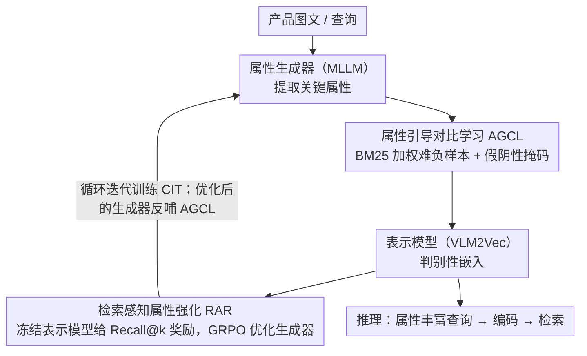

# AFMRL: Attribute-Enhanced Fine-Grained Multi-Modal Representation Learning in E-commerce

**会议**: ACL 2026  
**arXiv**: [2604.20135](https://arxiv.org/abs/2604.20135)  
**代码**: 无  
**领域**: 图像生成  
**关键词**: 电商检索, 细粒度表示学习, 属性生成, 强化学习对齐, 对比学习

## 一句话总结
提出 AFMRL 框架，将电商产品的细粒度理解定义为属性生成任务，通过 MLLM 生成关键属性来增强对比学习（AGCL），并用检索性能作为奖励信号反向优化属性生成器（RAR），在大规模电商数据集上实现 SOTA 检索性能。

## 研究背景与动机

**领域现状**：多模态表示学习正从 CLIP 等判别式匹配框架向基于生成式大模型的方向演进。电商场景需要区分高度相似的产品（如"V领红裙"vs"圆领红裙"），对细粒度理解要求极高。

**现有痛点**：CLIP 等模型本质上是"词袋"系统，难以区分组合语义差异（如"白色T恤蓝色logo" vs "蓝色T恤白色logo"）。VLM2Vec 等大模型表示方法虽有强推理能力，但受因果注意力机制限制，只能通过全局平均池化或末token获取嵌入，无法与 RoI 等细粒度对齐技术兼容。

**核心矛盾**：MLLM 的生成能力可以提取细粒度属性，但现有架构限制了它直接用于细粒度表示学习。如何将 MLLM 的理解能力转化为判别式表示的提升？

**本文目标**：利用 MLLM 的生成能力提取产品关键属性，并将这些属性融入表示学习过程，同时确保属性生成与最终检索目标对齐。

**切入角度**：将细粒度理解"外包"给属性生成器，通过生成的属性作为中间桥梁间接增强表示模型的细粒度判别能力。

**核心 idea**：两阶段训练——先用属性指导对比学习挖掘难负样本，再用检索结果作为奖励信号通过 RL 优化属性生成器，形成自改进闭环。

## 方法详解

### 整体框架
AFMRL 使用两个独立模型：表示模型（VLM2Vec，负责生成判别性嵌入）和属性生成器（MLLM，负责提取关键属性）。训练分两阶段：Stage 1 用属性指导对比学习训练表示模型；Stage 2 用冻结的表示模型给属性生成器提供检索奖励，通过 GRPO 优化生成策略。推理时，生成器提取属性丰富查询输入，表示模型编码后检索。

### 关键设计

**1. 属性引导对比学习 (AGCL)：让 MLLM 生成的关键属性回流进 InfoNCE，专治"区分不开高度相似产品"**

标准 InfoNCE 有两个老毛病：它只看嵌入相似度，用不上嵌入之外的互补匹配信号；又会盲目惩罚假阴性（其实语义正确的负样本）。AGCL 借属性信息一并解决。一方面，它用 BM25 计算查询与候选样本属性之间的词汇相似度 $B_{ij}$，再通过 $w_{ij} = e^{1+\tanh(B_{ij})}$ 转成重要性权重，让"V 领红裙 vs 圆领红裙"这种词汇高度相似的难负样本拿到更大的训练关注；另一方面，做假阴性掩码——若某负样本与正样本的相似度超过阈值 $\delta$，就直接把它从负样本池里剔除，避免把语义正确的匹配当成错误来惩罚。属性在这里相当于给对比学习补了一路文本侧的判别证据。

**2. 检索感知属性强化 (RAR)：用检索成绩当奖励，反向逼属性生成器只产出"对检索有用"的属性**

如果属性生成只靠 SFT 蒸馏，它的训练目标和最终的检索任务是脱节的——生成得再"像"，也未必检索得更准。RAR 把这条因果链接通：冻结 Stage 1 训练好的表示模型，拿它当奖励环境；生成器为查询产出属性后，表示模型用增强后的查询执行检索，直接把 Recall@k 当奖励信号回传。优化用 GRPO，并加 KL 散度正则化防止策略偏离 SFT 基础太远，对无效输出给 $\eta=-0.1$ 的惩罚。因为奖励就是检索指标本身，生成器学到的不再是"看起来合理的属性"，而是"真能把对的商品捞上来的属性"。

**3. 循环迭代训练 (CIT)：让 RL 优化后的生成器反哺表示模型，打破初始化的局部最优**

属性生成器和表示模型的质量是相互依赖的：生成器变强，AGCL 能拿到更好的属性；表示模型变强，又给 RAR 提供更准的奖励环境。CIT 把这层依赖做成闭环——RL 训练完成后，用优化后的属性生成器重新为 AGCL 训练供给属性，如此迭代自我改进。受益于这种闭环，仅用 30% 训练样本就能显著提升性能，相当于用迭代换掉了一部分数据成本。

### 损失函数 / 训练策略
Stage 1 的 AGCL 损失为加权 InfoNCE：$\mathcal{L}_{\text{AGCL}} = -\log \frac{w_{ii} \cdot e^{s_{ii}/\tau}}{w_{ii} \cdot e^{s_{ii}/\tau} + \sum_{j \in \mathcal{N}_i} w_{ij} \cdot e^{s_{ij}/\tau}}$。Stage 2 使用 GRPO 目标函数，包含剪裁比率和 KL 正则化项。表示模型用 Qwen2-VL-2B 初始化，LoRA 微调；属性生成器用 Qwen2.5-VL-3B 初始化，全参数微调。

## 实验关键数据

### 主实验

| 模型 | 细粒度 Recall@1 | Recall@5 | Recall@10 |
|------|----------------|----------|-----------|
| CLIP | 14.98 | 23.07 | 27.59 |
| FG-CLIP | 31.44 | 49.78 | 68.38 |
| VLM2Vec | 48.05 | 64.26 | 69.65 |
| + AGCL | 51.06 | 68.08 | 73.52 |
| + AGCL + Distill Gen. | 52.42 | 71.00 | 76.26 |
| **AFMRL (Full)** | **54.28** | **72.19** | **77.27** |

### 消融实验

| 配置 | Accuracy | NMI | ARI | Purity |
|------|----------|-----|-----|--------|
| 基线 VLM2Vec | 87.67 | 87.04 | 44.39 | 73.16 |
| + AGCL | 87.80 | 87.11 | 44.44 | 73.24 |
| + AGCL + 蒸馏生成器 | 87.98 | 87.63 | 46.24 | 74.21 |
| + AGCL + RL 策略 | 88.00 | 87.68 | 46.61 | 74.52 |
| + CIT (循环迭代) | 89.13 | 88.97 | 47.40 | 75.98 |

### 关键发现
- 每个组件都提供清晰的增量收益：AGCL → +3.01 R@1，蒸馏属性 → +1.36 R@1，RL 对齐 → +1.86 R@1
- RL 训练中观察到"生成简洁性"涌现行为：生成属性长度持续下降，模型学会用最精简属性完成检索
- Recall@50 是最佳 $k$ 值，平衡了奖励稀疏性和饱和度
- AGCL 防止模型过早陷入局部最优，提供更鲁棒的表示空间

## 亮点与洞察
- "属性即桥梁"的设计理念巧妙——通过文本属性绕过了 MLLM 因果注意力机制对细粒度对齐的限制，将生成能力转化为判别能力
- 用检索性能作为 RL 奖励信号形成闭环优化，比传统的代理损失更直接。这个思路可迁移到任何"生成辅助判别"的场景
- RL 训练中属性长度自动缩短是一个有趣的涌现现象，说明 RL 确实在学习"什么信息对检索有用"

## 局限与展望
- RL 策略存在"对齐税"——过度优化 Recall@k 可能损害通用表示质量
- 当前仅在电商数据集上验证，对其他细粒度检索场景的泛化性有待探索
- 属性生成器增加了推理开销，需要在精度和效率之间权衡
- 循环迭代训练的收敛性和最优迭代次数尚未深入分析

## 相关工作与启发
- **vs VLM2Vec**: VLM2Vec 直接用 MLLM 做表示，缺乏细粒度信号；AFMRL 通过属性生成补充细粒度信息
- **vs FG-CLIP**: FG-CLIP 依赖区域级标注做细粒度对齐，与 MLLM 架构不兼容；AFMRL 用属性文本替代区域特征
- **vs 通用 GRPO**: 本文将 GRPO 从推理任务拓展到检索对齐，奖励设计更紧凑

## 评分
- 新颖性: ⭐⭐⭐⭐ 属性引导对比学习 + 检索奖励 RL 的组合设计新颖
- 实验充分度: ⭐⭐⭐⭐ 大规模电商数据集验证，消融充分
- 写作质量: ⭐⭐⭐⭐ 框架描述清晰，图示直观
- 价值: ⭐⭐⭐⭐ 对电商细粒度检索有直接应用价值

<!-- RELATED:START -->

## 相关论文

- [\[CVPR 2026\] Multi-Metric Representation Learning Strategy Based on Clustering for Fine-Grained Multimodal Sentiment Analysis](../../CVPR2026/multimodal_vlm/multi-metric_representation_learning_strategy_based_on_clustering_for_fine-grain.md)
- [\[CVPR 2026\] MOON2.0: Dynamic Modality-balanced Multimodal Representation Learning for E-commerce Product Understanding](../../CVPR2026/multimodal_vlm/moon20_dynamic_modality-balanced_multimodal_representation_learning_for_e-commer.md)
- [\[AAAI 2026\] DEIG: Detail-Enhanced Instance Generation with Fine-Grained Semantic Control](../../AAAI2026/multimodal_vlm/deig_detail-enhanced_instance_generation_with_fine-grained_semantic_control.md)
- [\[CVPR 2026\] Multi-Modal Representation Learning via Semi-Supervised Rate Reduction for Generalized Category Discovery](../../CVPR2026/multimodal_vlm/multi-modal_representation_learning_via_semi-supervised_rate_reduction_for_gener.md)
- [\[CVPR 2026\] CropVLM: Learning to Zoom for Fine-Grained Vision-Language Perception](../../CVPR2026/multimodal_vlm/cropvlm_learning_to_zoom_for_fine_grained_vision_language_perception.md)

<!-- RELATED:END -->
