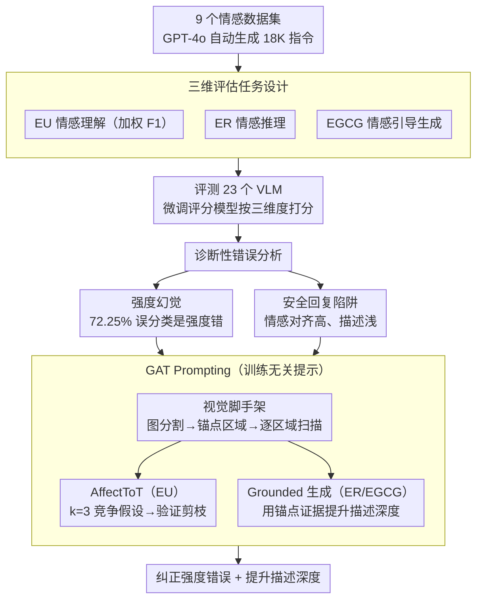

# AICA-Bench: Holistically Examining the Capabilities of VLMs in Affective Image Content Analysis

**会议**: ACL 2026 Findings  
**arXiv**: [2604.05900](https://arxiv.org/abs/2604.05900)  
**代码**: 无  
**领域**: 多模态VLM / 情感计算  
**关键词**: 情感分析, 视觉语言模型, 基准测试, 情感推理, 提示工程

## 一句话总结
提出 AICA-Bench，一个涵盖情感理解（EU）、情感推理（ER）和情感引导内容生成（EGCG）三个维度的综合基准，评估 23 个 VLM 后发现模型存在强度校准失败和描述浅薄两大缺陷，并提出 GAT Prompting 训练无关框架来缓解这些问题。

## 研究背景与动机

**领域现状**：VLM 在感知能力上取得了显著进展，现有基准主要评估事实正确性、语义定位、视觉推理等方面。近期开始出现一些评估 VLM 情感能力的基准（如 EVE、AffectGPT、EEmo-Bench），但它们主要聚焦于基本的情感分类任务。

**现有痛点**：现有情感基准存在三个关键不足：（1）只包含少量图像情感数据集，覆盖范围有限；（2）主要聚焦于多选情感分类，缺乏对情感推理和情感引导生成的评估；（3）缺少对"理解-推理-生成"全链路的整体评估框架。情感智能不仅要识别情感线索，还要推理情感原因、产生恰当的情感表达。

**核心矛盾**：缺乏全面的 AICA 基准是推进情感智能的关键瓶颈——无法系统评估意味着无法有效改进。

**本文目标**：构建一个覆盖理解、推理和生成三个维度的整体性情感图像内容分析基准，并发现 VLM 在情感任务上的系统性缺陷。

**切入角度**：从情感心理学出发，认为情感智能包含感知、归因和表达三个层次，对应设计三种评估任务。

**核心 idea**：用包含 9 个数据集、18,124 条指令的 AICA-Bench 全面评估 VLM 的情感能力，揭示"强度幻觉"和"描述浅薄"两大系统性问题，并用 GAT Prompting 通过视觉锚点和层次推理来缓解。

## 方法详解

### 整体框架
全文是「建基准 → 测模型 → 挖缺陷 → 开药方」四步闭环。**第一步建基准**：收集 9 个图像情感数据集、用 GPT-4o 自动生成 18,124 条指令，覆盖三类任务——EU（情感理解，识别图像表达和引发的情感）、ER（情感推理，解释图像为何引发某种情感）、EGCG（情感引导内容生成，按图像和目标情感生成一致描述）。**第二步测模型**：用这套基准评测 23 个 VLM，开放式的 ER/EGCG 由一个微调过的评分模型打分。**第三步挖缺陷**：对错误做诊断性分析，定位出「强度幻觉」和「安全回复陷阱」两大系统性缺陷。**第四步开药方**：针对这两个缺陷提出训练无关的 GAT Prompting，用视觉锚点 + 层次化假设推理对症缓解。

### 关键设计

**1. 三维评估任务设计：把情感智能拆成"识别—归因—表达"三层来考**

现有情感基准大多只考多选式的情感分类，无法回答"模型会不会解释情感原因、会不会生成恰当的情感表达"。AICA-Bench 因此设计了三类任务：EU（情感理解，识别图像表达的情感和引发的情感）、ER（情感推理，解释图像为何引发某种情感）、EGCG（情感引导内容生成，按图像和目标情感生成一致描述）。评测方式也分层对症：EU 用加权 F1，并区分基础提示和 CoT 提示两种模式；ER 和 EGCG 这类开放式任务无法用 BLEU 等传统指标衡量，于是改用一个基于 QwenVL2.5-7B 微调的评分模型，从情感对齐、描述丰富度、因果合理性三个维度打分——它与人工标注的 Pearson 相关达到 0.88/0.90，说明这套自动评分确实抓住了情感维度，而非只看表面词重叠。

**2. 诊断性错误分析：不止报准确率，更要挖出 VLM 错在认知的哪一环**

光有总分看不出模型究竟差在哪，作者于是对错误做结构化拆解，挖出两个系统性缺陷。其一是"强度幻觉"：强度错误占了全部误分类的 72.25%——模型能分清正负情感，却校不准强度，典型如把 Amusement 误判成 Contentment，问题出在情感粒度而非极性。其二是"安全回复陷阱"：开放式任务里情感对齐得分很高（中位数 ~4.1）但描述性得分明显偏低（中位数 ~3.0），模型倾向给出模板化的稳妥回复而不深入。把失败拆到这种认知机制层面，正好为下一步的提示设计指明了要修的方向。

**3. GAT Prompting（Grounded Affective Tree）：用视觉锚点 + 假设竞争，训练无关地堵住上面两个漏洞**

针对"靠语言先验瞎猜"和"强度校不准"两个病根，GAT 不改模型参数，只重构提示，共用同一个**视觉脚手架**打底、再按任务类型分两条路走。视觉脚手架先用基于图的图像分割切出大块连续区域作为视觉锚点，指导模型逐区域扫描、提取客观视觉元素，强制它盯着具体证据而不是凭语言先验臆测。对**EU 分类任务**走 **AffectToT 推理**（脱胎于 Tree-of-Thoughts）：固定搜索深度 $d=3$、广度 $k=3$，先基于区域扫描生成 3 个相互竞争的"情感—强度"假设、每个都引用特定区域 ID 作为证据，再由验证阶段当 critic 修剪掉与视觉事实矛盾的假设（如"放松的姿态"否决"高唤醒"假设）。对**开放式的 ER/EGCG 任务**则不做树搜索，而是直接拿视觉脚手架抽出的客观证据为生成打底（Grounded Generation），把描述钉在具体视觉细节上以提升丰富度。举例来说，面对一张人物图，模型会先标出"嘴角 / 眼睛 / 背景"几个锚点区域，再并列提出"Amusement-高 / Contentment-中 / Joy-高"三个假设各自挂上区域证据，验证时把缺乏视觉支撑的那个剪掉——靠这种"假设竞争 + 证据绑定"来消除强度幻觉。

### 损失函数 / 训练策略
评分模型用 10,000 个问答对（GPT-4o 生成 + 5 名标注员打分，Krippendorff's α=0.78）在 QwenVL2.5-7B 上微调。

## 实验关键数据

### 主实验

| 模型 | EU Avg. | ER Avg. | EGCG Avg. | Overall |
|------|---------|---------|-----------|---------|
| Gemini-2.5-Pro | 67.27 | 79.08 | 74.13 | 73.49 |
| GPT-4o | 64.93 | 77.81 | 75.73 | 72.82 |
| Qwen2.5VL-7B | 56.84 | 74.50 | 66.00 | 65.78 |
| LLaVA-1.6-13B | 41.80 | 73.57 | 64.51 | 59.96 |

### GAT Prompting 提升效果

| 模型 | EU 提升 | ER 提升 | EGCG 提升 |
|------|--------|--------|----------|
| Gemini-2.5-Pro | +4.18 | +3.37 | +4.12 |
| GPT-4o | +2.98 | +3.69 | +3.27 |
| 平均（所有模型） | +6.15 | +3.54 | +3.96 |

### 关键发现
- 所有模型呈现"头重脚轻"模式：推理和生成分数比理解高 15-30%，说明模型靠语言先验推断情感而非真正视觉感知
- 模型从 8B 扩到 16B 增益微弱，瓶颈在视觉编码质量而非模型规模
- 遮挡面部后 F1 下降 11.1%，揭示模型严重依赖面部表情这一视觉捷径

## 亮点与洞察
- **强度 vs 极性错误的分离分析**非常有启发——72.25% 错误来自强度而非正负极性，说明情感粒度才是真正难点
- **"安全回复陷阱"的发现**：模型在开放式任务中倾向生成模板化的安全回复而非深入分析，这一现象在其他开放式评估中也普遍存在
- **GAT Prompting 的设计思路**可迁移到任何需要细粒度视觉定位的 VLM 任务

## 局限与展望
- 评分模型基于 QwenVL2.5-7B 微调，可能存在与被评估模型的偏差
- 仅在静态图像上评估，视频中的动态情感变化未涉及
- GAT Prompting 增加了推理复杂度，实际部署成本需考量

## 相关工作与启发
- **vs EVE**：只评估 7 个模型的分类和解释，AICA-Bench 评估 23 个模型的理解-推理-生成全链路
- **vs EEmo-Bench**：只关注图像引发的情感，AICA-Bench 区分了表达情感和引发情感

## 评分
- 新颖性: ⭐⭐⭐⭐ 首个覆盖理解-推理-生成三维度的情感 VLM 基准
- 实验充分度: ⭐⭐⭐⭐⭐ 23 个模型、9 个数据集、18K+ 指令
- 写作质量: ⭐⭐⭐⭐ 诊断分析部分非常深入
- 价值: ⭐⭐⭐⭐ 为情感多模态研究提供了坚实基准

<!-- RELATED:START -->

## 相关论文

- [\[CVPR 2026\] VisRes Bench: On Evaluating the Visual Reasoning Capabilities of VLMs](../../CVPR2026/multimodal_vlm/visres_bench_on_evaluating_the_visual_reasoning_capabilities_of_vlms.md)
- [\[CVPR 2026\] VS-Bench: Evaluating VLMs for Strategic Abilities in Multi-Agent Environments](../../CVPR2026/multimodal_vlm/vs_bench_evaluating_vlms_for_strategic_abilities_in_multi_agent_environments.md)
- [\[ACL 2026\] CNSL-bench: Benchmarking the Sign Language Understanding Capabilities of MLLMs on Chinese National Sign Language](cnsl-bench_benchmarking_the_sign_language_understanding_capabilities_of_mllms_on.md)
- [\[CVPR 2026\] Rethinking VLMs for Image Forgery Detection and Localization](../../CVPR2026/multimodal_vlm/rethinking_vlms_for_image_forgery_detection_and_localization.md)
- [\[ACL 2026\] What Do Vision-Language Models Encode for Personalized Image Aesthetics Assessment?](what_do_vision-language_models_encode_for_personalized_image_aesthetics_assessme.md)

<!-- RELATED:END -->
