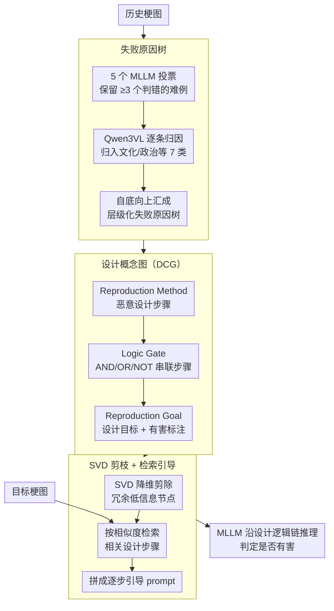

# All Changes May Have Invariant Principles: Improving Ever-Shifting Harmful Meme Detection via Design Concept Reproduction

**会议**: ACL 2026  
**arXiv**: [2601.04567](https://arxiv.org/abs/2601.04567)  
**代码**: [GitHub](https://github.com/jzySaber1996/RepMD)  
**领域**: Multimodal Safety / Meme Detection  
**关键词**: 有害梗图检测, 设计概念图, 攻击树, MLLM推理引导, 类型漂移

## 一句话总结

提出RepMD方法，通过构建设计概念图（DCG）——借鉴攻击树思想描述恶意用户设计有害梗图的步骤和逻辑——来引导MLLM检测不断变化的有害梗图，在GOAT-Bench上达81.1%准确率。

## 研究背景与动机

**领域现状**：互联网上有害梗图（harmful memes）持续演变，呈现类型漂移（新形式、新攻击对象）和时间演化（与时事紧密相关）两大特征，使得检测极其困难。

**现有痛点**：(1) 现有检测方法仅学习有害元素的组合，缺乏对隐含表达的理解——如通过突出人的配饰来暗示种族歧视；(2) 新出现的网络俚语（如GOAT, Stan）增加了检测难度；(3) MLLM虽有多模态理解能力但对这些隐含有害信息同样束手无策。

**核心矛盾**：有害梗图的视觉元素和表达方式不断变化，但其背后恶意用户的设计逻辑可能存在"不变原理"。如何从历史梗图中提取这些不变原理来指导新梗图的检测？

**本文目标**：定义一种可解释的结构来描述有害梗图的设计概念，并利用它引导MLLM进行检测。

**切入角度**：借鉴安全领域的攻击树（attack tree）思想，将梗图的设计意图建模为包含方法、目标和逻辑门的结构化图。

**核心 idea**：不同类型的有害梗图虽然表面不同，但可能共享相同的设计概念（如"将事实特化到特定群体以实现攻击"），这些概念可以跨类型迁移。

## 方法详解

### 整体框架

RepMD 的出发点是：有害梗图的视觉外壳一直在变，但背后恶意用户"怎么设计一张有害梗图"的逻辑相对稳定，可以从历史失败案例里提炼出来反过来引导检测。整条流水线无需训练，全部在推理时完成，分三步走：先回看 MLLM 过去在哪些梗图上栽了跟头、为什么栽，整理成一棵失败原因树；再把这些失败原因抽象成设计概念图（DCG），用攻击树的形式描述"一个恶意用户会怎么一步步把无害素材改造成有害梗图"；最后对一张新梗图，从 DCG 里检索出最相关的设计步骤，拼成逐步引导喂给 MLLM，让它沿着设计者的思路去判断。

### 关键设计

**1. 失败原因树：只盯 MLLM 真正搞不定的难例，把"为什么检测失败"结构化**

如果设计概念是从随便一批梗图里提炼的，多数样本对 MLLM 来说太简单，提炼出来的全是它本就会的东西，对真正的盲区毫无帮助。RepMD 因此先做一道难例过滤：对历史梗图用 5 个 MLLM 投票检测，只保留 ≥3 个模型都判错的样本作为难例，再用 Qwen3VL-235B 逐条分析失败原因，并归类到文化、政治等 7 大类，自底向上汇成一棵层级化的失败原因树；其间还有一轮 prompt 迭代优化，让归因更稳定。这样树上每个节点都对应一种 MLLM 确实抓不到的隐含有害表达，设计概念的提炼从一开始就聚焦在最有挑战性的案例上。

**2. 设计概念图（DCG）：借攻击树把恶意用户的设计逻辑写成可推理的结构**

失败原因只说明"MLLM 错在哪"，还没说明"这张梗图是怎么被设计出来害人的"。RepMD 借鉴网络安全里的攻击树思想，把每个失败原因节点推导成一张三级结构的设计概念图：底层是 Reproduction Method（恶意用户的具体设计步骤），中间用 Logic Gate（AND/OR/NOT）把步骤按组合逻辑串起来，顶层是 Reproduction Goal（设计目标，例如"把某个事实特化到特定人群以实现攻击"），并给每个节点标注是否有害。攻击树本来就擅长把攻击者"先做什么、再做什么、满足什么条件才得手"的逻辑链显式化，套到梗图设计者的思维上同样成立——它让"不变原理"这个抽象假设变成了一张可被检索、可被 MLLM 顺着读的图。

**3. SVD 剪枝 + 检索引导：先去噪精简 DCG，再按需把相关设计步骤喂给 MLLM**

DCG 累积下来节点很多，若把整张图原封不动塞进 prompt，大量与当前梗图无关的设计模式反而成了噪声，干扰 MLLM 的判断。RepMD 先用 SVD 降维剪除 DCG 中冗余、低信息量的节点，只留下核心设计模式（这种基于 SVD 的图剪枝在 GNN 里已被证明有效）；面对一张目标梗图时，再通过相似度检索从精简后的 DCG 里挑出最相关的若干设计步骤，拼成一段"先看是否做了人群特化、再看是否叠加了符号暗示……"式的逐步引导提示，让 MLLM 沿着设计者的逻辑链一步步推理，而不是孤立地看图面元素。

### 损失函数 / 训练策略

RepMD 是无需训练的方法，完全依赖 MLLM 的 in-context learning 能力，失败原因树构建、DCG 推导与检索引导都在推理阶段完成，没有任何参数更新。

## 实验关键数据

### 主实验

| 方法 | GOAT-Bench准确率 | 域外泛化 | 时序泛化 |
|------|-----------------|---------|---------|
| 基线MLLM | 低 | 大幅下降 | 下降 |
| RepMD | **81.1%** | 仅降2.1% | 提升0.3% |

### 消融实验

| 配置 | 关键指标 | 说明 |
|------|---------|------|
| 无DCG | 准确率显著下降 | 设计概念是核心贡献 |
| 无SVD剪枝 | 性能下降 | 剪枝去除噪声提升精度 |
| 人类评估 | 15-30秒/梗图 | DCG有效辅助人类识别 |

### 关键发现
- RepMD在域外泛化（新类型梗图）中仅损失2.1%准确率，在时序泛化（未来季度梗图）中甚至提升0.3%
- 人类评估确认DCG的高可解释性——评估者能在15-30秒内利用DCG判断梗图是否有害
- 不同类型的有害梗图确实共享设计概念，验证了"不变原理"的假设

## 亮点与洞察
- 从安全领域借鉴攻击树思想来建模梗图设计意图，是创造性的跨领域迁移
- "不变原理"假设得到实验验证——跨类型和跨时间的泛化性都很好
- 方法不需要训练，完全利用MLLM的推理能力和DCG的引导

## 局限与展望
- 当前DCG需要从失败案例中构建，冷启动时可能不够丰富
- 仅在英文梗图上测试，不同文化/语言的梗图可能有不同的设计模式
- SVD剪枝的参数选择可能需要针对不同领域调整
- 未来可扩展到视频梗和多语言梗图

## 相关工作与启发
- **vs 传统有害内容检测**: 不仅检测"是否有害"，还解释"为什么有害"以及"怎么设计的"
- **vs 攻击树**: 将安全分析方法创造性地迁移到社交媒体内容分析
- **vs LLM-based检测**: 提供结构化的设计概念引导，比纯prompt更稳定

## 评分
- 新颖性: ⭐⭐⭐⭐⭐ 攻击树→设计概念图的跨领域创新非常独特
- 实验充分度: ⭐⭐⭐⭐ 类型和时序两种泛化实验+人类评估
- 写作质量: ⭐⭐⭐⭐ 形式化定义清晰，动机说明充分
- 价值: ⭐⭐⭐⭐ 对有害内容检测有新范式的启示

<!-- RELATED:START -->

## 相关论文

- [\[ACL 2025\] Redundancy Principles for MLLMs Benchmarks](../../ACL2025/multimodal_vlm/redundancy_principles_for_mllms_benchmarks.md)
- [\[AAAI 2026\] Yes FLoReNce, I Will Do Better Next Time! Agentic Feedback Reasoning for Humorous Meme Detection](../../AAAI2026/multimodal_vlm/yes_florence_i_will_do_better_next_time_agentic_feedback_reasoning_for_humorous_.md)
- [\[AAAI 2026\] CAMU: Context Augmentation for Meme Understanding](../../AAAI2026/multimodal_vlm/trace_textual_relevance_augmentation_and_contextual_encoding_for_multimodal_hate.md)
- [\[CVPR 2026\] Concept-wise Attention for Fine-grained Concept Bottleneck Models](../../CVPR2026/multimodal_vlm/coat_cbm_concept_wise_attention.md)
- [\[ACL 2026\] Dynamic Emotion and Personality Profiling for Multimodal Deception Detection](dynamic_emotion_and_personality_profiling_for_multimodal_deception_detection.md)

<!-- RELATED:END -->
