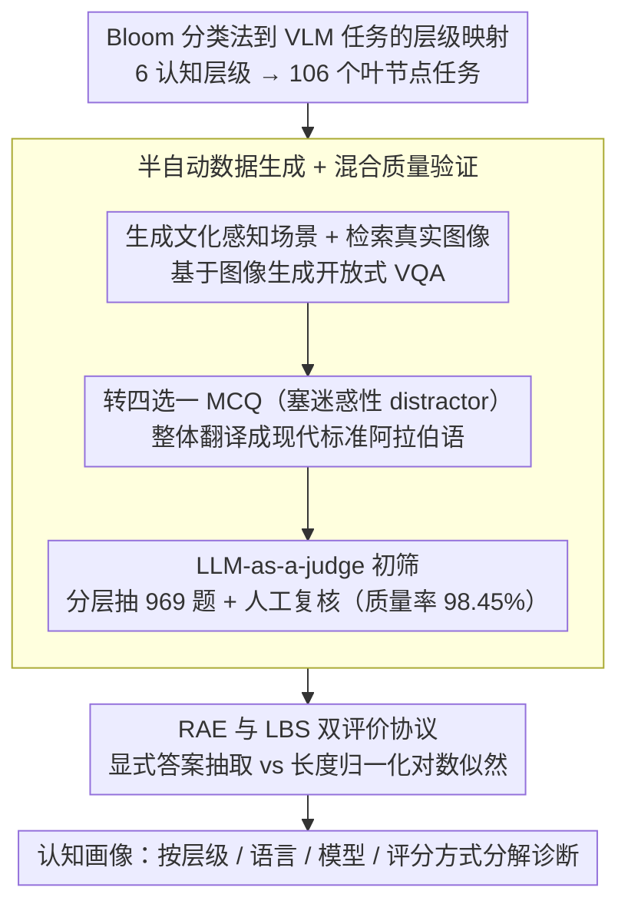

# Almieyar-Oryx-BloomBench: A Bilingual Multimodal Benchmark for Cognitively Informed Evaluation of Vision-Language Models

**会议**: ACL2026  
**arXiv**: [2606.05531](https://arxiv.org/abs/2606.05531)  
**代码**: https://github.com/qcri/Almieyar-Oryx-BloomBench  
**领域**: 多模态VLM / 评测基准  
**关键词**: Bloom分类法, 多模态评测, 英阿双语, 认知诊断, Likelihood-based Scoring  

## 一句话总结
BloomBench 用 Bloom 认知分类法重构 VLM 评测，将 7,747 个英阿双语图文问答样本组织为 6 个认知层级和 106 个任务类型，并发现当前 VLM 的高分往往掩盖了事实回忆、创造性综合和跨语言推理上的明显短板。

## 研究背景与动机
**领域现状**：VLM 评测已经从早期的 VQA、图像字幕和幻觉检测，发展到 MMMU、MMT-Bench、VLM2-Bench 等更综合的基准。主流做法通常把大量任务聚合成一个总体分数，用来比较模型在多模态知识、感知、推理或定位上的表现。

**现有痛点**：这类基准虽然覆盖面变宽，但诊断粒度仍然不够。一个模型在阅读图表或回答选择题上拿到高分，并不等于它真的具备人类式的分层认知能力；相反，它可能只是学会了某些任务格式、统计捷径或英文中心语料里的常见模式。论文还指出，现有 VLM 基准明显偏向英文，对阿拉伯语等非英语视觉语言场景覆盖不足。

**核心矛盾**：VLM 评测需要同时满足可规模化、可自动评分和可解释诊断，但越是追求大规模统一分数，越容易把不同认知能力混在一起。作者认为问题不只是“模型答对多少”，而是“模型在哪一层认知过程上答对或失败”。

**本文目标**：本文要构建一个认知驱动的双语多模态基准：一方面用 Bloom 分类法覆盖 Remember、Understand、Apply、Analyze、Evaluate、Create 六个层级，另一方面通过英阿双语问题暴露跨语言泛化能力，并用两种评分方式区分显式输出正确性和内部置信分布。

**切入角度**：Bloom 分类法来自教育心理学，天然把认知过程拆成由浅入深的层级。作者把这个框架映射到图像-问题-答案任务上，使每个样本不只是属于某个任务类型，也属于一个认知层级，从而让评测结果可以解释为“模型的认知画像”。

**核心 idea**：用 Bloom 分类法替代松散任务拼盘来组织 VLM 评测，并用英阿双语与 RAE/LBS 双评分方式同时诊断认知层级差异、跨语言差异和置信校准差异。

## 方法详解
BloomBench 本质上不是提出新模型，而是提出一个评测构建和分析框架。它的关键在于把抽象的认知分类法落到可执行的多模态选择题，并通过自动生成、翻译、质量验证和双评分评测形成闭环。

### 整体框架
整体流程可以分成四步。第一步，作者先定义 BloomBench taxonomy：六个 Bloom 层级继续拆成更细的任务叶节点，总计 106 个具体任务类型。第二步，系统为每个叶节点生成视觉场景、检索真实图像，并基于图像生成开放式 VQA。第三步，把开放式 VQA 转成四选一 MCQ，再翻译成现代标准阿拉伯语。第四步，用 LLM-as-a-judge 与人工验证抽样来控制质量，并在多个开源/闭源 VLM 上分别运行 Regex-based Answer Extraction 和 Likelihood-based Scoring。

输入是图像、问题和四个候选答案；输出不仅是模型的准确率，还包括按语言、认知层级、模型家族、模型大小和评分方式分解后的诊断结果。这个设计让 BloomBench 更像一套“认知体检表”，而不是单一排行榜。

### 关键设计
**1. Bloom 分类法到 VLM 任务的层级映射：让每道题都对应一种明确的认知操作**

传统基准常把不同难度、不同认知过程的题目混进一个总分，模型考砸了你也分不清它是不会看图、不会套用规则，还是不会创造性综合。BloomBench 把 Bloom 的六个认知层级整体搬到多模态任务上：低层级（Remember/Understand）覆盖物体、属性、活动、符号、文本识别以及组合语义理解；中层级（Apply/Analyze）覆盖知识应用、基础逻辑、上下文推理和表格/图表分析；高层级（Evaluate/Create）覆盖一致性、安全、质量评价，以及受约束下的创造性选择。六个层级再往下细化成 106 个叶节点任务，于是每个样本不止属于某个任务类型，还明确归属一种认知操作——模型在哪一层认知上掉链子，从分数上就能直接读出来，错误因此变得可解释。

**2. 半自动数据生成 + 混合质量验证：在 7,747 个双语样本的规模下守住质量**

全人工构建覆盖不了这么大的双语多模态规模，纯自动生成又容易产出不可答、与图像无关或翻译漂移的题目。BloomBench 走的是分工流水线：Gemini 2.5 Pro 先为每个 taxonomy 叶节点生成有文化感知的场景和图像关键词，基于真实网页图像生成开放式 VQA；另一个指令模型把开放问答转成四选一 MCQ，并刻意塞进一个更具迷惑性的 distractor；随后整体翻译成现代标准阿拉伯语。质量侧则是"机器初筛 + 分层抽检 + 人工复核"三道关：先用 LLM-as-a-judge 过滤，再从 106 个叶节点分层抽取 969 个样本验证，Gemini 3 Pro 标出 15 个可疑样本、人工复核确认这些确为错误，最终质量率 98.45%。分层抽样配人工复核，是在覆盖成本和可信度之间的折中。

**3. RAE 与 LBS 双评价协议：把"说出了正确选项"和"概率上真信正确答案"分开看**

很多模型能照着 prompt 输出正确的字母，但它内部的概率分布未必真把正确答案排在前面——只看显式输出会高估模型。BloomBench 因此并行跑两套评分：RAE（Regex-based Answer Extraction）从模型自由输出里抽取 A/B/C/D，贴近真实用户看到的结果；LBS（Likelihood-based Scoring）则计算每个候选答案在图像和问题条件下的长度归一化对数似然，

$$\text{NormalizedScore}(C_i)=\frac{1}{k}\sum_{j=1}^{k}\log P(w_j\mid I,Q,w_{<j})$$

再选分数最高的候选项。两套指标分歧越大，越说明模型只是学会了格式化输出，而置信校准和推理一致性其实很脆弱——LBS 正是用来把这层"表面正确"戳破的。

### 损失函数 / 训练策略
BloomBench 不训练新模型，因此没有模型优化损失。构建阶段的“训练策略”更接近评测协议设计：数据生成使用提示工程和 agentic pipeline，质量控制使用 LLM judge + 分层人工验证，模型评测使用 zero-shot 设置且 decoding temperature 设为 0。评测指标以 accuracy 为主，按 micro 和 macro 两种方式报告，以避免类别不均衡掩盖弱项。

## 实验关键数据

### 主实验
BloomBench 包含 7,747 个英阿双语图像-问题-答案样本，覆盖 106 个任务类型。六个认知层级的样本量如下，显示其不是只押注某个单一推理类别。

| 认知层级 | 样本数 | 评测含义 |
|----------|--------|----------|
| Remember | 2,948 | 物体、属性、符号、文本等基础识别与回忆 |
| Understand | 1,592 | 关系、组合语义、情绪和视觉释义理解 |
| Apply | 499 | 将数学、科学、逻辑等知识应用到视觉场景 |
| Analyze | 1,431 | 上下文推理、结构化数据分析、异常属性识别 |
| Evaluate | 592 | 一致性、安全性和图像质量判断 |
| Create | 685 | 在约束下识别最合理的创造性综合结果 |
| 合计 | 7,747 | 106 个 taxonomy 叶节点，英阿双语 |

整体模型结果显示，RAE 下若只看显式答案，Gemma4-31B 最高；但 LBS 下模型排序会明显改变，说明“会输出答案”和“概率上真相信答案”并不是同一件事。

| 模型 | 英文 RAE Micro | 英文 LBS Micro | 阿语 RAE Micro | 阿语 LBS Micro | 关键观察 |
|------|---------------|---------------|---------------|---------------|----------|
| Qwen2-VL-7B | 0.854 | 0.421 | 0.773 | 0.326 | RAE 尚可，但 LBS 置信较弱 |
| Qwen2.5-VL-7B | 0.869 | 0.654 | 0.792 | 0.503 | LBS 稳定性最好之一 |
| Gemma3-27B | 0.883 | 0.336 | 0.859 | 0.440 | RAE 高，但英文 LBS 出现明显崩落 |
| Gemma4-31B | 0.898 | 0.430 | 0.876 | 0.397 | RAE 总体最佳，LBS 仍不理想 |
| GPT-4o mini | 0.824 | N/A | 0.769 | N/A | 闭源模型不支持 LBS |

### 消融实验
论文没有模型结构消融，但提供了两个很有价值的诊断对比：一是同一模型在 RAE 与 LBS 下的差异，二是 BloomBench taxonomy 与现有 MMMU 覆盖面的差异。

| 分析项 | 结果 | 说明 |
|--------|------|------|
| 质量验证 | 抽样 969 个样本，15 个错误，质量率 98.45% | 分层覆盖 106 个叶节点，说明生成数据整体可信 |
| MMMU 覆盖映射 | Analyze 占 66.4%；Create + Evaluate 低于 1.1% | 现有强基准更偏专家知识/分析，不等于完整认知覆盖 |
| 零覆盖叶节点 | 45 个 taxonomy 叶节点在 MMMU 中没有样本 | Ambiguity Resolution、Toxicity Detection、Dialogue Generation 等能力缺失 |
| Qwen2.5-VL-7B 指标差异 | 英文 0.869 RAE → 0.654 LBS | 相对稳定，说明输出和置信更一致 |
| Gemma3-27B 指标差异 | 英文 0.883 RAE → 0.336 LBS | 暴露出表面输出强、概率校准弱的问题 |

### 关键发现
- 英文整体优于阿语，但差距不是单纯翻译问题；LBS 还受到阿语 tokenization fertility 和非英语概率先验影响。
- Understand 和 Evaluate 在 RAE 下接近或超过 0.88，说明当前 VLM 在判别式视觉语义理解上已经较强。
- Apply、Create 和 Remember 在 LBS 下暴露更深缺陷，说明模型可能偏向语义联想，而不是稳定的事实回忆、程序化应用和创造性综合。
- Gemma3 系列跨语言 RAE 一致性较好，但大模型在 LBS 中出现 inverse scaling，提示更强 instruction tuning 不一定带来更好的概率校准。

## 亮点与洞察
- 最有价值的地方是把“多模态评测”变成“认知层级诊断”。这使得模型失误不再只是一个低分，而能被定位到基础记忆、程序应用、结构分析或创造性综合等具体能力层。
- RAE/LBS 双指标很有启发性：RAE 贴近真实用户看模型输出的方式，LBS 则更像检查模型内部是否真的把正确答案排在前面。两者分歧越大，越说明模型可能在格式化输出上学得很好，但置信分布并不可靠。
- 双语设计不只是“多加一种语言”，而是直接挑战英文中心评测的外推假设。阿语上的 Create 和 Apply 退化说明高阶认知能力的跨语言迁移远比基础语义理解更脆弱。

## 局限与展望
- 评测模型数量受 GPU 和闭源 API 成本限制，很多最新 VLM 没有被纳入；未来需要更大规模模型池，尤其是不同训练语料和不同视觉编码架构的模型。
- 全部题目都是选择题，便于自动评分，但不能充分覆盖开放式生成、多步推理和真实交互任务。未来可加入短答、填空、长链路生成或自适应难度。
- 虽然抽样验证质量较高，但并未人工逐题验证全部 7,747 个样本；自动生成基准仍可能存在局部图像失效、选项歧义或翻译细节偏差。
- LBS 对不同语言的 tokenization 不完全公平，尤其在阿语这类形态更丰富的语言上，长度归一化仍可能残留系统性偏置。

## 相关工作与启发
- **vs MMMU**: MMMU 强在专家领域知识和分析题，但映射到 BloomBench taxonomy 后 Analyze 占 66.4%，Create/Evaluate 合计低于 1.1%。BloomBench 的优势是认知层级更均衡，劣势是目前以 MCQ 为主，开放式复杂任务还不足。
- **vs MMT-Bench / VLM2-Bench**: 这些基准扩展了任务覆盖和细粒度视觉能力，但更多是任务集合式组织。BloomBench 的不同点是先定义认知框架，再生成任务，因此结果更适合做能力画像。
- **vs 阿语 VLM 基准如 CAMEL-Bench**: 阿语基准强调语言和文化覆盖，BloomBench 则把英阿双语放进同一认知 taxonomy，用同构任务比较跨语言认知迁移。
- **启发**: 后续做 VLM/MLLM 评测时，可以少看单一 leaderboard，多报告按认知层级、语言和评分机制分解的结果；对于训练数据构造，也可以针对 Apply/Create 等薄弱层级主动补数据。

## 评分
- 新颖性: ⭐⭐⭐⭐⭐ 用 Bloom 分类法系统组织双语多模态评测，诊断视角非常清晰。
- 实验充分度: ⭐⭐⭐⭐ 覆盖多个开源/闭源 VLM、两种语言和两种评分方式，但模型池仍受算力和 API 限制。
- 写作质量: ⭐⭐⭐⭐ 结构完整，方法和讨论清楚；部分表格较大，读者需要在总体结果和认知层级结果之间来回对照。
- 价值: ⭐⭐⭐⭐⭐ 对构建更可解释、更包容的 VLM 评测很有参考价值，尤其适合后续做多语言多模态能力诊断。

<!-- RELATED:START -->

## 相关论文

- [\[ACL 2026\] VIGNETTE: Socially Grounded Bias Evaluation for Vision-Language Models](vignette_socially_grounded_bias_evaluation_for_vision-language_models.md)
- [\[CVPR 2026\] CrossHOI-Bench: A Unified Benchmark for HOI Evaluation across Vision-Language Models and HOI-Specific Methods](../../CVPR2026/multimodal_vlm/crosshoi-bench_a_unified_benchmark_for_hoi_evaluation_across_vision-language_mod.md)
- [\[ACL 2026\] Can MLLMs Reason Beyond Language? VisReason: A Comprehensive Benchmark for Vision-Centric Reasoning](can_mllms_reason_beyond_language_visreason_a_comprehensive_benchmark_for_vision-.md)
- [\[ACL 2026\] MMErroR: A Benchmark for Erroneous Reasoning in Vision-Language Models](mmerror_a_benchmark_for_erroneous_reasoning_in_vision-language_models.md)
- [\[ACL 2026\] Cross-Cultural Expert-Level Art Critique Evaluation with Vision-Language Models](cross-cultural_expert-level_art_critique_evaluation_with_vision-language_models.md)

<!-- RELATED:END -->
