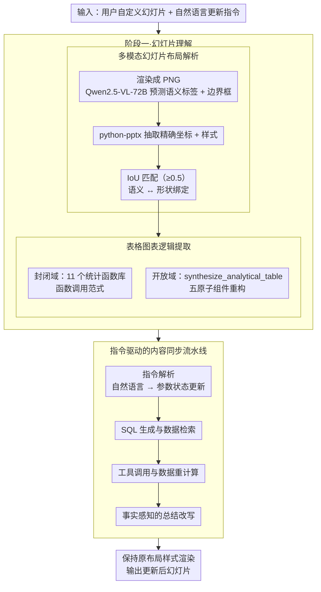

# Automatic Slide Updating with User-Defined Dynamic Templates and Natural Language Instructions

**会议**: ACL 2026  
**arXiv**: [2604.17894](https://arxiv.org/abs/2604.17894)  
**代码**: [github](https://github.com/XiaoZhou2024/SlideAgent)  
**领域**: Multimodal/VLM  
**关键词**: 幻灯片自动更新, 动态模板, 自然语言指令, 多模态Agent, 数据驱动报告

## 一句话总结

定义了"基于自然语言指令在用户自定义模板上进行动态幻灯片更新"的新任务，构建了包含 20,036 个指令-执行三元组的 DynaSlide 基准，并提出了 SlideAgent 作为强参考基线。

## 研究背景与动机

**领域现状**：演示幻灯片是数据驱动报告的核心媒介，但维护复杂分析类幻灯片依然极度耗费人力。现有自动化方法主要采用固定模板填充范式，无法支持多样化的用户自定义幻灯片。

**现有痛点**：(1) 周期性业务报告中，更新通常只涉及局部数据替换和结论微调，但大量人力被消耗在低价值的"复制-粘贴-修改"流程上；(2) 现有方法局限于从结构化数据源向固定模板注入信息，无法处理用户自创的复杂幻灯片结构。

**核心矛盾**：用户自定义模板（BYO-template）场景要求系统理解任意幻灯片的多模态结构（标题、表格、图表、总结及其布局和依赖关系），同时将自然语言更新指令精准映射到可执行操作——这远超简单的值替换。

**本文目标**：正式定义动态幻灯片更新任务，构建大规模基准数据集，并提出 Agent 基线系统。

**切入角度**：以真实房地产业务分析数据为基础，构建可控模板族，生成大量指令-执行三元组，支持可复现评估。

**核心 idea**：将幻灯片更新建模为感知-推理-执行的闭环过程：先解析幻灯片的语义结构和数据逻辑，再根据自然语言指令更新数据查询、重新计算统计结果、重绘图表、改写总结，同时保持原始布局和样式。

## 方法详解

### 整体框架

SlideAgent 采用两阶段架构：阶段一（幻灯片理解）将输入幻灯片解析为结构化表示，捕获元素位置、数据源和功能逻辑；阶段二（指令驱动更新）解释用户指令、检索更新数据、执行转换、重新生成内容。

### 关键设计

**1. 多模态幻灯片布局解析：把"一张图"还原成带语义角色和精确坐标的结构化表示**

要在用户自定义模板上更新，第一步得读懂这张幻灯片到底由哪些部件组成、各自是什么角色。纯靠 VLM 看渲染图能认出"这是标题、那是表格标题、底下是总结"，但给不出像素级精确的几何和样式；纯靠 python-pptx 解析能拿到精确坐标和样式元数据，却不知道每个形状的语义功能。SlideAgent 把两者对齐互补：先把幻灯片渲染成 PNG，用 Qwen2.5-VL-72B 预测各元素的语义标签和边界框，再用 python-pptx 抽取精确坐标与样式，最后通过 IoU 匹配（阈值 0.5）把 VLM 的语义预测和 PPTX 的真实形状一一绑定，得到既懂语义又有精确几何的结构化布局。

**2. 表格和图表逻辑提取（封闭域/开放域）：从呈现结果反推底层的数据查询和聚合逻辑**

幻灯片上看到的是算好的表格和图表，要更新数据就必须知道这些数字是"怎么算出来的"。SlideAgent 按两种模式反推：封闭域下，让 LLM 从预定义的 11 个统计函数库里识别出对应函数及其参数，走的是函数调用范式，适合覆盖已知模板；开放域下，预定义函数兜不住用户自创的任意分析，于是设计了一个通用的 `synthesize_analytical_table` 接口，把分析逻辑拆成表格结构类型、表头、约束规格、源字段和聚合操作五个原子组件来重构。两种模式互补，既能精确对上常见模板，又能泛化到任意自定义分析。

**3. 指令驱动的内容同步流水线：把一条自然语言指令落成端到端、可分段诊断的更新**

理解了幻灯片结构和数据逻辑之后，真正执行更新时，一条"把第二季度数据换成第三季度并更新结论"的指令要同时触动数据查询、统计重算、图表重绘和总结改写，一步错就步步错。SlideAgent 把它拆成四步流水线：指令解析（把自然语言映射为参数状态更新）→ SQL 生成与数据检索 → 工具调用与数据重计算 → 事实感知的总结改写与最终渲染，全程保持原始布局和样式不变。拆成可独立评估的子模块，好处是出了错能精确定位到是哪一环掉链子（实验也正是借此发现总结改写是最大瓶颈）。

### 一个完整示例：更新一张季度房产分析幻灯片

以一张"Q2 区域成交分析"幻灯片、配指令"更新为 Q3 数据"为例走一遍：

1. **布局解析**：渲染成 PNG，VLM 认出顶部标题、中部一张成交均价表、右侧一张柱状图、底部一段文字总结；python-pptx 给出各形状的精确坐标和字号配色；IoU 匹配（≥0.5）把"中部那块"绑定为"表格 + 表格标题"。
2. **逻辑提取**：反推出柱状图背后是 `AVG(price) GROUP BY district`、表格是对成交量的求和；若该模板在 11 个预定义函数内则按函数调用直接命中，否则用 `synthesize_analytical_table` 从五个原子组件重建这套聚合逻辑。
3. **指令解析**：把"更新为 Q3"解析成参数状态更新——时间过滤条件 `quarter = 'Q2'` 改写为 `'Q3'`，其余维度不变。
4. **数据检索与重算**：据此生成 SQL 取出 Q3 原始数据，调用工具重新计算各区均价与成交量。
5. **重绘与改写**：用新数值重绘柱状图、回填表格，再做事实感知的总结改写（把"Q2 均价环比上涨"改成与 Q3 真实数字一致的结论），最后按原布局样式渲染出更新后的幻灯片。

整条链路里布局解析最稳（开放域准确率 99.5%），第 5 步的总结改写最易出错（68.44%），是端到端成功率的主要瓶颈。

### 损失函数 / 训练策略

本文方法主要基于 LLM 推理而非训练。评估使用任务成功率（SR，生成幻灯片与 ground truth 在内容和布局上完全匹配的比例）和元素级准确率。

## 实验关键数据

### 主实验

| 模型 | 封闭域 SR (%) | 开放域 SR (%) |
|------|-------------|-------------|
| GPT-OSS-120B | 80.64 | 68.86 |
| Qwen3-80B | 75.33 | 63.91 |
| GPT-OSS-20B | 69.20 | 56.25 |
| Qwen3-30B | 71.40 | 59.69 |
| Qwen3-14B | 45.48 | 31.13 |

### 消融实验

| 模块 (GPT-OSS-120B, 开放域) | 准确率 (%) | 说明 |
|---------------------------|-----------|------|
| 布局解析 | 99.5 | 最稳定模块 |
| 函数逻辑提取 | 88.34 | 高准确率 |
| 数据源提取 | 90.37 | 高准确率 |
| 总结更新 | 68.44 | 最大瓶颈 |
| 端到端任务 SR | 68.86 | 误差累积效应 |

### 关键发现
- 模型规模与任务性能强相关：GPT-OSS-120B 比 20B 高 11-12 个百分点，Qwen3-80B 比 14B 高约 30 个百分点
- 开放域场景一致导致性能下降，对小模型影响更大（Qwen3-14B 相对下降 31.5%）
- 总结更新是最大瓶颈（68.44%），远低于逻辑提取（88.34%）——模型能有效提取计算逻辑，但将量化更新转化为连贯的自然语言结论仍是根本挑战
- 任务难度随主题显著变化：简单表格结构（Theme 1: 90.12%）vs 复杂跨维聚合（Theme 4: 77.03%）

## 亮点与洞察
- 新任务定义有很强的实际价值——周期性报告更新是企业中真实且高频的需求
- DynaSlide 基准设计精巧：可控模板族确保了可验证的 ground truth，YAML 元数据支持可复现的端到端评估
- 封闭域/开放域的对比设计很好地揭示了模型泛化能力的边界
- 模块级评估协议为识别错误瓶颈提供了清晰的诊断框架

## 局限与展望
- 仅覆盖房地产领域，尽管核心机制是领域无关的
- 使用可控模板而非完全野生的幻灯片，牺牲了部分样式多样性以换取可验证性
- 假设幻灯片元素可关联到结构化数据库，不处理"冷启动"问题（从静态幻灯片重建数据库）
- 未处理装饰性图形或概念性图表

## 相关工作与启发
- **vs AutoPresent/PPTAgent**: 它们关注一次性文档到幻灯片的生成，本文关注的是在用户自定义模板上的动态更新
- **vs 传统模板填充方法**: 它们使用固定预定义模板，无法处理用户自创的复杂布局
- **vs LLM Agent 方法 (如 Yao et al.)**: 它们更新表面内容但无法重建底层计算依赖

## 评分
- 新颖性: ⭐⭐⭐⭐⭐ 首次正式定义动态幻灯片更新任务，开辟新方向
- 实验充分度: ⭐⭐⭐⭐ 多模型、多主题、模块级评估，但仅单一领域
- 写作质量: ⭐⭐⭐⭐ 任务定义清晰，数据集构建过程详尽
- 价值: ⭐⭐⭐⭐ 任务实用性强，基准数据集对社区有持续贡献

<!-- RELATED:START -->

## 相关论文

- [\[ACL 2026\] Dynamic Emotion and Personality Profiling for Multimodal Deception Detection](dynamic_emotion_and_personality_profiling_for_multimodal_deception_detection.md)
- [\[ACL 2025\] Aria-UI: Visual Grounding for GUI Instructions](../../ACL2025/multimodal_vlm/aria-ui_visual_grounding_for_gui_instructions.md)
- [\[ICCV 2025\] Global and Local Entailment Learning for Natural World Imagery](../../ICCV2025/multimodal_vlm/global_and_local_entailment_learning_for_natural_world_imagery.md)
- [\[CVPR 2025\] Ground-V: Teaching VLMs to Ground Complex Instructions in Pixels](../../CVPR2025/multimodal_vlm/ground-v_teaching_vlms_to_ground_complex_instructions_in_pixels.md)
- [\[CVPR 2026\] Dynamic Token Reweighting for Robust Vision-Language Models](../../CVPR2026/multimodal_vlm/dynamic_token_reweighting_for_robust_vision-language_models.md)

<!-- RELATED:END -->
