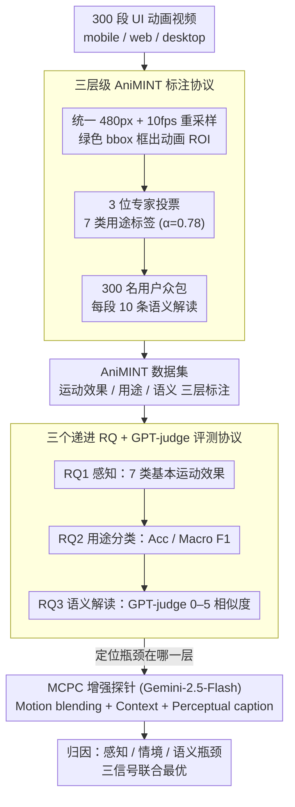

# Beyond Screenshots: Evaluating VLMs' Understanding of UI Animations

**会议**: ACL 2026  
**arXiv**: [2604.26148](https://arxiv.org/abs/2604.26148)  
**代码**: <https://github.com/publicationacc/AniMINT>  
**领域**: 多模态 VLM / UI 理解 / 评测  
**关键词**: UI 动画、VLM 评测、AniMINT、修辞结构、motion blending

## 一句话总结
构建首个 UI 动画理解评测集 AniMINT（300 段密集标注的动画视频 + 3 位专家 + 300 用户标注），系统测试 9 个 SOTA VLM 后发现：基础运动效果能识别，但动画用途分类和高层语义解读与人类差距巨大，进一步用 Motion-Context-Perceptual Cue (MCPC) 增强能在 Gemini-2.5-Flash 上同时提升分类和解读性能。

## 研究背景与动机

**领域现状**：UI agent（GPT-Operator、Mind2Web 等）需要全面感知用户界面，但现有 VLM 在 UI 理解上的研究几乎都聚焦静态截图——按钮识别、布局解析、UI semantics 等。

**现有痛点**：动画在现代 UI 中扮演的是核心沟通功能而非装饰——MacOS dock 弹跳传递通知、密码框抖动表示输入错误、加载动画暗示状态进度。这些信息往往只在动画里、static frame 完全捕捉不到。如果 VLM agent 只能看截图，就会漏掉用户和系统之间约 30-50% 的反馈通道。

**核心矛盾**：「动画的意义在运动里、不在画面里」（"motion that is drawn, not drawings that move"），但 VLM 输入要么是 single frame 要么是稀疏采样 video——结构上就难以捕捉短暂、空间局部、语义抽象的 UI motion。

**本文目标**：(1) 提供首个 UI 动画评测集，覆盖 mobile / web / desktop 三大平台、含动画的运动效果 / 功能用途 / 语义解读三层标注；(2) 系统测 9 个主流 VLM 的能力天花板；(3) 探索哪些信号增强（motion blending / context / caption）能显著提升性能。

**切入角度**：从 UX/UI 学界已有的动画分类学（7 类用途 × 7 种基本运动效果）出发，构建多层级标注；同时招募 3 位专家做用途标签 + 300 名 Prolific 用户对每段动画给 10 条独立自然语言解读，形成 expert + crowd 双视角。

**核心 idea**：让评测设计直接对应 UI 设计学界的语言体系，从而既能测「VLM 能不能感知运动」又能测「VLM 能不能像人一样理解动画为何而存在」。

## 方法详解

### 整体框架
本工作分两阶段：(1) **AniMINT 数据集构建**——300 段 UI 动画视频（mobile 大头：Top 100 App Store/Google Play 应用）+ 多层级标注（时间范围、ROI、交互上下文、用途类别、10 条独立语义解读）；(2) **VLM 系统评测 + 增强探索**——围绕三个 RQ 测 9 个 VLM：能否识别基本运动效果 (RQ1)、能否分类动画用途 (RQ2)、能否解读动画语义 (RQ3)；随后用 MCPC 三因素探针定位瓶颈并验证增强效果。

### 关键设计

**1. 三层级 AniMINT 标注协议：同一段动画支持低/中/高三种粒度评测，逼出瓶颈到底在哪一层**

一个用途标签根本表达不了动画的丰富语义，也无法回答"VLM 是看不见运动、还是看见了却不懂含义"。协议因此让每段动画同时承载三层标注。所有视频先统一到 480 像素分辨率 + 10 fps 重采样，并用绿色 bbox 框出动画 ROI 以减少干扰；随后 3 位 UI/UX 专家按多数投票从 7 类用途（Transition / Demonstration / Guidance / Feedback / Visualization / Highlight / Aesthetic）里选一个打标签，标注一致性 $\alpha=0.78$ 后再讨论达成共识；同时 300 名 Prolific 用户每人标 10 段视频，每段视频最终收集到 10 条独立的自然语言解读，全库共 3000 条 user response。所有视频上传前都手工筛掉敏感/闪烁等有害内容。这种"专家用途 + 群众语义"的双视角既保留细粒度的专业判断，又反映普通用户理解的天然多样性——10 条独立解读还能在评测时刻画"语义对齐的分布"，而不是拿单点答案硬碰硬。

**2. 三个递进 RQ + GPT-judge 评测协议：把"懂不懂动画"拆成可独立量化的三问**

"VLM 能不能理解动画"太笼统，必须拆开才能定位瓶颈，于是协议设了三个递进子问题。RQ1 测 perception：用一个静止方块叠加单一运动作为受控刺激，覆盖 7 类纯几何运动效果（move/rotate/size/color/fade/blur/morph），每模型每题把选项顺序随机化跑 10 次取平均。RQ2 测用途分类：把动画连同 context（应用/任务）+ user input（动作类型）+ 绿色 bbox 一起喂给模型，报 accuracy 和 macro F1。RQ3 测语义解读：让 VLM 生成自由文本，再与人类响应比对算 0–5 的语义相似度——评判用 GPT-5-mini 当 judge，prompt 严格控制不让输出长度干扰打分，并预先用 GPT-5 把每段动画的 10 条人类响应 summarize 成一条"共识响应"与 VLM 输出对齐。之所以用 GPT-judge 配统一 rubric（5=完全等价 / 0=毫不相关），是因为它比 BLEU 这类表层指标更能捕捉语义对齐，是当前 LLM-as-judge 的最佳实践。

**3. Motion-Context-Perceptual Cue（MCPC）增强探针：用三种补足信号反推失败究竟卡在哪**

要判断模型到底是"看不见运动、还是看见了不懂情境、还是连高层语义都抓不住"，单靠观察分数不够，得主动注入信号来做归因。MCPC 因此把"VLM 看动画"拆成三种可叠加的线索：**Motion blending**（把过去 6 帧按递减透明度叠成一张图，灵感来自 Phosphor afterglow，相当于把运动轨迹直接"画"在一张图上，绕开帧间推理瓶颈）、**Context**（交互上下文与用户输入，让模型知道动画发生在什么情境里）、**Perceptual caption**（直接用文字告诉模型动画发生了什么）。实验以 Gemini-2.5-Flash 为 backbone，base 只给采样 frame，然后逐个加 M/C/P 的单、双、三种组合，每个组合都重跑 RQ2 和 RQ3。逻辑很清晰：哪种增强单独有效，瓶颈就定位到对应那一层；若三者联合才最优，说明感知—情境—语义之间存在 synergy。

### 损失函数 / 训练策略
纯零样本评测论文，不训练任何模型。所有 9 个 VLM 用默认温度，通过 OpenRouter 调用闭源模型；开源模型本地推理；context length 从 64K（GLM-4.5V）到 1M（Gemini-2.5-Pro）不等。

## 实验关键数据

### 主实验：RQ2 用途分类（Accuracy + Macro F1）

| 模型 | Accuracy | Macro F1 |
|------|----------|----------|
| Gemini-2.5-Pro | **0.64** | **0.55** |
| GPT-5 | 0.64 | 0.53 |
| GPT-o4-mini | 0.63 | 0.51 |
| GPT-o3 | 0.62 | 0.54 |
| Gemini-2.5-Flash | 0.61 | 0.53 |
| GPT-5-mini | 0.58 | 0.48 |
| Claude-Sonnet-4 | 0.57 | 0.46 |
| GLM-4.5V | 0.45 | 0.40 |
| Qwen2.5-VL-72B | 0.39 | 0.32 |

最强模型只到 0.64，距离人类水平差距明显。Per-category recall：Feedback 0.69 / Visualization 0.69 / Guidance 0.59 高，但 Highlight 0.24 / Aesthetic 0.16 严重不行——VLM 对功能性强、有明确文字反馈的动画在行，对纯情感/品牌强调的「微妙」动画很差。

### RQ3 语义解读相似度（vs 群众共识响应，0-5）

| 模型 | Mean | Std |
|------|------|-----|
| GPT-o3 | **3.47** | 0.91 |
| GPT-5 | 3.44 | 0.90 |
| Gemini-2.5-Pro | 3.40 | 0.90 |
| GPT-5-mini | 3.39 | 0.82 |
| Gemini-2.5-Flash | 3.31 | 0.95 |
| Claude-Sonnet-4 | 3.10 | 1.12 |
| Qwen2.5-VL-72B | 2.94 | 1.24 |
| GLM-4.5V | 2.71 | 1.47 |

大多模型在 3 分左右——抓得到 gist 但常缺关键细节或方向走偏。

### MCPC 消融（Gemini-2.5-Flash）

| 增强 | RQ2 Acc | RQ2 F1 | RQ3 Mean | RQ3 Std |
|------|---------|--------|----------|---------|
| Base | 0.59 | 0.47 | 3.15 | 1.09 |
| + Motion | 0.52 | 0.41 | 3.08 | 1.07 |
| + Context | 0.58 | 0.48 | 3.30 | 0.95 |
| + Perceptual | 0.57 | 0.45 | 3.50 | 0.89 |
| + M+P | 0.53 | 0.40 | 3.48 | 0.86 |
| + C+P | 0.55 | 0.46 | 3.48 | 0.77 |
| **+ M+C+P** | **0.61** | **0.52** | **3.52†** | **0.73** |

三种信号联合显著优于任何单一/双信号组合，确认「感知-情境-语义」三者有强 synergy。

### 关键发现
- **VLM 能看运动但不会解读**：RQ1 中 5/9 模型对 7 类基本运动全对，但 RQ2/RQ3 显著下降，瓶颈不在低层感知。
- **错误模式 1：过度依赖静态末帧**：McDonald's 动画明显是 Aesthetic（M 字弹入 + "ba da ba"），但 6 模型因为末帧有「Your order is confirmed」文字误判为 Feedback。
- **错误模式 2：小 ROI 失败**：动画 ROI 平均占屏 24.3%（正确）vs 14.1%（错误抽签），Mann-Whitney $p=0.03$ 显著；小 ROI 时模型常被周围大元素干扰。
- **错误模式 3：忽视交互情境**：用户反复滑屏失败 → 系统弹出 demonstration 教正确手势，但 8/9 模型把它误判为 Transition，因为没把「失败动作 → 教学动画」串起来。
- **subtle 快速动画完全漏掉**：密码框抖动动画 5/9 模型直接说「无动画」或幻觉描述不存在的进度条。
- **Gemini-2.5-Pro 有 hallucination**：会编造不存在的「translucent rounded object」，与已知 VLM 幻觉文献一致。

## 亮点与洞察
- 「motion that is drawn, not drawings that move」这一定义抓得很准——直接解释了为什么单看 frame 不够；以此为出发点构建 video-level 评测是必要而非锦上添花。
- 三层级评测（运动效果 → 用途 → 语义）精准定位瓶颈，研究方法论很值得借鉴——以后任何「VLM 是否理解 X」的问题都可以拆成「能感知 X 吗 → 能分类 X 吗 → 能解读 X 吗」三阶问询。
- Motion blending 用「过去 6 帧叠透明」这个 Phosphor afterglow 老 trick，把动态视频压缩成单图，绕开 VLM 帧间推理瓶颈，是非常巧的 prompt 工程。
- 「shallow persona detection」式发现（模型能感知动画存在但不能区分动画用途）和心理学 persona 论文（同会议）的结论几乎同构，暗示 VLM 在多种「细粒度区分任务」上有共同失败模式。
- 群众标注 + 专家标注双视角设计很好——专家保证 taxonomy 严格，群众保证语义解读多样化（即同一动画可以有多种合理解读）。

## 局限与展望
- 数据来源以美国应用为主、英文界面，未覆盖文化/语言差异（如阿拉伯文 RTL、亚洲股市颜色约定）。
- 标注者全部美国英语母语者，对某些跨文化语义会有偏置。
- 仅评测 9 个 SOTA VLM，且发现小模型（7-14B）几乎完全无法处理 UI 动画任务（context length 或 single-image 限制），故主表未含。
- MCPC 探针仅在 Gemini-2.5-Flash 上跑，对其他模型迁移性未验证。
- ROI 用绿色 bbox 强制聚焦，真实部署中要求 VLM 自己定位 ROI 会更难。

## 相关工作与启发
- **vs Rico / MONDAY / GUI World**：那些数据集是 UI 截图/交互录制，并非为动画理解设计——AniMINT 是首个专门聚焦动画语义的多层级标注集。
- **vs Mackamul 2025 / Dessart 2011**：那些 UX 研究主要测真实用户对动画的感知，本文把同样的 taxonomy 引入 VLM 评测；为 HCI 与 NLP 跨界搭桥。
- **vs VLM agent 通用 benchmark (OSWorld / WebWalker)**：那些 benchmark 测「能否完成任务」的端到端能力，本文测「能否理解 UI 元素」的细粒度感知，互为补充——若 agent 无法理解动画反馈，端到端任务很可能失败而无法诊断原因。

## 评分
- 新颖性: ⭐⭐⭐⭐⭐ 首次系统聚焦 UI 动画理解，从 taxonomy 到 motion blending 到 MCPC 探针都是新设计，填补了从 static screenshot 到 dynamic interaction 的评测空白。
- 实验充分度: ⭐⭐⭐⭐ 9 个 SOTA VLM × 3 RQ + MCPC 消融 + 8 种 cue 组合扫描，并对每个错误模式做了细致定量分析（小 ROI Mann-Whitney 检验等）。
- 写作质量: ⭐⭐⭐⭐⭐ 例子贯穿（McDonald's、密码框抖动、Android 滑屏失败教学），把抽象失败模式讲得非常直观；3 个 RQ 的结构非常清晰。
- 价值: ⭐⭐⭐⭐⭐ 直指 UI agent 时代的核心盲区——动画理解；3000 条人工解读 + 双视角标注本身是非常稀缺的数据资源，会推动后续 dynamic UI agent / accessibility / animation generation 等多个方向。

<!-- RELATED:START -->

## 相关论文

- [\[ACL 2026\] Measuring What Matters Beyond Text: Evaluating Multimodal Summaries by Quality, Alignment, and Diversity (MM-Eval)](measuring_what_matters_beyond_text_evaluating_multimodal_summaries_by_quality_al.md)
- [\[ACL 2026\] CArtBench: Evaluating Vision-Language Models on Chinese Art Understanding, Interpretation, and Authenticity](cartbench_evaluating_vision-language_models_on_chinese_art_understanding_interpr.md)
- [\[CVPR 2026\] Think360: Evaluating the Width-centric Reasoning Capability of MLLMs Beyond Depth](../../CVPR2026/multimodal_vlm/think_360_evaluating_the_width-centric_reasoning_capability_of_mllms_beyond_dept.md)
- [\[CVPR 2026\] Beyond Recognition: Evaluating Visual Perspective Taking in Vision Language Models](../../CVPR2026/multimodal_vlm/beyond_recognition_evaluating_visual_perspective_taking_in_vision_language_model.md)
- [\[ACL 2026\] Long Story Short: Disentangling Compositionality and Long-Caption Understanding in Contrastive VLMs](long_story_short_disentangling_compositionality_and_long-caption_understanding_i.md)

<!-- RELATED:END -->
