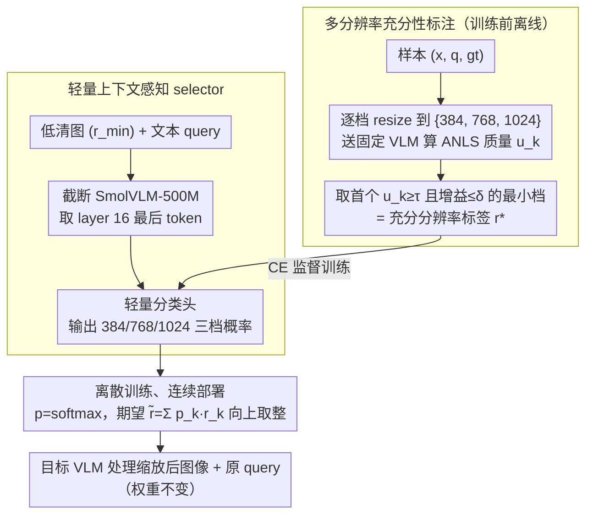

# CARES: Context-Aware Resolution Selector for VLMs

**会议**: ACL2026 Oral  
**arXiv**: [2510.19496](https://arxiv.org/abs/2510.19496)  
**代码**: https://mkimhi.github.io/CARES/  
**领域**: 多模态VLM / 推理效率 / 自适应分辨率  
**关键词**: 分辨率选择、视觉token压缩、VLM推理加速、ANLS、连续路由

## 一句话总结
CARES 在目标 VLM 前增加一个轻量 query-aware 分辨率选择器，用低分辨率图像和文本问题预测“足够回答”的最小输入分辨率，在 9 个多模态 benchmark 上基本保持准确率，同时平均节省约 65–85% 的 prefill 计算成本。

## 研究背景与动机
**领域现状**：通用 VLM 为了覆盖 OCR、文档理解、自然图像问答、图表推理等任务，通常默认使用高分辨率或 AnyRes/tiling 输入。分辨率越高，视觉 token 数越多，prefill 阶段视觉 token 甚至可占总 token 的 99%。

**现有痛点**：许多用户问题并不需要高分辨率。例如“狗是什么品种”可能低清图即可回答，而“项圈上写了什么名字”才需要高分辨率。现有 token pruning、pooling、merging 多发生在视觉编码之后，已经付出了高分辨率 tokenization 成本，而且通常不了解当前文本 query。

**核心矛盾**：VLM 需要高分辨率来保证困难样本质量，但把所有样本都按最高分辨率处理会浪费大量算力。真正可控的杠杆在 tokenization 之前：先决定该用多少像素。

**本文目标**：学习一个放在任意 VLM 前的预处理模块，根据 image-query pair 预测最小充分分辨率，减少 visual tokens、FLOPS、TTFT 或 API 成本，同时不改目标 VLM 架构和权重。

**切入角度**：作者不直接预测“难/易”，而是用目标 VLM 在多分辨率 rollout 下的真实回答质量生成 supervision：哪个最低分辨率已经达到足够质量，就把它作为标签。

**核心 idea**：把 VLM 推理效率问题前移到输入分辨率选择，用 query-conditioned sufficiency label 学会“够用就好”的像素分配。

## 方法详解
CARES 的主版本是一个 discriminative selector：用截断后的 SmolVLM-500M 在低分辨率下联合编码图像和问题，取中间层最后 token 表示，接轻量分类头预测 384/768/1024 三个分辨率类别，再在推理时通过概率加权得到连续分辨率。

### 整体框架
训练前，作者先对样本 `(x,q,gt)` 做多分辨率标注：把图像分别 resize 到候选分辨率，送入固定 VLM 得到答案，用 ANLS 或相应指标评估答案质量，选择最小充分分辨率作为标签。训练时 CARES 只看低分辨率图像和 query，学习预测该标签。部署时，CARES 输出连续分辨率，目标 VLM 只处理被缩放后的图像和原 query。

### 关键设计

**1. 多分辨率充分性标注：让目标 VLM 自己的性能曲线定义“够用阈值”**

selector 要学“这题最低需要多少像素”，可没人能人工判断每个样本该多清楚。CARES 的做法是把这个问题交还给目标模型自己回答：对每个样本 $(x,q,gt)$，把图像分别 resize 到离散候选集 $\mathcal R_d=\{384,768,1024\}$，逐档送入固定 VLM 得到答案并用 ANLS 算质量 $u_k=ANLS(F(x^{(r_k)},q),gt)$，再挑出第一个“已经够好”的档位作标签——即同时满足 $u_k\ge\tau$、且继续升档收益不超过 $\delta$ 的最小 $r_k$（默认 $\tau=0.85$、$\delta=0.1$）。

这样得到的标签天然带“性能收敛即停止”的语义：只要更高分辨率不再带来明显增益，就认为当前像素已经够用。相比直接在连续空间里搜最优分辨率，离散 rollout 成本低得多，标签也更稳定；而且它不依赖人对“难易”的主观判断，完全由 VLM 在不同清晰度下的真实答对率说了算。

**2. 轻量上下文感知 selector：在大 VLM 开销发生前，用半个小模型预判像素预算**

预测必须发生在昂贵的高分辨率 tokenization 之前，否则就失去了省算力的意义。CARES 因此用一个截断后的 SmolVLM-500M 做 selector：只保留到 layer 16 的中间表示、丢掉后半层，把 $r_{min}$ 下的低清图像和文本 query 联合编码，取最后 token 的 hidden state 接一个轻量分类头，输出 384/768/1024 三档的概率。

之所以用中间层而非最后一层，是因为中间层往往保留了更丰富的感知与语义信息，而只跑半个小 VLM 的额外开销几乎可以忽略。关键还在于 query-aware 的联合编码：同一张图，“狗是什么品种”和“项圈上写了什么名字”需要的像素预算天差地别，只看图像的 SigLIP 双塔特征判断不了这种差异，必须把问题一起喂进去才知道“这个问题到底需要哪些视觉细节”。

**3. 离散训练、连续部署：用概率加权把粗糙档位变成细粒度分辨率**

三档标签便于标注和训练，但部署时若只能在 384/768/1024 之间硬跳变，会在分类边界附近频繁过度升档、浪费算力。CARES 的解法是把分类器的概率分布利用起来：训练时按三档做分类，推理时先取 $p=softmax(\ell)$，再用期望 $\tilde r=\sum_k p_k r_k$ 算出一个连续分辨率，最后按目标 backbone 支持的输入尺寸向上取整。

这等于让模型的不确定性直接参与 compute-quality 权衡——模型越拿不准就给越接近中间值的分辨率，而不是粗暴地二选一。消融也显示连续路由比离散路由进一步省下约 17 个百分点的 FLOPS（Granite/InternVL 上 -63% vs -46%），且分数基本不掉。

### 损失函数或训练策略
CARES 使用 80K 训练集，来自 TextVQA、ChartQA、DocVQA、LLaVA-Multi 各 20K，覆盖文档和自然图像。主 selector 训练 6 epoch，学习率 $10^{-3}$，batch size 32，用 cross-entropy $\mathcal L(\theta)=CE(f_\theta(z),r^*)$ 监督三档分辨率分类，并加入 0.05 label smoothing 以支持连续分辨率部署。作者还实现了 Granite-Docling-258M 的 autoregressive 版本，用 LoRA rank 8 训练 3 epoch，让模型预测 `<1>/<2>/<3>` 分辨率 token。

## 实验关键数据

### 主实验
| Target VLM | Native 平均分 | CARES 平均分 | 平均成本变化 | 说明 |
|------------|---------------|--------------|--------------|------|
| Granite-Vision-2B | 0.59 | 0.60 | -63% | 小模型上准确率略升且成本大降 |
| InternVL3-8B | 0.77 | 0.77 | -64% | 多 benchmark 保持性能 |
| Qwen2.5-VL-72B | 0.79 | 0.80 | -70% | 大模型上仍能迁移 |
| GPT-4o | 0.69 | 0.68 | -55% | API 成本下降，质量基本持平 |

| Benchmark 范围 | 指标 | CARES 设置 |
|----------------|------|-------------|
| Ai2D / ChartQA / SeedBench-2 | exact-match accuracy | 评估自然图像、图表和通用视觉问答 |
| DocVQA / OCRBench | ANLS | 检验文档/OCR 场景是否仍需高分辨率 |
| MMMU / RealWorldQA / InfoVQA / MathVista | task score | 检验跨领域泛化 |
| DocVQA latency frontier | TTFT / TFLOPs | CARES 用约 2.58 TFLOPs 接近 native，而 native 约 7.5 TFLOPs |

### 消融实验
| 配置 | 关键指标 | 说明 |
|------|----------|------|
| SigLIP v2 feature | 56.1% resolution accuracy | 双塔特征不如联合 VLM 编码 |
| SmolVLM Mid | 63.3% / 0.35B params | 默认选择，效率和准确率平衡最好 |
| SmolVLM Last | 62.3% / 0.5B params | 最后一层略弱且成本更高 |
| Qwen2.5-3B Mid | 67.2% / 2.3B params | 分辨率分类最准但更重 |
| 二档分辨率 {384,1024} | 96.2% 分类准确率 / 0.76 downstream | 标签更简单但控制太粗 |
| 三档分辨率 {384,768,1024} | 67.2% 分类准确率 / 0.80 downstream | 分类更难，但下游效果更好 |
| Continuous routing | Granite/InternVL FLOPS -63% | 比 discrete -46% 更省，分数基本不掉 |
| Label smoothing | OCRBench 0.821 vs 0.811 | 改善连续分辨率概率校准 |

### 关键发现
- 目标 VLM 不同，CARES 仍能迁移：Granite、InternVL、Qwen2.5-VL、GPT-4o 上都能以小于 1 个百分点的平均质量变化换来大量 prefill 节省。
- 充分分辨率标签不是单一 teacher 的偶然偏好：Granite-Vision-2B 和 Qwen3-VL-235B 在 1000 个样本上 95% 以上标签一致，Pearson 相关 0.908。
- 连续分辨率不是装饰项。离散预测已经省算力，连续预测进一步降低 FLOPS，同时能避免硬分类边界附近的过度升档。

## 亮点与洞察
- CARES 的最大亮点是把效率控制放在“像素进入 VLM 之前”。相比 token pruning，它避免了先高分辨率编码再删 token 的先付费后节省问题。
- 用多分辨率 rollout 生成 sufficiency labels 很实用：它不需要人工判断“这题需要多清楚”，而是让目标模型自己的性能曲线定义够用阈值。
- query-aware 是关键。单看图像无法判断分辨率需求，同一张图在粗粒度分类和 OCR 问题下需要完全不同的像素预算。

## 局限与展望
- 训练标签需要对大量样本做多分辨率 VLM rollout，离线标注成本不低；如果目标模型频繁升级，标签可能需要重建或校准。
- 当前主要处理单图静态输入，视频、多图推理、交互式检索场景下的分辨率选择会更复杂。
- CARES 只选择输入分辨率，不处理视觉 token 在模型内部的冗余；它和 token pruning/merging 可互补，但组合后的误差累积需要进一步研究。
- 对极端小文字、稀疏细节或安全关键任务，过低分辨率的风险更高，部署时可能需要任务级安全下限或置信度回退。

## 相关工作与启发
- **vs HiRED / SparseVLM / PyramidDrop / VTW**: 这些方法在 tokenization 或编码之后减少视觉 token；CARES 在 tokenization 前决定图像分辨率，避免不必要的高分辨率输入成本。
- **vs TokenFLEX / Matryoshka / LLaVA-Mini**: 这些方法训练模型适配不同 token budget；CARES 不改目标 VLM，可作为前端和弹性 token 模型叠加。
- **vs AnyRes / tiling**: AnyRes 通过更多 tile 保留细节，CARES 则按 query 判断是否需要这些细节，对 coarse query 可以直接绕开高成本 tiling。

## 评分
- 新颖性: ⭐⭐⭐⭐☆ 分辨率选择本身不新，但 query-aware sufficiency rollout 在 VLM 推理前端很实用。
- 实验充分度: ⭐⭐⭐⭐⭐ 覆盖 9 个 benchmark、4 类目标 VLM、AR 版本和多项消融，证据充足。
- 写作质量: ⭐⭐⭐⭐☆ 方法动机和算法很清楚，表格稍密但关键信息完整。
- 价值: ⭐⭐⭐⭐⭐ 对 VLM 实际部署、成本控制和动态视觉计算非常有价值。

<!-- RELATED:START -->

## 相关论文

- [\[CVPR 2025\] Context-Aware Multimodal Pretraining](../../CVPR2025/multimodal_vlm/context-aware_multimodal_pretraining.md)
- [\[ICML 2025\] MMInference: Accelerating Pre-filling for Long-Context VLMs via Modality-Aware Permutation Sparse Attention](../../ICML2025/multimodal_vlm/mminference_accelerating_pre-filling_for_long-context_vlms_via_modality-aware_pe.md)
- [\[ICCV 2025\] HRScene: How Far Are VLMs from Effective High-Resolution Image Understanding?](../../ICCV2025/multimodal_vlm/hrscene_how_far_are_vlms_from_effective_high-resolution_image_understanding.md)
- [\[CVPR 2026\] HiconAgent: History Context-aware Policy Optimization for GUI Agents](../../CVPR2026/multimodal_vlm/hiconagent_history_context-aware_policy_optimization_for_gui_agents.md)
- [\[ICML 2026\] Density-Aware Translation of Spurious Correlations in Zero-Shot VLMs](../../ICML2026/multimodal_vlm/density-aware_translation_of_spurious_correlations_in_zero-shot_vlms.md)

<!-- RELATED:END -->
