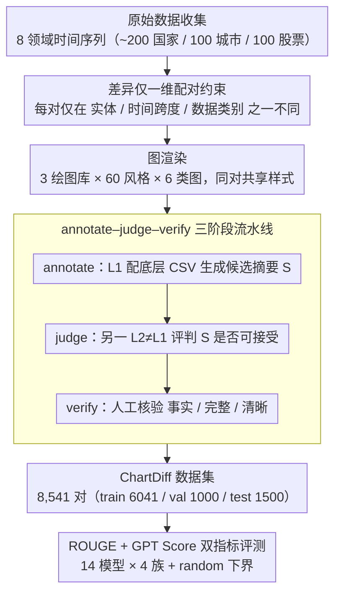

# ChartDiff: A Large-Scale Benchmark for Comprehending Pairs of Charts

**会议**: ACL 2026  
**arXiv**: [2603.28902](https://arxiv.org/abs/2603.28902)  
**代码**: https://ckchaos.github.io/ChartDiff  
**领域**: 多模态 / 图表理解  
**关键词**: 图表对比、Benchmark、VLM 评测、跨图推理、ROUGE vs GPT Score

## 一句话总结
作者构建了第一个面向"两图对比摘要"的大规模 benchmark ChartDiff（8,541 对图表，覆盖 6 种图类型、3 个绘图库、约 60 种视觉风格、LLM 生成 + 人工核验的对比摘要），系统评测了 14 个 VLM/pipeline，发现前沿闭源大模型在 GPT Score 上领先但 ROUGE 低，专业图表模型/pipeline 反之，揭示了 ROUGE 与人感知质量的严重失配；同时多系列图始终是所有模型最难的死角。

## 研究背景与动机

**领域现状**：图表理解（ChartQA、Chart-to-Text、Chart Summarization）近年发展迅猛，从 FigureQA / PlotQA 等模板化合成数据集，到 ChartQA / ChartQAPro / CharXiv / ChartX / ChartBench 等真实数据集，再到 ChartLlama、UniChart、MatCha、ChartAssistant、ChartGemma 等专用模型，几乎都聚焦于"单张图理解"——把每张图当成独立单元做 QA、抽数、摘要。

**现有痛点**：真实分析场景大量是**比较型**——分析师同时看两张图判断 A/B 测试效果、模型对比、不同时期/不同地区的趋势差异、异常检测、可复现性核查。但这一能力在评测体系中几乎缺位：MultiChartQA、INTERCHART、ReMI 等少数尝试多图任务，规模均偏小（千级别）、任务形式偏 QA 而非自由摘要；同期 ChartAB（与本文同规模）虽然也做多图但定位为"细粒度 grounding/alignment"诊断，不评测整体 comparative 推理。因此"VLM 能否完成开放式跨图比较摘要"这个核心能力，从来没有大规模、可重复的标尺。

**核心矛盾**：(1) 比较任务的难度并非来自单图理解的简单叠加——模型需要同时做两图的数据提取 + 对齐 + 趋势对比 + 异常识别 + 文本生成；现有 single-chart benchmark 的能力曲线无法外推到这里。(2) 现有评测惯用 ROUGE 这种 lexical overlap 指标，对长摘要的语义/事实正确性几乎不敏感；如果数据集准备时大量复用类似句式，专用模型可以"背模板"刷高分而不真正理解内容。

**本文目标**：(1) 构建一个规模 + 多样性 + 标注质量都足够支撑严肃评测的"双图对比摘要" benchmark；(2) 系统性评测当前主流的闭源大模型、开源大模型、领域专用模型、pipeline 方案在该任务上的表现差距；(3) 同时使用 ROUGE 与 GPT Score 两类指标，定量揭示 lexical 指标在比较摘要上失效的程度；(4) 切分多个维度（图类型、绘图库）做诊断分析。

**切入角度**：图表对（chart pair）的设计原则——每对只在**一个维度**上有差异（数据实体 / 时间跨度 / 数据类别），其他保持一致，让"差异性"成为唯一变量、对模型形成可解释的可控压力测试。

**核心 idea**：用"先 LLM 生成 → 另一 LLM judge → 人工校验"的三阶段流水线规模化生产高质量对比摘要，绕开"纯人工太慢、纯 LLM 太脏"的两难。

## 方法详解

### 整体框架
ChartDiff 数据集构建分四阶段：(1) **原始数据收集**——从 Macrotrends、Yahoo Finance、Visual Crossing 抓取 8 个领域（经济、健康、移民、劳动、人口、贸易、股票、天气）的时间序列，覆盖 ~200 国家/地区、100 城市、100 股票；剔除断点、不完整数据。(2) **配对**——每对两个 CSV 数据集，只允许在"实体 / 时间跨度 / 数据类别"三种维度之一上不同，保证差异可控。(3) **图渲染**——用 Matplotlib、Plotly、Plotnine 三个库共 60 种风格配置，覆盖线图、柱图、横向柱图、多系列线图、多系列柱图、饼图共 6 类；线/柱图每对 6–12 点，饼图 3–5 类别；同一对共享 styling；人工检查避免遮挡/缺点/比例异常。(4) **标注**——annotate–judge–verify 三阶段。最终保留 8,541 对，划分为 train 6041 / val 1000 / test 1500。评测套件覆盖 14 个模型，4 大族：闭源大模型（GPT-5.4、Gemini 3.1 Pro、Claude Sonnet 4.6、GPT-4o 等）、开源大模型（Qwen3.5-397B-A17B、Qwen3.5-9B、Qwen2.5-VL-7B）、领域专用（ChartGemma、MatCha）、pipeline（DePlot + GPT/Qwen）；外加 random 下界 baseline。指标用 ROUGE-1/2/L + GPT Score（GPT-5.4 作 judge，与 300 人评的 Pearson $r=0.91$）。

### 关键设计

**1. "差异仅一维"的配对约束：把所有混淆变量都关掉，只留"内容差异"这一个轴**

multi-chart benchmark 里如果两张图同时在多个维度不同，评估器根本判断不出模型究竟"读懂"了哪个维度的对比。ChartDiff 因此给每对图加了一条硬约束：两个 CSV 必须仅在实体（国家/股票/城市）、时间跨度、数据类别三者中**只有一个**不同，例如同一国家不同时段、或同一时段不同国家；数据点数严格相等（线/柱图 6–12 点，饼图 3–5 类别），样式（绘图库 + 颜色 + 字体）也共享同一套配置。

把混淆变量全部关掉后，"差异性"就成了唯一变量，对模型形成可解释的可控压力测试。这种 control 还有一个副产物：因为差异维度是受控的，后续可以干净地按维度切片做诊断（如按图类型、按绘图库分别报告 GPT Score），让评测从混乱多变量退化成可分析的单变量实验。

**2. annotate–judge–verify 三阶段 LLM 流水线：在 8.5k 规模与人感知质量之间找平衡**

纯人工标注 8,541 对太慢，纯单模型 LLM 标注又会引入 self-bias（同一模型偏爱自己的输出）。ChartDiff 用三阶段流水线绕开这个两难：先从模型池 $\mathcal{A}=\{\text{GPT-5.4, Gemini 3.1 Pro}\}$ 随机抽 $L_1$ 配合**底层 CSV**（而非图像）生成候选摘要 $S$；再抽另一个 $L_2\in\mathcal{A}\setminus\{L_1\}$ 作 judge，给定图对 + $S$ 评判是否可接受（提示里把 "dataset" 自动改写为 "chart"）；最后由人工核验事实正确、关键差异完整、表达清晰。

引入第二个 LLM 做 cross-judge 能显著压低同质化偏差——实测 GPT-5.4 候选接受率 0.93、Gemini 3.1 Pro 0.967，说明绝大部分质量问题在跨模型互评阶段就被过滤掉，人工只做最后一道收口。其中**给标注喂 CSV 而非图片**是关键 trick：它把"标注的数值正确性"和"被测的图像理解能力"彻底解耦，避免训练数据本身就带 OCR/perceptual error。

**3. ROUGE + GPT Score 双指标：定量揭示 lexical 指标在长摘要上的失效程度**

长对比摘要的核心是语义和事实正确性，可大家惯用的 ROUGE 只测 n-gram 重叠，对此几乎不敏感——专用模型只要复用 reference 的句式就能"背模板"刷高分。ChartDiff 因此并排报告两类指标：ROUGE-1/2/L 测 lexical 重叠，GPT Score 用 GPT-5.4 按预设 grading prompt 对 quality + correctness 打 0–5 分，并用 300 条人评样本做 reliability check，得到 Pearson $r=0.91$ 的强相关给这把"尺子"背书。

并排一放，错位极其戏剧化：ChartGemma 的 ROUGE-1=51.49 居全场之首，GPT Score 却只有 2.0；MatCha 的 ROUGE-L=28.75 最高，GPT Score 1.45 已逼近 random 的 1.17；反观 GPT-5.4，ROUGE-1 才 46.02 却拿下 4.95 的最高 GPT Score。这种排名近乎完全反转，把"专用模型靠模板背书刷分"这个长期被忽视的隐性问题摆上台面，倒逼后续 chart 工作必须配 model-based 评估、不能只报 ROUGE。

## 实验关键数据

### 主实验：14 模型 × 4 评测指标（test 1500 对）

| 模型 | 类别 | ROUGE-1 | ROUGE-2 | ROUGE-L | GPT Score |
|------|------|---------|---------|---------|-----------|
| GPT-5.4 | 闭源大模型 | 46.02 | 12.28 | 23.45 | **4.95** |
| Gemini 3.1 Pro | 闭源大模型 | 47.21 | 13.48 | 24.20 | 4.86 |
| GPT-5.4-mini | 闭源大模型 | 43.00 | 10.62 | 21.68 | 4.82 |
| Gemini 3.1 Flash Lite | 闭源大模型 | 46.37 | 12.83 | 22.82 | 4.63 |
| Claude Sonnet 4.6 | 闭源大模型 | 47.54 | 13.31 | 23.42 | 4.58 |
| GPT-4o | 闭源大模型 | 44.43 | 11.48 | 22.44 | 4.23 |
| Qwen3.5-397B-A17B | 开源大模型 | 47.07 | 12.68 | 22.57 | 4.54 |
| Qwen3.5-9B | 开源大模型 | 44.09 | 10.84 | 21.16 | 3.65 |
| Qwen2.5-VL-7B | 开源大模型 | 41.18 | 9.82 | 20.88 | 3.18 |
| **ChartGemma** | 专用 | **51.49** | 17.81 | 28.53 | 2.00 |
| **MatCha** | 专用 | 49.52 | **18.34** | **28.75** | 1.45 |
| DePlot + GPT-5.4 | Pipeline | 50.75 | 17.25 | 28.88 | 3.58 |
| DePlot + GPT-4o | Pipeline | 46.46 | 13.19 | 23.66 | 3.38 |
| DePlot + Qwen3.5-9B | Pipeline | 43.10 | 10.38 | 20.30 | 2.81 |
| Random baseline | – | 25.50 | 2.50 | 12.81 | 1.17 |

### 消融实验：按图类型切片 GPT Score（部分模型）

| 模型 | Overall | Line | Bar | Bar(H.) | Line(M.) | Bar(M.) | Pie |
|------|---------|------|-----|---------|----------|---------|-----|
| GPT-5.4 | 4.95 | 4.97 | 4.97 | 4.89 | 4.90 | 4.88 | **4.99** |
| Gemini 3.1 Pro | 4.86 | 4.82 | 4.90 | 4.94 | 4.65 | 4.85 | 4.98 |
| Qwen3.5-9B | 3.65 | 3.82 | 3.89 | 3.55 | **3.20** | **3.33** | 3.57 |
| Qwen2.5-VL-7B | 3.18 | 3.54 | 3.14 | 2.79 | **2.79** | **2.53** | 3.58 |
| ChartGemma | 2.00 | 2.36 | 2.36 | 2.01 | **1.30** | **1.36** | 1.68 |
| DePlot+GPT-5.4 | 3.58 | 3.89 | 4.63 | 3.16 | 2.91 | 4.65 | **1.24** |

绘图库切片（GPT Score）：GPT-5.4 在 Matplotlib/Plotly/Plotnine 上为 4.94/4.97/4.93，差异 ≤0.04；而 DePlot+GPT-5.4 为 4.08/3.12/3.89，Plotly 上掉近 1 分。

### 关键发现
- **ROUGE vs GPT Score 错位极端**：ChartGemma / MatCha 在 ROUGE 上比 GPT-5.4 高 5+ 个绝对点，但 GPT Score 仅 1.45–2.00（接近 random 1.17），说明它们高 ROUGE 完全来自"背模板"。MatCha 的 1.45 已经低于"GPT 随机生成"baseline 的 1.17 仅高出 0.28，对 chart-specialized 是辛辣警钟。
- **多系列图是所有族系最大死角**：Line(M.) / Bar(M.) 列在 Qwen3.5-9B 等中等模型上分别比 single-series Line/Bar 掉 0.5–0.6；ChartGemma 上掉到 1.30/1.36（接近 random）。这是图表理解的下一个研究高地。
- **饼图对 pipeline 是灾难**：DePlot+GPT-5.4 在 Pie 上仅 1.24（远低于其 Overall 3.58），因为 DePlot 没在 pie 上预训练；pipeline 方案对图类型的鲁棒性远不如端到端 VLM。
- **强 end-to-end 模型对绘图库基本不敏感**：GPT-5.4 跨 3 库 GPT Score 仅波动 ±0.02，Qwen3.5-397B-A17B 也只在 4.44–4.63 区间小幅起伏，说明强 LLM 已具备 library-agnostic 的图像泛化能力。
- **GPT Score 与人评 $r=0.91$ 强可靠**：300 样本的人评校验给出 GPT Score 作为评测指标的可信度背书，rebuts "LLM judge 不可信" 的常见质疑。
- **开源模型差距仍明显**：最强开源 Qwen3.5-397B-A17B GPT Score 4.54，仍比 GPT-5.4 低 0.41，更小的 Qwen2.5-VL-7B 只 3.18 → 多图对比是一个会显著拉开开源闭源差距的任务。

## 亮点与洞察
- **第一个把 ROUGE 失效推到台面的 chart benchmark**：以前大家虽然知道 ROUGE 在生成任务上不够好，但很少有人能拿出"ROUGE 51 但 GPT Score 2"这种戏剧化反例；本文用极端数字让"必须配 model-based 评估"成为后续工作绕不过去的标准。
- **"差异只一维"的对比设计是可迁移的方法论**：可推广到 multi-image VQA、A/B 评测、causal reasoning 等多领域，让模型评测从混乱多变量变成可控单变量科学实验。
- **annotate–judge–verify 三阶段流水线在 0.93–0.97 接受率下规模化生产高质量标注**：给"如何用 LLM 大规模合成 benchmark 但避免单一模型偏见"提供可操作模板。关键 trick 是**喂 CSV 而非图像**——把标注的事实正确性从图像感知问题里解耦出来。
- **多系列图是行业共同弱点**：所有族系（闭源 / 开源 / 专用 / pipeline）在多系列图上都明显掉分，这是清晰的研究信号，未来工作可以专门攻克。
- **Pipeline 方案的脆弱性被精确量化**：DePlot+LLM 在 ROUGE 上能打专用模型，但在饼图、Plotly 上崩盘——说明 chart-to-table 的上游错误是 pipeline 的硬瓶颈，与 ChartMimic / ChartMoE 等结论形成证据合流。
- **可迁移启发**：(1) 任何 chart-to-text 工作都该至少同时报 ROUGE + GPT/Claude Score；(2) 把 multi-image benchmark 设计成"控制单一差异维度"既科学也好分析；(3) "judge LLM ≠ generator LLM" 是降偏的便宜手段。

## 局限与展望
- 只覆盖 6 种图类型 + 3 个绘图库，对 sankey、heatmap、geo map、3D plot 等更复杂可视化未覆盖。
- 标注虽人工核验但底层由 LLM 生成，可能继承训练数据中的特定句式偏好，存在隐性偏差。
- 主评测靠 GPT Score；尽管 $r=0.91$ 但仍是自动评估，不能取代领域专家深度评估。
- 只研究"开放式对比摘要"，未覆盖"差异检测 QA""逐点对齐""trend 分类"等其他 multi-chart 推理形式。
- 单 author paper、单 GPU 实验，未做大规模 finetuning，专用模型只在训练集 fine-tune 5 个 epoch；如果给更多算力，专用模型 GPT Score 可能提升，需要后续工作核实。
- 改进思路：(1) 引入"事实正确性"的程序化验证（让 judge LLM 输出数值差异 dict 与 ground truth 对比）；(2) 加入更多绘图风格（dashboard、annotation、双轴等）；(3) 把比较任务扩展到 3 图、N 图，研究 scaling。

## 相关工作与启发
- **vs ChartAB (Bansal et al. 2025)**：同样千级别多图，但 ChartAB 是 fine-grained grounding/alignment 诊断框架，ChartDiff 关注开放式 holistic summarization，两者互补。
- **vs MultiChartQA (Zhu et al. 2025) / INTERCHART (Iyengar et al. 2025) / ReMI (Kazemi et al. 2024)**：前者侧重 multi-hop QA、后两者规模较小，本文以 8.5k 对 + 自由摘要补齐"开放生成"空白。
- **vs ChartQA / Chart-to-Text / ChartQAPro**：均为单图任务的 benchmark，本文把维度从 single 扩到 pair。
- **vs ChartMimic / ChartMoE**：他们暴露 pipeline 与代码生成范式的脆弱性，本文给出 ChartDiff 上的定量证据（pie/Plotly 上 pipeline 崩）。
- **vs ChartLlama / UniChart / ChartGemma / MatCha**：专用模型在 ChartDiff 上 ROUGE 漂亮但 GPT Score 灾难性低，说明 chart 专用 instruction tuning 在迁移到比较任务时高度过拟合现有模板。
- **vs CharXiv (Wang et al. 2024)**：CharXiv 强调复杂推理但仍 single-chart，ChartDiff 把推理推到 cross-chart 层。
- 启发：(1) chart 领域下一阶段研究应聚焦"multi-chart + 多系列"双重难点；(2) "data-level 喂 LLM 标注 + image-level 测 model" 的解耦标注范式可推广到 VQA、document understanding；(3) chart 专用模型需要重新设计训练目标，从"模仿 reference 句式"转向"生成事实正确且语义全面的描述"。

## 评分
- 新颖性: ⭐⭐⭐⭐ 第一个 8k+ 规模的对比摘要 benchmark；"差异仅一维 + cross-model judge + CSV 标注"组合是新方法论组合。
- 实验充分度: ⭐⭐⭐⭐ 14 个模型 × 多指标 × 图类型 × 绘图库切片很扎实，但缺 fine-tuning 与 scaling 实验。
- 写作质量: ⭐⭐⭐⭐ 论述清晰、表格阅读友好、limitations 写得诚实直接。
- 价值: ⭐⭐⭐⭐⭐ "ROUGE vs GPT Score 错位"和"专用模型崩盘"两个发现会直接重塑 chart-understanding 评测范式，benchmark 本身将成为后续工作的标准压力测试。

<!-- RELATED:START -->

## 相关论文

- [\[ACL 2026\] MedLayBench-V: A Large-Scale Benchmark for Expert-Lay Semantic Alignment in Medical Vision Language Models](medlaybench-v_a_large-scale_benchmark_for_expert-lay_semantic_alignment_in_medic.md)
- [\[ACL 2025\] WikiMixQA: A Multimodal Benchmark for Question Answering over Tables and Charts](../../ACL2025/multimodal_vlm/wikimixqa_a_multimodal_benchmark_for_question_answering_over_tables_and_charts.md)
- [\[ICML 2025\] LAION-C: An Out-of-Distribution Benchmark for Web-Scale Vision Models](../../ICML2025/multimodal_vlm/laion-c_an_out-of-distribution_benchmark_for_web-scale_vision_models.md)
- [\[ACL 2026\] GeoRC: A Benchmark for Geolocation Reasoning Chains](georc_a_benchmark_for_geolocation_reasoning_chains.md)
- [\[CVPR 2026\] Towards Open-Vocabulary Industrial Defect Understanding with a Large-Scale Multimodal Dataset](../../CVPR2026/multimodal_vlm/towards_open-vocabulary_industrial_defect_understanding_with_a_large-scale_multi.md)

<!-- RELATED:END -->
