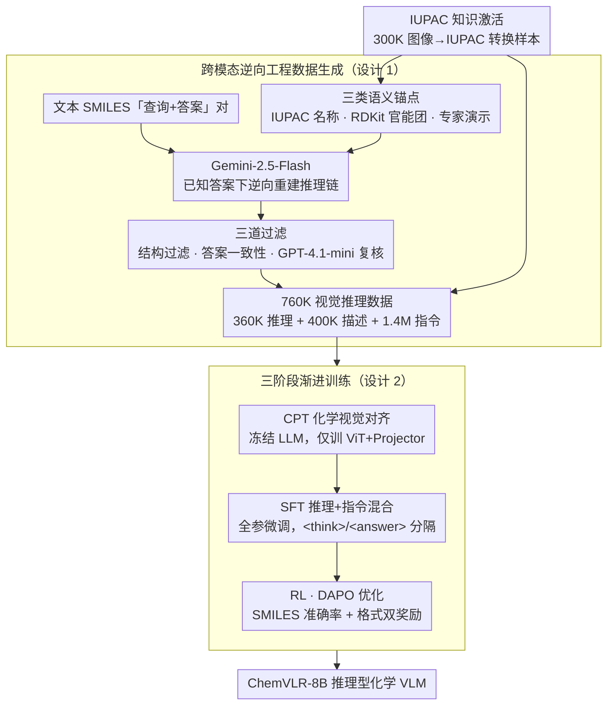

# ChemVLR: Prioritizing Reasoning in Perception for Chemical Vision-Language Understanding

**会议**: ACL 2026 Findings  
**arXiv**: [2604.06685](https://arxiv.org/abs/2604.06685)  
**代码**: [https://github.com/xxlllz/ChemVLR](https://github.com/xxlllz/ChemVLR)  
**领域**: 可解释性  
**关键词**: 化学视觉理解, 推理VLM, 跨模态逆向工程, 三阶段训练, 分子识别

## 一句话总结
提出 ChemVLR，首个化学领域推理型 VLM，通过跨模态逆向工程策略构建 760K 推理数据集，结合持续预训练-SFT-RL 三阶段训练流程，在分子识别和反应预测任务上显著超越专有模型和领域专家 VLM。

## 研究背景与动机

**领域现状**：化学领域的 VLM（如 ChemVLM、TinyChemVL）已取得一定进展，但主要采用端到端的直接回答范式，依赖 SFT 训练。同时，RLVR 在数学和编程等领域展现了强大的推理增强能力。

**现有痛点**：现有化学 VLM 是"黑箱"系统——直接从分子图像跳到答案，不生成可解释的推理路径。它们未充分利用 LLM 推断底层反应机制的能力，在复杂视觉化学问题上表现不佳。此外，高质量的化学推理数据极度稀缺，特别是视觉基础的推理标注。

**核心矛盾**：化学图像理解需要精细的子结构分析（如官能团识别），但通用 VLM 缺乏化学领域知识，直接 SFT 无法充分激活预训练知识。

**本文目标**：构建一个在感知过程中优先推理的化学 VLM——先显式识别细粒度化学描述符（如官能团），再推导最终答案。

**切入角度**：利用文本化学查询+真实答案，通过 LLM 逆向重建推理过程，再配合图像渲染生成视觉推理数据。

**核心 idea**：跨模态逆向工程生成大规模推理数据 + CPT→SFT→RL 三阶段渐进式训练。

## 方法详解

### 整体框架
数据构建方面，通过逆向工程从文本 SMILES QA 对出发，用 Gemini-2.5-Flash 重建推理过程，辅以 IUPAC 名称、RDKit 官能团和专家示范作为语义锚点，经三阶段过滤生成 760K 高质量样本。训练方面，采用 CPT（化学视觉对齐）→ SFT（推理+指令混合训练）→ RL（DAPO 优化）三阶段流程。

### 关键设计

**1. 跨模态逆向工程数据生成：从答案反推推理过程，破解视觉化学推理标注几乎为零的困境**

化学领域几乎没有现成的"看图—推理—答题"标注，硬靠人工标注无法规模化。ChemVLR 反其道而行：手里已有大量文本 SMILES 的「查询+答案」对，那就让 Gemini-2.5-Flash 在已知正确答案的前提下，去逆向重建一条能走到该答案的推理链。光给 SMILES 序列模型容易胡编，于是每条样本再喂三类语义锚点——PubChem 检索到的 IUPAC 名称、RDKit 计算出的官能团、以及人工策划的专家演示，把推理"钉"在真实化学事实上。生成后过三道闸：结构过滤（只留带视觉推理模式的样本）、答案一致性检查（推导出的 SMILES 必须和 ground truth 一致）、外部 LLM 验证（GPT-4.1-mini 独立复核）。

这套锚点+过滤把数据保留率从 55%–78% 拉到 73%–95%，最终产出 360K 推理 + 400K 描述 + 1.4M 指令样本，再配合图像渲染变成视觉推理数据。它的价值在于把"标注稀缺"问题转成了"已有答案下的逆向生成+多重验证"问题，可直接迁移到其他缺推理标注的专业领域。

**2. 三阶段渐进训练：先补化学视觉感知，再教推理，最后用 RL 拔尖**

通用 VLM 看分子图像基本是"睁眼瞎"，实验里直接 SFT、甚至直接 RL 都收效甚微，因为模型连官能团都认不准，谈不上推理。ChemVLR 因此把能力一层层垒起来：CPT 阶段冻住 LLM backbone、只训 ViT+Projector，用 500K 化学图文对做视觉—化学域对齐，先让模型"看懂"分子；SFT 阶段全参数微调，混合 360K 推理与 1.4M 指令数据，统一用 `<think>/<answer>` 标签把推理和答案分隔开；RL 阶段再用 DAPO 优化，奖励由 SMILES 准确率（Tanimoto 相似度等于 1.0 才给分）和格式正确性两部分组成。

这种"感知先于推理"的顺序正是论文标题 Prioritizing Reasoning in Perception 的落点——跳过 CPT 直接优化，模型没有领域基础，RL 无从着力（消融里 RL-only 几乎无效）；补齐域差距后，RL 才能在全任务上平均再提升约 9%。

**3. IUPAC 知识激活：换个表示形式，唤醒预训练语料里早已存在的化学知识**

模型在通用预训练阶段其实见过大量化学内容，但这些知识是以 IUPAC 命名（如"2-甲基丁烷"）形式出现的，而非 SMILES 字符串——直接拿 SMILES 训练等于在用模型不熟悉的方言提问。ChemVLR 据此专门构建 300K 图像→IUPAC 转换样本并入指令数据，用模型熟悉的表示去触发它本就掌握的化学常识。

效果很直接：加入 IUPAC 数据后，逆向工程的数据生成保留率从 78% 升到 92%。这条发现的普适启示是——能否用上预训练知识，往往取决于训练数据的表示形式是否与预训练分布对齐，而非知识本身缺失。

### 损失函数 / 训练策略
RL 阶段使用 DAPO（Decoupled Clip and Dynamic Sampling Policy Optimization），二值化奖励（准确率+格式），用 SFT 模型过滤出中等难度的 100K 样本进行训练。

## 实验关键数据

### 主实验

| 模型 | MMChemOCR Avg Sim. | MMChemOCR Tani@1.0 | img2smiles Tani@1.0 | ChemRxn-V Pred |
|------|-------------------|-------------------|-------------------|---------------|
| ChemVLR-8B | **93.8** | **84.6** | **92.7** | **67.8** |
| TinyChemVL | 91.2 | 77.4 | 75.6 | 52.4 |
| Gemini-3-Flash | 77.6 | 61.2 | 63.8 | 51.7 |
| ChemDFM-X | 70.9 | 36.5 | 77.6 | 0.7 |

### 消融实验

| 配置 | 效果 | 说明 |
|------|------|------|
| SFT only | 基线 | 缺乏化学视觉理解能力 |
| CPT + SFT | 提升 | 视觉对齐改善感知 |
| CPT + SFT + RL | **最优** | RL 在全任务上平均提升 9% |
| RL only | 几乎无效 | 缺乏领域基础无法有效优化 |

### 关键发现
- ChemVLR 首次在 VLM 中达到与专用 SMILES OCR 模型（如 Decimer）相当的精度
- RL 训练展现"顿悟时刻"——在 200-400 步之间奖励急剧上升
- IUPAC 数据是关键催化剂，显著激活预训练知识

## 亮点与洞察
- **逆向工程数据生成策略**非常实用——从答案反推推理过程，配合多重验证确保质量，可推广到其他数据稀缺的专业领域
- **IUPAC 知识激活的发现**很有启发——预训练知识的利用取决于训练数据的表示形式是否与预训练分布匹配
- **RL "顿悟时刻"**再次验证了 RLVR 在专业领域推理增强中的有效性

## 局限与展望
- 训练依赖 16xH800 GPU，资源要求高
- 推理过程的正确性依赖过滤质量，可能存在推理路径正确但逻辑不严谨的情况
- 仅在有机化学分子/反应上验证，无机化学和更复杂的反应机理尚未涉及

## 相关工作与启发
- **vs TinyChemVL**：同为化学域 VLM 但仅用 SFT，ChemVLR 通过 RL 进一步提升推理能力
- **vs ChemDFM-R/Chem-R**：它们在文本域增强推理，ChemVLR 扩展到多模态视觉推理

## 评分
- 新颖性: ⭐⭐⭐⭐ 首个化学域推理 VLM，逆向工程数据生成策略新颖
- 实验充分度: ⭐⭐⭐⭐⭐ 多基准、多基线、详细消融
- 写作质量: ⭐⭐⭐⭐ 数据构建和训练流程描述清晰
- 价值: ⭐⭐⭐⭐ 对化学 AI 和科学推理有重要推动

<!-- RELATED:START -->

## 相关论文

- [\[ACL 2026\] Decoding Scientific Experimental Images: The SPUR Benchmark for Perception, Understanding, and Reasoning](decoding_scientific_experimental_images_the_spur_benchmark_for_perception_unders.md)
- [\[ACL 2026\] Addressing Overthinking in Large Vision-Language Models via Gated Perception-Reasoning Optimization](addressing_overthinking_in_large_vision-language_models_via_gated_perception-rea.md)
- [\[CVPR 2026\] Select Less, Reason More: Prioritizing Evidence Purity for Video Reasoning](../../CVPR2026/multimodal_vlm/select_less_reason_more_prioritizing_evidence_purity_for_video_reasoning.md)
- [\[AAAI 2026\] TinyChemVL: Advancing Chemical Vision-Language Models via Efficient Visual Token Reduction and Complex Reaction Tasks](../../AAAI2026/multimodal_vlm/tinychemvl_advancing_chemical_vision-language_models_via_efficient_visual_token_.md)
- [\[CVPR 2026\] PDCR: Perception-Decomposed Confidence Reward for Vision-Language Reasoning](../../CVPR2026/multimodal_vlm/pdcr_perception-decomposed_confidence_reward_for_vision-language_reasoning.md)

<!-- RELATED:END -->
