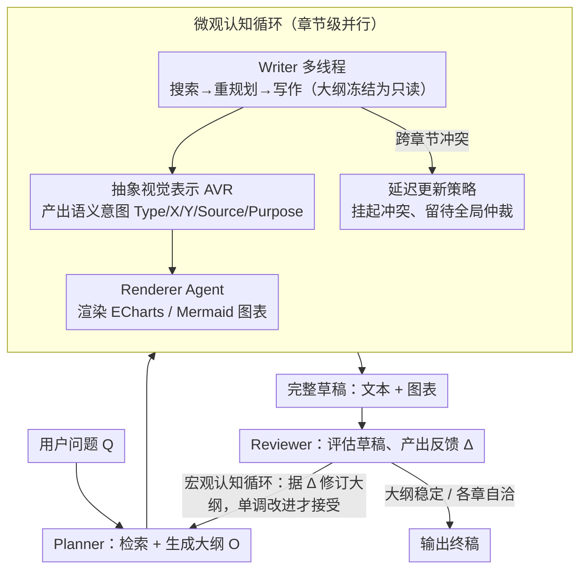

# CogGen: A Cognitively Inspired Recursive Framework for Deep Research Report Generation

**会议**: ACL 2026  
**arXiv**: [2604.17072](https://arxiv.org/abs/2604.17072)  
**代码**: [GitHub](https://github.com/NJUNLP/CogGen)  
**领域**: 多模态VLM  
**关键词**: 深度研究报告, 递归写作框架, 多模态融合, 认知负荷评估, 多智能体

## 一句话总结
CogGen 提出一个模拟人类认知写作过程的多智能体递归框架，通过宏观认知循环实现全局重构、微观认知循环实现并行章节精炼、抽象视觉表示（AVR）实现文本-图表的语义级协同规划，在 OWID 基准上达到人类专家水平并超越 Gemini Deep Research。

## 研究背景与动机

**领域现状**：自动化深度研究报告生成是 LLM 的前沿应用，现有方案分为单代理系统（如 Gemini Deep Research）和多代理框架（如 STORM、Co-STORM）。但它们都遵循线性预定义工作流。

**现有痛点**：线性工作流一旦生成内容就无法回溯修改——当下游发现推翻了上游的组织逻辑时，无法进行"逆向重构"。此外，文本和图表的生成通常是异步的、脱耦的，导致图表只是插图而非论证的有机组成部分。

**核心矛盾**：专家写作是非线性递归过程（计划→写→审→重构→再写），但现有 AI 写作框架是线性前向过程，无法实现跨章节的全局一致性和文本-图表的深度协同。

**本文目标**：构建一个支持全局重构和多模态语义级协同的递归报告生成框架。

**切入角度**：基于 Flower & Hayes 的写作认知过程理论和认知卸载（Cognitive Offloading）理论设计框架。

**核心 idea**：层次化递归架构（宏观循环做全局重构 + 微观循环做章节精炼）+ 抽象视觉表示将图表生成从推理中解耦。

## 方法详解

### 整体框架
CogGen 由三个对等认知代理组成：Planner（检索+结构规划）、Writer（文本写作+视觉意图定义）、Reviewer（实时监控+后评估）。宏观认知循环（Macro-Cognitive Loop）在全局报告级别进行递归：规划→写作→审查→反馈→重新规划。微观认知循环（Micro-Cognitive Cycle）在章节级别并行执行「搜索→重规划→写作」（Search-Replan-Write）循环，每个线程把全局大纲冻结为只读约束；写作时由抽象视觉表示（AVR）产出图表的语义意图，再交 Renderer 渲染成图。

### 关键设计

**1. 宏观认知循环（Macro-Cognitive Loop）：把大纲变成可改对象，解决线性工作流"写了就锁死"的痛**

现有报告生成方案（STORM、Gemini Deep Research 等）都是线性前向流——大纲一旦定下、内容一旦写出就回不去；可真实写作里，写到后半段常会发现前半段的组织逻辑该推翻重来。CogGen 的破法是把大纲 $\mathcal{O}$ 当成可变对象而非固定计划，让它在全局层面递归迭代：每一轮 Planner 生成大纲 → Writer 并行写各章节草稿 → Reviewer 评估完整草稿并产出反馈 $\Delta^{(t)}$ → Planner 据此修订大纲：

$$\mathcal{O}^{(t+1)} = A_p\!\left(Q,\ \{\mathcal{O}^{(t)}, \Delta^{(t)}\}\,\middle|\,K\right)$$

关键是这里加了一条严格单调改进约束：只有当 Reviewer 验证质量确有明确提升时才接受新大纲，否则保留旧版，从而避免在两个方案间无限振荡。正是这种"写完回头改组织逻辑"的逆向重构能力，让 CogGen 能产出长文档级别的全局一致性，而线性系统做不到。

**2. 微观认知循环（Micro-Cognitive Cycle）：章节并行写，又不掉进"改 A 引发改 B 再引发改 A"的递归陷阱**

并行生成各章节能提速，但天然有个坑：为了让 Sec 1 适配 Sec 5 的新发现去改 Sec 1，又会反过来要求 Sec 5 更新，串行修订时上下文会反复抖动。CogGen 让多个线程并行跑"搜索→重规划→写作"循环，每个线程把全局大纲 $\mathcal{O}^{(t)}$ 当成只读约束、各自的检索结果存进线程本地缓存，互不干扰。

真正的巧思是 Deferred Update Policy：跨章节冲突不在局部就地解决，而是延迟上交、留给 Reviewer 在宏观循环里统一仲裁。这样局部线程永远基于同一份冻结的大纲写作，彻底回避了串行修订的上下文振荡——并行的效率和全局的一致性因此能同时拿到。

**3. 抽象视觉表示（Abstract Visual Representation, AVR）：让图表和文本在语义层面一起规划，而不是写完文章再补图**

传统做法里文本和图表异步、脱耦地生成，图表沦为插图而非论证的有机部分。AVR 的做法是让 Writer 不直接产出可执行绘图代码，而是产出结构化的语义描述（Title、Chart_Type、X/Y_Axis、Data_Source、Purpose）；再由独立的 Renderer Agent 把这份语义意图翻译成 ECharts/Mermaid 代码，并在无头浏览器中渲染成图。

这样 Writer 就能像操作"语义 token"一样反复迭代视觉计划，无需陷进像素级细节。其理论依据是认知卸载（Cognitive Offloading）——把视觉设计决策从写作推理中剥离出来，降低 Writer 的认知负荷，使其专注叙事逻辑；同时因为图表是和文本同源规划的，二者能真正在语义上协同（消融显示 AVR 相比直接生成代码在数据准确性上提升显著）。

### 一个完整示例：生成一份"全球能源转型"报告

设用户提问"过去 30 年全球能源结构如何变化"。**宏观循环第 1 轮**：Planner 检索后给出大纲 $\mathcal{O}^{(0)}$＝{背景、化石能源占比、可再生能源崛起、区域差异、结论}；Writer 开 5 个线程并行写——在写"可再生能源崛起"这章时（微观循环），该线程发现一组关键数据更适合放进"区域差异"，但它不就地改大纲，只把这个冲突挂起、上交。Writer 同时为该章定义视觉意图（AVR）：`{Chart_Type: line, X: year, Y: share%, Data_Source: OWID, Purpose: 展示风光发电占比 2000→2023 的爬升}`，Renderer 据此渲染出折线图。

**Reviewer 评估**完整草稿，发现"区域差异"章信息单薄、且收到了刚才挂起的冲突，于是生成反馈 $\Delta^{(0)}$：建议把可再生数据迁移过去并新增一节"发展中国家追赶"。**宏观循环第 2 轮**：Planner 据 $\Delta^{(0)}$ 修订出 $\mathcal{O}^{(1)}$——但只有当 Reviewer 确认新版质量更高时才被接受（单调改进约束）。如此递归，直到大纲稳定、各章自洽、图表与论证扣合，输出终稿。整个过程里，线性系统无法做到的"回头重构 + 冲突延迟仲裁 + 图文同源"在这三层机制下被一次性串了起来。

### 损失函数 / 训练策略
CogGen 是纯推理时框架，不涉及训练。使用 GPT-4.1 作为各代理骨干，GPT-4.1-Mini 做搜索扩展，温度 0.5。

## 实验关键数据

### 主实验

| 数据集 | 方法 | 平均分 | 组织 | 深度 | 对齐 | 协同 |
|--------|------|--------|------|------|------|------|
| OWID | 人类专家 (参考) | 0.4997 | 0.4986 | 0.5000 | 0.5000 | 0.5000 |
| OWID | CogGen | 0.4992 | 0.4972 | 0.5813 | 0.4806 | 0.4326 |
| OWID | WriteHere | 0.4502 | 0.4912 | 0.5503 | 0.3846 | 0.3312 |
| OWID | STORM | 0.3205 | 0.4253 | 0.4443 | 0.1675 | 0.1667 |
| WildSeek | Gemini DR (参考) | 0.5000 | 0.5000 | 0.5000 | 0.5000 | 0.5000 |
| WildSeek | CogGen | 0.5341 | 0.5389 | 0.5000 | 0.5544 | 0.5437 |

### 消融实验

| 配置 | 平均分 | 说明 |
|------|--------|------|
| GPT-4.1 + Search (无框架) | 0.4119 | 单代理基线 |
| CogGen 无 review | 0.4681 | 去掉 Reviewer 后质量显著下降 |
| CogGen 两阶段（无原生多模态） | 0.4904 | 文本图表分离生成 |
| CogGen 完整 | 0.4994 | 所有组件协同 |

### 关键发现
- CogGen 在 OWID 上达到人类专家水平（0.4992 vs 0.4997），在 WildSeek 上超越 Gemini Deep Research（0.5341 vs 0.5000）
- 多模态对齐和协同（D4、D5）是 CogGen 相对于 STORM/Co-STORM 的核心优势（分数差距超过 0.3）
- Reviewer 的去除导致最大性能下降，说明审查-反馈循环是质量保证的核心
- AVR 相对于 FDV（直接生成代码）在数据准确性上提升显著

## 亮点与洞察
- **宏观-微观双层递归**的设计精确模拟了人类写作的非线性特征——写完全文后回头重构大纲的能力是超越线性系统的关键
- **延迟更新策略**巧妙地解决了并行生成中的上下文振荡问题——把冲突留给全局审查者而非局部修改，避免了递归修改陷阱
- AVR 将"想展示什么"与"怎么画"解耦，可以推广到任何需要文本-代码协同生成的场景

## 局限与展望
- 依赖 GPT-4.1 等闭源模型，成本高且不可复制
- 递归循环的收敛速度未充分分析，实际生成时间可能较长
- 评估框架 CLEF 虽有理论基础但依赖 GPT-5 作为评估者，存在评估偏差
- 仅支持静态文本+图表，不支持交互式可视化

## 相关工作与启发
- **vs STORM/Co-STORM**: 多视角 QA 和协作写作，但缺乏全局重构能力
- **vs WriteHere**: 支持递归分解但仍是前向生成，无法逆向修改已生成内容
- **vs Gemini Deep Research**: 商业系统在写作执行阶段仍受限于固定框架，CogGen 在 WildSeek 上超越其输出质量

## 评分
- 新颖性: ⭐⭐⭐⭐ 认知写作理论在 AI 报告生成中的系统化应用新颖
- 实验充分度: ⭐⭐⭐⭐ 两个数据集、多基线对比、详细消融、人工评估验证
- 写作质量: ⭐⭐⭐⭐⭐ 理论动机清晰，图示优秀，叙事流畅

<!-- RELATED:START -->

## 相关论文

- [\[ICML 2026\] WeatherSyn: An Instruction Tuning MLLM For Weather Forecasting Report Generation](../../ICML2026/multimodal_vlm/weathersyn_an_instruction_tuning_mllm_for_weather_forecasting_report_generation.md)
- [\[AAAI 2026\] PET2Rep: Towards Vision-Language Model-Driven Automated Radiology Report Generation for Positron Emission Tomography](../../AAAI2026/multimodal_vlm/pet2rep_towards_vision-language_model-drived_automated_radiology_report_generati.md)
- [\[ACL 2025\] MEIT: Multimodal Electrocardiogram Instruction Tuning on Large Language Models for Report Generation](../../ACL2025/multimodal_vlm/meit_multimodal_electrocardiogram_instruction_tuning_on_large_language_models_fo.md)
- [\[ICML 2026\] Deep Pre-Alignment for VLMs](../../ICML2026/multimodal_vlm/deep_pre-alignment_for_vlms.md)
- [\[ACL 2026\] Almieyar-Oryx-BloomBench: A Bilingual Multimodal Benchmark for Cognitively Informed Evaluation of Vision-Language Models](almieyar-oryx-bloombench_a_bilingual_multimodal_benchmark_for_cognitively_inform.md)

<!-- RELATED:END -->
