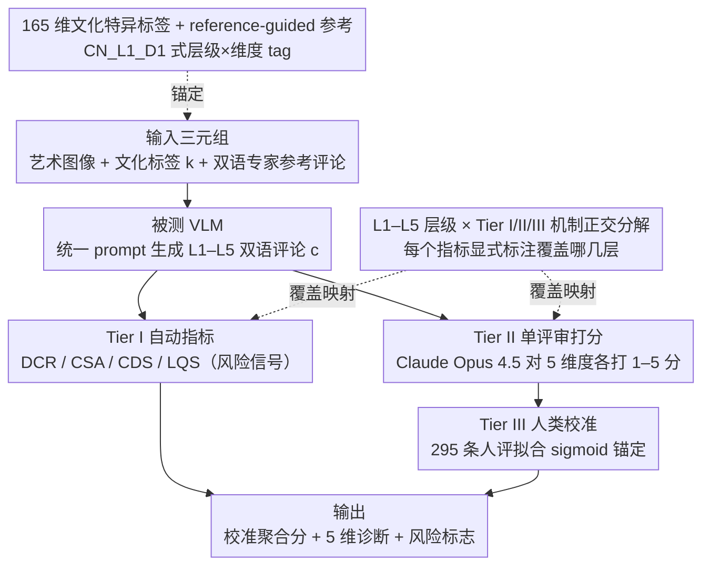

# Cross-Cultural Expert-Level Art Critique Evaluation with Vision-Language Models

**会议**: ACL 2026  
**arXiv**: [2601.07984](https://arxiv.org/abs/2601.07984)  
**代码**: https://github.com/yha9806/VULCA-Framework  
**领域**: 多模态 VLM / 文化评测 / 艺术评论  
**关键词**: 跨文化评测、艺术评论、VLM-as-Judge、人类校准、Vulca-Bench

## 一句话总结
论文提出 Vulca-Bench 三层评测框架（自动指标 + 单评审打分 + 人类 sigmoid 校准），覆盖 6 大艺术传统、165 个文化维度与 L1–L5 五层"视觉描述→文化诠释"层级，在 15 个 VLM 上首次量化揭示了"模型在深层文化诠释上掉点显著、且系统性偏好西方艺术"的现象。

## 研究背景与动机

**领域现状**：当前对 VLM 文化能力的评测主要落在感知层（VQAv2、POPE、MME、SEED-Bench），第三代文化探针（CulturalBench、CulturalVQA、GIMMICK）虽然引入了多国背景，但仍是闭合式 QA，考的是"是否认识这个文化符号"，而非"能否像艺术评论家那样解读一幅画"。

**现有痛点**：把 VLM 用到艺术评论这种**开放生成**任务时，评测手段全面失灵——自动指标（BLEU/ROUGE 之类）只能匹配关键词；LLM-as-Judge 用双评审平均时存在严重的 scale 不一致（作者实测 cross-judge ICC(2,1) 低至 $-0.50$）；而单文化研究（如只评中国画）无法把"文化特异困难"从"系统性西方偏好"中分离出来。

**核心矛盾**：评测**构念**（construct，文化理解的深度）和评测**机制**（mechanism，自动指标 / 评审 / 人类）被混在一起讨论——大家拿一个 0.x 分就声称"模型懂文化"，但既没说清在测什么层级、也没验证测量本身可不可靠。

**本文目标**：(1) 给文化理解一个可验证的分层定义；(2) 验证各种评测代理（automated metrics / LLM judge）对文化深度的可靠性；(3) 用这套验证过的工具去诊断 15 个 SOTA VLM 在 6 种文化上的真实表现。

**切入角度**：作者借用艺术学经典理论：Panofsky 的 iconology 三阶段（pre-iconographic 描述 / iconographic 分析 / iconological 诠释）和 Goodman 的符号指称论。这恰好对应"L1 视觉感知 → L2 技术分析 → L3 文化符号 → L4 历史语境 → L5 哲学美学"五个**可经验分离**的能力层级——也就是说，L1–L2 主要看"VLM 能不能看见"，L3–L5 才是"能不能看懂"。

**核心 idea**：把"层级（L1–L5，被测构念）"和"层级（Tier I/II/III，测量机制）"严格区分开，每一个 Tier 都明确声明它测的是 L 几；再用人类专家评分通过 sigmoid 校准对最终聚合分进行**单评审锚定**，避开双评审平均不收敛的陷阱。

## 方法详解

### 整体框架

Vulca-Bench 的输入是一组三元组：(i) 一幅艺术作品图像，(ii) 一个文化标签 $k$（中、西、日、韩、伊斯兰、印度六选一），(iii) 一份双语专家参考评论。被测 VLM 收到压缩到 $\leq 3.75$MB 的图像后，按统一 prompt 生成中英双语的 L1–L5 评论 $c$。然后 $c$ 进入三个并行 / 串行的 Tier：

- **Tier I（自动指标）**：在 $c$ 上算 4 个不需要任何评审的量化指标（DCR / CSA / CDS / LQS），作为"风险信号"而非排序指标。
- **Tier II（单评审打分）**：以 Claude Opus 4.5 为唯一评审，以专家评论为 reference anchor（而非 gold answer），对 5 个维度（Coverage / Alignment / Depth / Accuracy / Quality）各打 1–5 分。
- **Tier III（人类校准）**：用 295 条人评分样本拟合 sigmoid 函数 $S_{\text{II}}^{*}=1+4\sigma(a\cdot S_{\text{II}}+b)$，把 Tier II 的聚合分映射回 $[1,5]$ 并与人类评分对齐。

整套流水线最终输出：(a) 校准后的聚合分 $S_{\text{II}}^{*}$，(b) 5 维度细分诊断，(c) Tier I 风险标志（如低文化覆盖、弱语义对齐、高模板化风险）。

### 关键设计

**1. L1–L5 层级 × Tier I/II/III 机制的正交分解：把"测什么"和"用什么测"拆成两个互不纠缠的轴**

以前所有文化能力评测的通病，是把"模型在哪个能力层级上表现"和"用哪种手段测量"揉进同一个总分——结果模型在 L1–L2 感知层的高分会直接掩盖 L3–L5 诠释层的塌陷，没人看得出问题到底出在哪。本文在 Table 2 里给每个指标显式标注它覆盖 L1–L5 中的哪几层：Tier I 的 DCR / CSA 是关键词匹配，能同时给 L1–L5 全层信号但都停在表层；CDS 则用 $w_\ell=\ell/15$ 的层级加权（L1 只占 $1/15$，L5 占 $5/15$）专门放大深层贡献；LQS 只测语言流畅度，与文化深度刻意正交。Tier II 同样分工：Depth 和 Alignment 专攻 L3–L5，Coverage / Accuracy 横跨全层，Quality 不绑定任何层级。

正是这种正交分解，才让"VLM 看得见但看不懂"这一现象第一次能被定量诊断——感知分和诠释分被分开报告后，L1–L2 到 L3–L5 的单调塌陷曲线一目了然，而不再被一个糊在一起的总分藏起来。

**2. 单评审 + sigmoid 校准：用一个评审加人类锚定，绕开双评审平均不收敛的陷阱**

LLM-as-Judge 的标准做法是取两个评审的平均来降方差，但作者实测发现这在文化任务上会崩盘：8 个候选评审里，OpenAI 系（GPT-4o 均值 4.52）倾向宽松、Anthropic 系（Claude Opus 4.5 均值 3.42）倾向严格，cross-judge ICC(2,1) 在 $-0.50$ 到 $0.12$ 之间漂移，全部低于 0.6 阈值——直接平均等于把"严格 + 宽松"折算成对中位数的系统性偏移，而非真实共识。

本文改用 Claude Opus 4.5 作唯一评审（选它是因为它兼具稳定的 rank discrimination、一致的文化差异方向、且无 self-favouritism），再在 295 条人评样本上拟合 sigmoid $S_{\text{II}}^{*}=1+4\sigma(a\cdot S_{\text{II}}+b)$ 的 $a,b$，让输出与人类评分 MSE 最小。sigmoid 是单调可逆变换，既能把分压回 $[1,5]$ 又保住排名，更关键的是把"模型分"显式锚定到"专家分"，让跨文化、跨模型比较第一次有了可解释的绝对基准。

**3. 165 个文化特异维度 + reference-guided 双语评论：把"是否提及"升级成"是否在正确层级正确归因"**

早期 LLM-judge 直接对自由生成打分，本质只是在打"是否流畅"。本文让评审在 Tier II 打分时同时看到 VLM 的生成和该文化下专家的同主题双语参考评论——参考是 reference anchor 而非 gold answer，评审据此判定的是"VLM 有没有在正确的 L 层上正确使用正确的文化术语"，而不是简单地查关键词命中。

支撑这套对齐评估的是数据层的硬功夫：作者把 6 种文化共拆出 165 个 culture-specific dimensions（中国 30 维、印度 30 维、日本 27 维……），每个维度用 `CN_L1_D1` 这样的层级 × 维度 tag 标注在专家评论上；VLM 被要求输出中文（保留"气韵"这类不可译术语）+ 英文（保跨文化可读）双语。有了 tag 化的参考，原本主观的打分被转成相对客观的"对齐专家在某个 L 层的具体诠释"度量，这也是 Tier I 能算 DCR、Tier II 能做对齐评分的共同基础。

### 损失函数 / 训练策略

本文不训练 VLM，只训练 Tier III 的两个 sigmoid 参数 $(a,b)$，目标为最小化 $\text{MSE}(S_{\text{II}}^{*}, S_h)$，其中 $S_h$ 是 295 条训练样本的人类评分均值。Tier II 的 5 个维度分**不**做校准（保留诊断粒度）；评审温度采用提供商默认（$T=1.0$），论文承认这会带来非确定性，但 JSON 受限的整数打分模板会压住方差。

## 实验关键数据

### 主实验

15 个 VLM × 294 个评测样本 × 6 种文化 = 4,405 条 model–sample 评估（5 条因解析失败被排除，占 0.11%）。下表为 Tier II 五维度 + 校准后 $S_{\text{II}}^{*}$ 总分（节选 top/mid/bottom）：

| 模型 | $S_{\text{II}}^{*}$ | Coverage | Alignment | Depth | Accuracy | Quality |
|------|---------------------|----------|-----------|-------|----------|---------|
| **Gemini-2.5-Pro** | **4.27** | 4.49 | 4.26 | 4.38 | 3.56 | 4.55 |
| Qwen3-VL-235B | 4.21 | 4.49 | 4.10 | 4.41 | 3.33 | 4.51 |
| Claude-Sonnet-4.5 | 4.11 | 4.29 | 4.05 | 4.00 | 3.44 | 4.48 |
| GPT-5 | 4.00 | 4.23 | 3.48 | 4.04 | 3.85 | 4.08 |
| Llama4-Scout | 3.67 | 4.21 | 3.48 | 3.36 | 2.96 | 4.10 |
| GPT-4o | 3.57 | 3.88 | 3.38 | 3.21 | 3.09 | 4.10 |
| GPT-4o-mini | 3.24 | 3.76 | 2.94 | 2.93 | 2.90 | 3.76 |
| **DeepSeek-VL2** | **3.01** | 3.50 | 2.74 | 2.64 | 2.72 | 3.78 |
| 维度方差 $\sigma$ | — | 0.33 | 0.48 | **0.56** | 0.35 | 0.24 |

- Top tier（前 3）与 bottom tier（后 3）在 bootstrap 95% CI 下完全不重叠（$p<0.001$，置换检验）；中段名次因 CI 重叠应作为"性能带"而非严格排序。
- **Depth** 和 **Alignment** 是判别力最强的维度（$\sigma=0.56$ / $0.48$），而 Quality 方差最小（$\sigma=0.24$），证实"流畅性不是瓶颈，深层文化理解才是"。

### 消融实验

| 配置 | 关键指标 | 说明 |
|------|---------|------|
| 单评审 + sigmoid 校准（本文） | MAE 0.446（held-out $n=155$）| 相比未校准聚合分 MAE 0.454 降低 1.7% |
| 双评审平均（Claude-Opus + GPT-5） | cross-judge ICC(2,1) = $-0.50$ | 系统性 scale 不一致，分数不可信 |
| 双评审平均（Claude-Sonnet + GPT-5） | ICC(2,1) = $0.12$ | 仍远低于 0.6 阈值 |
| DCR$_\text{auto}$ vs Tier II Judge | ICC = 0.02 / Pearson $r=0.53$ | 关键词覆盖与语义理解几乎不相关 |
| CSA$_\text{auto}$ vs Judge | ICC = 0.17 / $r=0.44$ | 弱相关，与人类金标准也只是弱-中等 |
| CDS$_\text{auto}$ vs Judge | ICC = 0.18 / $r=0.51$ | 中等相关，但低估了真实文化对齐 |
| LQS$_\text{auto}$ vs Judge | ICC = $-0.17$ / $r=0.27$ | 流畅度与文化深度方向相反 |

### 关键发现

- **L1–L2 → L3–L5 单调塌陷**：所有 15 个 VLM 在感知层（Coverage）都很强（最弱也有 3.50），但一进入文化诠释层（Alignment / Depth）就大幅掉点，DeepSeek-VL2 的 Coverage 3.50 与 Depth 2.64 之间差近 1 分；这印证了"image-caption 训练能给描述力但给不了文化 grounding"的猜想。
- **13/15 模型系统性偏好西方艺术**：中-西评分差 $-0.39$（Cohen's $d=-0.74$，$p<0.001$，bootstrap 95% CI $[-0.44,-0.34]$）；GPT-4o-mini 偏向最严重（$\Delta=-1.08$），GPT-5.2 最中性（$\Delta=+0.07$）。
- **混淆控制双保险**：在 landscape 题材子集（控制题材）上差距反而扩大到 $d=-0.93$；在 blind-culture 设置（去掉文化标签）上差距 $\Delta_{\text{blind}}=-0.61$ 大于 $\Delta_{\text{std}}=-0.54$——这两个反证表明"西方偏好"并非来自题材分布或评审泄漏，而是 VLM 本身的训练分布偏差。
- **自动指标与评审打分测量的是不同构念**：4 个 Tier I 指标对 Tier II 的 ICC 全部低于 0.2，DCR 甚至只有 0.02——这是对"用 BLEU / ROUGE 评估文化生成"做法的一记重锤。

## 亮点与洞察

- **"构念 / 机制正交分解"是被低估的方法论贡献**：在文化、对齐这类主观任务里，大家长期把"想测什么"和"用什么测"混在一个总分里；这篇用 Table 2 把每个指标在 L1–L5 上覆盖范围画得一清二楚，等于给后续所有 VLM 文化评测画了一张地图。
- **单评审 + sigmoid 校准是绝佳的工程权衡**：双评审在理论上能降方差但实测 ICC 是负的，说明多评审带来的 scale 失配比方差收益还大；用一个评审 + 用人类校准其偏置，既保留可扩展性又拿到了"绝对量尺"，这个 trick 几乎可以原样迁移到所有 LLM-as-Judge 场景。
- **"blind-culture 反而差距更大"是反直觉的关键发现**：常见质疑是"评审知道文化标签所以打分有偏"，本文用一个 50 条样本的小 ablation 一招化解——去掉标签后差距反而增大，把锅明确扣到 VLM 的训练分布上而非评测设计上，这个反证思路非常值得借鉴。
- **165 维细粒度文化标签是数据层的硬功夫**：每条专家评论上挂 `CN_L1_D1` 这样的层级 × 维度 tag，让 Tier I 的关键词匹配能算 DCR、让 Tier II 的评审能做对齐——这种"评测数据本身带 schema"的做法，可以直接迁到任何需要分层评估的开放生成任务（如医学诊断、法律意见）。

## 局限与展望

- 作者承认：6 种文化中 Chinese + Western 占了 91% 样本，少数文化（Korean $n=16$，Islamic $n=18$）的校准 MAE 反而上升 6%+，校准在样本稀疏时退化。
- 双语只到 Chinese-English，日 / 韩 / 阿拉伯 / 印地语等原生术语（wabi-sabi、jeong、rasa）通过罗马化只能部分保留，存在系统性翻译损失；未来需扩展到原生语言评论。
- 整套框架依赖 Claude Opus 4.5 作为唯一评审，存在评审单点失败风险；评审温度 $=1.0$ 让重跑分数会有 $\pm 0.02$ 级别浮动，对小差距的模型排序可能不稳。
- 1–5 整数 rubric 的粒度限制了表达力，作者做了 0–5 量尺的 retrospective pilot 发现 MAE 反而升到 0.4870，说明 rubric 设计本身是一个未被充分探索的旋钮。
- Few-shot 实验里加 1–3 条 expert critique 作 in-context exemplar 反而掉点，作者猜是 attention dilution 或风格过拟合——这意味着简单的 ICL 在文化诠释任务上不一定 work，需要专门的 L1→L5 reasoning scaffold（如 retrieval-augmented exemplar）。
- 自评：该方法目前是诊断工具而非提升工具，没回答"知道 VLM 在 L3–L5 上差以后怎么修"的问题；下一步把这套指标接到 RLHF / SFT 的奖励信号里会更有冲击力。

## 相关工作与启发

- **vs CulturalBench / CulturalVQA / GIMMICK**：那三套测的是闭合 QA（"这个符号是哪国的"），本文测的是开放生成（"像专家一样评论这幅画"），且唯一同时覆盖跨文化 + L1–L5 全层 + 人类校准三件套。
- **vs GalleryGPT / Strafforello et al. 2024**：他们的艺术 VLM 工作主要在 L1–L2（风格分类 + 历史问答）；本文把评测推到 L3–L5，且首次量化"上不去 L3 是普遍现象"。
- **vs G-Eval / MT-Bench / Prometheus-Vision**：那些 LLM-as-Judge 论文主要在英文通用任务上验证，本文揭示出在文化敏感任务上**双评审平均会崩盘**，单评审 + 人类校准是必须的；这个结论应该立刻被所有跨文化 NLG 评测吸纳。
- **vs 单文化的 Yu et al. 2025 / Yu, Zhao et al. 2025**：那两篇只在中国画 / 非西方火文化上发现 VLM-专家分歧，但无法把"文化特异困难"和"系统性西方偏好"分开；本文用 6 文化设计 + blind 控制把两者解耦，是单文化研究升级到跨文化研究的范式样板。

## 评分
- 新颖性: ⭐⭐⭐⭐ 跨文化 × L1–L5 × 三层评测的组合是首例，思路扎实但单点创新不算颠覆性。
- 实验充分度: ⭐⭐⭐⭐⭐ 15 个 VLM × 6 文化 × 294 样本 + 450 人评分 + bootstrap CI + blind-culture + genre-control 多重消融，硬指标几乎到顶。
- 写作质量: ⭐⭐⭐⭐⭐ RQ–Contribution 一一对应、Tier vs Level 严格区分、附录覆盖完整，行文清晰程度在评测类论文里属上乘。
- 价值: ⭐⭐⭐⭐⭐ 同时提供了可复用的评测协议、165 维文化标注、关于"双评审平均不可靠"的硬证据，对文化 AI / NLG 评测社区有直接基础设施价值。

<!-- RELATED:START -->

## 相关论文

- [\[ACL 2026\] CArtBench: Evaluating Vision-Language Models on Chinese Art Understanding, Interpretation, and Authenticity](cartbench_evaluating_vision-language_models_on_chinese_art_understanding_interpr.md)
- [\[ACL 2026\] Cross-Modal Taxonomic Generalization in (Vision-) Language Models](cross-modal_taxonomic_generalization_in_vision-_language_models.md)
- [\[ACL 2026\] OMIBench: Benchmarking Olympiad-Level Multi-Image Reasoning in Large Vision-Language Models](omibench_benchmarking_olympiad-level_multi-image_reasoning_in_large_vision-langu.md)
- [\[ACL 2025\] MultiMM: Cultural Bias Matters — Cross-Cultural Benchmark for Multimodal Metaphors](../../ACL2025/multimodal_vlm/multimm_cultural_metaphor.md)
- [\[ACL 2026\] VULCA-Bench: A Multicultural Vision-Language Benchmark for Evaluating Cultural Understanding](vulca-bench_a_multicultural_vision-language_benchmark_for_evaluating_cultural_un.md)

<!-- RELATED:END -->
