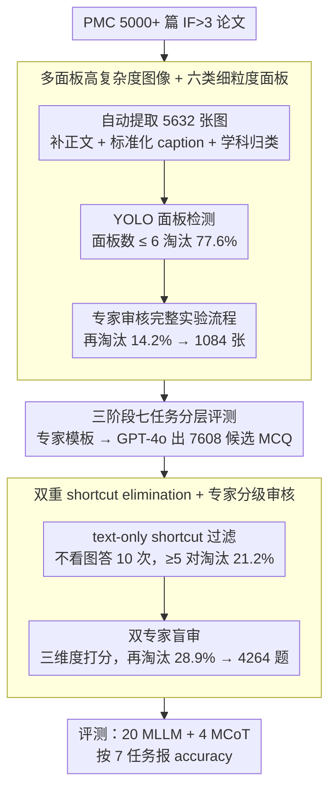

# Decoding Scientific Experimental Images: The SPUR Benchmark for Perception, Understanding, and Reasoning

**会议**: ACL 2026  
**arXiv**: [2604.27604](https://arxiv.org/abs/2604.27604)  
**代码**: https://github.com/BUPT-Reasoning-Lab/SPUR (有)  
**领域**: 多模态 VLM / 科学图像理解 / AI4S  
**关键词**: 实验图像、多面板理解、定量推理、MCoT、PMC

## 一句话总结
SPUR 是首个针对生物医学实验图像（多面板染色图/Western blot/统计图）"感知 → 理解 → 推理"三阶段评测的 benchmark，包含 4264 道专家审定 MCQ，揭示当今 MLLM 仅 Gemini 3 Pro Preview 勉强突破 60%，定量推理普遍比定性推理低 12.76%–31.41%。

## 研究背景与动机
**领域现状**：MLLM 在科学图像（统计图、表格、生物图、化学结构）上的能力快速涨点，并衍生出 ScienceQA、MMMU、M3CoT、MMSci、SciAssess、MicroVQA 等 benchmark；同时 MCoT 方法（prompt-based、plan-based、training-based）被用来强化多模态推理。

**现有痛点**：科研论文里真正考验"读图能力"的是**多面板实验图**（如 Western blot + 染色图 + 趋势曲线一起讲一个故事），但已有 benchmark 三方面缺位：(1) 实验图像比例极低，多数是统计图或学术示意图；(2) 平均每图 ≤ 8 个 panel，缺乏跨 panel 关系建模；(3) 几乎只考定性结论（"A 促进 B"），不考定量推理（"A 提升 50%"）。

**核心矛盾**：AI4S 真正需要的能力是"从复杂多面板视觉证据 → 跨面板对照/趋势综合 → 给出可量化的科学结论"，而现有基准只测了链路上某一段，掩盖了 MLLM 的真实瓶颈。

**本文目标**：构造一个**专门面向多面板实验图**、显式分解为**感知→理解→推理**三阶段、覆盖**定性+定量**双重推理的 benchmark，并系统测 20 个 MLLM + 4 个 MCoT 方法，分析能力短板。

**切入角度**：从 PMC 开源论文里筛 IF>3 的实验图，要求**每图 ≥ 6 个 panel**（YOLO 检测过滤掉 77.6%），借专家分级审核 + GPT-4o 生成 QA，再用"text-only 也能答对的就丢掉"的 shortcut 过滤确保题目必须看图。

**核心 idea**：用"Perception (NP/MP/IL) → Understanding (TA/HI) → Reasoning (Qual./Quant.)"七任务分层，把"读懂一张实验图"这件事拆成可独立诊断的子能力，从而把 MLLM 的瓶颈定位到"细粒度数值感知 + 跨面板趋势分析"两个具体环节。

## 方法详解

### 整体框架
SPUR 不是模型而是 benchmark + 评测框架。Pipeline：① **图像采集**——从 PMC 抓 5000+ 篇 IF>3 论文，自动提取 5632 张图，人工补 3–5 句相关正文 + 标准化 caption + 学科归类；② **图像过滤**——YOLO panel 检测器扔掉面板数 ≤ 6 的图（淘汰 77.6%），专家二次审核扔掉无完整实验流程的（再淘汰 14.2%），最终留 1084 张；③ **QA 生成**——专家按 7 任务模板写 prompt，GPT-4o 产出 7608 道候选 MCQ；④ **质量保障**——textual shortcut elimination（GPT-4o 在不看图条件下答 10 次，≥5 次正确的题目丢掉，淘汰 21.2%）+ 双专家盲审（再淘汰 28.9%），最终 4264 题；⑤ **评测**——在 8 个闭源 + 12 个开源 MLLM 上跑 7 任务 accuracy，并对比 4 种 MCoT。

### 关键设计

**1. 多面板高复杂度图像 + 六类细粒度面板：把图像复杂度推到真实顶刊 figure 的密度**

低复杂度图（1–3 panel）既考不了跨面板关系，MLLM 抄一句 caption 就能蒙对。SPUR 反其道而行，强制图像平均含 14.3 个 panel（远超 MMSci 的 7.4、SFE 的 2.3、MicroVQA 的 1.9），且最多混排 6 种细粒度面板类型（4 类染色 + 统计图 + Western blot）。实现上先用 YOLO 检测器对 5632 张候选图数面板，$\geq 6$ panel 才放行；同时把染色图细分为 Cell / Tissue / Microorganism / Subcellular 四类，让 MP 任务能按 panel category 拆开做细粒度分析。

这种细分立刻暴露了训练数据偏置——Ministral 3 14B 在 Subcellular 面板上能到 70.52%，在 Microorganism 上却只有 42.80%，同一个感知任务因图像子类型不同而判若两模型。高 panel 数 + 多类型混排，才真正模拟了"读 Nature 一张 figure"的科研场景。

**2. 三阶段七任务分层评测：把"读懂多面板实验图"拆成可独立诊断的能力链**

传统 VQA-style benchmark 只给一个 overall accuracy，模型错了也不知道错在哪一环。SPUR 把"读懂一张实验图"显式拆成三阶段七子任务，每个子任务单独算 accuracy：感知阶段是 panel 级的——NP 估计动力学曲线的数值、MP 识别细胞形态、IL 把面板映射回实验条件；理解阶段跨 panel——TA 分析同构面板的趋势方向、HI 在异构面板间做跨模态信息整合；推理阶段是专家级——Qual. 给方向性结论、Quant. 给比率/显著性这类量化结论。

有了这套指标空间，作者才能把瓶颈定位到具体环节，而不是泛泛地说"模型不行"：NP 是系统性最低项、TA 随跨面板关系数从 1 增到 4 时 accuracy 从 60.7% 跌到 34.0%、Quant. 全程比 Qual. 低 12.76%–31.41%——这些诊断结论都依赖于"错在哪一段链路"能被分层读出来。

**3. 双重 shortcut elimination + 专家分级审核：逼模型必须看图，堵死从 caption 和常识抄答案的近路**

科学图像 QA 最大的陷阱是答案泄漏到 caption 或预训练常识里，导致 benchmark 测的其实是 LLM 的知识而非视觉能力。SPUR 用三道闸门封死这条近路：(a) textual shortcut filter——把题目 + 选项不附图喂给 GPT-4o 重复答 10 次，凡 ≥5 次答对就判为"文字可解"丢掉，淘汰 21.2%（1612 题）；(b) 双专家盲审——4 位 >40 篇 paper 的领域专家 + 2 位 >100 篇 paper 的高级专家，按 Scientific Validity / Task Alignment / Visual Reasoning Necessity 三维度打分，分歧由高级专家仲裁，再淘汰 28.9%（1732 题）；(c) 出题阶段就禁止从 caption 直接派生题目，强制基于面板视觉信息命题。

两道过滤器之后，GPT-4o 在 text-only 设置下答不出超过 50% 的题，这本身就证明了视觉信息确实是答题的必需品，而非可有可无的装饰。

### 损失函数 / 训练策略
SPUR 是评测 benchmark，无训练。评测协议：直接 prompting + accuracy on MCQ；MCoT 评测时分别套用 DDCoT/VoT (prompt-based)、VIC/Cantor (plan-based) 四种 inference-time 推理增强方式，公平比对。

## 实验关键数据

### 主实验

20 个 MLLM 在 SPUR 上的 overall accuracy（节选）：

| 模型 | NP | MP | IL | TA | HI | Qual. | Quant. | Overall |
|------|------|------|------|------|------|--------|---------|---------|
| Gemini 3 Pro Preview | 61.26 | 67.74 | 59.67 | 51.04 | 59.23 | 90.31 | 58.90 | **60.57** |
| Claude 3.7 Sonnet (thinking) | 59.67 | 64.32 | 57.45 | 51.30 | 60.80 | 87.58 | 59.96 | 59.52 |
| Gemini 2.5 Pro Preview | 56.47 | 62.97 | 56.47 | 53.30 | 61.54 | 86.54 | 57.94 | 59.00 |
| GPT-5.1 | 58.73 | 61.72 | 54.47 | 51.18 | 50.78 | 86.52 | 56.36 | 57.68 |
| GLM-4.5V (开源最佳) | 57.70 | 61.99 | 57.65 | 55.71 | 68.46 | 80.94 | 58.48 | 59.87 |
| InternVL3-78B | 46.30 | 51.97 | 49.84 | 49.52 | 61.24 | 75.24 | 51.06 | 51.94 |
| Qwen2.5-VL-72B | 38.10 | 45.34 | 49.11 | 51.87 | 61.90 | 73.10 | 52.51 | 48.21 |
| LLaVA-v1.5-13B | 33.05 | 28.11 | 34.15 | 34.52 | 44.96 | 62.19 | 35.58 | 35.97 |

**结论**：除 Gemini 3 Pro Preview 外**全军覆没在 60% 以下**；开源最佳 GLM-4.5V 接近闭源中游；NP 普遍最低；Qual. 与 Quant. 落差最大可达 31.41% (Llama 4 Maverick 84.64 vs 57.02)。

### 消融实验

四种 MCoT 方法 vs 直接 prompting（节选 GLM-4.5V）：

| 配置 | NP | TA | Qual. | Quant. | Overall |
|------|-----|------|--------|---------|---------|
| Direct | 57.70 | 55.71 | 80.94 | 58.48 | 59.87 |
| DDCoT (prompt) | 47.11 | 45.24 | 71.52 | 53.27 | 48.90 |
| VoT (prompt) | 55.82 | 53.65 | 78.44 | 57.77 | 58.47 |
| VIC (plan) | 35.50 | 27.20 | 34.59 | 36.52 | 32.02 |
| Cantor (plan) | 53.41 | 51.23 | 77.12 | 56.61 | 55.59 |

按"感知正确/感知错误"解耦推理 accuracy（Qwen3-VL-30B-A3B-Instruct）：

| Condition | Direct | DDCoT | VoT | VIC | Cantor |
|-----------|--------|--------|------|------|---------|
| Perception Correct | 71.66 | 82.66 ($\uparrow$11.0) | 98.59 ($\uparrow$26.9) | 65.66 ($\downarrow$6.0) | 79.65 ($\uparrow$8.0) |
| Perception Incorrect | 32.40 | 23.68 ($\downarrow$8.7) | 9.32 ($\downarrow$23.1) | 30.30 ($\downarrow$2.1) | 40.23 ($\uparrow$7.8) |

### 关键发现
- **MCoT 是"放大器"不是"修复器"**：感知对了，MCoT 能多涨 8–27 个点；感知错了，MCoT 把错误放大，VoT 直接掉 23 个点。这把"先看清再思考"的优先级量化了。
- **TA 与关系复杂度反相关**：当跨面板关系数从 1 增到 4，Claude 3.7 thinking 的 TA accuracy 从 60.70% 直接掉到 34.00%，说明多关系联合推理才是真正瓶颈。
- **MP 有显著学科偏置**：Ministral 3 14B 在 Subcellular 上 70.52% 但 Microorganism 上仅 42.80%，反映训练语料里实验图像的分布严重不均，泛化性弱。
- **闭源 thinking 模型 Qual. 接近天花板**：Gemini 3 Pro Preview / Claude 3.7 thinking 在 Qual. 上 87–90%，但 Quant. 只有 59–60%，说明"会下结论"≠"会算数"，量化推理是统一短板。

## 亮点与洞察
- **诊断性 benchmark 而非排行榜 benchmark**：七任务分层让一个数字（overall）能反推到"哪一段链路断了"，对 AI4S 模型开发更具指导性，比单纯 MMMU 风格的 overall accuracy 信息量大。
- **"双过滤 + 双盲审"管道**可复用：text-only shortcut 检测 + 多面板强制下限，是一套通用的"防 caption 抄答案"模板，可以迁移到任何科学图 QA。
- **MCoT 解耦分析很惊艳**：把 MCoT 增益按"感知是否正确"拆成两个子集，一图揭穿"CoT 万能论"，并给出明确建议——先训 VLM perceptual ability，再叠 CoT 才有意义。
- **平均 14.3 panel/图**是迄今最高，几乎逼近真实顶刊论文的 figure 密度，未来研究在 SPUR 上掉点比在 MMMU 掉点更能反映真实场景。

## 局限与展望
- **MCQ 形式遮蔽推理过程**：无法直接观察模型为什么错（数值估错？趋势看反？逻辑跳步？）；作者也承认这是 trade-off，未来需引入 free-form rationales + 步骤打分。
- **学科覆盖偏生物医学**：7 学科都在生命科学范畴（细胞/分子/肿瘤等），物理/化学/材料的实验图（如显微 SEM、能谱、晶体）未覆盖，结论外推需额外适配。
- **未给出训练集**：仅是 zero-shot evaluation benchmark，模型怎么"练好实验图感知能力"还是开放问题；建议未来发布配套的 SPUR-Train 用作 instruction tuning。
- **基线 MCoT 方法都是 training-free**：缺 training-based MCoT（如 R1-V、MM-R1）对照，无法断言"训练 + RL 是否能突破 NP 瓶颈"。

## 相关工作与启发
- **vs MicroVQA (CVPR 2025)**：MicroVQA 也做实验图但只 1.9 panel/图 + 仅 Qual.；SPUR 在面板复杂度（14.3 vs 1.9）和定量推理覆盖上都是数量级提升。
- **vs MMMU / M3CoT / ScienceQA**：这些 benchmark 都是 1–2.5 panel 的"非实验图"，且未模型跨面板关系；SPUR 的"复杂多面板 + cross-panel relation"填补了真正的实验图理解空白。
- **vs SciAssess / MMSci**：后两者图像孤立度高（≤8 panel），SPUR 把"科研读图"的物理复杂度推到顶刊真实水平。
- **启发**：在任何"多模态 + 科学推理"项目里，应该把 perception accuracy 与 reasoning accuracy 解耦上报，否则 MCoT/SFT/RL 提升是无法归因的。

## 评分
- 新颖性: ⭐⭐⭐⭐ 实验图多面板这个赛道前人零星做过 (MicroVQA)，但本文把复杂度推到 14.3 panel + 显式拆 NP/MP/IL/TA/HI/Qual./Quant. 七任务，定位足够清晰
- 实验充分度: ⭐⭐⭐⭐⭐ 20 个 MLLM + 4 个 MCoT + 五学科 + 解耦 perception-reasoning 的诊断性分析，全套
- 写作质量: ⭐⭐⭐⭐ 图 1 + 图 5 + 图 6 三张诊断图很贴主张，故事线"基准缺位→七任务→诊断结果→MCoT 失效原因"清晰
- 价值: ⭐⭐⭐⭐ 作为 AI4S 社区的诊断标杆 benchmark 实用性强，且暴露的"NP 是瓶颈、MCoT 不会救感知错误"两条洞察是可指导研究方向的

<!-- RELATED:START -->

## 相关论文

- [\[ACL 2026\] SciMDR: Advancing Scientific Multimodal Document Reasoning](scimdr_advancing_scientific_multimodal_document_reasoning.md)
- [\[ACL 2026\] ChemVLR: Prioritizing Reasoning in Perception for Chemical Vision-Language Understanding](chemvlr_prioritizing_reasoning_in_perception_for_chemical_vision-language_unders.md)
- [\[ACL 2026\] A Survey of Multimodal Mathematical Reasoning: From Perception, Alignment to Reasoning](a_survey_of_multimodal_mathematical_reasoning_from_perception_alignment_to_reaso.md)
- [\[CVPR 2026\] Beyond Single Images: A Comprehensive Benchmark for Album-Level Vision-Language Understanding](../../CVPR2026/multimodal_vlm/beyond_single_images_a_comprehensive_benchmark_for_album-level_vision-language_u.md)
- [\[ACL 2026\] GeoRC: A Benchmark for Geolocation Reasoning Chains](georc_a_benchmark_for_geolocation_reasoning_chains.md)

<!-- RELATED:END -->
