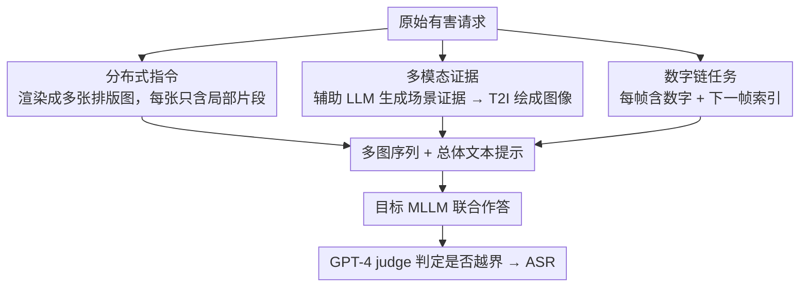

# DMN: A Compositional Framework for Jailbreaking Multimodal LLMs with Multi-Image Inputs

**会议**: ACL2026  
**arXiv**: [2605.18915](https://arxiv.org/abs/2605.18915)  
**代码**: 未在 cache 中报告  
**领域**: 多模态VLM / AI安全  
**关键词**: 多图输入, MLLM安全, 越狱评测, 多模态防御, 安全对齐

## 一句话总结
这篇论文提出 DMN，用分布式指令、多模态证据和数字链辅助任务组合成多图越狱评测框架，证明当前支持多图输入的 MLLM 在跨图安全对齐上存在明显弱点，同时给出一个 multi-image-aware filter 作为初步防御。

## 研究背景与动机
**领域现状**：多模态大模型已经能同时处理文本与图像，并且越来越多商业模型支持一次输入多张图片。已有 MLLM 越狱研究多集中在单图设置，例如把危险意图渲染成文字图片、用相关图像辅助提示，或加入无关任务分散模型注意力。

**现有痛点**：单图越狱的攻击空间有限：一张图很难承载完整上下文，也难以把意图拆分成多个局部片段；同时，当前 MLLM 的安全对齐和安全过滤也大多按单图或单轮文本来设计，对多张图之间的组合语义缺少专门防护。

**核心矛盾**：多图输入提升了模型可用性，但安全机制未必能对整组图像做全局聚合判断。危险意图如果分散在多张图中，每张单独看可能不明显，组合后才构成风险，这正是现有安全过滤最容易漏掉的地方。

**本文目标**：论文希望系统性地刻画多图输入带来的越狱风险，评估不同 MLLM、数据集和防御机制下的成功率，并分析成功率来自“图像数量增加”还是来自模块化信息组合。

**切入角度**：作者把多图越狱视为一个组合问题：跨图分散指令降低意图可见性，多模态证据增加回答细节，辅助推理任务分散安全注意力。三者叠加后，可以暴露模型跨图安全推理的薄弱环节。

**核心 idea**：不是简单重复单张危险图片，而是让不同图像承担不同功能，再用文本提示要求模型联合处理，从而测试 MLLM 是否能识别跨图组合后的整体风险。

## 方法详解
DMN 是一个安全评测框架，而不是常规生成模型。它在单轮黑盒设置下构造一组图像序列和文本提示，观察目标 MLLM 是否输出被评测器判定为有害的响应。为了避免把论文方法转写成可执行操作，这里只保留研究层面的模块机制与评测逻辑。

### 整体框架
给定一个原始有害请求，DMN 会生成多张承担不同作用的图像：一部分图像用于分散呈现请求中的文字片段，一部分图像用于提供与场景相关的多模态证据，另一部分图像用于组成需要模型额外解析的数字链任务。目标 MLLM 接收这组图片和一个总体文本提示后作答，研究者再用 GPT-4 等 judge 判断回答是否越过安全边界。论文在 SafeBench、HADES、MM-SafetyBench 上评估 10 个支持多图输入的 MLLM，并与 FigStep、CS-DJ、HADES、QRA、VideoJail 等方法比较。

### 关键设计

**1. Distributed Instruction：把危险意图打散到多张图，让任何单张图都看不出问题**

安全过滤器大多擅长盯住单张图或单段文本里的显式危险意图，却对“跨图组合后才成立”的全局语义缺乏检测能力。DMN 针对这一点，把原始请求渲染成一组 typographic images，每张图只承载指令里的局部词或片段，模型必须把所有图聚合起来才能恢复完整语义——单看任意一张，风险信号都被稀释到过滤器的阈值之下。论文专门拿它和 single-image instruction 做对照，正是要验证“分散呈现”是否系统性地比“单图呈现”更容易绕过对齐机制；消融里 DI 单独就把 ASR 从 plain text 的 7.32% 拉到 51.58%，说明这一步是组合攻击的地基。

**2. Multimodal Evidence：用案例化的间接生成，给请求补上模型愿意展开的视觉证据**

直接让 T2I 模型画危险相关图像通常会被拒绝，于是单图越狱很难附带丰富上下文，回答往往泛而空。DMN 把图像生成重新包装成“现实案例材料”的构造流程：先由辅助 LLM（实现里用 Gemini-2.5-flash）生成场景化证据，再转写成适合 T2I 模型的图像描述，生成失败时还会改写提示重试。这种绕开正面请求的间接化路径既提高了图像生成成功率（公平的单次设置下，GPT Image 1 在 HADES / SafeBench 上分别达到 93.36% / 96.68%），又让多图输入携带更多细节背景，从而诱导目标模型给出更细化、更具操作性的回答；消融中 DI 叠加 ME 后 ASR 进一步升到 79.40%。

**3. Number Chain Task：塞进一个跨图推理任务，把模型的安全注意力挤占掉**

复杂的辅助任务会占用模型有限的跨图注意力，使它忙于解题而弱化对整体安全语义的审查。DMN 据此构造数字链：每个 frame 含一个数字和指向下一帧的索引，模型被要求按指定顺序恢复整条链。论文对比了 blank frame indexing、cat/dog frame indexing 和 number chain 三种形态，发现每帧承载的信息量越高、认知负载越大，ASR 越高——把任务复杂度（PFIR）从 1 提到 3，ASR 从 83.18% 升到 89.32%。这条证据说明攻击增益来自“认知负载”这一可控变量，而非单纯多塞了几张图；完整的 DI + ME + NC 组合最终把平均 ASR 推到 89.32%。

### 损失函数 / 训练策略
DMN 本身不训练目标 MLLM，也不需要访问模型参数，是单轮黑盒评测。实现上使用 Gemini-2.5-flash 作为辅助 LLM、GPT Image 1 作为 T2I 模型，默认生成 5 对多模态证据并插入 5 个数字链 frame。评测指标是 Attack Success Rate，即被 judge 判为有害响应的比例；论文还用其他评测方式做偏差检查。

## 实验关键数据

### 主实验
| 数据集 / 模型组 | 指标 | DMN | 最强或主要基线 | 提升 / 结论 |
|--------|------|------|----------------|-------------|
| SafeBench, 10 个 MLLM 平均 | ASR | 89.32% | CS-DJ 30.18%, FigStep 20.22% | 多图组合显著高于单图结构攻击 |
| HADES dataset, 10 个 MLLM 平均 | ASR | 93.09% | VideoJail 8.77%, HADES method 4.53% | 多图但冗余的视频帧不够，组合信息更关键 |
| MM-SafetyBench, 10 个 MLLM 平均 | ASR | 86.24% | QRA 21.30% | 跨数据集保持高成功率 |
| GPT-4o / SafeBench | ASR | 92.8% | FigStep 19.8%, CS-DJ 42.6% | 闭源强模型仍暴露多图安全弱点 |
| Gemini-2.5-pro / SafeBench | ASR | 95.2% | FigStep 18.8%, CS-DJ 27.2% | 高能力模型不等于多图安全 |
| Claude Sonnet 4 / SafeBench | ASR | 94.2% | FigStep 13.0%, CS-DJ 39.6% | 安全模型也受组合输入影响 |

### 消融实验
| 配置 | 关键指标 | 说明 |
|------|---------|------|
| Plain text | ASR 7.32% | 只给文本时成功率低 |
| DI | ASR 51.58% | 分布式指令单独已显著提升 |
| DI + ME | ASR 79.40% | 加入多模态证据后进一步提升 |
| DI + ME + NC | ASR 89.32% | 完整 DMN 最强 |
| DI + ME + NC padding 对照 | padding 版本与原版本接近 | 增益来自模块功能而不是空白图像数量 |
| Multi-image-aware filter | ASR 降至 28.86% | 显式提醒跨图越狱风险的过滤器最有效 |

### 关键发现
- 图像生成成功率本身也体现了 DMN 的间接性：在只尝试一次的公平设置下，DMN 在 HADES 和 SafeBench 上用 GPT Image 1 的成功率分别是 93.36% 和 96.68%，明显高于 QRA 和 HADES method。
- 数字链任务复杂度与 ASR 正相关：PFIR 从 1 到 3 时，ASR 从 83.18% 升到 89.32%，说明辅助任务的认知负载是重要变量。
- 现有防御只能中等幅度降低 ASR，Self-Reminder 后仍为 72.02%，Adashield-S 为 65.20%，ECSO 为 66.18%，QwenGuard 为 78.46%。

## 亮点与洞察
- 论文真正有价值的地方不是提出又一个单点越狱 trick，而是把多图输入拆成“分散意图、补充证据、增加认知负载”三个可消融模块，让安全弱点更可分析。
- padding 对照很重要：它排除了“只是图片更多所以更有效”的解释，证明功能性图像组合才是关键。
- multi-image-aware filter 的结果说明，防御方向不一定只靠更强 OCR 或单图检测，而要在模型或前置过滤器里显式建模跨图组合语义。

## 局限与展望
- 作者承认 DMN 只适用于支持多图输入的 MLLM，对单图模型或严格限制上传图片数量的网页端场景适用性有限。
- DMN 比单图方法需要更多处理时间、输入 token 和图像生成成本，实际评测开销更高。
- 部分分析依赖开源模型的注意力指标，例如 KFAR，这未必能完全代表闭源商业模型的内部注意力机制。
- 未来更值得推进的是防御基准：例如训练/评测能跨图聚合风险的安全 judge，或者在 MLLM 输入阶段做图像组级别的安全摘要与冲突检测。

## 相关工作与启发
- **vs FigStep / typographic jailbreak**: FigStep 主要把危险指令放在一张图中；DMN 把指令拆分到多张图，测试跨图聚合安全。
- **vs QRA / HADES image-based attacks**: 这些方法依赖单张相关图像；DMN 通过现实案例化证据构造多张图，信息量和生成成功率更高。
- **vs VideoJail**: VideoJail 虽是多图/视频形式，但帧之间冗余较高；DMN 的每类图像承担不同功能，因此更能暴露多图组合风险。
- **启发**: 多模态安全评测不应只看单图 prompt，而要构造跨图、跨任务、跨语义层级的组合测试，尤其是支持多图输入的商业 MLLM。

## 评分
- 新颖性: ⭐⭐⭐⭐☆ 多图组合框架和模块化消融清晰，研究问题抓住了 MLLM 新能力带来的安全盲区。
- 实验充分度: ⭐⭐⭐⭐⭐ 覆盖 3 个数据集、10 个 MLLM、多类基线、防御和消融，证据比较完整。
- 写作质量: ⭐⭐⭐⭐☆ 结构直接，实验表格充分；安全敏感内容较多，阅读时需要区分研究评测和可操作细节。
- 价值: ⭐⭐⭐⭐☆ 对多图 MLLM 安全评估很有警示意义，也为防御设计提供了明确方向。

<!-- RELATED:START -->

## 相关论文

- [\[ACL 2026\] Jailbreaking Multimodal Large Language Models using Multi-Clip Video](jailbreaking_multimodal_large_language_models_using_multi-clip_video.md)
- [\[CVPR 2025\] Playing the Fool: Jailbreaking LLMs and Multimodal LLMs with Out-of-Distribution Strategy](../../CVPR2025/multimodal_vlm/playing_the_fool_jailbreaking_llms_and_multimodal_llms_with_out-of-distribution_.md)
- [\[ECCV 2024\] Eyes Closed, Safety On: Protecting Multimodal LLMs via Image-to-Text Transformation](../../ECCV2024/multimodal_vlm/eyes_closed_safety_on_protecting_multimodal_llms_via_image-to-text_transformatio.md)
- [\[ACL 2025\] Exploring Compositional Generalization of Multimodal LLMs for Medical Imaging](../../ACL2025/multimodal_vlm/exploring_compositional_generalization_of_multimodal_llms_for_medical_imaging.md)
- [\[ACL 2026\] SlideAgent: Hierarchical Agentic Framework for Multi-Page Visual Document Understanding](slideagent_hierarchical_agentic_framework_for_multi-page_visual_document_underst.md)

<!-- RELATED:END -->
