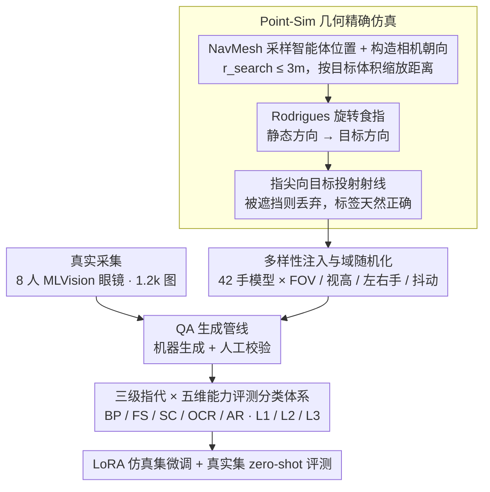

# Do MLLMs Understand Pointing? Benchmarking and Enhancing Referential Reasoning in Egocentric Vision

**会议**: ACL 2026  
**arXiv**: [2604.21461](https://arxiv.org/abs/2604.21461)  
**代码**: https://guyyyug.github.io/EgoPoint-Bench/ (项目页)  
**领域**: 多模态 VLM / 第一人称视觉 / 指点理解  
**关键词**: Egocentric Pointing, Referential Hallucination, Sim-to-Real, MLLM Benchmark, LoRA Fine-tuning

## 一句话总结
作者构建了首个真实+物理仿真混合的第一人称"手指指点"问答基准 EgoPoint-Bench（11.7k QA / 5 维度 / 3 级语义指代），证实当前 SOTA MLLM 普遍依赖"视觉邻近 / 显著性"伪相关而非真正解析指尖射线，并通过在仿真数据上 LoRA 微调获得平均最高 +25 点的提升与稳健的 sim-to-real 泛化。

## 研究背景与动机

**领域现状**：智能眼镜等可穿戴设备催生了第一人称视觉 (egocentric) 的智能体场景，用户的自然交互高度依赖"那个 / 这个"等指示代词 + 指点手势，而 GPT-5 / Gemini 3 / Qwen3-VL 等 MLLM 在通用图像 QA 上已经表现不俗。

**现有痛点**：作者实测发现，当输入是含"指点手势"的第一人称图像时，模型并不真正沿食指方向投射射线去找目标，而是去抓"离手最近的物体"或"画面最显著的物体"。文中把这一现象命名为 **Referential Hallucination（指代幻觉）**。

**核心矛盾**：高质量"视觉—语言—空间"对齐数据的稀缺——RefCOCO/Visual Genome 是第三人称、Ego4D/EPIC-KITCHENS 没有指点 QA 标注、Ges3ViG 用合成 avatar 而非真手、YouRefIt 又不是第一人称。模型从来没见过"指尖几何 → 目标对象"的密集监督，自然学不会。

**本文目标**：(1) 提供能定量评测 MLLM 第一人称指点理解能力的 benchmark；(2) 提供一条能可扩展生成几何精确数据的合成流水线；(3) 验证仿真数据是否足够让模型真正"学会指点"并迁移到真实场景。

**切入角度**：用 Habitat-Sim + ray-casting 在 3D 场景里生成几何严格正确的指点样本（射线必须到达目标且无遮挡），再配合真实采集的 1.2k 样本做 zero-shot 跨域测试。

**核心 idea**：用"物理射线投射 + 多样化手模型"的可扩展仿真，造出 10k+ 几何无歧义的第一人称指点 QA 数据，让小模型 LoRA 微调后就能击败 GPT-5 / Gemini 3 这类闭源大模型。

## 方法详解

### 整体框架
EgoPoint-Bench 由两条数据采集管线 + 一套 QA 生成管线 + 一套五维评测体系组成。仿真侧 Point-Sim 在 1838 个高保真 3D 场景中用 42 种手模型生成 10,567 条样本；真实侧由 8 名志愿者佩戴 MLVision 智能眼镜在室内外场景采集 1,162 张图像。所有图像都进入"机器生成 + 人工校验"的 QA 管线，输出含三种题型（选择 / 判断 / 开放）和三级指代语言（L1 显式动作描述 / L2 视觉定位 / L3 隐式代词）的样本，按五维能力分类后做训练 / 验证 / 测试划分。

### 关键设计

**1. Point-Sim 几何精确仿真：把“指点正确”从学习目标降级成一个无法作弊的几何约束**

第一人称指点数据最大的麻烦是标注噪声——人工框出“食指到底指向哪个物体”既贵又容易主观出错，而模型一旦在脏标签上训练就只会学到偏差。Point-Sim 干脆不让人来判定对错，而是用射线几何强制保证标签正确。它先在 NavMesh 上以 $r_{search}\leq 3.0\text{m}$ 采样智能体位置 $P_{agent}$（最小避障 0.4 m，并按目标体积动态缩放距离，避免目标占满画面或小到看不见）；再按 $\mathbf{f}=(P_{obj}-P_{agent})/\|P_{obj}-P_{agent}\|$ 构造相机旋转 $R_{cam}\in SO(3)$，让目标自然落在视野里。

接着用 Rodrigues 公式把食指的静态方向 $\mathbf{u}_{rest}$ 旋到目标方向 $\mathbf{u}_{target}$，旋转角与旋转轴为

$$\theta=\arccos(\mathbf{u}_{rest}\cdot\mathbf{u}_{target}),\quad \mathbf{k}=\frac{\mathbf{u}_{rest}\times\mathbf{u}_{target}}{\|\mathbf{u}_{rest}\times\mathbf{u}_{target}\|}$$

最后从指尖向 $P_{obj}$ 投射一条射线，只要中途被任何障碍物拦截就直接丢弃该样本。这样“射线能命中且无遮挡”本身就等价于“标签正确”，从根本上消除了标注噪声；而且仿真天然附带 RGB / Depth / Semantic / BBox / 2D 投影坐标等多模态对齐数据，等于给后续 grounding 任务白送了一份密集监督。1838 个高保真 3D 场景最终产出 10,567 条样本。

**2. 多样性注入与域随机化：用大量无关变量把模型逼回去看几何方向**

如果仿真里手模型单一、视角固定，模型很容易把“某只手的纹理”和“指点意图”绑死，到了真实智能眼镜画面上就崩——这正是 sim-to-real gap 的根源。作者的对策是在视觉信号侧主动注入噪声：相机 FOV 在 $[100^\circ, 115^\circ]$ 均匀采样模拟广角眼镜，视点高度 $h_{eye}\sim\mathcal{U}(1.45, 1.70)$ 米，随机左右手；从 ArtStation 拿到的 3D 手臂手模在 Blender 里被参数化拉伸、调节关节，再叠加 3 种肤色 × 7 种衣袖 × 左右共 42 个手模型；最后对相机 pitch / yaw 加小幅扰动，模拟真人指点时手会抖。这些低成本变化把肤色、衣袖、姿态这类表观特征全部打散，模型再也无法靠记住某种纹理来蒙混，只能回到唯一稳定的线索——指尖的几何方向，从而把 sim-to-real 差距压下来。

**3. 三级指代 × 五维能力的评测分类体系：把“懂不懂指点”拆成能分别打分的子任务**

“指点理解”是个笼统能力，整体一个准确率根本看不出模型到底栽在哪。作者沿两个轴把它切开。指代语言由易到难分三级：L1“我指的这个 X”（带类别词）、L2“我指着的左边那个”（带空间词）、L3“这个怎么用？”（纯指示代词，最考验真解析射线）。能力维度分五类：BP 基础感知（类别 / 颜色 / 材质）、FS 功能与状态（可食 / 可操作）、SC 空间上下文（可达性 / 场景一致性）、OCR（品牌 / 标语）、AR 对抗鲁棒性（反事实 / 空指代）。这套切分的价值在实验里立刻显现——模型在 BP 拿高分却在 AR 极低，恰好说明它是靠视觉邻近 / 显著性蒙对，并没真懂指点；分维度打分才能精确定位“指代幻觉”集中爆发在哪个能力上，并据此决定后续训练数据该怎么配比。

### 损失函数 / 训练策略
评测端是 zero-shot 直接推理；增强实验端在每个开源 MLLM 上用 LoRA 仅在 Point-Sim 仿真训练集（10k 级）上微调，监督信号是问答对的标准语言建模目标。真实测试集完全 zero-shot，用于检验 sim-to-real 泛化。

## 实验关键数据

### 主实验
在仿真测试集 + 真实测试集上对比 4 个闭源大模型与 5 个开源模型（Direct vs LoRA），指标为各能力维度准确率（%）。

| 模型 | 方法 | Sim Mean | Real Mean | Overall Avg | LoRA Gain |
|------|------|----------|-----------|-------------|-----------|
| Random | - | 31.14 | 28.94 | 30.24 | - |
| Human | - | 95.80 | 96.00 | 95.90 | - |
| Gemini 3 Pro | Direct | 56.44 | 72.00 | 62.29 | - |
| Gemini 3 Flash | Direct | 57.21 | 71.84 | 62.71 | - |
| GPT-5.2 Instant | Direct | 54.80 | 66.76 | 59.29 | - |
| GPT-5 mini | Direct | 57.66 | 60.57 | 58.75 | - |
| LLaVA-1.5-7B | Direct / LoRA | 48.82 / **73.18** | 47.19 / **54.54** | 48.21 / **66.17** | **+17.96** |
| LLaVA-NeXT-7B | Direct / LoRA | 48.17 / **80.93** | 46.44 / **59.64** | 47.52 / **72.93** | **+25.41** |
| GLM-4.6V-Flash | Direct / LoRA | 53.29 / 74.86 | 56.42 / 61.26 | 54.47 / 69.74 | +15.27 |
| InternVL3.5-2B | Direct / LoRA | 51.74 / 75.43 | 53.73 / 62.03 | 52.49 / 70.39 | +17.90 |
| InternVL3.5-8B | Direct | 52.62 | 57.09 | 54.30 | - |

最强的闭源 Gemini 3 Pro 也仅 62.3% 综合分，距离 95.9% 的人类水平差近 34 个百分点；而 LLaVA-NeXT-7B 经 LoRA 后冲到 72.93%，全面超越所有闭源模型，证明问题不是"模型不够大"而是"训练数据缺这种监督"。

### 消融实验
利用同架构不同规模 / 不同数据规模做横向消融对比。

| 配置 | 综合 Overall Avg | 说明 |
|------|-----------------|------|
| LLaVA-1.5-7B Direct | 48.21 | 旧架构无指点训练 |
| LLaVA-NeXT-7B Direct | 47.52 | 升级视觉编码器但无监督，几乎没涨 |
| InternVL3.5-2B Direct | 52.49 | 小模型但更强通用 VLM |
| InternVL3.5-8B Direct | 54.30 | 8B 比 2B 只涨 1.8 点 → 单纯堆规模收益小 |
| LLaVA-1.5-7B + LoRA | 66.17 | +17.96，监督信号已生效 |
| LLaVA-NeXT-7B + LoRA | **72.93** | +25.41，更好的视觉 backbone × 更好的数据 → 最大叠加增益 |
| InternVL3.5-2B + LoRA | 70.39 | 2B 模型也能逼近 GPT-5 |

### 关键发现
- **指代幻觉是普遍现象**：所有 Direct 模型在 AR（对抗鲁棒性）维度普遍 30–60 分，远低于其他维度，表明模型在"没有合理指代目标"时仍硬猜，验证作者关于"伪相关"的诊断。
- **规模无法替代监督**：InternVL3.5 从 2B 到 8B Direct 只涨 1.8 分，而同样 7B 量级的 LLaVA-NeXT 一旦 LoRA 就反超 8B，证明指点能力是数据问题而非规模问题。
- **Sim-to-Real 显著**：在纯仿真数据上 LoRA 后，所有模型在真实测试集上一致涨分（+7~+13），说明 Point-Sim 的几何精确性 + 域随机化设计有效缩小了 sim-to-real 差距。
- **闭源 ≠ 更强**：Gemini 3 Pro 在真实集 72% 看似不错，但仿真 56% 表明它对"严格几何对齐"的判别能力反而弱，可能是因为闭源模型的训练数据偏向"宽松匹配"。

## 亮点与洞察
- **把标注问题转成几何约束**：用 ray-casting + 命中校验直接保证标签正确性，绕开"标多了就贵、标少了不够"的传统困境，是合成数据的优雅范式。
- **42 个手模型 × 域随机化**：在视觉信号侧主动注入"无关变量"（肤色 / 衣袖 / 抖动），强制模型把决策权交给几何方向而非表观特征，可迁移到任意需要"姿态—对象"对齐的任务。
- **"指代幻觉"概念命名**：把模糊的"模型猜错"现象提炼成一个可量化、可对比的失败模式（用 AR 维度专门测），是一个高复用的诊断框架。
- **LoRA 7B > GPT-5 mini**：用极轻量的微调让小模型在垂直能力上超越闭源大模型，再次印证"高质量任务数据 + 小模型适配"的范式在 narrow capability 上极具性价比。

## 局限与展望
- **真实集仅 1.2k**：sim-to-real 评测样本规模偏小，且采集者只有 8 人，潜在采集偏差（习惯姿势、左右手分布）未充分讨论。
- **仅看单帧**：基准是图像 QA 而非视频，但真实智能眼镜场景中指点是一个时间过程（伸出—锁定—收回），单帧设定可能高估了真实部署难度。
- **静态场景**：3D 场景全部来自静态家庭/室内数据集，缺少动态人群、移动目标等真实交互场景。
- **未上 grounding 任务**：数据其实带 BBox 和 2D 投影坐标，但论文主要做 QA 评测，未充分释放 grounding 任务的潜力（如直接回归指尖射线在 3D 空间的命中点）。

## 相关工作与启发
- **vs YouRefIt**: YouRefIt 用第三人称 + 真实手势 + grounding 任务，本文转向第一人称 + 几何精确仿真，是从"看别人指"到"看自己手"的视角根本转换。
- **vs Ges3ViG**: Ges3ViG 用合成 avatar 做 3D grounding，本文从 avatar 升级到真实采集 + 物理仿真双源，且关注 QA 而非纯坐标定位，更贴近 AR 交互真实需求。
- **vs RefEgo**: RefEgo 是第一人称视频 grounding 但完全文本指代，本文加入手势模态，覆盖了"deictic + gesture"这一真实交互必备组合。
- **vs EOC-Bench / ECBench**: 这两个第一人称 QA 基准依赖人为画框等视觉 prompt，本文用自然手势替代，更符合"无增强"的 AR 终端实际输入条件。

## 评分
- 新颖性: ⭐⭐⭐⭐ 第一个把"指点几何"作为一等公民的第一人称 benchmark，"指代幻觉"概念命名很有传播力，但物理仿真 + 域随机化的思路本身在机器人/具身领域并不新。
- 实验充分度: ⭐⭐⭐⭐ 覆盖 4 个闭源 + 5 个开源，做了 Direct vs LoRA、五维 × 三级双重切分，但 fine-grained ablation（手模型多样性、域随机化各维度的贡献）相对薄弱。
- 写作质量: ⭐⭐⭐⭐ 动机 → 失败模式命名 → 数据 → 评测 → 微调一条龙清晰，图 1 直击痛点，公式推导规范。
- 价值: ⭐⭐⭐⭐⭐ 切中智能眼镜/AR 助手的核心交互瓶颈，且证明"小模型 + 高质量任务数据"可碾压闭源大模型，对工业部署直接可用。

<!-- RELATED:START -->

## 相关论文

- [\[ACL 2026\] How Do LLMs and VLMs Understand Viewpoint Rotation Without Vision? An Interpretability Study](how_do_llms_and_vlms_understand_viewpoint_rotation_without_vision_an_interpretab.md)
- [\[NeurIPS 2025\] MMPerspective: Do MLLMs Understand Perspective? A Comprehensive Benchmark for Perspective Perception, Reasoning, and Robustness](../../NeurIPS2025/multimodal_vlm/mmperspective_do_mllms_understand_perspective_a_comprehensive_benchmark_for_pers.md)
- [\[ACL 2026\] MathFlow: Enhancing the Perceptual Flow of MLLMs for Visual Mathematical Problems](mathflow_enhancing_the_perceptual_flow_of_mllms_for_visual_mathematical_problems.md)
- [\[ACL 2026\] OMIBench: Benchmarking Olympiad-Level Multi-Image Reasoning in Large Vision-Language Models](omibench_benchmarking_olympiad-level_multi-image_reasoning_in_large_vision-langu.md)
- [\[CVPR 2025\] Vision-Language Models Do Not Understand Negation](../../CVPR2025/multimodal_vlm/vision-language_models_do_not_understand_negation.md)

<!-- RELATED:END -->
