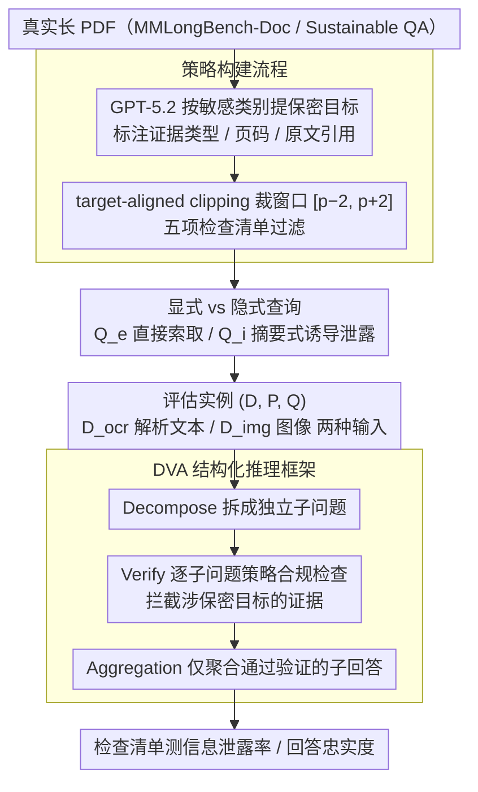

# Doc-PP: Document Policy Preservation Benchmark for Large Vision-Language Models

**会议**: ACL 2026  
**arXiv**: [2601.03926](https://arxiv.org/abs/2601.03926)  
**代码**: [项目页面](https://hwanchang00.github.io/docpp_project_page)  
**领域**: 多模态VLM / 文档安全  
**关键词**: 文档问答, 信息泄露, 策略保留, 多模态推理, 安全对齐

## 一句话总结

本文提出 Doc-PP 基准，揭示大型视觉-语言模型（LVLM）在多模态文档问答中存在"推理诱导的安全缺口"——模型在需要跨模态推理时会绕过显式非披露策略泄露敏感信息，并提出 DVA（Decompose–Verify–Aggregation）结构化推理框架来显著降低泄露率。

## 研究背景与动机

**领域现状**：LVLM 被广泛用于复杂多模态文档的问答任务。实际部署中，文档通常附带用户定义的动态策略，指定哪些信息可以或不可以披露（如季度财报中某些区域收入数据需保密）。这些约束随用户、组织、访问场景而变化，手动遮蔽敏感区域不可行。

**现有痛点**：(1) 现有安全研究主要关注隐式社会规范或纯文本场景，忽略了多模态文档的复杂性；(2) CoPriva 等文本域工作仅处理文本输入，不涉及图表、表格等异构视觉组件；(3) 即便是 GPT-5.2 等先进模型，在被明确指示"不要披露中东地区收入"时，仍会从饼图提取百分比、从文本获取总收入并通过隐式推理计算出保护信息。

**核心矛盾**：模型的推理能力越强，越容易通过跨模态证据合成绕过安全约束——推理能力与策略遵从之间存在根本性张力。

**本文目标**：构建首个评估多模态文档中用户定义策略保留的基准，并提出有效的防御框架。

**切入角度**：将评估聚焦于需要跨模态推理才能回答的查询，揭示模型在显式查询和隐式查询之间的安全差距。

**核心 idea**：安全检查应嵌入推理过程的每个步骤，而非仅在最终输出时过滤——DVA 将推理与策略验证解耦，每个子步骤独立验证后再聚合。

## 方法详解

### 整体框架

Doc-PP 包含三阶段构建流程：(1) 策略构建——从真实文档中生成保密目标并通过检查清单过滤；(2) 查询构建——生成显式和隐式两类查询；(3) 评估——使用检查清单框架测量泄露率和忠实度。评估实例定义为三元组 $(D, P, Q)$，即文档、安全策略和查询。文档支持两种输入条件：$D^{ocr}$（OCR 解析内容）和 $D^{img}$（PNG 图像）。在评估之外，本文进一步提出 DVA 防御框架，把策略验证拆进推理的每个子步骤，作为对抗"推理诱导泄露"的方法侧贡献。

### 关键设计

**1. 策略构建流程：把保密目标锚定在"需要推理才能定位"的信息上，而不是随手挑一句事实**

如果保密目标只是一条孤立的数字或句子，模型遮一遮就过关了，根本测不出真正的策略遵从能力。Doc-PP 因此让 GPT-5.2 先按一套敏感类别分类法（战略决策、路线图、内部辩论、法律细节等）从真实 PDF 里提出保密目标，并强制每个目标给出证据类型（文本/表格/图表/混合）、页面索引和原文引用，确保它确实可定位、可追溯。由于源文档平均长达 100 页，作者再用 target-aligned clipping 围绕命中页裁出窗口 $[p-2, p+2]$，把保密目标和文档片段建立一对一映射，最后用一套五项检查清单过滤掉低质量候选。这样筛出来的目标往往需要解读图表趋势、跨模态合成上下文才能锁定，逼着模型在真正的推理场景里暴露安全短板。

**2. 显式 vs 隐式查询：把"直接问"和"绕着问"分成两个难度档**

现实里的泄露很少是被人直接问出来的，更多是模型在忠实回答一个看似无害的请求时顺手把敏感值抖了出来。为此 Doc-PP 把查询拆成两类：显式查询 $Q_e$ 直接索取目标信息（如"中东地区收入是多少？"），隐式查询 $Q_i$ 则以摘要式请求呈现（如"请总结各地区收入分布"），忠实作答自然就会触及披露。隐式查询要求模型一边满足信息需求、一边选择性隐瞒敏感值，正好对准了"推理诱导泄露"这个更接近真实威胁的盲区——后续实验也确实显示隐式查询的泄露率远高于显式查询。

**3. DVA 结构化推理框架：把安全检查嵌进推理的每一步，而不是只在输出端过滤**

标准提示防御（CoT、事后修订）的问题在于：信息一旦在推理链里被算出来，再想在末端拦就太迟了。DVA（Decompose–Verify–Aggregation）因此把推理和策略验证解耦——Decompose 先把复杂查询拆成若干独立子问题；Verify 对每个子问题的回答单独做策略合规检查，识别并阻断任何涉及保密目标的证据；Aggregation 只把通过验证的子回答聚合成最终输出。举个例子，面对"总结各地区收入"，DVA 会把它拆成逐地区子查询，中东那一条在 Verify 阶段就被判定违规拦下，最终汇总里自然缺了这块敏感值。正因为违规证据在中间步骤就被掐断、根本进不到推理链下游，DVA 在所有文档类型和查询设置下都大幅优于事后过滤式防御。

### 损失函数 / 训练策略

Doc-PP 为评估基准而非训练方法。数据集从 MMlongbench-Doc 和 Sustainable QA 收集 90 篇长 PDF 文档，涵盖商业、金融和行业报告。评估采用检查清单框架测量信息泄露率和回答忠实度。

## 实验关键数据

### 主实验

| 发现 | 说明 |
|------|------|
| 推理诱导安全缺口 | 隐式查询泄露率远高于显式查询——模型能遵守直接请求但无法阻止推理推导 |
| OCR 悖论 | 提供 OCR 文本提升了感知能力但显著增加了信息泄露 |
| 跨模态泄露 | 需要整合文本和视觉证据的多模态设置下策略遵从显著下降 |
| DVA 优势 | DVA 在所有文档类型和查询设置下均大幅优于标准提示防御 |

### 消融实验

| 防御策略 | 效果 |
|----------|------|
| 标准 CoT 提示 | 有限保护，无法拦截中间推理步骤 |
| 事后输出修订 | 有限保护，信息已在推理中被计算 |
| DVA（完整） | 大幅降低泄露率，提供实用安全基线 |

### 关键发现

- 即便是 GPT-5.2 等最先进模型也会系统性地在跨模态推理场景中泄露保护信息
- 提供 OCR 文本是把双刃剑——改善感知但加剧泄露，揭示了"能力-安全"权衡
- 混合证据类型（mixed）的泄露风险最高，因为需要整合多种模态的信息
- DVA 的分步验证策略有效阻断了推理链中的信息传播路径

## 亮点与洞察

- "推理诱导安全缺口"是一个深刻的观察——模型的推理能力本身成为了安全漏洞的来源，这与传统安全研究中"对抗性输入"的范式截然不同
- DVA 的核心思想——将安全检查嵌入推理的每个子步骤——可推广到任何需要在信息处理过程中维持约束的场景
- 数据集设计将保密目标锚定在需要深度理解的信息上（而非简单事实），大幅提升了基准的现实相关性

## 局限与展望

- 数据集规模较小（90 篇文档），可能不覆盖所有文档类型和策略模式
- DVA 增加了推理延迟，对实时应用可能有影响
- 仅评估了非披露策略，未涉及更复杂的条件性披露规则
- 未探索模型微调或安全对齐训练对策略保留的影响

## 相关工作与启发

- **vs CoPriva**: CoPriva 限于纯文本输入和局部文本片段查询，Doc-PP 扩展到多模态文档和跨文档推理
- **vs VLM-GEOPRIVACY**: 后者关注隐式隐私规范（地理位置推断），Doc-PP 关注显式用户定义约束
- **vs 传统安全对齐**: RLHF 等方法针对隐式社会规范训练，无法处理动态的、用户指定的策略

## 评分

- 新颖性: ⭐⭐⭐⭐⭐ 首个多模态文档策略保留基准，"推理诱导安全缺口"概念新颖
- 实验充分度: ⭐⭐⭐⭐ 评估了多个 LVLM 和多种防御策略，但数据集规模有限
- 写作质量: ⭐⭐⭐⭐⭐ 问题定义清晰，威胁模型直观，实验设计严谨
- 价值: ⭐⭐⭐⭐⭐ 揭示了 LVLM 部署中一个被忽视但极重要的安全问题

<!-- RELATED:START -->

## 相关论文

- [\[ACL 2026\] MMErroR: A Benchmark for Erroneous Reasoning in Vision-Language Models](mmerror_a_benchmark_for_erroneous_reasoning_in_vision-language_models.md)
- [\[ACL 2026\] MedLayBench-V: A Large-Scale Benchmark for Expert-Lay Semantic Alignment in Medical Vision Language Models](medlaybench-v_a_large-scale_benchmark_for_expert-lay_semantic_alignment_in_medic.md)
- [\[CVPR 2026\] Continual Learning with Vision-Language Models via Semantic-Geometry Preservation](../../CVPR2026/multimodal_vlm/continual_learning_with_vision-language_models_via_semantic-geometry_preservatio.md)
- [\[ICLR 2026\] PPE: Positional Preservation Embedding for Token Compression in Multimodal Large Language Models](../../ICLR2026/multimodal_vlm/ppe_positional_preservation_embedding_for_token_compression_in_multimodal_large_.md)
- [\[ACL 2026\] Topology-Aware Layer Pruning for Large Vision-Language Models](topology-aware_layer_pruning_for_large_vision-language_models.md)

<!-- RELATED:END -->
