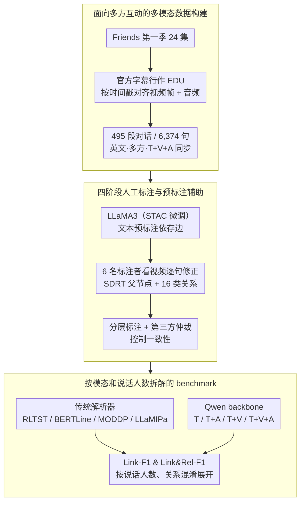

# DraDDP: A Multimodal Multi-Party Dialogue Discourse Parsing Dataset

**会议**: ACL 2026  
**arXiv**: [2606.00012](https://arxiv.org/abs/2606.00012)  
**代码**: https://github.com/DraDDP  
**领域**: 多模态对话理解 / 话语解析  
**关键词**: 多方对话、话语解析、多模态数据集、音视频线索、SDRT

## 一句话总结
DraDDP 构建了首个公开的英文多模态多方对话话语解析数据集，并用传统解析器、LLM 与多模态 LLM 系统评测了文本、音频、视频线索对依存边和话语关系识别的不同贡献。

## 研究背景与动机
**领域现状**：多方对话话语解析希望从一段对话中识别话语单元之间的依存结构和关系类型，例如 Comment、Background、Question-Answer Pair 等。过去的主流数据集和方法大多围绕文本展开，典型数据集包括 STAC、Molweni、DialogueDSA、MSDC，模型侧则依赖 BERT、结构 Transformer、增量 LLaMA parser 或专门的多任务学习框架。

**现有痛点**：真实多人对话并不只靠文字传递语义。说话人之间可能存在并行话题、视线转移、语气变化和场景动作，仅看文本时容易把不相关的回应误连到错误上下文。已有多模态话语解析资源也不够覆盖这个场景：JDDC 2.1 和 MODDP 都偏双人对话，且主要是中文资源，无法支撑英文多方多模态对话研究。

**核心矛盾**：多方对话增加了话题分叉和远距离依存，而多模态信息又可能既提供关键线索，也带来场景噪声。研究社区缺少一个同时具备英文、多方、音视频同步和人工话语结构标注的基准，无法系统判断不同模态到底在哪里有帮助。

**本文目标**：作者希望补上数据层面的空白，并建立可复现实验基准：一方面构建包含文本、视频、音频的英文多方对话话语解析数据集；另一方面用多个传统模型、LLM 和 MLLM 评测 Link-F1 与 Link&Rel-F1，分析音频、视频在不同说话人数和不同关系类型上的作用。

**切入角度**：论文选择美剧 Friends 第一季作为数据源，因为它既有稳定的字幕和时间戳，也有丰富的多人互动、情绪表达、肢体动作和场景切换。这个选择让作者可以在保证对齐质量的同时，收集比论坛文本更接近真实面对面交流的对话结构。

**核心 idea**：用带时间戳的电视剧多方对话构建可对齐的文本、视频、音频话语解析数据集，再用系统 benchmark 把“多模态是否有用”拆成依存边、关系类型、说话人数和模态组合几个可量化问题。

## 方法详解
DraDDP 本质上是一篇数据集与 benchmark 论文。它的技术贡献不在提出一个复杂模型，而在把多方多模态话语解析拆成可标注、可训练、可对比的流程：先从电视剧字幕抽取 EDU，再按照 SDRT 体系标注依存图和 16 类话语关系，最后在同一评测协议下比较文本、音频、视频及其组合。

### 整体框架
整体 pipeline 分为四步。第一步是数据准备：从 Friends 第一季 24 集中抽取对话片段，把官方字幕行作为基本话语单元（elementary discourse unit, EDU），并利用字幕时间戳对齐视频帧和音频片段。第二步是人工标注：基于 SDRT（Segmented Discourse Representation Theory）关系体系，为每个话语单元标注其父节点和 16 类话语关系。第三步是质量控制：用预标注模型辅助但不决定最终标签，通过分层标注、讨论和第三方仲裁控制一致性（这一步与第二步同属一套标注流程）。第四步是 benchmark：在 DraDDP 和 MODDP 上评测 RLTST、BERTLine、MODDP、LLaMIPa 等传统解析器，以及把 LLaMIPa 框架 backbone 换成 Qwen 系列得到的文本 / 文本+音频 / 文本+视频 / 全模态模型。

### 关键设计
**1. 面向多方互动的多模态数据构建：把英文电视剧多人对话转成同步对齐的文本/视频/音频样本**

论坛或游戏文本数据缺面部表情、视线、语气这些互动线索，已有的双人多模态数据又覆盖不了多方话题分叉，作者因此回到电视剧对话——它虽然是脚本化的，却能提供稳定、密集、可对齐的多人互动。具体做法是把官方字幕行直接当作 EDU，因为字幕长度适中、通常正好对应一个说话轮次和语义边界，而且自带时间戳，方便把每个话语单元和对应的视频帧、音频片段精确对齐。最终数据集落到 495 个 dialogue segments、6,374 个 utterances 和 9.1 小时平行视频，构成一份英文、多方、三模态同步的话语解析资源。

**2. 四阶段人工标注与预标注辅助：在复杂多方场景里得到可靠的依存边和关系类型**

纯人工从零标注这种多人话题交错的对话成本极高，完全交给模型又会把模型偏差固化进标签。作者于是先用在 STAC 上微调的 LLaMA3 对 DraDDP 做文本预标注，再让 2 名博士生和 4 名硕士生观看视频逐句修正——预标注在依存结构上有 72.69% F1、关系类型上有 41.31% F1，刚好能减轻短距离依存的重复劳动，但最终关系判定仍由人结合文本和音视频决定。一致性靠分层流程保证：先协同标注 1/6 数据统一标准，再双人独立标注 1/3 数据并讨论分歧，剩余数据由两人初标、第三标注者仲裁。

**3. 按模态和说话人数拆解的 benchmark：把"多模态到底有没有用"拆成可量化的几个问题**

多模态并不是一概有利——视频可能捕捉视线和动作，也可能引入场景噪声；音频可能对语气和情绪更敏感。要看清模态作用的条件性，就不能只报一个总分。评测因此用 micro F1，并区分 Link-F1（只要求依存边正确）和 Link&Rel-F1（边和关系都正确）两档；除传统模型（RLTST、BERTLine、MODDP、LLaMIPa）外，作者还把 LLaMIPa 框架的 backbone 换成 Qwen2.5、Qwen2.5-VL、Qwen2-Audio、Qwen2.5-Omni，分别对应纯文本、文本+视频、文本+音频、文本+视频+音频。把结果再按说话人数和关系混淆类型展开，就能看出音频在多人场景、视频在双人场景各自的收益边界。

### 损失函数 / 训练策略
论文没有提出新的损失函数，训练策略主要来自各 baseline。LLM 相关模型用 LLaMA-Factory 做 LoRA 微调，rank 设为 8，scaling 参数为 16，AdamW 学习率为 $1\times10^{-4}$，每张 GPU batch size 为 1，梯度累积 8 步，训练 3 个 epoch，混合精度训练；视频以 1 fps 采样，最多 16 帧，音频转成 16 kHz、80-channel Mel spectrogram。模型选择以开发集 Link&Rel-F1 最优 checkpoint 为准。

## 实验关键数据

### 主实验
| 数据集 / 设置 | 指标 | 本文关键结果 | 对比对象 | 说明 |
|--------|------|------|----------|------|
| DraDDP 数据规模 | Dialogues / Utterances / Video | 495 / 6,374 / 9.1h | MODDP: 864 / 18K / 中文双人 | DraDDP 更小，但覆盖英文多方和 T+V+A |
| DraDDP | Link-F1 / Link&Rel-F1 | LLaMIPa†: 85.03 / 54.58 | LLaMIPa: 84.71 / 53.39 | 去掉历史结构拼接后关系 F1 提升 1.19 |
| DraDDP | Link-F1 / Link&Rel-F1 | Qwen2-Audio: 84.90 / 55.09 | Qwen2.5 text: 84.14 / 53.55 | 音频带来 1.54 Link&Rel-F1 提升 |
| MODDP | Link-F1 / Link&Rel-F1 | Qwen2-Audio: 92.43 / 54.88 | Qwen2.5 text: 91.26 / 52.82 | 在中文双人数据上音频也提升 2.06 Link&Rel-F1 |
| DraDDP | Link-F1 / Link&Rel-F1 | Qwen2.5-Omni: 84.55 / 53.34 | Qwen2-Audio: 84.90 / 55.09 | 全模态融合不如文本+音频，说明视频噪声会抵消收益 |

### 消融实验
| 配置 | Link-F1 | Link&Rel-F1 | 说明 |
|------|---------|------|------|
| T | 84.67 | 53.69 | 文本是最强单模态基础 |
| V | 43.38 | 22.21 | 纯视觉信息不足以解析话语关系 |
| A | 47.39 | 38.83 | 纯音频比纯视觉更接近关系判别 |
| T+V | 83.61 | 52.97 | 视频加入后低于纯文本 |
| T+A | 84.83 | 54.76 | 最优双模态组合，较纯文本提升 1.07 Link&Rel-F1 |
| V+A | 50.12 | 40.39 | 无文本时仍然难以稳定解析依存结构 |
| T+A+V | 84.55 | 53.34 | 三模态融合受到视觉噪声影响 |

### 关键发现
- DraDDP 的多方属性确实增加难度：Qwen2.5 文本模型在 DraDDP 上 Link-F1 为 84.14，比在 MODDP 上低 7.12。
- 说话人数越多，音频越重要。在 $s>6$ 场景中，Qwen2-Audio 相比文本模型 Link-F1 提升 7.69，Link&Rel-F1 提升 5.77。
- 视频更适合两人或少人数场景。在 $s\leq2$ 时，Qwen2.5-VL 的 Link&Rel-F1 比文本模型高 2.08；但在更复杂多人场景中，视频背景和动作噪声会干扰关系分类。
- 错误类型分析显示，音频能显著减少情绪和疑问相关混淆，例如 `{Comt -> Clafi}` 错误减少 71.4%，`{QAP -> Comt}` 错误减少 75%。

## 亮点与洞察
- 数据集定位很清楚：它不是再做一个通用聊天数据集，而是专门补“英文 + 多方 + T/V/A + 话语结构”这个缺口。这个交叉点此前几乎没有公开资源。
- 最有价值的发现是“多模态有条件地有用”。音频在多人复杂互动中更可靠，视频在双人交互中更聚焦，全模态融合反而可能因噪声损害关系识别。
- 预标注机制的使用比较克制。作者没有把 LLaMA3 输出当成银标，而是用它减少短距离依存的重复劳动，再用人工观看视频来修正关系类型。
- 对后续任务的启发是，多模态对话模型不应简单拼接所有模态，而应根据参与人数、关系类型和场景噪声动态加权。

## 局限与展望
- 数据规模仍然偏小。495 段、6,374 句对于训练大模型不算充足，尤其是关系类型较细时，长尾关系很容易样本不足。
- 数据源来自单一 sitcom，可能带有 Friends 的幽默风格、脚本化节奏和特定文化背景偏差，不能直接代表会议、客服、课堂或自然社交场景。
- 视频处理方式较粗，1 fps 且最多 16 帧很难捕捉微表情、动作开始/结束和多人视线流动，这可能低估了视觉信息的上限。
- 当前融合主要依赖现有 MLLM 能力，结果显示全模态融合会引入干扰。未来更值得探索面向话语关系的模态门控、角色跟踪和时序视觉编码。

## 相关工作与启发
- **vs STAC / Molweni**: 它们提供多方文本话语解析资源，DraDDP 则加入音频和视频，并把数据源换成面对面多人互动，优势是能研究非语言线索，劣势是规模小得多。
- **vs MODDP**: MODDP 是中文双人多模态话语解析数据集，DraDDP 的核心区别是英文和多方场景，能覆盖更多话题分叉和远距离依存。
- **vs LLaMIPa**: LLaMIPa 是增量解析模型，DraDDP 用它做强 baseline，并发现历史结构拼接可能传播早期错误，说明多方解析中的历史依赖需要更谨慎的置信度控制。
- **对多模态 VLM 的启发**: 通用 VLM/MLLM 即使能看图听音，也不一定能做精细话语解析。数据集可以作为测试多模态模型是否真正理解“谁在回应谁、为什么回应”的诊断基准。

## 评分
- 新颖性: ⭐⭐⭐⭐☆ 首个公开英文多模态多方话语解析数据集，数据任务组合很新，但模型方法创新不是重点。
- 实验充分度: ⭐⭐⭐⭐☆ benchmark、模态消融、说话人数分析和错误类型分析都比较完整，仍受数据规模和单一来源限制。
- 写作质量: ⭐⭐⭐⭐☆ 动机、构建流程和实验解释清楚，表格信息量高，个别抽取文本中的公式和符号略显混乱。
- 价值: ⭐⭐⭐⭐⭐ 对多模态对话理解、会议解析、社交场景建模和 MLLM 诊断都很有用，属于资源型论文中价值比较高的一类。

<!-- RELATED:START -->

## 相关论文

- [\[ACL 2025\] AkaCE: A Multimodal Multi-party Dataset for Emotion Recognition in Movie Dialogues](../../ACL2025/multimodal_vlm/akan_cinematic_emotions_ace_a_multimodal_multi-party_dataset_for_emotion_recogni.md)
- [\[ACL 2026\] GuideDog: A Real-World Egocentric Multimodal Dataset for Blind and Low-Vision Accessibility-Aware Guidance](guidedog_a_real-world_egocentric_multimodal_dataset_for_blind_and_low-vision_acc.md)
- [\[ACL 2026\] MONETA: Multimodal Industry Classification through Geographic Information with Multi Agent Systems](moneta_multimodal_industry_classification_through_geographic_information_with_mu.md)
- [\[ACL 2026\] SlideAgent: Hierarchical Agentic Framework for Multi-Page Visual Document Understanding](slideagent_hierarchical_agentic_framework_for_multi-page_visual_document_underst.md)
- [\[ACL 2026\] LaMI: Augmenting Large Language Models via Late Multi-Image Fusion](lami_augmenting_large_language_models_via_late_multi-image_fusion.md)

<!-- RELATED:END -->
