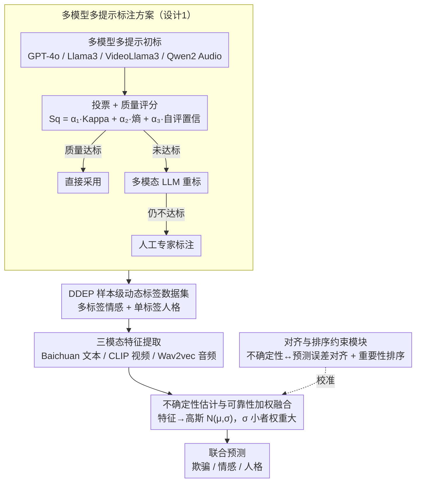

# Dynamic Emotion and Personality Profiling for Multimodal Deception Detection

**会议**: ACL 2026  
**arXiv**: [2604.17037](https://arxiv.org/abs/2604.17037)  
**代码**: 无  
**领域**: 多模态分析 / 情感计算  
**关键词**: 欺骗检测, 动态情感标注, 人格特征, 可靠性加权融合, 多模态

## 一句话总结
本文指出现有欺骗检测数据集仅提供受试者级别的情感/人格标签（同一人所有样本共用标签），提出样本级动态标注方案和可靠性加权多模态融合框架 Rel-DDEP，在欺骗检测 F1 上提升 2.53%，情感检测提升 2.66%，人格检测提升 9.30%。

## 研究背景与动机

**领域现状**：多模态欺骗检测利用文本、视频和音频信号识别欺骗行为。已有工作（如 MDPE 数据集）整合了人格和情感信息来辅助欺骗检测，但仅提供受试者级别（per-participant）的静态标签。

**现有痛点**：同一个人在不同情境下的情感和人格表现差异显著——说谎时可能表现出"假装高兴+害怕暴露"的混合情感，而敷衍时可能表现出"悲伤+厌恶"。受试者级标签将这些差异抹平，损失了对欺骗检测至关重要的情境信号。

**核心矛盾**：人格和情感是欺骗检测的关键线索，但现有标注粒度太粗（受试者级而非样本级），使得特征空间中欺骗/诚实样本边界模糊。

**本文目标**：构建样本级动态情感（多标签）+ 人格（单标签）标注数据集，设计自适应可靠性加权的多模态融合框架。

**切入角度**：通过可视化实验直观展示：受试者级标签仅能正确检测 32/200 个样本，样本级单标签情感提升到 85/200，样本级多标签情感+单标签人格达到 141/200。

**核心 idea**：样本级动态标注 + 不确定性驱动的可靠性加权融合。

## 方法详解

### 整体框架
分两部分：（1）数据标注：多模型多提示标注方案 → 投票+质量评分 → 高级重标注 → 人工标注 → 得到 DDEP 数据集；（2）模型：Rel-DDEP 框架 → 特征提取（Baichuan/CLIP/Wav2vec）→ 不确定性估计（映射到高斯分布）→ 可靠性加权融合 → 联合预测欺骗/情感/人格。

### 关键设计

**1. 多模型多提示标注方案：把"受试者一套标签"细化成每个样本一套可靠的动态标签**

数据端的死结是受试者级标签把同一人不同情境下的情感差异全抹平了，可单靠一个 LLM 重标又容易带进单一视角的偏差。本文的做法是让一批互补的模型同时上场——GPT-4o、Llama3、VideoLlama3、Qwen2 Audio 各管一个模态视角，而且每个模型还用多种提示（比如"从整体氛围判断情感"和"从具体行为判断情感"分别问一遍），先用投票得到初始标签。

光投票不够，关键是给每条标注算一个质量分 $S_q = \alpha_1 k + \alpha_2 u_i + \alpha_3 s_c$，把模型间一致性（Kappa 系数 $k$）、不确定性（熵 $u_i$）和自评置信度 $s_c$ 揉进一个分数，再据此做三级分流：质量过关的直接采用，未达标的交给多模态 LLM 重标，还不行才送人类专家。这样既靠多模型多提示压住偏差，又靠质量分把昂贵的人工只花在真正难的样本上，最终标注的 Kappa 达到 0.85。

**2. 不确定性估计与可靠性加权融合：让"更确定的模态"在融合时说话声更大**

多模态信号天生质量参差——音频可能有噪声、视频可能有遮挡，简单拼接或平均会让一个糊掉的模态拖累整体判断。框架因此不直接用模态特征，而是把每个模态的特征 $\mathbf{h}_m$ 映射成一个高维高斯分布 $N(\mu_m, \sigma_m)$，用方差 $\sigma_m$ 来量化这个模态此刻有多可信，均值 $\mu_m$ 和方差 $\sigma_m$ 都由 GRU 从模态特征里预测出来。

融合时方差小（更确定）的模态自动拿到更大的权重，于是同一段视频里清晰的语音可以盖过模糊的画面，反之亦然。相比固定权重或纯注意力融合，这种按不确定性动态调权的方式更贴合"哪个模态此刻更靠谱就更信哪个"的直觉。

**3. 对齐与排序约束模块：给不确定性估计上校准，免得"自信却错"的模态抢走权重**

可靠性加权全押在不确定性估计准不准上，而一个未校准的估计会反过来坏事——某个模态明明判断错了却显得很自信，就会骗到过高的融合权重。对齐模块负责把不确定性和真实预测误差绑在一起：预测误差大的样本，其不确定性也应该高，二者不匹配就惩罚。

排序约束模块则保证不确定性的相对大小能反映各模态在联合检测里的真实重要性顺序，而不只是绝对数值对得上。两者合起来把"信哪个模态"这件事从拍脑袋的权重变成有校准依据的决策。

### 损失函数 / 训练策略
三任务联合训练，使用加权交叉熵。不确定性校准通过对齐损失和排序约束损失实现。

## 实验关键数据

### 主实验

| 任务 | 数据集 | 模型 | 基线 F1 | Rel-DDEP F1 | 提升 |
|------|--------|------|--------|------------|------|
| 欺骗检测 | DDEP | CLB-HBB-Bai | 58.30% | 61.49% | +2.53% |
| 情感检测 | DDEP | - | - | - | +2.66% |
| 人格检测 | DDEP | - | - | - | +9.30% |

### 消融实验

| 配置 | 欺骗检测 | 说明 |
|------|---------|------|
| 受试者级标签 (MDPE) | ~50% | 特征空间中样本混杂 |
| 样本级标签 (DDEP) | ~58% | 特征可分性显著提升 |
| DDEP + Rel-DDEP | ~61% | 可靠性融合进一步提升 |

### 关键发现
- 从受试者级到样本级标注，欺骗检测准确率从 32/200 提升到 141/200（使用多标签情感+单标签人格），证明动态标注的必要性
- 可靠性加权融合一致优于简单拼接和平均融合
- 人格检测提升最大（+9.30%），因为受试者级标签完全忽略了情境变化
- Kappa 分数达到 0.85，标注质量有保证

## 亮点与洞察
- **样本级 vs 受试者级标注**的对比实验非常直观有说服力——可视化图清楚展示了标注粒度如何影响特征空间的可分性
- 多模型多提示的标注流程是一个可推广的数据标注方法论——特别适合主观性强的标注任务
- 不确定性驱动的模态融合思路可以应用到任何多模态任务中

## 局限与展望
- DDEP 数据集规模有限，泛化性需要更多实验验证
- LLM 标注情感/人格的准确性本身存疑——特别是通过文本推断视觉情感线索
- 可靠性估计使用 GRU 预测高斯参数，模型容易过度自信
- 三任务联合训练的任务间相互作用可能有负面影响

## 相关工作与启发
- **vs Cai et al. (2024) MDPE**: MDPE 仅提供受试者级标签，本文扩展到样本级动态标注并证明其必要性
- **vs DDPM**: 仅做欺骗检测单任务，本文做三任务联合检测
- **vs 标准多模态融合**: 简单拼接或注意力融合不考虑模态可靠性，本文的不确定性驱动融合更合理

## 评分
- 新颖性: ⭐⭐⭐⭐ 样本级动态标注+不确定性融合的组合有贡献
- 实验充分度: ⭐⭐⭐⭐ 两个数据集、多特征提取器组合、详细可视化分析
- 写作质量: ⭐⭐⭐ 结构合理但部分形式化（如 Theorem 1, 2）略显牵强

<!-- RELATED:START -->

## 相关论文

- [\[ACL 2025\] Hidden in Plain Sight: Evaluation of the Deception Detection Capabilities of LLMs in Multimodal Settings](../../ACL2025/multimodal_vlm/hidden_in_plain_sight_evaluation_of_the_deception_detection_capabilities_of_llms.md)
- [\[ACL 2026\] ErrorRadar: Benchmarking Complex Mathematical Reasoning of Multimodal Large Language Models Via Error Detection](errorradar_benchmarking_complex_mathematical_reasoning_of_multimodal_large_langu.md)
- [\[CVPR 2026\] EmoVerse: A MLLMs-Driven Emotion Representation Dataset for Interpretable Visual Emotion Analysis](../../CVPR2026/multimodal_vlm/emoverse_a_mllms-driven_emotion_representation_dataset_for_interpretable_visual_.md)
- [\[CVPR 2026\] Unbiased Dynamic Multimodal Fusion](../../CVPR2026/multimodal_vlm/unbiased_dynamic_multimodal_fusion.md)
- [\[ACL 2026\] Automatic Slide Updating with User-Defined Dynamic Templates and Natural Language Instructions](automatic_slide_updating_with_user-defined_dynamic_templates_and_natural_languag.md)

<!-- RELATED:END -->
