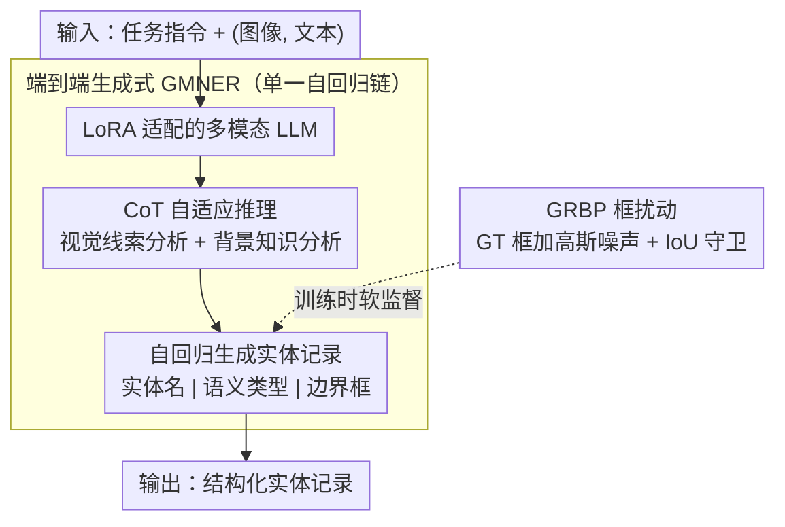

# E2E-GMNER: End-to-End Generative Grounded Multimodal Named Entity Recognition

**会议**: ACL 2026  
**arXiv**: [2604.17319](https://arxiv.org/abs/2604.17319)  
**代码**: [https://github.com/Finch-coder/E2E-GMNER](https://github.com/Finch-coder/E2E-GMNER)  
**领域**: 目标检测  
**关键词**: 多模态命名实体识别, 端到端生成, 视觉定位, 高斯扰动, CoT推理

## 一句话总结

提出E2E-GMNER，首个将实体识别、语义分类、视觉定位和隐式知识推理统一在单一多模态大语言模型中的端到端GMNER框架，通过CoT推理自适应判断视觉/知识线索的可用性，并引入高斯风险感知框扰动（GRBP）提升生成式框预测的鲁棒性。

## 研究背景与动机

**领域现状**：Grounded Multimodal Named Entity Recognition（GMNER）需要联合识别文本中的实体、预测语义类型，并将每个实体定位到图像中对应的视觉区域。现有方法如H-Index、TIGER、RiVEG等主要采用流水线架构。

**现有痛点**：（1）流水线架构将文本实体识别和视觉定位解耦为独立模块（如独立NER标注器、外部目标检测器），导致错误累积和无法联合优化；（2）现有方法通过隐式跨模态对齐解决文本-视觉歧义，但缺乏显式机制判断视觉证据或外部知识何时真正有用，导致噪声视觉线索反而降低性能；（3）生成式框预测中，单一硬目标监督对标注噪声和坐标离散化误差敏感。

**核心矛盾**：端到端统一 vs 各子任务的特异性需求——如何在单一模型中同时优化实体识别、语义分类和视觉定位三个本质不同的任务？

**本文目标**：设计首个端到端GMNER框架，消除流水线中的错误累积。

**切入角度**：将GMNER建模为指令微调的条件生成任务，利用多模态大语言模型的统一生成能力。

**核心 idea**：端到端生成+CoT自适应推理+高斯软监督，三者协同解决GMNER的三个核心问题。

## 方法详解

### 整体框架

给定图文对和任务指令，LoRA适配的多模态LLM先进行CoT推理（视觉线索分析+背景知识分析），然后自回归生成结构化实体记录（实体名|语义类型|边界框坐标），训练时用GRBP替代硬框监督。

### 关键设计

**1. 端到端生成式 GMNER：把识别和定位塞进同一个生成过程，掐断流水线的错误累积**

流水线架构把文本实体识别和视觉定位拆成独立模块——独立的 NER 标注器接一个外部目标检测器，前一级的错误会一路传到后一级，且各模块无法联合优化。本文索性把整个任务建模成一个条件生成问题：输入是 $[\text{指令}; (\text{图像}, \text{文本})]$，输出是 $[\text{推理序列} R; \{(e_i, c_i, b_i)\}]$，其中每条实体记录序列化成"实体名|类型|$[x_1,y_1,x_2,y_2]$"这样的字符串，所有记录拼接成最终预测。

整个过程用标准自回归 MLE 损失训练，识别和定位在同一条生成链上完成。好处是实体名、语义类型和边界框坐标之间能自由地相互参照——模型生成框时能看到它刚识别出的实体名，反过来也一样，这正是流水线里被切断的信息流。

**2. CoT 指令微调的自适应推理：让模型先想清楚"该不该信这条视觉/知识线索"再动手**

现有方法靠隐式跨模态对齐消歧，缺一个显式机制判断视觉证据或外部知识到底有没有用，结果一条带噪声的视觉线索反而把性能拖下去。这里的对策是在生成实体记录之前先输出一段推理序列 $R$，里面包含视觉线索分析（图里到底有没有跟文本实体对得上的视觉证据）和背景知识分析（要不要外部知识来消歧）。

训练时这段推理由更强的外部 LLM 通过 API 生成来当监督信号，但推理阶段模型完全自主产出 $R$、不再依赖任何外部模型。这等于给多模态融合加了一道"注意力门控"：模型在用一个信号前先评估它可不可靠，比无脑 cross-attention 更聪明，也让它在视觉线索有噪声时能主动忽略而非被带偏。

**3. 高斯风险感知框扰动（GRBP）：用软监督顶替硬框标签，容忍标注噪声和坐标离散化误差**

生成式框预测把坐标离散成 token 序列，一个微小的几何偏差就会算出不成比例的大训练损失，单一硬目标监督对标注噪声和离散化误差都很敏感。GRBP 的办法是训练时对 GT 框做概率性扰动：中心位置加高斯噪声 $\delta_x, \delta_y \sim \mathcal{N}(0, \beta^2)$，宽高各乘一个高斯缩放因子，把原来"一个点对一个标签"的硬监督换成高斯加权的软目标——扰动越大对应的概率越低。

为了不让扰动失控，还加了一道 IoU 守卫，要求扰动框与原始框的 $\text{IoU} \geq \tau$。这样既保持了经验风险最小化的方向，又给模型留出容忍小几何偏差的余地，本质上是把数据增强的思路从"增强输入"挪到了"增强标签"。

### 损失函数 / 训练策略

标准自回归MLE损失 $\mathcal{L} = -\sum_t \log p_\theta(y_t | y_{<t}, \text{Instruction}, I, T)$，其中框坐标在GRBP扰动后作为软目标参与训练。

## 实验关键数据

### 主实验

在Twitter-GMNER和Twitter-FMNERG基准上：

| 方法 | Twitter-GMNER (GMNER) | Twitter-GMNER (MNER) |
|------|----------------------|---------------------|
| GMDA (流水线) | 58.61 | - |
| GEM (流水线+MLLM) | 59.83 | 83.15 |
| **E2E-GMNER** | **竞争力最强** | **竞争力最强** |

### 消融实验

| 配置 | 效果 | 说明 |
|------|------|------|
| w/o CoT推理 | 下降 | 自适应视觉/知识利用重要 |
| w/o GRBP | 下降 | 框预测鲁棒性受损 |
| 硬框监督 vs GRBP软监督 | GRBP优 | 容忍标注噪声 |
| 端到端 vs 流水线 | 端到端优 | 消除错误累积 |

### 关键发现

- 端到端框架在GMNER主任务上达到高度竞争性能，验证了统一优化的有效性
- CoT推理使模型在视觉线索有噪声时主动忽略它们而非被误导，这对提升实体定位精度至关重要
- GRBP的IoU守卫机制确保扰动不会过大，平衡了软监督的灵活性和准确性
- 推理时完全不依赖外部模型，保持了高效的端到端推理

## 亮点与洞察

- 首个端到端GMNER框架的意义不仅在于性能提升，更在于证明了实体识别和视觉定位可以在统一生成框架中有效协同，而非必须分步处理。
- GRBP将数据增强的思想引入监督目标设计：不是增强输入数据，而是"增强"标签——通过概率性扰动GT框来产生软监督信号。这个思路可迁移到其他生成式定位任务。
- CoT推理作为一种"注意力门控"机制：让模型在使用视觉/知识信号前先评估其可靠性，是比简单的cross-attention更智能的多模态融合策略。

## 局限与展望

- 在某些特定类别上可能仍不如专门的流水线方法（特别是使用强大外部检测器的方法）
- CoT推理的训练依赖外部LLM（如GPT-4o）生成推理序列，引入了额外的数据准备成本
- GRBP的超参数（$\beta, \gamma, \tau$）需要调优，不同数据集可能需要不同设定
- 目前仅在Twitter图文对数据集上验证，其他领域（新闻、电商）的泛化性未知

## 相关工作与启发

- **vs RiVEG (Li et al., 2024)**: 用MLLM辅助但仍为流水线架构；E2E-GMNER实现真正端到端
- **vs MAKAR (Lin et al., 2025)**: 用MLLM多智能体系统解决语义歧义，但仍有流水线组件；E2E-GMNER更简洁
- **vs MQSPN (Tang et al., 2025)**: 用集合预测缓解曝光偏差，但未解决框预测的噪声敏感问题；E2E-GMNER的GRBP直接应对此挑战

## 评分
- 新颖性: ⭐⭐⭐⭐ 首个端到端GMNER+GRBP软监督创新
- 实验充分度: ⭐⭐⭐⭐ 两个基准+完整消融
- 写作质量: ⭐⭐⭐⭐ 问题定义清晰，方法描述详细
- 价值: ⭐⭐⭐⭐ 为多模态NER的端到端范式提供了有效示范

<!-- RELATED:START -->

## 相关论文

- [\[CVPR 2026\] MarkushGrapher-2: End-to-end Multimodal Recognition of Chemical Structures](../../CVPR2026/multimodal_vlm/markushgrapher-2_end-to-end_multimodal_recognition_of_chemical_structures.md)
- [\[AAAI 2026\] SpeakerLM: End-to-End Versatile Speaker Diarization and Recognition with Multimodal Large Language Models](../../AAAI2026/multimodal_vlm/speakerlm_end-to-end_versatile_speaker_diarization_and_recognition_with_multimod.md)
- [\[ICLR 2026\] WebDS: An End-to-End Benchmark for Web-based Data Science](../../ICLR2026/multimodal_vlm/webds_an_end-to-end_benchmark_for_web-based_data_science.md)
- [\[ACL 2026\] OMHBench: Benchmarking Balanced and Grounded Omni-Modal Multi-Hop Reasoning](omhbench_benchmarking_balanced_and_grounded_omni-modal_multi-hop_reasoning.md)
- [\[ACL 2026\] Towards Visually Grounded Multimodal Summarization via Cross-Modal Transformer and Gated Attention](towards_visually_grounded_multimodal_summarization_via_cross-modal_transformer_a.md)

<!-- RELATED:END -->
