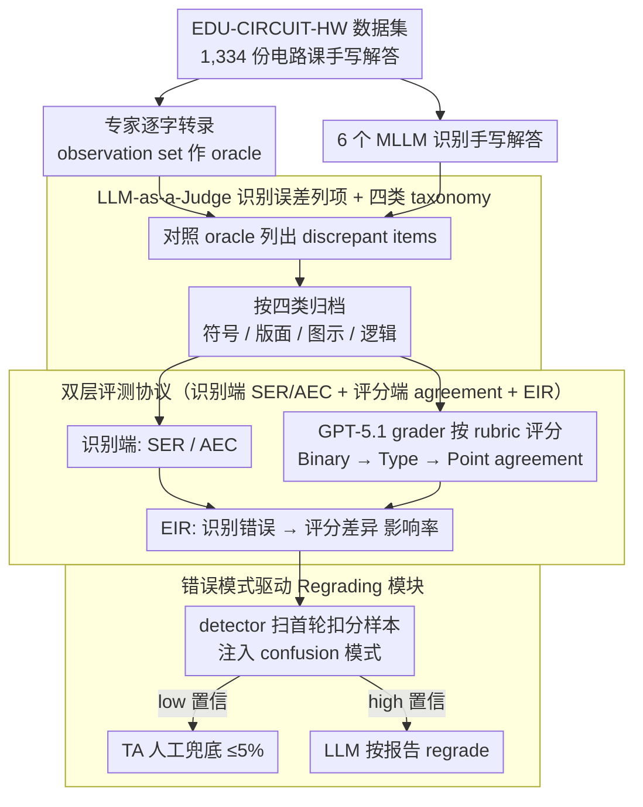

# EDU-CIRCUIT-HW: Evaluating Multimodal Large Language Models on Real-World University-Level STEM Student Handwritten Solutions

**会议**: ACL 2026  
**arXiv**: [2602.00095](https://arxiv.org/abs/2602.00095)  
**代码**: 项目站点 + GitHub（论文给出 Project Website / GitHub Repository 链接）  
**领域**: 多模态 VLM / 教育评测  
**关键词**: STEM 手写理解、MLLM 评测、auto-grading、识别误差传播、human-in-the-loop

## 一句话总结
作者发布 1,334 条真实大学电路课手写作业的 EDU-CIRCUIT-HW 数据集，并提出"upstream 识别 + downstream 评分"双层评测协议，发现即便最强 MLLM（GPT-5.1 / Gemini-3-Preview）也有 37–85% 样本含识别错误，但仅 7–20% 会传播到评分；通过 LLM-judge 错误模式 + 仅 3.3% 人工兜底的 regrading 模块，可把 point-agreement 从 70 %提升到 76 %。

## 研究背景与动机

**领域现状**：把 MLLM 用作"自动批改助教"已成 AI 教育的新风口：先让 Gemini/GPT/Claude 识别手写作业，再让 LLM 按 rubric 打分（Kortemeyer 2024、Liu 2024、Yang 2025 等）。但绝大多数评测要么用 K-12 简单数学（DrawEduMath），要么只评孤立公式（CROHME、MathWriting），无法反映大学 STEM 那种"公式 + 推导 + 手画电路图"交织的复杂手写文本。

**现有痛点**：作者点出两个根本问题——(1) **数据稀缺**：缺少"图文混杂 + 大学难度 + 真实学生书写"的 benchmark；(2) **评测范式错位**：现有工作只看下游（多为粗粒度 binary 自动评分），导致 rubric 外的识别错误被"屏蔽"，开发者会高估 MLLM 的视觉理解能力。例如图 1 中 ① ② 识别出错但因不在评分点而被掩盖。

**核心矛盾**：识别错误的"潜伏率"远高于"显化率"——一旦 rubric 收紧或要做电路→网表等下游任务，这些潜在错误就会爆雷；但传统的"只看 grading agreement"评测协议根本看不到它们。

**本文目标**：搭起"upstream 识别 fidelity + downstream grading"双指标体系，定量回答 (i) 识别错误有多少，(ii) 哪些类型最致命，(iii) 能否用错误模式做防御。

**切入角度**：分出 "observation set"（513 张专家逐字校核的解答，做训练/分析用）和 "test set"（821 张仅有 ground-truth 分数，做泛化部署模拟用）的双拆分；用 LLM-as-a-judge 把识别误差自动列项后再分类。

**核心 idea**：先用"专家逐字 transcription"作为 oracle 计算识别错误，再定义 Error Impact Rate (EIR) 把识别错误与评分错误一一对应，最后用"错误模式 → 低置信路由 → 人工兜底"的 regrading pipeline 把识别脆弱性变成可控成本。

## 方法详解

### 整体框架
整个 benchmark + 诊断链路如下：(1) **数据收集**：2025 春季某美国研究型大学本科电路课，29 名学生、62 道教材题，共 1,334 份手写解答，分别由专家给出 5 维 rubric 分数（E / M / U / C / NC）；observation set（11 学生、513 张）还额外提供专家逐字 markdown 转录与图示自然语言描述；test set（18 学生、821 张）只有 ground-truth 分数。(2) **识别评测**：6 个 MLLM（Gemini-3-Pro-Preview、Gemini-2.5-Pro、GPT-5.1、Claude-4.5-Sonnet、Qwen3-VL-Plus/8B-Thinking）做识别，Gemini-2.5-Pro 当 LLM-judge 对照 oracle 列出 discrepant items；再用另一个 LLM 把每个 item 按四类（Symbolic & Character / Structural & Notational / Diagrammatic / Textual & Logical）打标。(3) **下游评分**：固定 GPT-5.1 作 grader，给定 problem + reference + rubric，输出 5 类扣分；与专家报告比对得 Binary / Type / Point agreement。(4) **影响分析**：定义 EIR = 引起评分差异的识别错误 / 总识别错误。(5) **Regrading 案例**：把 observation set 总结的错误模式注入 prompt，让 LLM 在 test set 上检测潜在识别错误并给出 high/low 置信；低置信样本走人工，其余 LLM regrade。

### 关键设计

**1. 双层评测协议（SER / AEC + EIR + Binary/Type/Point Agreement）：把"识别"和"评分"两件被混在一起的能力拆开评，再量化错误怎么传播**

只看 auto-grading accuracy 这种 task-centric 指标，会让大量"沉默错误"逃逸——识别出错了但因为不在评分点上，下游分数看不出任何异常，开发者于是高估了 MLLM 的视觉理解力。本文把识别端和评分端分开度量：识别端用样本错误率 $\text{SER}=\frac{\#\{s: \text{errors}(s)>0\}}{|S|}$ 和平均错误数 $\text{AEC}=\frac{1}{|S|}\sum_s \#\text{errors}(s)$，评分端则用 Binary $\to$ Type $\to$ Point 三级递进的 agreement，越往后越严格、越能逼出细粒度错误。

真正把两端桥接起来的是错误影响率 $\text{EIR}=\frac{\text{识别错误中引起评分差异的数量}}{\text{识别错误总数}}$。有了它才能定量回答"识别差到什么程度才会真的伤到下游评分"——这恰恰是所有 vision→reasoning 流水线都缺的那把尺子，而不只是教育场景独有。

**2. LLM-as-a-Judge 识别误差自动列项 + 四类 taxonomy：让模型只做"对照检查"，把识别差异自动列项再归类**

逐条人工标注 MLLM 识别结果和专家转录之间的差异根本无法规模化。本文把 judge 任务拆成"列差异 + 分类"两步：把 oracle markdown 和待测 markdown 一起喂给 Gemini-2.5-Pro，要求它列出所有句/式级别的 discrepant items，语义等价的小写法差异（如 `KCL: out` ≡ `KCL: @ out`）算对齐不计错；随后再用一个 LLM 把每条差异按 Symbolic & Character（字符/操作符/单位）、Structural & Notational（公式版面/变量一致性）、Diagrammatic（电路拓扑/标注误读）、Textual & Logical（语境/推导步骤）四类归档。

关键在于全程有 oracle 兜底，judge 只做"照着标准答案挑差异"而非"开放打分"，自由度被压到最低，幻觉也随之被压住。在 186 份样本、5000+ items 的人工验证里，sample-level accuracy $\geq 0.95$、item-level F1 $\geq 0.90$，而这个四类 taxonomy 又正好为后面的 EIR 分类分析铺好了路。

**3. 错误模式驱动的 human-in-the-loop Regrading 模块：用统计出来的错误模式当风险特征扫一遍，把人工占比压到 ≤5%**

在高利害的教育评分里，完全自动化不可接受、完全人工又太贵。这个模块利用一个假设——识别错误的模式是可统计的、人工成本是可控的：先从 observation set 里抽出常见的 confusion 模式（如 $-V\to V$、$\frac{1/8}{1/8+1/16}\to \frac{8}{8+16}$、KCL 节点错连等）塞进 detector 的 prompt。

detector 只在那些首轮被扣分的样本上扫描可疑识别项并打 high/low 置信——因为识别错误主要造成 false-positive 扣分，首轮没扣分的样本直接放过。low 置信的交 TA 手批，high 置信的让 LLM 按 detector 报告 regrade。靠这套路由，人工占比被压到 ≤5%，却把 point-agreement 拉到逼近"专家亲自做 OCR"的天花板。

### 损失函数 / 训练策略
本工作没有模型训练，只是 **prompt-only 评测 + LLM-judge pipeline**。Grader 统一用 GPT-5.1；识别端覆盖 5 个商业模型 + 1 个开源 8B；regrading 中 detector / regrader / grader 也全部用 GPT-5.1 以排除模型异构干扰。LLM-judge 阈值上把"语义等价"判定交给同一模型并保留人工反向核查。

## 实验关键数据

### 主实验
observation set 上六个 MLLM 的识别质量与对下游 5 维 rubric 评分的影响（GPT-5.1 当 grader；Graduate 行为助教 baseline；Human Expert 行表示用专家转录当输入的 oracle grader）：

| 识别器 | SER ↓ | AEC ↓ | Binary ↑ | Type ↑ | Point ↑ | EIR ↓ |
|--------|-------|-------|----------|--------|---------|-------|
| Graduate（人工） | – | – | 83.63 | 82.46 | 81.29 | – |
| Human Expert（oracle） | – | – | **89.47** | 78.36 | 74.46 | – |
| Gemini-3-Preview | **37.62** | **0.61** | 87.91 | **78.17** | **74.27** | **7.60** |
| Gemini-2.5-Pro | 53.52 | 1.23 | 85.58 | 73.68 | 69.40 | 14.72 |
| Qwen3-VL-Plus | 61.72 | 1.38 | 80.90 | 68.62 | 65.11 | 16.67 |
| GPT-5.1 | 71.54 | 2.05 | 77.78 | 65.50 | 61.99 | 17.89 |
| Claude-4.5-Sonnet | 80.70 | 2.76 | 77.58 | 63.16 | 59.84 | 18.05 |
| Qwen3-VL-8B-Thinking | 85.43 | 2.79 | 75.05 | 61.01 | 56.92 | 19.60 |

要点：(1) 即便最强 Gemini-3-Preview 也有 37.6% 样本含识别错误，但 EIR 仅 7.6%，说明下游评分掩盖了大量识别错误；(2) 从 Gemini-3-Preview 到 Qwen3-VL-8B-Thinking，rubric 越严，性能差距越大（Binary 差 12.86%，Point 差 17.35%）——证实"rubric 收紧 → 识别错误显化"的核心论点；(3) MLLM 在 Binary 上能超过 graduate 助教，但在 Type / Point 上仍落后，说明 LLM 偏宽松，人类更精细。

### 消融实验 / Regrading 模块对比
test set 上分别用 vanilla pipeline 与 regrading 模块对比（agreement 越高越好；LLM/Human 列为 regrading 占比）：

| Workflow | Visual Recognizer | Binary | Type | Point | LLM regrade | Human regrade |
|----------|-------------------|--------|------|-------|-------------|---------------|
| Vanilla | Gemini-2.5-Pro | 85.02 | 74.91 | 69.91 | – | – |
| Vanilla | GPT-5.1 | 82.34 | 72.23 | 66.87 | – | – |
| **+ Regrading** | Gemini-2.5-Pro | **86.48** | **77.34** | **74.42** | 20.6% | 3.3% |
| **+ Regrading** | GPT-5.1 | **86.60** | **78.93** | **75.76** | 25.1% | 4.4% |

要点：在 ≤5% 人工兜底下，Point agreement 从 ~70% 提升到 76%，接近"专家做识别"的上限 74.46%（甚至略超，是因为 detector 帮 grader 主动避坑）。

### 关键发现
- **识别错误最常见的是 Symbolic & Character**，但其 EIR 也最高（≈20%），因为 grader 高度依赖符号匹配；Diagrammatic 与 Textual & Logical 错误虽然认知层级更高，但当前 rubric 几乎不 cover，EIR 反而 <10%——这是 auto-grading 一种"幸存者偏差"。
- **越细 rubric 越能区分模型**：Binary→Type→Point 三档下，模型间差距从 ~13% 拉大到 ~17%，说明今后 AI 教育评测必须用 Point 级 rubric 才有诊断价值。
- **小模型在 diagram 上反而不差**：Qwen3-VL-8B-Thinking 在 Diagrammatic 错误数 98 反优于 Gemini-2.5-Pro 的 103，反映了商业模型主要赢在文字推理而非图形理解。
- **Regrading 不靠强 MLLM 也能提升**：即便 Gemini-2.5-Pro 作识别器，单靠 detector + 3.3% 人工就把 Point 提升 +4.5%，证明"识别错误模式 + 人机协作"的 ROI 极高。

## 亮点与洞察
- **真正在'高利害'场景跑通的双层评测**：先前手写理解评测多停在 OCR 数字上，本文把"识别 fidelity"重新定位为下游可靠性的瓶颈，并用 EIR 量化"沉默错误"，这种"先解耦、再桥接"的评测哲学可以照搬到任何 perception→reasoning 流水线（医学影像→诊断、文档→合规判断等）。
- **Observation/Test 双切分的数据设计**：把"专家逐字校核"的成本压在 ~40% 数据上做诊断与模式学习，剩余 60% 数据靠分数 oracle 评测部署效果，是一种成本 / 信息密度平衡得很好的 benchmark 构造范式。
- **LLM-as-a-Judge "列差异"模式**：作者把 judge 任务定义为"差异点列举 + 分类"而非"打分"，从源头限制了 LLM 的自由度，使 F1 稳定在 0.9 以上——这一点对所有想用 LLM 做大规模标注的工作都有借鉴价值。
- **错误模式 → 路由 → 兜底的三段式 deployment 框架**：把"识别可靠性"问题转化为"可控人工比例"问题，给真正想部署 AI 批改的学校一份直接可抄的工程蓝图。

## 局限与展望
- 数据集只覆盖电路分析一门课，diagram 形态偏电路；几何 / 化学结构 / 流程图等仍未覆盖，因此结论对其他 STEM 学科推广需谨慎。
- 下游任务仅做 auto-grading；VQA、circuit-to-netlist、tutoring 等不同任务对识别错误的敏感度可能完全不同，EIR 数值也会变化。
- rubric 与 ground-truth 由少量博士专家给出，开放式 STEM 评分本身具有一定主观性，可能存在系统性偏差。
- Regrading 的 detector / regrader / grader 都用 GPT-5.1，可能存在"同一模型既出题又当裁判"的隐性循环，需在未来用异构模型验证。
- 未来可扩展到多学科、多下游任务，并加入"错误模式持续学习"模块，让 detector 随新错误进化。

## 相关工作与启发
- **vs DrawEduMath (Baral 2025)**：他们做 K-12 数学手画图 VQA；本工作把场景升到大学 STEM、解答远更复杂，并明确提供 Point-level rubric。
- **vs CROHME / MathWriting**：只评孤立公式 OCR；本文评的是"公式 + 推导 + 图示"交织文本，覆盖识别失败的"长尾"。
- **vs Pensieve Grader (Yang 2025)、GPT-4 grading (Liu 2024)**：他们做端到端评分；本文额外把识别层单独评测、并提供 EIR 解释下游误差来源，方法论更完备。
- **vs HTR Correction (Pavlopoulos 2023、Chen 2023)**：他们做事后纠错；本文用"识别错误模式"做事前过滤 + 路由，工程上更轻、且天然适配 LLM-only 部署。
- **启发**：任何"视觉感知 → 高阶推理"任务都可以照搬 SER/AEC/EIR + observation/test 双切分 + LLM-judge 列差异 + 错误模式路由这一整套；尤其在医学影像、法律 OCR、自动化合规审计等高利害场景里几乎可以即插即用。

## 评分
- 新颖性: ⭐⭐⭐⭐ 双层评测协议 + EIR + 错误模式路由的组合是新的；单项技术不算特别炫，但合起来切中真痛点。
- 实验充分度: ⭐⭐⭐⭐⭐ 6 个 MLLM × 4 类错误 × 3 档 rubric + 真实部署 case study，覆盖很全面。
- 写作质量: ⭐⭐⭐⭐ 论点—证据—对策三段推进清晰，图 1 + 表 5 + 表 6 是论文骨架；少量段落偏冗长。
- 价值: ⭐⭐⭐⭐⭐ 直接对应 AI 教育"批改可靠性"工业痛点，并提供可落地工程方案。

<!-- RELATED:START -->

## 相关论文

- [\[ACL 2026\] GeoArena: Evaluating Open-World Geographic Reasoning in Large Vision-Language Models](geoarena_evaluating_open-world_geographic_reasoning_in_large_vision-language_mod.md)
- [\[ACL 2026\] GuideDog: A Real-World Egocentric Multimodal Dataset for Blind and Low-Vision Accessibility-Aware Guidance](guidedog_a_real-world_egocentric_multimodal_dataset_for_blind_and_low-vision_acc.md)
- [\[ACL 2026\] OMIBench: Benchmarking Olympiad-Level Multi-Image Reasoning in Large Vision-Language Models](omibench_benchmarking_olympiad-level_multi-image_reasoning_in_large_vision-langu.md)
- [\[ICLR 2026\] Can Vision-Language Models Answer Face to Face Questions in the Real-World?](../../ICLR2026/multimodal_vlm/can_vision-language_models_answer_face_to_face_questions_in_the_real-world.md)
- [\[ICML 2026\] TimeSpot: Benchmarking Geo-Temporal Understanding in Vision-Language Models in Real-World Settings](../../ICML2026/multimodal_vlm/timespot_benchmarking_geo-temporal_understanding_in_vision-language_models_in_re.md)

<!-- RELATED:END -->
