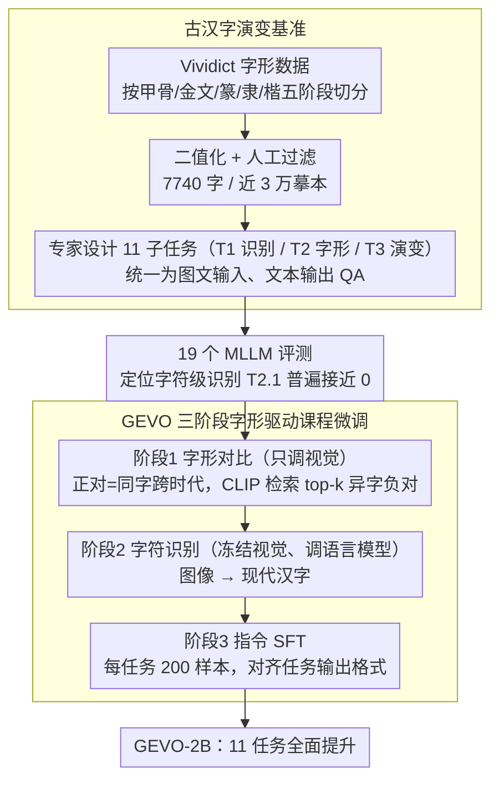

# Enhancing Multimodal Large Language Models for Ancient Chinese Character Evolution Analysis via Glyph-Driven Fine-Tuning

**会议**: ACL 2026  
**arXiv**: [2604.11299](https://arxiv.org/abs/2604.11299)  
**代码**: [https://github.com/songruiecho/GEVO](https://github.com/songruiecho/GEVO)  
**领域**: 多模态VLM / 数字人文  
**关键词**: 古文字演变、多模态大模型、字形对比微调、甲骨文、课程学习

## 一句话总结
本文构建了一个包含11个任务、13万+实例的古汉字演变分析基准，评估了19个MLLM后发现现有模型在字形级识别和演变推理上能力有限，并提出字形驱动对比微调框架GEVO，在2B模型上实现全任务提升。

## 研究背景与动机

**领域现状**：随着MLLM的快速发展，越来越多的研究开始利用其分析古文字（如甲骨文、金文），从字符识别到文物解读都展现了潜力。古文字的演变分析（从甲骨文到楷书）是理解文化变迁和历史传承的基础路径。

**现有痛点**：(1) 缺乏系统性评估MLLM在古文字演变分析能力的基准；(2) 现有MLLM在字体风格跨时代识别和古文字识别上表现不佳；(3) 虽然有研究探索古文字，但如何系统提升MLLM在演变分析任务上的能力仍是开放问题。

**核心矛盾**：古文字演变涉及微妙的字形差异和跨时代的结构变化，现有MLLM主要在现代数据上训练，缺乏对古文字字形特征的理解。但少量微调就能显著提升时代归属能力，说明MLLM有潜力但需要针对性引导。

**本文目标**：(1) 构建全面的古汉字演变分析基准；(2) 系统评估现有MLLM的能力边界；(3) 提出有效的微调方法来提升演变分析能力。

**切入角度**：观察到MLLM在少量微调后可以显著提升时代归属能力，这启发了设计基于字形对比的微调方法——让模型学会区分字形变化中由时代和字符差异引起的微妙区别。

**核心 idea**：使用课程学习思想，构建正负字形对，通过对比学习引导模型捕获演变一致性中的字形变换规律。

## 方法详解

### 整体框架
GEVO 的工作分两块：先构建一个覆盖完整演变链的评测基准，再用一套三阶段的字形驱动微调把一个 2B 小模型练到全任务领先。基准侧从字形资源 Vividict 按甲骨文 → 金文 → 篆书 → 隶书 → 楷书五个阶段抽取摹本，二值化、人工过滤后得到 7740 个汉字、近 3 万张摹本图像，再请古文字专家把评测抽象成三大类共 11 个子任务（T1 基础识别 / T2 字形理解 / T3 演变分析），统一成图文输入、文本输出的 QA。在该基准上评测 19 个 MLLM 后，作者发现字符级识别（T2.1）几乎是所有模型的共同盲区，于是沿课程学习思想设计了三阶段微调：先用字形对比只调视觉模块、再调语言模型补回图像到现代汉字的识别、最后用任务指令做轻量 SFT。

### 关键设计

**1. 古汉字演变基准：把零散的甲骨文研究升级成覆盖完整演变链的 11 任务评测 + 19 模型能力地图**

现有古文字基准大多只盯着甲骨文这一个阶段、或只做单一任务，根本量不出 MLLM 在"演变分析"上到底缺哪块能力。本文按字形发展把汉字切成甲骨文、金文、篆书、隶书、楷书五个阶段，收集 7740 个有完整演变记录的汉字、近 3 万张摹本图像，再在领域专家协助下设计三大类共 11 个子任务：T1 基础识别（字体风格识别、时代判断）、T2 字形理解（图像级字符识别、结构分析）、T3 演变分析（跨时代对比、演变路径推理），全部统一成图文混合输入、文本输出的 QA（按 9:1 切分训练/测试），并用 ChatGPT 生成候选指令、再经专家与多个 MLLM 反复校验确保指令有效。

这种多维度切分的价值在于把评估摊到 11 个粒度上——有的考视觉理解、有的考知识推理、有的考跨时代关联，单一准确率说不清模型到底是"看不清字"还是"推不出演变"。正因如此，对 1B–72B 共 19 个 MLLM（含 GPT5-mini、Gemini-3-Flash 等闭源模型）的评测才能得出细颗粒结论：字符级识别（T2.1）是几乎所有模型的共同盲区、开源模型常反超闭源大模型（后者在非标准任务上常拒答），从而精确定位每个模型的短板，也为下一步微调指明了方向。

**2. GEVO 三阶段字形驱动课程微调：先对齐字形、再补识别、最后跟指令**

古文字演变的字形差异往往只在笔画级别，直接做识别 SFT 模型很容易学到表面纹理、甚至在样本不足时灾难性遗忘已有的识别能力（预实验里 200 样本/任务的朴素 SFT 平均涨 30%，却在 T2.1、T3.1 上掉点）。GEVO 的破局点是按课程学习把微调拆成由易到难的三个阶段：

- **阶段 1 · 字形对比（只调视觉）**：把同一字符在不同时代的摹本当作正样本集 $\mathcal{P}$，再用 CLIP 检索与之视觉最相似、但属于**不同字符**的 top-$k$ 摹本当负样本集 $\mathcal{N}$（例如"日"和"目"的某些写法极像，必须被推开），只更新视觉编码器与跨模态投影模块，把表示学得"对字形敏感、对语义一致"。
- **阶段 2 · 字符识别（冻结视觉、调语言模型）**：给定任意时代的字形图像，让模型预测对应的现代汉字，专门补回阶段 1 不碰的图文映射与识别能力。
- **阶段 3 · 指令 SFT**：用每任务仅 200 条的任务指令数据轻量微调语言模型，把前两阶段习得的字形与识别能力对齐到 11 个评测任务的输出格式。

消融印证了这套顺序缺一不可：只做到阶段 1（跳过识别）会在 T2.1/T3.1 崩到 10% 以下，只做阶段 2（去掉字形对比）则字形比较任务全面塌掉——只有三阶段合起来才让 GEVO 在字形辨别与字符识别之间取得平衡，11 个任务全部提升、平均分达 83.54。

### 损失函数 / 训练策略
阶段 1 的对比损失见式 (1)：$\mathcal{L}_{con}=-\frac{1}{|\mathcal{P}|}\sum_{I_i\in\mathcal{P}}\log\frac{\mathcal{S}_i^+}{\mathcal{S}_i^++\mathcal{S}_i^-}$，其中正项 $\mathcal{S}_i^+$ 聚合同字正样本对的余弦相似度、负项 $\mathcal{S}_i^-$ 聚合 CLIP 检索的异字负样本，温度 $\tau$ 缩放。阶段 2、3 用标准交叉熵分别做字符识别与指令 SFT。这里的课程学习体现在三阶段由易（字形对比）到难（任务指令）的递进，而非对单批样本排序。全程在 2B 规模（Qwen3-VL-2B）上微调。

## 实验关键数据

### 主实验（19个MLLM评估）

| 模型 | 平均分 | 字体识别(T1) | 字符识别(T2) | 演变分析(T3) |
|------|--------|------------|------------|------------|
| GPT-5-mini | 24.88 | 低 | 极低(0.07) | 低 |
| Gemini-3-Flash | 27.89 | 低 | 极低 | 低 |
| Qwen2.5-VL-7B | **47.65** | 中等 | 23.51 | 中等 |
| Qwen2.5-VL-72B | 46.30+ | 中等 | 24.45 | 中等 |
| GEVO-2B | 全面提升 | 显著提升 | 显著提升 | 显著提升 |

### 消融实验

| 配置 | 效果 | 说明 |
|------|------|------|
| GEVO完整 | 全11个任务提升 | 对比+课程学习 |
| w/o 课程学习 | 部分提升减弱 | 简单到难的顺序有帮助 |
| w/o 对比学习 | 提升有限 | 仅识别训练不够 |
| 仅识别微调 | 时代归属提升但推理弱 | 验证了对比学习的必要性 |

### 关键发现
- 所有现有MLLM（包括GPT-5-mini）在古文字演变分析上表现很差，平均分不超过50
- 字符级识别（T2.1）是所有模型的最大瓶颈——几乎都接近0%
- 意外发现：少量微调就能显著提升时代归属能力，但推理任务需要对比学习支持
- GEVO在2B模型上实现了全部11个任务的一致性提升
- 开源7B模型（如Qwen2.5-VL-7B）反而优于闭源大模型，可能因为后者的安全限制影响了非标准任务

## 亮点与洞察
- **基准的文化价值**：覆盖甲骨文到楷书完整演变链的AI评估基准本身就是一个重要的数字人文贡献，可以推动计算古文字学的发展。
- **对比学习捕获演变一致性**：利用同一字符在不同时代的变体作为正对来学习演变规律，这个思路可以推广到任何需要跨时间/风格理解的视觉任务。
- **小模型的潜力**：2B模型经过针对性微调就能在所有任务上提升，说明领域知识的注入比模型大小更重要。

## 局限与展望
- 数据集只覆盖了约7740个有演变记录的字符，许多字符的演变路径不完整
- 2B模型的绝对性能仍然有限，需要在更大模型上验证
- 基准主要基于摹本图像（非实际文物照片），可能与真实古文字识别场景有差距
- 未探索将演变知识用于辅助未解读字符的解读

## 相关工作与启发
- **vs TongGu-VL**：专为古文字设计的VLM，但仅2B规模且演变分析能力弱。GEVO通过微调策略更有效
- **vs 传统古文字OCR**：基于CNN的专用识别模型，缺乏推理和关联能力。MLLM具备这些潜力但需要引导
- **vs 通用VLM微调**：标准SFT可以提升识别但不足以支持演变推理。对比学习提供了额外的结构性学习信号

## 评分
- 新颖性: ⭐⭐⭐⭐ 首个系统性的古文字演变MLLM基准，字形对比微调思路新颖
- 实验充分度: ⭐⭐⭐⭐⭐ 19个模型的全面评估、11个子任务、充分的消融
- 写作质量: ⭐⭐⭐⭐ 基准构建流程清晰，评估结果分析深入
- 价值: ⭐⭐⭐⭐ 对数字人文和古文字研究有独特贡献

<!-- RELATED:START -->

## 相关论文

- [\[CVPR 2026\] CoVFT: Context-aware Visual Fine-tuning for Multimodal Large Language Models](../../CVPR2026/multimodal_vlm/covft_context-aware_visual_fine-tuning_for_multimodal_large_language_models.md)
- [\[ACL 2026\] DRIFT: Transferring Reasoning Priors for Efficient MLLM Fine-Tuning](drift_transferring_reasoning_priors_for_efficient_mllm_fine-tuning.md)
- [\[CVPR 2026\] EmoVerse: A MLLMs-Driven Emotion Representation Dataset for Interpretable Visual Emotion Analysis](../../CVPR2026/multimodal_vlm/emoverse_a_mllms-driven_emotion_representation_dataset_for_interpretable_visual_.md)
- [\[ACL 2026\] Thinking Like a Botanist: Challenging Multimodal Language Models with Intent-Driven Chain-of-Inquiry](thinking_like_a_botanist_challenging_multimodal_language_models_with_intent-driv.md)
- [\[ACL 2026\] Position: Multimodal Large Language Models Can Significantly Advance Scientific Reasoning](position_multimodal_large_language_models_can_significantly_advance_scientific_r.md)

<!-- RELATED:END -->
