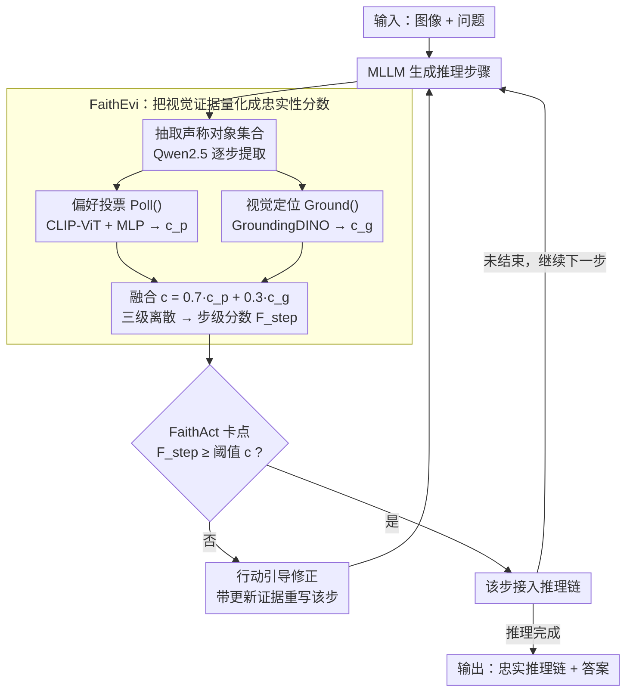

# Faithful-First Reasoning, Planning, and Acting for Multimodal LLMs

**会议**: ACL 2026  
**arXiv**: [2511.08409](https://arxiv.org/abs/2511.08409)  
**代码**: [GitHub](https://github.com/lijunxian111/Faithful-First-RPA)  
**领域**: 多模态 VLM / 推理忠实性  
**关键词**: 感知忠实性, 推理规划与执行, 多模态幻觉, 视觉证据验证, 逐步推理

## 一句话总结

本文提出 Faithful-First RPA 框架，通过 FaithEvi 管线在每一步推理中评估感知忠实性（claimed objects 是否在图像中真实存在），以及 FaithAct 机制在推理生成过程中强制执行基于证据的规划和行动，在不降低任务准确率的前提下将感知忠实性提升最高 24%。

## 研究背景与动机

**领域现状**：多模态大语言模型（MLLMs）在 VQA、视觉推理等任务上取得了显著进展，但其推理轨迹经常出现"不忠实"现象——生成的解释与视觉证据不符，或事后合理化其预测结果。

**现有痛点**：(1) 现有工作主要关注行为忠实性（推理链是否反映模型的决策过程），忽略了感知忠实性（推理步骤是否基于可验证的视觉输入）；(2) CoT 和 ReAct 等推理框架不验证中间步骤的感知基础；(3) 模型可能在答案正确的同时依赖错误的视觉描述（如将黑色自行车描述为黄色）。

**核心矛盾**：现有推理框架采用"先生成后验证"的范式，当推理链已经生成完毕才发现感知错误，修正成本高且效果有限。忠实性应该是设计原则而非事后评估指标。

**本文目标**：建立一个统一框架，既能量化评估推理链的感知忠实性，又能在推理过程中主动强制执行证据验证。

**切入角度**：基于"感知忠实的模型只推理视觉上可观察到的内容"这一原则，将推理过程形式化为忠实性约束的规划问题。

**核心 idea**：在推理的每一步，先提取声称的对象、通过偏好投票和视觉定位验证其存在性、计算忠实性分数，不满足阈值的步骤必须修正后才能进入推理链。

## 方法详解

### 整体框架

Faithful-First RPA 想解决的是：MLLM 推理链里那些"看似有理、实则没有视觉证据"的步骤（比如把黑色自行车说成黄色），现有 CoT/ReAct 都是先把整条链写完再回头查，错误早已传播。它的做法是把验证拼进生成循环里——输入图像和问题后，MLLM 每生成一步，先交给 FaithEvi 评估这一步声称的对象是否真在图里、给出忠实性分数；分数不达标就由 FaithAct 把这一步连同更新后的证据打回 MLLM 重写，达标了才接进推理链、再继续下一步。两个组件一个负责"量"（FaithEvi 评分），一个负责"管"（FaithAct 卡点修正）。

### 关键设计

**1. FaithEvi：把"这一步有没有视觉证据"量化成一个可比的分数**

推理链不忠实的根源是没人逐步核对"声称看到的东西到底在不在图里"，FaithEvi 就用三阶段把这件事算出来。第一阶段先用 Qwen2.5-7B-Instruct 从每个推理步骤里抽出它声称存在的对象集合 $O_t = \{O_t^1, \dots, O_t^{m_t}\}$；第二阶段对每个对象做两路独立验证——一路用冻结的 CLIP-ViT-Large 编码图像与对象文本，过一个在 POPE 上训练的两层 MLP 预测存在概率 $c_p$（偏好投票），另一路用冻结的 GroundingDINO 去图里定位该对象、拿到检测置信度 $c_g$。第三阶段把两路融合成 $c_t^i = 0.7 \cdot c_p + 0.3 \cdot c_g$，再压成三级离散分数（$<0.4\to0$，$0.4\text{-}0.6\to c_t^i$，$>0.6\to1$），逐级聚合出步级分数 $F_{\text{step},t} = \frac{1}{m_t}\sum f_t^i$ 和链级分数 $F_{\text{chain}} = \frac{1}{n}\sum F_{\text{step},t}$。两路之所以都要，是因为弱视觉线索下检测器置信度并不可靠，偏好投票补的是全局存在性判断，定位补的是区域级空间证据，互为兜底。

**2. FaithAct：把推理重新表述成"带忠实性约束的规划"，边生成边卡点**

FaithEvi 只给分还不够，得有人拿这个分去拦住坏步骤。FaithAct 把整个推理形式化为带约束的规划目标

$$S^* = \arg\max F_{\text{step}}(s_t) \quad \text{s.t.} \quad \forall t,\; F_{\text{step}}(s_t) \geq c,$$

每生成一步就立刻送进 FaithEvi 验证，低于阈值 $c$ 的步骤会连同更新后的证据（对象存在性标签、边界框、计数）打回 MLLM 重新生成。为支撑这套循环，它暴露了一组可扩展的函数接口：`Poll()` 给存在性概率、`Ground()` 做边界框检测、`Select()` 确认存在、`Abstain()` 确认不存在、`Count()` 做计数推理。和"生成完再验证"最大的区别在于它把纠错点提前到了每一步，感知错误在传播开之前就被截住。

**3. 行动引导的推理修正：不丢弃坏步骤，而是带着证据让它重写**

卡住一步之后怎么处理也有讲究——直接删掉会破坏逻辑链的连贯性。这里的做法是把未通过的步骤连同更新后的视觉证据塞回模型，用修正 prompt 引导它在保持逻辑连续的前提下只改感知描述。这个修正在推理链后期收益尤其明显，和"过长 CoT 在后期更容易被噪声带偏"的已有观察一致——越靠后的步骤越需要证据兜底。

### 损失函数 / 训练策略

本文为推理时框架，不涉及模型训练。偏好投票头在 POPE 数据集上训练（两层 MLP），GroundingDINO 和 CLIP 均冻结使用。GroundingDINO 的 box threshold=0.35，text threshold=0.25。

## 实验关键数据

### 主实验

**感知忠实性评估（$F_{\text{chain}}$, %）**

| 模型 + 方法 | LLaVA-bench | RealWorldQA | POPE | MMHal | 平均 |
|------------|-------------|-------------|------|-------|------|
| Qwen + CoT | 46.05 | 48.11 | 45.21 | 53.34 | 48.18 |
| Qwen + ReAct | 54.82 | 56.82 | 45.02 | 33.76 | 47.61 |
| **Qwen + FaithAct** | **55.10** | **57.22** | **56.87** | **66.45** | **58.91** |
| InternVL + CoT | 45.63 | 44.23 | 43.25 | 53.17 | 46.57 |
| **InternVL + FaithAct** | **52.64** | **57.35** | **56.01** | **61.71** | **56.93** |
| LLaVA + CoT | 47.56 | 52.31 | 52.28 | 30.63 | 45.70 |
| **LLaVA + FaithAct** | **52.82** | **58.11** | **56.09** | **39.91** | **51.73** |

**任务准确率保持**

| 模型 | 方法 | RealWorldQA(%) | MMHal(rating) |
|------|------|---------------|---------------|
| Qwen | CoT | 70.1 | 3.40 |
| Qwen | FaithAct | **74.5** | **3.48** |
| InternVL | CoT | 70.8 | 3.61 |
| InternVL | FaithAct | 71.2 | 3.58 |

### 消融实验

**核心组件消融（Qwen, RealWorldQA / MMHal）**

| 配置 | RealWorldQA(%) | MMHal(%) |
|------|---------------|----------|
| FaithAct (完整) | 57.22 | 66.45 |
| w/o Poll() | 54.24 (-3.0) | 63.25 (-3.2) |
| w/o Ground() | 53.16 (-4.1) | 62.47 (-4.0) |

### 关键发现

- FaithAct 平均感知忠实性达 55.86%，比最强基线 ReAct (48.10%) 提升 7.76 个百分点
- 在幻觉敏感基准 MMHal 上提升最大：比 CoT 平均提升 21.99%，比工具增强方法平均提升 9.81%
- 忠实性提升不损害任务准确率——Qwen 在 RealWorldQA 上甚至从 70.1% 提升到 74.5%
- Ground() 的贡献略大于 Poll()，说明空间定位提供了更关键的视觉证据
- 替换 GroundingDINO 为 SAM3 导致性能下降约 5%，说明框架需要定位专用模型
- FaithAct 的收益在推理链后期步骤更显著，验证了后期步骤更易产生幻觉的假设
- 人工验证 LLM 对象提取精度达 99.42%（7550 个对象级标签），片段有效性 0.968
- 推理时间增加约 2-3 倍（FaithAct 14-19秒 vs CoT 3-11秒）

## 亮点与洞察

- "忠实性应是设计原则而非事后指标"的理念很有说服力——将忠实性约束嵌入推理循环，使得每一步都有证据支撑
- 感知忠实性 vs 行为忠实性的区分具有理论价值——模型可以"答对但理由错"（行为忠实但感知不忠实），也可以"理由对但答错"（感知忠实但行为不忠实）
- 可扩展的函数接口设计（Poll/Ground/Select/Abstain/Count）使得框架易于扩展到属性和关系验证

## 局限与展望

- 目前仅在对象存在性层面验证忠实性，未涉及属性（颜色、大小）和关系（空间关系、动作）级别
- 推理时间增加约 2-3 倍
- 未直接评估行为忠实性，仅假设感知忠实会促进行为一致
- 在感知需求较弱的基准（MathVista）上优势不明显

## 相关工作与启发

- **vs Grounded-CoT (Wu et al., 2025)**: 后者在推理后附加定位信息，本文在推理过程中实时验证——FaithAct 在 11/12 个设置中优于 Grounded-CoT
- **vs ReAct (Yao et al., 2022)**: ReAct 允许调用工具但不强制忠实性约束，本文证明 $F_{\text{chain}}$ of ReAct 理论上被 FaithAct 上界限定
- **vs VAT (Liu et al., 2025)**: 视觉抽象思维在 POPE 上严重退化（21.46%），说明抽象化可能加剧感知脱节

## 评分

- 新颖性: ⭐⭐⭐⭐ 感知忠实性的形式化定义和"边验证边生成"范式有新意
- 实验充分度: ⭐⭐⭐⭐ 3 个模型、4 个基准、完整消融和人工验证
- 写作质量: ⭐⭐⭐⭐ 感知/行为忠实性区分清晰，框架设计逻辑严谨
- 价值: ⭐⭐⭐⭐ 为多模态推理的可信度提供了实用框架，函数接口可扩展

<!-- RELATED:START -->

## 相关论文

- [\[ACL 2026\] Tree-of-Evidence: Efficient "System 2" Search for Faithful Multimodal Grounding](tree-of-evidence_efficient_34system_234_search_for_faithful_multimodal_grounding.md)
- [\[ACL 2026\] ShredBench: Evaluating the Semantic Reasoning Capabilities of Multimodal LLMs in Document Reconstruction](shredbench_evaluating_the_semantic_reasoning_capabilities_of_multimodal_llms_in_.md)
- [\[ICLR 2026\] Evaluating VLMs' Spatial Reasoning Over Robot Motion: A Step Towards Robot Planning with Motion Preferences](../../ICLR2026/multimodal_vlm/evaluating_vlms_spatial_reasoning_over_robot_motion_a_step_towards_robot_plannin.md)
- [\[ACL 2026\] A Survey of Multimodal Mathematical Reasoning: From Perception, Alignment to Reasoning](a_survey_of_multimodal_mathematical_reasoning_from_perception_alignment_to_reaso.md)
- [\[NeurIPS 2025\] To See or To Read: User Behavior Reasoning in Multimodal LLMs](../../NeurIPS2025/multimodal_vlm/to_see_or_to_read_user_behavior_reasoning_in_multimodal_llms.md)

<!-- RELATED:END -->
