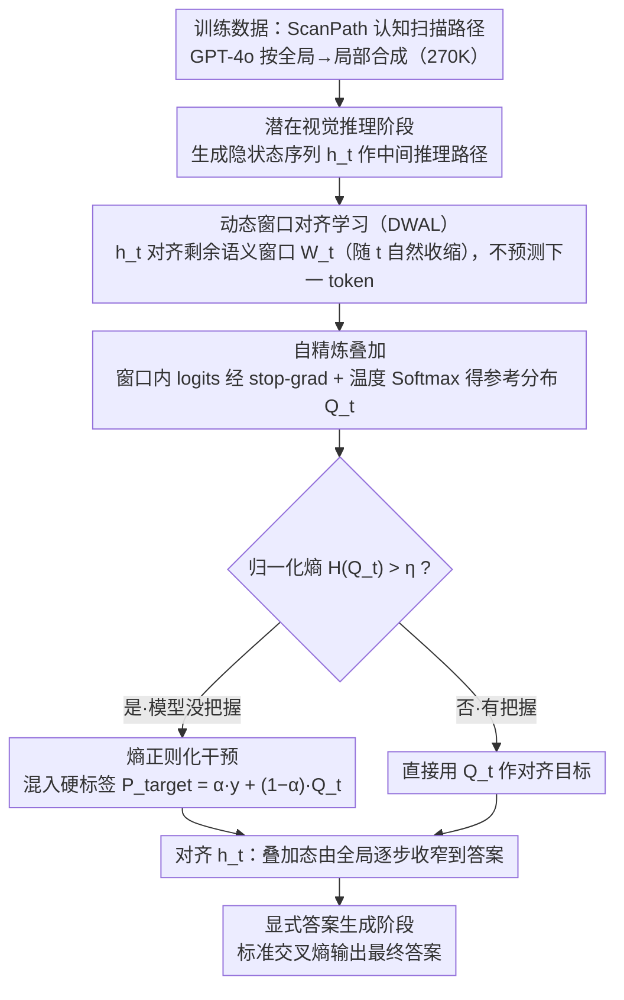

# Forest Before Trees: Latent Superposition for Efficient Visual Reasoning

**会议**: ACL 2026  
**arXiv**: [2601.06803](https://arxiv.org/abs/2601.06803)  
**代码**: [GitHub](https://github.com/Laser-VLM/Laser)  
**领域**: 可解释性  
**关键词**: 潜在推理, 动态窗口对齐, 语义叠加, 视觉推理, token 效率

## 一句话总结

本文提出 Laser，通过动态窗口对齐学习（DWAL）在潜在空间中进行视觉推理，使模型在推理过程中维持未来语义的"概率叠加态"而非逐 token 精确预测，实现"先全局后局部"的认知层次，在 6 个基准上以仅 6 个推理 token（减少 97%+）达到潜在推理方法的 SOTA，超越 Monet 平均 5.03%。

## 研究背景与动机

**领域现状**：视觉语言模型（VLM）已通过集成 LLM 与视觉编码器实现了强大的视觉理解，Chain-of-Thought 被引入实现多步推理。同时，潜在空间推理方法（Coconut、SoftCoT、Monet 等）尝试在高维隐状态中推理以避免显式 token 化的信息损失。

**现有痛点**：(1) 显式文本推理存在信息带宽瓶颈——连续视觉细节在离散 token 化过程中丢失；(2) 现有潜在推理方法仍沿用标准自回归目标，迫使每步隐状态严格最小化对下一个 token 的预测误差，导致"过早语义塌缩"——在把握全局上下文之前就被迫聚焦于单一具体 token；(3) 这种逐点映射与视觉感知的层次性本质不一致——视觉推理是从全局语义到局部特征的层次化过程。

**核心矛盾**：严格的逐 token 预测目标与视觉推理的层次化特性根本不匹配——推理早期应保持全局语义的开放性，后期才逐步收窄到具体答案。

**本文目标**：设计一种潜在推理范式，允许推理状态在早期编码全局语义的"叠加态"，随推理推进逐渐收窄到局部精确信息。

**切入角度**：受全局优先假说（Global Precedence Hypothesis）启发——人类视觉感知先处理整体结构再处理局部细节，将推理目标从逐点预测重新定义为动态窗口对齐。

**核心 idea**：用动态语义窗口替代逐 token 预测目标：每步的隐状态不需要预测下一个 token，而是与包含所有剩余推理步骤的动态窗口对齐。窗口随推理推进自然缩小，实现从全局探索到局部精确的渐进过渡。

## 方法详解

### 整体框架

Laser 想解决的痛点是：现有潜在推理方法（Coconut、Monet 等）虽然在隐空间里推理，但仍套用标准自回归目标，逼着每一步隐状态去精确预测下一个 token，结果在还没看清全局之前就被迫塌缩到单个具体语义——这和视觉感知"先整体后局部"的层次性根本拧着。Laser 的整篇推理分两阶段：先是潜在视觉推理阶段，模型生成一串高维隐状态作为中间推理路径，但训练目标换成 DWAL——让隐状态去对齐一个动态语义窗口而非预测单 token；然后是显式答案生成阶段，基于这条进化后的视觉理解用标准交叉熵吐出最终答案。训练数据则由 GPT-4o 按全局到局部顺序合成认知扫描路径（ScanPath，270K 样本）。

### 关键设计

**1. 动态窗口对齐学习（DWAL）：把"预测下一个 token"换成"对齐一整段剩余语义"**

标准自回归目标的毛病在于它逼早期隐状态过早塌缩成一个语义点，全局上下文还没建立就丢了。DWAL 的改法是给推理步骤 $t$ 定义一个动态语义窗口 $W_t = \{c_k \mid t \leq k \leq T\}$，囊括从当前到最后的所有剩余推理 token；隐状态 $h_t$ 不再去预测 $c_{t+1}$，而是与整个 $W_t$ 对齐。关键在于这个窗口会随 $t$ 增大自然收缩（$|W_t| \to 1$），于是推理早期窗口大、状态可以保持全局语义的"叠加态"四处探索，越往后窗口越窄、状态自然收敛到具体答案——"先全局后局部"的层次过渡就是这么从优化目标里长出来的。

**2. 自精炼叠加（Self-Refined Superposition）：在没有外部软标签时，用模型自己造一个稳定监督目标**

动态窗口对齐需要一个"窗口内语义长什么样"的参考分布，但又没有现成软标签可用，纯软目标还容易把优化带偏到高熵均匀分布去。这里的解法是提取窗口 $W_t$ 内各 token 对应的 logits，经 stop-gradient 和温度缩放 Softmax 构造出参考叠加分布 $Q_t$。stop-gradient 是为了切断梯度回流、避免模型自我强化成发散循环——本质是拿模型自身对未来语义的估计当软目标，既给了对齐的靶子又不至于失稳。

**3. 熵正则化干预（Entropy-Regularized Intervention）：模型越没把握，就越往里掺硬标签**

完全放开的潜在空间有发散成无意义高熵分布的风险，需要在关键时刻硬性拉回。具体做法是算参考分布的归一化熵 $H(Q_t)$，当 $H(Q_t) > \eta$（不确定性高）时把硬标签和软分布混起来

$$P^{target}_t = \alpha \cdot \mathbf{y}_{hard} + (1-\alpha) \cdot Q_t,$$

否则就直接用 $Q_t$。这等于形成一条隐式课程：模型拿不准时强制它精确对齐到正确 token，拿得准时才放它在叠加态里自由探索，把"探索"和"纠偏"按不确定性自动切换。

### 损失函数 / 训练策略

总损失 $\mathcal{L}_{Total} = \mathcal{L}_{DWAL} + \mathcal{L}_{CE}$，其中 DWAL 损失在推理链上对齐隐状态与混合目标，CE 损失在答案生成阶段使用。基座模型 Qwen2.5-VL-7B-Instruct，冻结视觉塔，仅优化 LLM 参数。$\eta=0.6$，$\alpha=0.8$。

## 实验关键数据

### 主实验

| 方法 | 类型 | MMVP | BLINK | SEED2+ | MMStar | Hallusion | HRBench | Overall |
|------|------|------|-------|--------|--------|-----------|---------|---------|
| Qwen2.5-VL-7B | Zero-shot | 65.67 | 53.60 | 65.31 | 59.70 | 56.57 | 68.25 | 61.52 |
| Vision-R1 | RL | 72.67 | 52.71 | 68.95 | 62.67 | 63.83 | 75.12 | 65.99 |
| VL-Rethinker | RL | 72.67 | 55.55 | 70.27 | 63.20 | 71.08 | 63.50 | 66.05 |
| Monet | Latent | 68.00 | 50.71 | 65.88 | 60.33 | 56.36 | 68.00 | 61.55 |
| LVR | Latent | 64.00 | 53.60 | 47.39 | 57.93 | 65.19 | 53.62 | 56.96 |
| **Laser** | Latent | **72.00** | **56.92** | **70.05** | **60.27** | **67.72** | **72.50** | **66.58** |

### 消融实验

**效率对比（平均推理 token 数）**

| 方法 | BLINK 平均 tokens | HRBench 平均 tokens | 减少比例 |
|------|-----------------|-------------------|---------|
| Qwen2.5-VL-7B | 223.5 | 55.9 | — |
| VL-Rethinker | 207.0 | 143.8 | +157.2%(HRBench) |
| Monet | 118.3 | 86.8 | — |
| LVR | 8.0 | 8.0 | -96.4% |
| **Laser** | **6.0** | **5.7** | **-97.3%** |

### 关键发现

- Laser 超越所有潜在推理基线平均 5.03%，甚至超越计算密集型的 RL 方法 Vision-R1 和 VL-Rethinker
- 仅需 6 个推理 token（减少 97.3%），同时性能不降反升——证明潜在叠加态能在极紧凑的空间中编码丰富语义
- 消融显示移除 DWAL（回退到逐 token 预测）主要损害细粒度感知，移除动态窗口（使用固定窗口）主要损害复杂推理
- 在域外任务（Web +8.03%、Chart +5.18%）上也有显著提升，无灾难性遗忘
- 潜在轨迹可通过 LM head 解码为可解释的 top-k token，展示了"实体定位 → 空间分析 → 语义推断"的多跳推理过程

## 亮点与洞察

- "语义叠加态"概念优雅——将量子力学的叠加直觉引入视觉推理，允许推理状态在塌缩为答案之前保持多种可能性
- 97%+ 的 token 减少同时性能提升，彻底改变了"推理需要冗长思维链"的固有认知
- 隐式课程设计精妙——熵阈值自动控制何时强制对齐、何时允许探索

## 局限与展望

- 在绝对像素级定位任务（如 Object Localization、Jigsaw）上略有不足——"先全局后局部"策略天然偏向语义理解而非精确度量
- 合成数据依赖 GPT-4o，可能继承其偏差
- 仅在 7B 模型上验证，更大模型上的效果未知
- 动态窗口的缩小策略（线性缩小）可能不是最优的，自适应缩小可能更好

## 相关工作与启发

- **vs Monet**: Monet 在潜在空间推理但仍生成稠密序列（118 tokens）；Laser 通过叠加态压缩到 6 tokens
- **vs LVR**: LVR 强制严格的自回归重建导致语义退化（-9.62%）；Laser 用灵活的窗口对齐避免塌缩
- **vs Vision-R1/VL-Rethinker**: 这些方法通过 RL 和长文本推理提升性能但计算开销大；Laser 纯潜在空间推理更高效
- **vs CoT**: 显式 CoT 受离散 token 化的信息瓶颈限制；Laser 在连续空间中推理绕过此瓶颈

## 评分

- 新颖性: ⭐⭐⭐⭐⭐ 动态窗口对齐+语义叠加态的思路非常新颖，重新定义了潜在推理的优化目标
- 实验充分度: ⭐⭐⭐⭐⭐ 6 个基准 + 效率分析 + 细粒度任务分析 + 域外迁移 + 可解释性 + 详细消融
- 写作质量: ⭐⭐⭐⭐⭐ 概念阐述优雅，"Forest Before Trees"隐喻贯穿全文
- 价值: ⭐⭐⭐⭐⭐ 97% token 减少 + 性能提升，对 VLM 实时部署具有重要意义

<!-- RELATED:START -->

## 相关论文

- [\[ACL 2025\] Don't Miss the Forest for the Trees: Attentional Vision Calibration for Large Vision Language Models](../../ACL2025/multimodal_vlm/dont_miss_the_forest_for_the_trees_attentional_vision_calibration_for_large_visi.md)
- [\[ACL 2025\] MMSafeAware: Can't See the Forest for the Trees: Benchmarking Multimodal Safety Awareness for Multimodal LLMs](../../ACL2025/multimodal_vlm/cant_see_the_forest_for_the.md)
- [\[CVPR 2026\] Monet: Reasoning in Latent Visual Space Beyond Image and Language](../../CVPR2026/multimodal_vlm/monet_reasoning_in_latent_visual_space_beyond_image_and_language.md)
- [\[ACL 2026\] DRIFT: Transferring Reasoning Priors for Efficient MLLM Fine-Tuning](drift_transferring_reasoning_priors_for_efficient_mllm_fine-tuning.md)
- [\[CVPR 2026\] Reasoning Palette: Modulating Reasoning via Latent Contextualization for Controllable Exploration for (V)LMs](../../CVPR2026/multimodal_vlm/reasoning_palette_modulating_reasoning_via_latent_contextualization_for_controll.md)

<!-- RELATED:END -->
