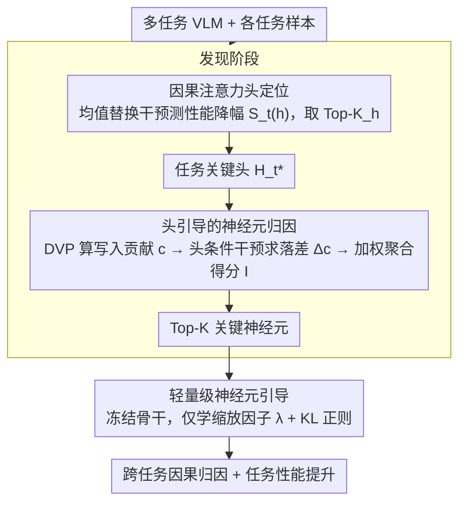

# From Heads to Neurons: Causal Attribution and Steering in Multi-Task Vision-Language Models

**会议**: ACL 2026  
**arXiv**: [2604.17941](https://arxiv.org/abs/2604.17941)  
**代码**: [github](https://github.com/petergit1/HONES)  
**领域**: 多模态VLM  
**关键词**: 神经元归因, 因果分析, 多任务VLM, 注意力头, 模型可解释性

## 一句话总结

提出 HONES 框架，通过先定位任务关键注意力头再以其为条件引导 FFN 神经元归因，实现了多任务 VLM 中跨异构任务的统一、无梯度的神经元级因果分析和轻量级任务性能提升。

## 研究背景与动机

**领域现状**：大型视觉语言模型（VLM）在 VQA、OCR、图像描述等多任务中表现出色，但内部决策过程不透明——多种能力纠缠在共享参数中，阻碍了错误归因和可控部署。神经元级分析能提供细粒度的可操作洞察。

**现有痛点**：(1) 现有神经元分析主要关注单任务设置，无法跨异构任务（如问答 vs 图文匹配）比较神经元重要性；(2) 大多方法独立评分神经元，忽略了注意力头的任务依赖路由效应，导致多义性神经元获得膨胀的重要性分数。

**核心矛盾**：如何在共享参数空间中准确识别不同任务的关键神经元，同时避免多义性带来的噪声？

**本文目标**：设计统一的跨任务神经元归因框架，并利用发现的关键神经元进行轻量级任务性能提升。

**切入角度**：遵循 Transformer 的结构化因果视图——注意力头负责选择和路由任务关键输入，FFN 神经元负责将路由信息写入残差流。先定位路由节点（注意力头），再在其条件下归因 FFN 神经元。

**核心 idea**：神经元的任务重要性应通过其在任务关键注意力头路由路径下的"写入贡献"来衡量，而非简单的激活幅度。

## 方法详解

### 整体框架

HONES 要解决的是多任务 VLM 的一个老难题：能力都纠缠在共享参数里，想知道"哪个神经元对 OCR 重要、哪个对 VQA 重要"很难，而且现有方法各自独立给神经元打分，忽略了注意力头的任务路由效应，结果多义性神经元被刷出虚高的重要性。HONES 顺着 Transformer 的因果结构走——注意力头负责选择和路由任务关键输入，FFN 神经元负责把路由来的信息写进残差流——所以分两阶段：发现阶段先用均值替换干预定位任务关键注意力头 $\mathcal{H}_t^*$，再在这些头的条件下用直接词汇投影（DVP）衡量每个 FFN 神经元对任务目标的因果写入贡献、取 Top-K；引导阶段则冻结骨干，只在这批关键神经元上学一组稀疏缩放因子，靠 KL 正则实现可控的任务提升。先定头、再定神经元，是一条从粗到细的因果路径。

### 关键设计

**1. 因果注意力头定位：先圈出"路由节点"，把下游神经元的搜索空间收窄**

如果对全部 FFN 神经元直接评分，搜索空间大且容易混入无关计算路径。HONES 先做一层注意力头筛选：对目标头采用均值替换干预——把它的输出换成其余 $H-1$ 个头输出的均值，测量由此带来的任务性能下降 $S_t(h)$，下降越多说明这个头越关键，取 Top-$K_h$ 个组成 $\mathcal{H}_t^*$。之所以用均值替换而非直接置零，是因为零置换会制造分布外伪影、污染测量；先把这些路由节点定下来，等于先隔离出有效的计算路径，后面归因神经元才不会在噪声里打转。

**2. 头引导的神经元归因（因果写入效应）：只计入沿任务路由路径的那部分贡献**

独立评分激活幅度的老办法最容易被多义性神经元骗——一个神经元在很多任务里都激活，幅度高不代表对当前任务重要。HONES 改成衡量"写入贡献"：对每个神经元 $(l,i)$，先算它通过下投影写入残差流的向量 $\Delta \mathbf{r}_i^{(l)}$，再用 DVP 把它投到目标 token 的 unembedding 向量方向上，得到写入贡献 $c_{l,i}$；接着对每个关键头施加干预，看干预前后这份贡献落差 $\Delta c$，并以头重要性为权重聚合成最终分数 $I_{l,i}$。关键就在"以头为条件"这一步——只有真正沿着任务路由路径流过去的写入才会被计入，多义性带来的虚高贡献被自然滤掉。

**3. 轻量级神经元引导：冻结骨干，只在关键神经元上拧一个缩放旋钮**

光会归因还不够，论文想顺手把任务性能也提上去，但又不能动整个模型。做法是冻结所有骨干参数，只为每个关键神经元学一个缩放因子 $\lambda_{l,i}$，优化目标在任务损失上加一项 KL 散度正则

$$\min_{\lambda_t}\; \mathcal{L}_t + \beta\, \text{KL}(p_\theta \,\|\, p_{\theta_{\lambda_t}}),$$

KL 项把调过的模型行为拉住、防止它偏离原模型太远。因为只学一批稀疏缩放因子、参数量极小，这套引导既轻又能在 OOD 上 zero-shot 迁移。

### 训练策略

发现阶段使用 7K 图像的 discovery split，引导阶段使用 2K 图像的 dev split 学习缩放因子，3K 图像用于测试。支持开放式目标（如 caption）时用 IDF 加权聚合 token 的 unembedding 向量。

## 实验关键数据

### 主实验（Top-1% 神经元掩码后的性能下降 %）

| 方法 | VQA | OCR | Caption | Retrieval | 平均 |
|------|-----|-----|---------|-----------|------|
| AP | 11.33 | 10.40 | 8.65 | 0.50 | 7.72 |
| MA | 6.82 | 15.50 | 11.90 | 1.35 | 8.89 |
| APE | 3.20 | -1.87 | 12.20 | 0.90 | 3.61 |
| **HONES** | **27.30** | **19.00** | **19.80** | **7.43** | **18.38** |

### 引导效果（LLaVA-1.5-7B）

| 方法 | VQA | OCR | Caption | Retrieval | 平均 |
|------|-------|-------|---------|-----------|-------|
| Base | 0.652 | 0.576 | 0.129 | 0.933 | 0.572 |
| Grid-Search | 0.666 | 0.594 | 0.132 | 0.956 | 0.587 |
| **HONES** | **0.673** | **0.602** | **0.141** | **0.963** | **0.595** |

### 关键发现
- HONES 在所有任务和两个 VLM 上全面超越激活统计方法，平均性能下降达18.38%（LLaVA）和 21.91%（Qwen）
- 关键神经元表现出任务依赖的层偏好：检索任务集中在中间层（视觉-文本对齐），其他任务偏向深层（答案解码）
- VQA 共享神经元的跨任务显著性最高，呈现"Hub"效应——VQA 相关神经元支撑了广泛的视觉语言任务
- OOD 实验中，直接迁移域内学习的缩放因子（zero-shot）即可获得一致的提升

## 亮点与洞察
- 从注意力头到神经元的"粗到细"归因思路优雅且高效——头引导条件有效抑制了多义性噪声
- 提出统一的跨任务评分接口（DVP + IDF 加权），解决了异构任务输出不可比的难题
- VQA 作为跨任务"Hub"的发现具有重要的模型理解意义
- 引导方法仅学习稀疏缩放因子，参数开销极低且 OOD 可迁移

## 局限与展望
- 实验限于 7B 规模的稠密模型，更大模型或 MoE 架构上的验证待进行
- 四个粗粒度任务类别可能掩盖子任务级别的差异（如 VQA 中的计数 vs 空间推理）
- 因果分析需要多次前向传播，计算开销较高，大数据集上扩展性受限
- 未探索与 SAE 等特征级方法的互补结合

## 相关工作与启发
- **vs AP/MA/APE（激活统计方法）**: 仅看激活幅度无法区分多义性，HONES 的头引导条件更准确
- **vs QRNCA（梯度方法）**: HONES 无梯度且更高效，定位速度更快
- **vs SAE**: HONES 在原始模型上直接操作，无需额外特征学习，支持因果归因和轻量引导
- **vs MultEdit**: MultEdit 编辑 MLP 块的知识，HONES 分析跨任务的神经元共享结构

## 评分
- 新颖性: ⭐⭐⭐⭐⭐ 头引导神经元归因的框架设计新颖，跨任务统一评分接口解决了实际瓶颈
- 实验充分度: ⭐⭐⭐⭐⭐ 四任务×两模型，大量控制变体和消融实验，OOD 验证
- 写作质量: ⭐⭐⭐⭐ 框架描述清晰，发现洞察丰富
- 价值: ⭐⭐⭐⭐⭐ 对 VLM 可解释性和可控性有重要推进，引导方法具有实用价值

<!-- RELATED:START -->

## 相关论文

- [\[CVPR 2026\] Understanding Task Transfer in Vision-Language Models](../../CVPR2026/multimodal_vlm/understanding_task_transfer_in_vision-language_models.md)
- [\[ICML 2025\] Learning Invariant Causal Mechanism from Vision-Language Models](../../ICML2025/multimodal_vlm/learning_invariant_causal_mechanism_from_vision-language_models.md)
- [\[ACL 2026\] OMIBench: Benchmarking Olympiad-Level Multi-Image Reasoning in Large Vision-Language Models](omibench_benchmarking_olympiad-level_multi-image_reasoning_in_large_vision-langu.md)
- [\[CVPR 2025\] Task Preference Optimization: Improving Multimodal Large Language Models with Vision Task Alignment](../../CVPR2025/multimodal_vlm/task_preference_optimization_improving_multimodal_large_language_models_with_vis.md)
- [\[ICML 2026\] CyberJurors: A Multi-Agent Simulation Task for E-Commerce Disputes Verdict](../../ICML2026/multimodal_vlm/cyberjurors_a_multi-agent_simulation_task_for_e-commerce_disputes_verdict.md)

<!-- RELATED:END -->
