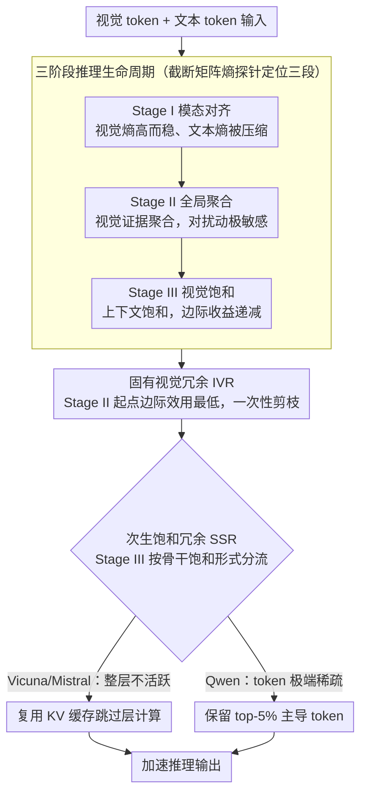

# From Inheritance to Saturation: Disentangling the Evolution of Visual Redundancy for Architecture-Aware MLLM Inference Acceleration

**会议**: ACL 2026  
**arXiv**: [2604.16462](https://arxiv.org/abs/2604.16462)  
**代码**: [https://github.com/civilizwa/HalfV](https://github.com/civilizwa/HalfV)  
**领域**: 多模态VLM / 推理加速  
**关键词**: 视觉冗余, MLLM加速, 架构感知, token剪枝, 矩阵熵

## 一句话总结

揭示 MLLM 推理中视觉冗余的两种来源——ViT 密集 tokenization 导致的固有冗余（IVR）和深层语义饱和导致的次生冗余（SSR，且其表现形式因骨干架构不同而异），提出 HalfV 框架分别处理两类冗余，在 Qwen2.5-VL 上实现4.1倍 FLOPs 加速且保留96.8%性能。

## 研究背景与动机

**领域现状**：高分辨率 MLLM 因视觉 token 爆炸导致推理计算成本极高。现有加速方法包括 token 级剪枝和层级稀疏。

**现有痛点**：现有加速策略存在严重的"骨干依赖性"——在 Vicuna/Mistral 架构（如 LLaVA）上表现良好，但迁移到 Qwen 架构时性能退化5.7%-22.4%。通过控制变量实验（使用相同视觉前端的 LLaVA-Next），证实瓶颈在于不同 LLM 骨干处理视觉信息的内在机制不同。

**核心矛盾**：不同骨干架构对视觉信息的处理方式根本不同，但现有方法假设"一种策略适用于所有架构"。需要理解不同架构中视觉冗余的本质差异，才能设计通用的加速方案。

**本文目标**：用截断矩阵熵作为探针，系统追踪视觉信息在不同架构中的演变，据此设计架构感知的加速框架。

**切入角度**：利用截断矩阵熵追踪视觉表示的特征值谱演变，发现了跨架构通用的三阶段推理生命周期（模态对齐→全局聚合→视觉饱和）。

**核心 idea**：将视觉冗余解耦为通用的 IVR（来自 ViT 密集 tokenization）和架构依赖的 SSR（来自深层饱和），前者用统一剪枝策略处理，后者根据架构特异性表现自适应处理（Vicuna/Mistral 的层级不活跃 vs Qwen 的极端 token 稀疏）。

## 方法详解

### 整体框架

HalfV 分两步：（1）在 Stage II 起始处对所有架构统一执行一次性 token 剪枝，消除 IVR；（2）在 Stage III 根据架构特异性处理 SSR——对 Vicuna/Mistral 架构复用 KV 缓存跳过层计算，对 Qwen 架构只保留 top-5% 主导 token 参与计算。这一切的前提，是先用截断矩阵熵这把"尺子"把推理过程切成三阶段、读出 IVR 与 SSR 各自该在哪一段下手。

### 关键设计

**1. 三阶段推理生命周期：用矩阵熵把视觉信息的演变拆成可对齐的三段**

要解释"为什么同一套加速策略换个骨干就崩"，先得有一把跨架构通用的尺子。作者用截断矩阵熵分别追踪视觉与文本表示在各层的特征值谱演变，发现无论 Vicuna、Mistral 还是 Qwen，都会经历同样的三段。Stage I（模态对齐）视觉熵高而稳定、文本熵被快速压缩，注意力从均衡迅速转为文本主导；Stage II（全局聚合）视觉熵开始下降，分散的视觉证据被聚合到关键语义区域，此时整段对局部扰动极度敏感——只抑制 1% 的 token 就能引发严重退化；Stage III（视觉饱和）视觉上下文已经饱和，再算下去边际收益递减。

这把尺子的价值在于，它把"冗余"从一个笼统的词拆成了有时间轴的过程，让后面两个设计能各自挑准下手的层：IVR 该在哪一层一次性剪掉，SSR 又在哪一段才真正出现，都能从熵曲线上读出来。

**2. 固有视觉冗余（IVR）：在 Stage II 起点一次性剪枝，避开聚合的敏感区**

ViT 的密集 tokenization 天生带来大量空间冗余，这部分冗余跟骨干无关、所有架构都有，所以可以用同一招处理。难点在于"何时剪"——Stage II 对局部扰动太敏感，逐层剪会破坏正在进行的证据聚合。作者用边际效用 $\text{MU}_{l,r} = -\Delta\mathcal{M} / (\Delta\mathcal{C} + \epsilon)$ 量化"每省一点算力损失多少信息"，发现 Stage II 的起始层是唯一的甜点位（MU=0.21，明显低于其他位置的 0.29–0.87）。

之所以是这一层：它正好卡在 Stage I 的对齐已经完成、Stage II 的敏感聚合尚未开始之间，此时视觉表示冗余度最高、信息最不脆弱，一次性剪掉大批 token 既不干扰对齐、也不破坏后续聚合，是定量而非启发式地选出来的最优时机。

**3. 次生饱和冗余（SSR）：按骨干的饱和表现形式分流，而不是一刀切**

SSR 是深层语义饱和后产生的冗余，关键在于它的表现形式因骨干而异——这正是现有方法跨架构失效的根因。Vicuna/Mistral 的 SSR 表现为整层不活跃（相邻层 KL 散度 $\approx 0$，没有信息增益），于是可以直接复用 KV 缓存跳过这些层的计算；Qwen 的 SSR 则表现为极端 token 稀疏：层本身仍然活跃，但信息流塌缩到极少数主导 token 上，必须保留 top-5% token 的全精度计算、其余才能省。

实验把这两种形态的差异钉得很死：在 Vicuna 上抑制全部视觉更新反而更好（OCRBench +13.1%），同样的操作搬到 Qwen 上却灾难性崩溃（−86.2%）；反过来，Qwen 上只保留 5% token 几乎无损（−0.1%~−2.4%）。这组对照说明 SSR 不能用单一策略概括——HalfV 据此在 Stage III 给两类骨干分别派对应的加速方式，而不是假设"深层都能跳"。

### 损失函数 / 训练策略

HalfV 是无训练的推理时加速方法。仅需在小量数据（100样本）上运行预分析确定三阶段边界。在 LLaVA-1.5v-7B（Vicuna）、LLaVA-1.5v-7B（Mistral）和 Qwen2.5-VL-7B 上评估，基准包括 GQA、MME、POPE、SQA、AI2D 等。

## 实验关键数据

### 主实验

| 模型 | 方法 | FLOPs 加速 | 平均性能保留 |
|------|------|-----------|------------|
| Qwen2.5-VL | HoloV (现有方法) | 高 | 差 (退化5.7-22.4%) |
| Qwen2.5-VL | HalfV | **4.1×** | **96.8%** |
| LLaVA-1.5v (Vicuna) | HalfV | 高 | 优秀 |
| LLaVA-1.5v (Mistral) | HalfV | 高 | 优秀 |

### 消融实验

| 配置 | 效果 | 说明 |
|------|------|------|
| 仅 IVR 处理 | 中等加速 | 通用剪枝有效但不充分 |
| 仅 SSR 处理 | 有限加速 | 只处理深层冗余 |
| IVR + SSR (完整 HalfV) | 最优 | 两阶段互补 |
| 错误的 SSR 策略 | 灾难性退化 | 验证架构感知的必要性 |

### 关键发现

- 现有方法在 Qwen 上退化的根因是 SSR 的表现形式不同——Qwen 的深层仍活跃但极度稀疏，不能简单跳过层
- Stage II 的起始层是一次性剪枝的最优时机（边际效用最低）
- 仅1% token 被抑制就导致 Stage II 性能崩溃，证实了全局聚合过程的高度耦合
- 三阶段生命周期在所有测试架构上都一致，但 SSR 的表现架构依赖

## 亮点与洞察

- **"骨干依赖性"问题的系统揭示和解释**：首次证实 MLLM 加速方法失败的根因是骨干架构差异而非视觉前端差异，并通过矩阵熵分析给出了机理解释
- **IVR/SSR 解耦的框架优雅**：将复杂的视觉冗余分解为两个独立可处理的组件，且给出了各自的最优处理策略
- **边际效用分析定位最优剪枝时机**：定量而非启发式地确定剪枝层，具有方法论价值

## 局限与展望

- 预分析阶段需要100个样本确定阶段边界，不同数据分布可能影响边界位置
- 仅在 Vicuna、Mistral、Qwen 三类骨干上验证，更多架构的 SSR 表现未知
- 极端 token 稀疏策略中 top-5% 的比例可能需要针对不同任务调整
- 未与最新的动态 token 管理方法进行比较

## 相关工作与启发

- **vs HoloV/DART（token剪枝方法）**: 这些方法隐含假设所有架构的冗余模式相同，在 Qwen 上严重退化。HalfV 通过架构感知的 SSR 处理解决了这一问题
- **vs ShortV（层级方法）**: ShortV 假设深层可跳过，对 Vicuna 成立但对 Qwen 不成立。HalfV 区分了"层不活跃"和"token 稀疏"两种 SSR 模式

## 评分

- 新颖性: ⭐⭐⭐⭐⭐ IVR/SSR 解耦和架构感知的分析是原创性贡献，三阶段生命周期的发现有独立价值
- 实验充分度: ⭐⭐⭐⭐⭐ 三种架构+8个基准+边际效用分析+SSR 交叉验证，非常充分
- 写作质量: ⭐⭐⭐⭐ 分析深入、图表丰富，但部分描述较技术化

<!-- RELATED:START -->

## 相关论文

- [\[ICLR 2026\] Visual Prompt-Agnostic Evolution](../../ICLR2026/multimodal_vlm/visual_prompt-agnostic_evolution.md)
- [\[AAAI 2026\] Filter, Correlate, Compress: Training-Free Token Reduction for MLLM Acceleration](../../AAAI2026/multimodal_vlm/filter_correlate_compress_training-free_token_reduction_for_.md)
- [\[ACL 2026\] Long Story Short: Disentangling Compositionality and Long-Caption Understanding in Contrastive VLMs](long_story_short_disentangling_compositionality_and_long-caption_understanding_i.md)
- [\[ACL 2026\] Enhancing Multimodal Large Language Models for Ancient Chinese Character Evolution Analysis via Glyph-Driven Fine-Tuning](enhancing_multimodal_large_language_models_for_ancient_chinese_character_evoluti.md)
- [\[AAAI 2026\] Global Compression Commander: Plug-and-Play Inference Acceleration for High-Resolution Large Vision-Language Models](../../AAAI2026/multimodal_vlm/global_compression_commander_plug-and-play_inference_acceler.md)

<!-- RELATED:END -->
