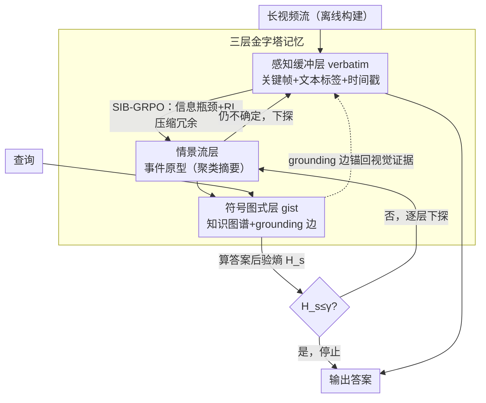

# From Verbatim to Gist: Distilling Pyramidal Multimodal Memory via Semantic Information Bottleneck

**会议**: ACL 2026  
**arXiv**: [2603.01455](https://arxiv.org/abs/2603.01455)  
**代码**: [GitHub](https://github.com/EliSpectre/MM-Mem)  
**领域**: 多模态VLM  
**关键词**: 长视频理解, 多模态记忆, 信息瓶颈, 模糊痕迹理论, 强化学习

## 一句话总结

本文提出 MM-Mem，一种受模糊痕迹理论启发的金字塔式多模态记忆架构——将记忆分为感知缓冲层（视觉为主）、情景流层（事件级摘要）和符号图式层（知识图谱）三个层级，通过 SIB-GRPO（语义信息瓶颈+强化学习）自底向上压缩冗余、通过熵驱动自顶向下检索，在 4 个长视频 benchmark 上实现 SOTA。

## 研究背景与动机

**领域现状**：多模态大语言模型（MLLMs）在短期感知上表现出色，但在长视频理解中受限于上下文窗口和静态记忆机制。现有方法分为两个极端：视觉中心方法（如 LongVA、VideoRAG）密集采样视觉帧导致高延迟和冗余；文本中心方法（如 Vgent）将视频转为文本记忆导致细节丢失和幻觉。

**现有痛点**：(1) 视觉中心方法积累大量视觉 token，计算冗余严重且忽略高层语义；(2) 文本中心方法通过 captioning 进行有损压缩，丢失关键视觉线索导致歧义；(3) 现有系统的记忆机制是静态的，不像人类记忆那样动态组织；(4) 多模态场景下的动态记忆管理被严重欠探索。

**核心矛盾**：长视频理解需要同时保留细粒度视觉细节（用于精确验证）和高层语义抽象（用于跨事件推理），但现有方法只能二选一——视觉保真度和语义抽象之间存在根本性的 trade-off。

**本文目标**：设计一种分层多模态记忆架构，实现从细粒度感知到高层认知的渐进蒸馏，同时支持动态记忆压缩和自适应检索。

**切入角度**：认知心理学的模糊痕迹理论（FTT）提出人类记忆包含两种并行痕迹：verbatim（精确感知细节）和 gist（抽象语义意义）。视觉天然对应 verbatim，文本天然对应 gist——这种跨模态互补性可以直接映射为分层记忆架构。

**核心 idea**：构建一个三层金字塔记忆，自底向上从视觉主导逐渐过渡到文本主导，用信息瓶颈理论指导压缩（SIB-GRPO），用熵驱动的自顶向下检索在抽象和细节之间动态切换。

## 方法详解

### 整体框架

MM-Mem 以长视频流为输入，离线构建三层金字塔记忆：(1) 感知缓冲层（Sensory Buffer）保留关键帧的视觉表示+简短文本标签；(2) 情景流层（Episodic Stream）通过聚类和摘要生成事件级表示；(3) 符号图式层（Symbolic Schema）构建实体知识图谱。查询时，自顶向下检索：先查知识图谱（gist），不确定时下探到事件层，仍不确定才访问视觉帧（verbatim）。

### 关键设计

**1. 三层金字塔记忆：让视觉细节和语义抽象各居其位、还能相互锚定**

长视频理解的根本矛盾是既要保留细粒度视觉细节（用于精确验证）、又要高层语义抽象（用于跨事件推理），而现有方法只能二选一。MM-Mem 干脆按 FTT 的抽象层级把记忆分成三层。最底的**感知缓冲层** $\mathcal{M}_{sens} = \{(v_{t,i}, l_{t,i}, \tau_{t,i})\}$ 用内容自适应时序分割（PySceneDetect）切片、按帧间变化挑关键帧，存下视觉表示、文本标签和时间戳，对应 verbatim（精确感知）；中间的**情景流层**用决策算子 $\psi(m_{t,i}, e^\star) \in \{ADD\_NEW, MERGE, DISCARD\}$ 把零散感知项组织成紧凑事件序列，再用 K-means 聚类抽代表性原型；最顶的**符号图式层**构建知识图谱 $\mathcal{G} = (\mathcal{N}, \mathcal{E})$，节点是情景单元和实体原型，对应 gist（抽象语义）。

这套结构真正的巧思在边的设计：图谱里除了语义关系边，还有一类 **grounding 边**把高层文本概念锚定回具体的视觉证据。它让顶层抽象始终拴着底层的"原始画面"，需要核对细节时能顺着指针一路下探回去——这正是纯文本记忆方法做不到、因而容易凭空捏造细节的地方。

**2. SIB-GRPO：用强化学习把"压多少"这件事交给信息瓶颈来定夺**

从感知层蒸到情景层时，到底压掉多少冗余、保留多少任务相关语义，没有现成答案。作者把这一步建模成随机压缩，直接优化信息瓶颈目标

$$\min_{p_\theta(m|x)} [I(X;M) - \beta I(M;Y)]$$

其中 $X$ 是感知记忆、$M$ 是情景表示、$Y$ 是下游 VQA 答案——既要挤掉 $X$ 里的冗余，又要保住对答对 $Y$ 有用的信息。麻烦在于情景痕迹 $M$ 是 LLM 离散生成的文本，传统信息瓶颈假设连续变量根本套不上去。

解法是把 IB 原则翻译成可以用序列级反馈训练的 RL 目标：引入变分解码器和 quality-quantity 先验 $r(m) \propto p_{ref}(m) \cdot e^{-\lambda|m|}$（同时管表达质量和长度），然后用 GRPO 风格采样 $G$ 个候选痕迹，按标量奖励 $r(s,m) = R_{vqa} - \beta_1 \cdot Length(m) - \beta_2 \cdot \log\frac{\pi_{\theta_{old}}}{\pi_{ref}}$ 打分——答对加分、太长扣分、偏离参考策略再扣分——组内归一化成优势函数后优化 PPO 裁剪代理目标。这里的 quality-quantity 先验起的作用类似 RLHF 的信任域约束，避免压缩压过头压崩。

**3. 熵驱动的自顶向下检索：按问题难度决定要不要下探到视觉帧**

不是每个问题都得翻原始画面——时序推理查查知识图谱就够，细节计数才需要看帧。于是检索从最抽象的符号图式层起步，逐层维护答案候选的后验分布 $p_i^{(s)} = p(a_i | \mathcal{Q}, R_{\leq s})$ 并算它的熵

$$H_s(\mathcal{Q}) = -\sum_i p_i^{(s)} \log p_i^{(s)}$$

当 $H_s \leq \gamma$（已经足够确定）或连续多步熵减 $\Delta H_s$ 低于阈值 $\epsilon$（再下探也没新信息）时就停手。高层文本检索快、先把语义范围迅速缩窄，只有在不确定性仍然很高时才触发慢而贵的低层视觉检索。这样检索深度随查询难度自适应伸缩，省掉了为不同问题类型手工设计检索策略的麻烦，也避免了无谓的视觉计算开销。

### 一个完整示例：一个"片中谁先离开房间"的查询怎么逐层下探

以一段半小时会议视频为例。离线阶段，MM-Mem 先把视频切成若干场景片段，感知层存下每段的关键帧+标签，情景层把"开场寒暄""A 做汇报""B 中途离席"等聚成事件原型，符号图式层把人物 A/B/C 连成带时间关系的知识图谱。

查询"谁比 B 更早离开房间"进来时：检索先停在符号图式层，图谱里已记录"B 离席"事件及其时间边，但"更早离开"的候选还有 A、C 两人，后验分布熵 $H_s$ 偏高，于是下探到情景流层；事件序列显示 A 的离席事件早于 B、C 没有离席记录，候选收敛到 A，熵骤降到 $\gamma$ 以下——此时根本不必再访问感知层的原始帧就能作答。若问题换成"B 离开时桌上有几个杯子"，前两层都答不上来，熵迟迟降不下去，检索才会一路下探回感知层、调出那一帧的 verbatim 视觉细节去数。同一套记忆，简单问题两层搞定、细节问题才付出视觉代价。

### 损失函数 / 训练策略

SIB-GRPO 目标函数：$J_{SIB-GRPO}(\theta) = \mathbb{E}[\frac{1}{G}\sum_{i=1}^{G} \min(\rho_i A_i, \text{clip}(\rho_i, 1-\epsilon, 1+\epsilon) A_i)]$。基座模型 Qwen3-VL-8B，使用 SWIFT 框架微调，$\beta_1=0.1$, $\beta_2=0.3$, temperature=0.0。

## 实验关键数据

### 主实验

**Video-MME 长视频理解（Overall Accuracy）**

| 方法 | 类型 | w/o 字幕 | w/ 字幕 |
|------|------|---------|--------|
| Gemini 1.5 Pro | 商用 | 75.0 | 81.3 |
| Qwen2-VL-72B | 开源 72B | 71.2 | 77.8 |
| Vgent | Agent | 68.9 | 74.3 |
| **MM-Mem (Ours)** | **Agent 8B** | **72.4** | **78.1** |

**流式视频 VStream-QA-Ego**

| 方法 | Accuracy | Score |
|------|----------|-------|
| Flash-VStream | 59.0 | 3.9 |
| **MM-Mem** | **62.5** | **4.1** |

### 消融实验

**Video-MME w/o 字幕各组件消融**

| 配置 | Short | Medium | Long | Overall |
|------|-------|--------|------|---------|
| Full (MM-Mem) | 81.5 | 69.6 | 66.1 | 72.4 |
| w/o SIB-GRPO | ~79 | ~68 | ~63 | ~70 |
| w/o Hierarchical Memory | ~77 | ~66 | ~61 | ~68 |

### 关键发现

- MM-Mem 在仅用 8B 模型的情况下超越了所有开源 MLLM（含 72B）和多数 Agent 系统
- 在 Long 分组上提升最大——SIB-GRPO 对长时序依赖的压缩尤为关键
- HD-EPIC++ 上 MM-Mem (30.28%) 超越 Qwen3-VL-8B (25.88%) 达 4.4 点，证明自我中心长视频的细粒度聚合能力
- 效率分析：推理延迟仅 5.35s/分钟视频，VRAM 17.8GB（低于 Qwen3-VL-8B 的 22.8GB）
- t-SNE 可视化显示感知层保留了域特异性视觉细节，情景层自然涌现出语义聚类

## 亮点与洞察

- FTT 到工程实现的映射非常自然——视觉=verbatim、文本=gist 的对应关系简洁优雅，grounding 边的设计确保两者不会完全解耦
- 将信息瓶颈理论与 GRPO 结合的思路可推广——任何需要在信息保留和压缩之间取舍的场景（如 RAG 的 chunk 选择）都可以借鉴
- 熵驱动的自适应检索深度是一个实用的设计——避免了为每个查询类型手工设计检索策略

## 局限与展望

- 记忆构建的计算开销虽可分摊但仍存在——边缘部署场景需要进一步蒸馏
- 依赖上游视觉编码器和 captioner 的质量——感知层的噪声会向上传播
- 当前 SIB-GRPO 使用任务驱动的 VQA 奖励，在没有明确下游任务的无监督场景中如何定义奖励仍是开放问题
- 未在超长视频（>2h）上系统评估

## 相关工作与启发

- **vs Vgent**: 纯文本记忆，在 Video-MME 上 MM-Mem 超越 3.5 点（72.4 vs 68.9），因为 Vgent 的文本压缩丢失了细粒度视觉证据
- **vs VideoRAG**: 视觉中心方法，VRAM 更高（23.0 vs 17.8 GB）且性能更低（60.5 vs 72.4），因为密集视觉积累带来冗余
- **vs A-Mem**: 文本中心的动态记忆，缺乏多模态 grounding，无法在需要视觉验证时下探到细节层

## 评分

- 新颖性: ⭐⭐⭐⭐⭐ FTT→金字塔记忆的映射 + IB→GRPO 的理论创新 + 熵驱动检索，三重贡献
- 实验充分度: ⭐⭐⭐⭐⭐ 4 个 benchmark（离线+流式+自我中心）+ 消融 + 效率分析 + t-SNE 可视化
- 写作质量: ⭐⭐⭐⭐ 理论推导清晰，认知科学到工程的桥接自然
- 价值: ⭐⭐⭐⭐⭐ 为长视频 Agent 的记忆系统提供了一个可复用的认知架构范式

<!-- RELATED:START -->

## 相关论文

- [\[ICML 2025\] Learning Optimal Multimodal Information Bottleneck Representations](../../ICML2025/multimodal_vlm/learning_optimal_multimodal_information_bottleneck_representations.md)
- [\[AAAI 2026\] Conditional Information Bottleneck for Multimodal Fusion: Overcoming Shortcut Learning in Sarcasm Detection](../../AAAI2026/multimodal_vlm/conditional_information_bottleneck_for_multimodal_fusion_overcoming_shortcut_lea.md)
- [\[CVPR 2026\] SeD-UD: An Influence-Driven and Hierarchically-Decoupled Information Bottleneck for Multimodal Intent Recognition](../../CVPR2026/multimodal_vlm/sed-ud_an_influence-driven_and_hierarchically-decoupled_information_bottleneck_f.md)
- [\[ACL 2026\] Reducing Peak Memory Usage for Modern Multimodal Large Language Model Pipelines](reducing_peak_memory_usage_for_modern_multimodal_large_language_model_pipelines.md)
- [\[ACL 2026\] MONETA: Multimodal Industry Classification through Geographic Information with Multi Agent Systems](moneta_multimodal_industry_classification_through_geographic_information_with_mu.md)

<!-- RELATED:END -->
