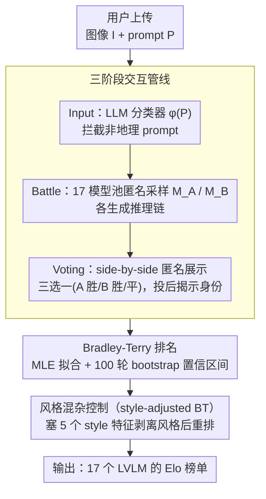

# GeoArena: Evaluating Open-World Geographic Reasoning in Large Vision-Language Models

**会议**: ACL 2026  
**arXiv**: [2509.04334](https://arxiv.org/abs/2509.04334)  
**代码**: https://github.com/Applied-Machine-Learning-Lab/ACL2026_GeoArena  
**领域**: 多模态 VLM / 地理推理 / 评测基准  
**关键词**: 地理推理, LVLM 评测, 人类偏好, Bradley-Terry, 开放世界

## 一句话总结
本文提出 **GeoArena**，一个面向 LVLM 开放世界地理推理的"动态、无标签、过程导向"评测平台，把 in-the-wild 图像下的地理定位评估改写为成对推理对齐任务，用人类偏好 + Bradley-Terry 评分对 17 个前沿 LVLM 排榜，专家-众包一致率达 78%。

## 研究背景与动机

**领域现状**：现有 LVLM 地理推理评测（OSV-5M、LLMGeo、IMAGEO-Bench、FairLocator、GeoChain 等）几乎都是 *outcome-centric*：用静态数据集 + 预定义标签（坐标距离、国家/城市准确率），算"label-match"。

**现有痛点**：
- *数据污染*：静态基准的图像极易被 Web-scale 预训练吸收，新模型刷分可能纯属背答案；
- *过程黑盒*：把复杂推理链坍缩成一个标签，无法区分"猜对了"和"推理对了"；
- *标签缺失/歧义*：野外图像往往没有权威 GT，多假设并存时"正确性"概念本身崩塌；
- *开放世界本质*：地理推理是 *abductive*——融合视觉证据 + 空间/环境/文化知识做合理猜测，本就不是确定性预测。

**核心矛盾**：评测范式（封闭、静态、label-only）与任务本质（开放、动态、reasoning-heavy）严重错配。

**本文目标**：构建一个 (i) 动态扩展、(ii) 过程导向、(iii) 无需 GT label 的地理推理评测框架，能稳定排出 LVLM 高低。

**切入角度**：借鉴 Chatbot Arena 的"人类成对偏好 + Bradley-Terry"范式，把地理推理评测做成 *pairwise reasoning alignment*——同图同 prompt 喂给两个匿名模型，让人类按"推理质量 + 证据整合 + 合理性"投票；这样既绕开 GT label，又自然捕捉推理链质量。

**核心 idea**：把"对不对"换成"哪个解释更对得上人类地理直觉"，并把它实例化成一个 always-on 的公开 web arena。

## 方法详解

### 整体框架
GeoArena 是一套"上传图 → 自动过滤 → 两模型对战 → 人类投票 → BT 排名"的 in-the-wild 评测 pipeline，部署为公开网站，持续收数据持续更新榜单。形式化定义：对每张图 $I\in\mathcal{I}$ 与 prompt $P\in\mathcal{P}$，模型 $M$ 输出推理链 $R\in\mathcal{R}$，评测函数为
$E_{\text{reasoning}}(M)=\mathbb{E}_{(I,P)}[\mathcal{A}(M(I,P),\mathcal{H})]$
，其中 $\mathcal{H}$ 是"人类地理期望"的隐空间，$\mathcal{A}$ 衡量推理链与人类空间逻辑的对齐度。

### 关键设计

**1. 三阶段交互管线（Input → Battle → Voting）：把随手上传的图变成可观测的对照实验**

野外评测最怕被噪声 prompt 和品牌偏见污染，这条管线就是用流程把用户行为硬约束成科学实验。*Input* 阶段先用 LLM 分类器 $\phi(P)$ 把非地理相关的 prompt 拦在门外，保证榜单只评真正的地理推理；*Battle* 阶段从 17 个模型池里匿名采样两个 $M_A, M_B$，对同一张图同一条 prompt 各自生成解释；*Voting* 阶段把两份回答 side-by-side 匿名摆出，用户三选一（A 胜 / B 胜 / 平），投完才揭示模型身份。

三步各自挡掉一种偏差：匿名对决消除品牌偏置、预过滤挡住跑题污染、side-by-side 逼评判者只盯推理质量而非花哨包装。作者还专门验证了门口那道分类器靠不靠谱——用 Gemini 2.0 flash / GPT-3.5 turbo / GPT-4.1 mini 在 100 正例 + 100 负例（Chatbot Arena 通用 prompt）上做二分类，全部 100% 准确，说明"是不是地理问题"这件事现代 LLM 闭着眼都能判，自动过滤完全可达。

**2. Bradley-Terry 排名 + bootstrap 置信区间：把流式投票聚合成统计上站得住的全局榜**

pairwise 投票是流式来的，最直接的在线 Elo 期望胜率 $P(M_i \succ M_j)=\frac{1}{1+10^{(\gamma_j-\gamma_i)/\alpha}}$ 有个毛病——它对比赛顺序敏感，先打后打结果会飘。GeoArena follow Chiang et al. 改用 Bradley-Terry 对全部历史成对结果做极大似然估计

$$\mathcal{L}(\mathbf{\Gamma})=\sum_{i\neq j}W_{ij}\log\frac{1}{1+10^{(\gamma_j-\gamma_i)/\alpha}}$$

再用线性变换 $\text{rating}_i=400\cdot\hat\gamma_i + 1000$ 把分数对齐回熟悉的 Elo 量纲。BT 是 order-invariant 的，天然适配这种静态 LVLM 评测；外面再套 100 轮 bootstrap 重采样估 95% 置信区间，让"两个模型到底有没有显著差距"有统计依据，而不是被几票噪声带偏排名。

**3. 风格混杂控制（style-adjusted BT）：把"写得花哨"从"推理得好"里剥出来**

未经控制的人类偏好很容易被冗长、列表、花哨格式骗到——length bias 是 pairwise 评测的经典陷阱。GeoArena 的处理很直接：在 BT 回归的设计矩阵里，把模型 one-hot 和 5 个归一化 style 特征 $\{\text{length, list, header, emphasis, GPS\_ratio}\}$ 一起塞进 logistic 回归，先估出风格系数 $\beta$，再用扣掉风格后的模型系数重新排榜。

回归结果把"哪些花招在加分"摊得很清楚：$\beta_{\text{length}}=0.526$（越长越占便宜，强正相关）、$\beta_{\text{list}}=0.095$、$\beta_{\text{GPS}}=0.06$，而 $\beta_{\text{header}}=-0.153$、$\beta_{\text{emphasis}}=-0.117$（过度加小标题和强调反而招人烦，负相关）。控制掉风格后排名剧烈重排——Gemma 3 12B 从第 4 掉到第 9，直接坐实了它原来的高排名有相当一部分是被冗长输出"虚高"撑起来的，而不是真的推理强。

### 损失函数 / 训练策略
平台无训练；仅推理时调用 17 个模型并由人类做 pairwise vote。排名拟合用 logistic regression（BT MLE），$K$=4 缩放下用 100 轮 bootstrap 估 CI。专家校验 100 对样本以验证众包可靠度。

## 实验关键数据

### 主实验
17 个前沿 LVLM 在 GeoArena 上的 BT 排名（节选）：

| 排名 | 模型 | Elo | 95% CI | 备注 |
|------|------|-----|--------|------|
| 1 | Gemini 2.5 pro | 1319.7 | [974.8, 1443.8] | 第一梯队 |
| 2 | Gemini 2.5 flash | 1206.5 | [1062.2, 1330.6] | 第一梯队 |
| 3 | Qwen 2.5 VL 72B | 1094.5 | [982.6, 1181.9] | 开源最佳 |
| 6 | GPT 4.1 mini | 1059.8 | [970.0, 1161.4] | 中段 |
| 10 | Claude Opus 4 | 1042.3 | [933.8, 1130.0] | 与 GPT 4.1 几乎重叠 |
| 13 | GPT 4o | 1000.0 | — | 锚点 |
| 17 | GPT 4o mini | 871.6 | [715.2, 1114.7] | 末位 |

Gemini 系列遥遥领先；Qwen 2.5 VL 72B 等开源接近 GPT-4.1 系列；GPT 4.1 / Llama 4 maverick / Claude Opus 4 三家在 1040–1050 区间 CI 重叠不显著。

### 消融实验

| 实验 | 主指标 | 结论 |
|------|--------|------|
| 专家 vs 众包一致率 | 平均 78%（Left Win 83.3% / Tie 65.6% / Right Win 84.4%） | 众包偏好可靠，与 Chiang et al. 报告的强一致区间相符 |
| LVLM 替代人类做评委 | Gemini 2.5 pro 65.79% / Qwen 2.5 VL 72B 46.67% | 自动评测仍远不足以替代人评 |
| 风格控制（style-adjusted Elo） | Gemma 3 12B 从 4 → 9，Claude Opus 4 从 10 → 8 | "啰嗦/列表多"会虚高排名 |
| 风格回归系数 | $\beta_{\text{length}}=0.526$，$\beta_{\text{header}}=-0.153$ | 长度强正相关、过度小标题反而负相关 |

### 关键发现
- **能力分层清晰**：Gemini 系 > Qwen/Gemma 中段 > GPT-mini/nano 小模型，scaling 在地理推理上仍有效；同家族 Qwen 2.5 VL 7B→32B→72B 单调上升。
- **专家-众包高度一致**：78% 平均一致 + Tie 类别一致仅 65.6%，说明"分胜负"任务好评，"细到平局"反而难判，这与 LMSYS 经验一致。
- **当前 LVLM 还不能当评委**：哪怕 Gemini 2.5 pro 也只有 65.8% 与人类一致，证明地理推理评测仍需人类，自动 judge 是开放问题。
- **长度偏置在地理推理上同样存在**：风格调整后排名重排剧烈（Gemma 3 12B 从 4→9），说明"看起来全面"和"真的推理对"差距很大。
- **数据集本身偏野外/无地标**：94.2% 户外、84.2% 无地标、45.2% 含文字，迫使模型从植被、建筑风格、路面纹理等弱信号推理，更接近实战。

## 亮点与洞察
- **范式贡献**：把 Chatbot Arena 思路第一次系统化迁移到 *地理推理* 这种"既需要视觉、又需要世界知识、还没有 GT"的复杂任务上；过程导向 + 人偏好 + 动态扩展正好对症"现有静态基准的三大痛点"。
- **风格-能力解耦的实操**：在 BT 回归里硬塞 5 个 style 特征作为混杂变量，是控制 "verbose-wins" 偏置的轻量好办法，可以直接迁移到 Chatbot Arena、Code Arena 等任何 pairwise 评测体系。
- **自动过滤的高可靠**：100% 二分类准确率显示"是否地理 query"任务对现代 LLM 极易；同样的"小型 LLM 当 gatekeeper"思路可推广到其他 arena 平台。
- **case study 揭示模型差距来源**：强模型在"无地标、靠植被/建筑风格"的难图上显著领先，说明地理推理的瓶颈是 *微弱多线索整合*，而非 landmark 识别，这对未来训练数据策略有直接启示。

## 局限与展望
- **用户人口/地理分布偏置**：当前用户库决定了图像分布并非真正"世界均匀"，可能高估了对常见地区的能力。
- **无用户级追踪**：为隐私不存 user-id，无法量化"少量重度用户"造成的投票偏置。
- **模型池静态有限**：17 个模型不可能穷尽前沿；新模型加入时排名波动会较大，CI 大小依赖于样本量。
- **评测仍偏"解释好坏"**：没有客观坐标精度评估，对追求精确坐标输出（定位 vs 推理）的应用不够。
- **缺失对失败模式的系统分析**：例如"哪些类型的图最容易被误判"、"是否存在系统性的文化偏置"等可进一步实证。

## 相关工作与启发
- **vs Chatbot Arena / GenAI Arena**：方法论同源——pairwise + BT，但本文是首个把范式落地到 *地理推理* 这种 reasoning-heavy 多模态任务。
- **vs OSV-5M / LLMGeo / IMAGEO-Bench**：它们用静态数据 + GPS/国家标签做 outcome 评估；GeoArena 是动态 + 标签自由 + 过程导向，三个维度都不同。
- **vs GeoChain**：reasoning-oriented 但仍依赖固定数据集 + pass score；GeoArena 用人类成对偏好替代 pass score，可扩展性更强。
- **vs Img2Loc / G3**：属于"方法侧"（用 RAG/检索增强 LVLM 做 geolocalization）；本文是"评测侧"，二者互补：可在 GeoArena 上评 G3 类系统。

## 评分
- 新颖性: ⭐⭐⭐⭐ 把 Arena 范式系统化迁移到地理推理领域是首创；技术机制大多是 Arena 现成方法的复用。
- 实验充分度: ⭐⭐⭐⭐ 17 个模型、专家校验、style-adjusted、自动过滤、LVLM-judge 多维分析；缺失更大规模长期跟踪与跨文化偏置实证。
- 写作质量: ⭐⭐⭐⭐ 问题动机推导清晰，方法形式化到位；表 1 的范式对比与 BT 数学公式都直观可读。
- 价值: ⭐⭐⭐⭐⭐ 提供了 GeoAI 社区缺失的人偏好基础设施，代码与平台开源，对未来"地理推理模型对齐"是必备评测工具。

<!-- RELATED:START -->

## 相关论文

- [\[CVPR 2026\] From Indoor to Open World: Revealing the Spatial Reasoning Gap in MLLMs](../../CVPR2026/multimodal_vlm/from_indoor_to_open_world_revealing_the_spatial_reasoning_gap_in_mllms.md)
- [\[ICML 2026\] Immuno-VLM: Immunizing Large Vision-Language Models via Generative Semantic Antibodies for Open-World Trustworthiness](../../ICML2026/multimodal_vlm/immuno-vlm_immunizing_large_vision-language_models_via_generative_semantic_antib.md)
- [\[NeurIPS 2025\] OpenHOI: Open-World Hand-Object Interaction Synthesis with Multimodal Large Language Models](../../NeurIPS2025/multimodal_vlm/openhoi_open-world_hand-object_interaction_synthesis_with_multimodal_large_langu.md)
- [\[NeurIPS 2025\] Adapting Vision-Language Models for Evaluating World Models](../../NeurIPS2025/multimodal_vlm/adapting_visionlanguage_models_for_evaluating_world_models.md)
- [\[ACL 2026\] Addressing Overthinking in Large Vision-Language Models via Gated Perception-Reasoning Optimization](addressing_overthinking_in_large_vision-language_models_via_gated_perception-rea.md)

<!-- RELATED:END -->
