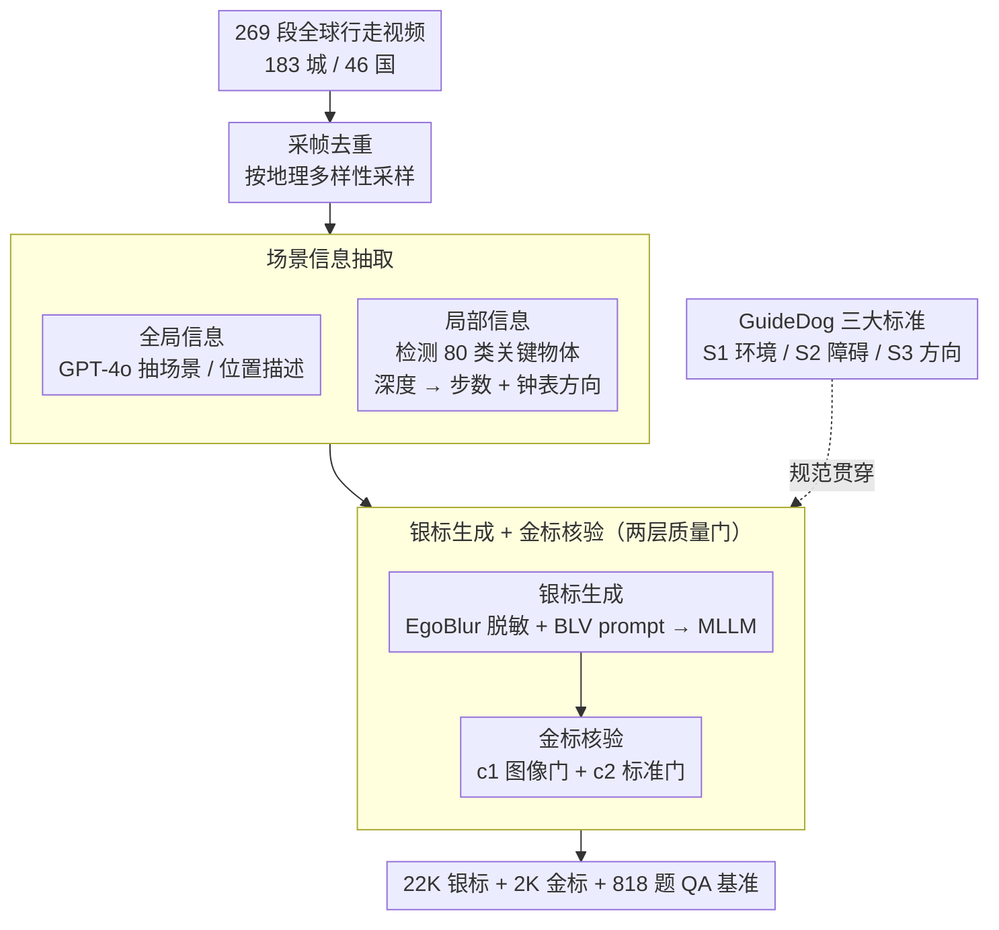

# GuideDog: A Real-World Egocentric Multimodal Dataset for Blind and Low-Vision Accessibility-Aware Guidance

**会议**: ACL 2026  
**arXiv**: [2503.12844](https://arxiv.org/abs/2503.12844)  
**代码**: https://jun297.github.io/GuideDog/  
**领域**: 多模态VLM / 无障碍 / 数据集  
**关键词**: BLV 导航、第一视角、MLLM 评测、深度感知、人机协同标注

## 一句话总结
GuideDog 用「专家规范驱动的银标生成 + 人工核验金标」流水线，从 269 段全球行走视频中构建出 22K 张第一视角行人场景图文对（含 818 题 QA 基准），首次让 MLLM 在 BLV（盲与低视力）导航任务上有了规模化、地理多样、标准化的训练与评测数据。

## 研究背景与动机

**领域现状**：全球 22 亿 BLV 人群每天面对独立出行的安全难题，约 7% 视障者每月至少摔倒一次。早期方案以电子助行器 + 计算机视觉为主，只能完成「障碍检测/避让」，无法回答「我处在什么环境里、下一步该往哪走」。MLLM（GPT-4o、Gemini、Qwen-VL 等）让高阶场景理解成为可能，少量近期工作开始把 MLLM 用作 BLV 视觉助手。

**现有痛点**：现有 BLV 数据集要么太小（VIALM 200 张、Merchant 48 张），要么不是行人第一视角（VizWiz 是 BLV 用户随手拍的物品照片），要么地理覆盖严重失衡（WalkVLM 仅 10 个地点）。视觉任务又要求大量「BLV-aware」描述，普通明眼标注员根本无法准确预判 BLV 用户真正关心什么，只能靠极少数专家手工写，规模与多样性都被卡死。

**核心矛盾**：BLV 标注的「质量」和「规模」之间存在结构性矛盾——专家保证质量但供给极少；纯自动生成规模够但根本不符合 BLV 真实需求；明眼众包既不专业也容易遗漏关键障碍。

**本文目标**：(1) 用一套可扩展流水线产出至少万级、地理多样、符合 BLV 出行专业指南的图文对；(2) 提供一个细粒度评测基准，专门考察 MLLM 在真实街景下的物体识别和相对深度判断；(3) 系统刻画当前 MLLM 在 BLV 导航上的能力与短板。

**切入角度**：把官方 BLV 引导规范（Vision Australia、Be My Eyes、Wisconsin DHS 等十多份指南）提炼成 3 条机器可执行的「GuideDog 标准」(S1 描述环境 / S2 描述障碍 / S3 给方向)，再用「生成→核验」替代「从头生成」——MLLM + 检测器 + 深度模型先生成「银标」，人工只做过滤和修正得到「金标」，把昂贵的人力从写作转移到核对。

**核心 idea**：用「专家规范模板 + 银标自动生成 + 金标人工核验」三段式流水线，把不可扩展的专家写作变成可扩展的专家审核，同时配套一个专测 MLLM 真实空间感知的 QA 基准。

## 方法详解

### 整体框架

GuideDog 要解决的是"BLV 导航数据既要专业又要规模"这个结构性矛盾，核心思路是把不可扩展的专家写作换成可扩展的专家审核。流水线分四步：先从全球行走视频里按地理多样性采帧去重，得到第一视角场景图；再抽取全局信息（场景/位置的文字描述）和局部信息（80 类关键物体 + 边框 + 步数距离 + 钟表方向）；接着把这些结构化信息塞进 BLV 专用 prompt，让 MLLM 写出符合 S1/S2/S3 三大标准的"银标"导航文本；最后由 3 名标注员按图像可用性 $c_1$ 和标准符合度 $c_2$ 两道关卡过滤修正，得到 2106 张人工核验的"金标"。三大标准（S1/S2/S3）在生成与核验两端反复被引用，是贯穿整条流水线的规范主线。最终产出 22K 银标 + 2K 金标 + 818 题 QA 基准。

### 关键设计

**1. GuideDog 三大标准（S1/S2/S3）：把十几份出行指南压成三条机器可执行、人可逐条审核的硬规范**

BLV 引导经验散落在 Vision Australia、Be My Eyes、Wisconsin DHS 等十多份官方指南里，明眼标注员根本无法准确预判 BLV 用户真正在意什么，任何脱离规范的"自由发挥"在真实使用中都会失效。GuideDog 把这些经验 distill 成三条标准：S1 描述周围环境（位置 + 关键环境元素），如"你在一条两侧有店铺的繁忙步行街上"；S2 逐个描述障碍的类型、钟表方向和步数距离，如"正前方 12 点钟、4 步外有一根标志杆"；S3 用直觉量（"3 步""1 点钟方向"）而非精确量（"3 ft""5 m"）给出汇总方向。

这三条标准之所以关键，是因为它在 pipeline 里一物三用：既是 MLLM 生成银标的 prompt 模板，又是人工核验时逐条勾的 checklist，还是评测打分的维度。把规范显式化，等于同时给生成端套上约束、给评测端定下可衡量的尺子——BLV 用户偏好步数 + 钟表方向而非米/英尺，这种认知特性一旦写进标准就能端到端贯穿。

**2. 场景信息抽取——80 类关键物体 + 钟表方向 + 步距离：把图像变成结构化障碍清单，让 MLLM 只需"写"而不必"判断"**

如果直接让开放词表 MLLM 自由生成导航文本，它会出现同义词混乱、漏检小障碍、用不符合 S3 的米/英尺量纲。GuideDog 因此先把图像拆成结构化信息再喂给 MLLM：用 GPT-4o 过掉天空/地面/被完全遮挡的废帧并抽出场景与位置描述 $\mathcal{X}^{\text{global}}=(t^s,t^l)$；再用开放词表检测器在 80 类 BLV 关键物体上检测得到 $\mathcal{O}_i,\mathcal{B}_i$，配合 Depth-Anything 类深度模型生成深度图 $m_i$。

每个物体的距离 $d_{ij}$ 取边框内深度的中位数，再按 0.7 m/步换算成步数；方向 $l_{ij}$ 则按边框中心的横向位置映射到 10/11/12/1/2 点钟。这些聚合成 $\mathcal{A}_i=\{(o_{ij},b_{ij},d_{ij},l_{ij})\}$ 后，再让 MLLM 从中筛出真正"BLV 关心"的子集 $\mathcal{X}^{\text{local}}$ 去写银标。本质上是把"80 类关键物体 + 步数/钟表向"这套 BLV 常识硬编码进 pipeline，把判断前置、只留下表达，银标质量因此更稳定。

**3. 银标自动生成 + 金标人工核验的两层质量门：用约三成的拒收成本换来 22K 的训练规模**

完全人工标注不可扩展，完全自动生成又不可信，GuideDog 用两层质量门夹在中间。第一层生成银标：先用 EgoBlur 模糊人脸车牌，再把 $\mathcal{X}^{\text{global}}$ 和 $\mathcal{X}^{\text{local}}$ 拼进 BLV-aware 指令喂 MLLM，一次产出覆盖 S1+S2+S3 三段的导航文本。第二层人工核验：3 名标注员同时跑两个过滤——图像级 $c_1$（可读性/角度/遮挡）和标准级 $c_2$（是否真符合 S1/S2/S3），不合格就拒，可修就修。

统计上 26.5% 的样本因图像质量被拒、8.1% 因标准不符被拒，反过来说明在质量过关的图上，pipeline 几乎都能产出标准合规的输出。正是"显式标准 + 自动生成 + 可量化拒收率"三件套同时在场，才让这个数据集既扩到 22K 又守住了质量。

### 损失函数 / 训练策略
GuideDog 本身是数据集论文，模型侧只做了 Qwen2.5-VL + LoRA 的小规模微调，直接在 22K 银标上做标准下一 token 预测（无特殊损失），用于验证"在 GuideDog 上微调能否显著拉高开源模型"的命题。

## 实验关键数据

### 主实验：导航生成（GuideDog）
0-shot / 3-shot 双设置下 BLEU/ROUGE/METEOR/GPT-Eval/Gemini-Eval 全维评测。

| 模型 | 0-shot GPT-Eval | 3-shot GPT-Eval | 0-shot METEOR | 3-shot METEOR |
|--------|------|------|------|------|
| Cambrian-1 (开源) | 0.219 | 0.307 | 0.267 | 0.375 |
| Qwen2.5-VL (开源) | 0.230 | 0.319 | 0.294 | 0.412 |
| Qwen2.5-VL **+ GuideDog LoRA** | **0.541** | 0.529 | **0.471** | 0.456 |
| Gemini 2.0 Flash | 0.462 | 0.481 | 0.400 | 0.463 |
| GPT-4o | 0.490 | 0.505 | 0.445 | 0.474 |
| Socratic GPT-4o (纯文本推理) | 0.384 | 0.391 | 0.419 | 0.417 |

### 消融/分析：视觉感知 QA（GuideDogQA）
专门把"识别 vs 深度"拆开看，揭示出现有 MLLM 的能力错位。

| 模型 | 物体识别 Acc | 相对深度 Acc | 说明 |
|------|------|------|------|
| 随机 | 25.0 | 25.0 | 4 选 1 / 2 选 1 双向 |
| Cambrian-1 | 82.3 | 24.3 | 识别强但深度等同瞎猜 |
| Qwen2.5-VL | 85.7 | 22.2 | 同上，深度甚至低于随机 |
| Qwen2.5-VL **+ GuideDog LoRA** | 83.9 | **41.5** | 识别基本持平，深度 +19.3 |
| Gemini 2.0 Flash | 65.7 | 53.0 | 闭源识别偏弱但深度好得多 |
| GPT-4o | 74.7 | **67.1** | 深度感知遥遥领先 |

### 关键发现
- **微调贡献最大**：Qwen2.5-VL LoRA 后 GPT-Eval 从 0.230 飙到 0.541，超过 GPT-4o，说明 22K 银标足以把开源 MLLM 推到准 SOTA，验证了银标的实用价值。
- **深度感知是真瓶颈**：所有开源模型的相对深度准确率都在 22–32%（接近瞎猜），只有 GPT-4o 达到 67%；而 BLV 导航偏偏最需要"前面 3 步有东西"这种距离判断，这也解释了为什么 S2（障碍描述）在用户研究里普遍打分最低。
- **Socratic 模型反证视觉信息不可替代**：把视觉先转字幕再纯文本推理（SM 流水线）在 0-shot/3-shot 差异极小且整体弱于直接 MLLM，说明任务真的需要"看图"而不是"看字幕"。
- **银标本身就接近上限**：用户研究里过滤后的银标 Likert 平均 4.63（满分 5），高于 GPT-4o 的 3.90，说明 pipeline 产出的文本质量本身就很好，瓶颈在底层视觉模型的空间感知。

## 亮点与洞察
- **把"专业指南"做成 prompt + 评测 checklist**：BLV 出行有十几份官方专业指南，作者把它们 distill 成 S1/S2/S3 三条标准，同时用于生成 prompt、人工核验 checklist 和 LLM-as-a-judge 评分维度，三个角色复用同一套规范，让"规范一致性"在 pipeline 里端到端贯穿。
- **生成→核验的范式**：把人力成本从"写作"转到"审核"，配上 26.5%+8.1% 的可量化拒收率，既能扩规模又能保证质量；这套范式在任何"标注规则明确但样本要海量"的细分场景（医学影像、法律条款、可达性合规）都可以直接迁移。
- **把"识别"和"深度"拆开测**：GuideDogQA 没有再做综合性的 VQA，而是单测物体识别 + 相对深度两个子能力，结果一眼看出开源 MLLM 的"识别强 / 深度瞎猜"非对称弱点，对后续做空间感知专项强化非常有指导价值。

## 局限与展望
- **银标天花板被底模锁死**：作者自己也承认银标的主要噪声来自检测器幻觉/漏检，pipeline 的上限被开放词表检测器 + 深度估计器钉住，将来需要把感知模块也纳入主动学习循环。
- **图像级而非视频级**：BLV 真实导航是连续视频流，本文 22K 都是采样自视频的静态帧，缺少时序连贯性（前后帧的指令一致性、动态障碍跟踪）评测。
- **3 名明眼标注员的主观偏差**：金标核验仍由明眼人完成，虽然有规范 checklist，但"对 BLV 真有用"最终需要 BLV 用户做闭环验证，作者只做了 14 人小规模 user study。
- **可改进方向**：把 BLV 用户加入审核环 + 引入视频时序版本 + 联合训练检测/深度/语言三个模块以闭环优化银标质量。

## 相关工作与启发
- **vs VizWiz / VIALM / Merchant**：这些前作都靠纯人工标注，VizWiz 31K 但不是导航任务，VIALM 200 张专业但太小；GuideDog 用"人机协同"在同等专业度下把规模拉到 22K 且地理覆盖 183 城/46 国。
- **vs WalkVLM / EgoBlind**：同样是视频源，但 WalkVLM 只 10 个地点且是视频问答，EgoBlind 仅 1.3K 视频片段；GuideDog 把视频降采样为大规模静态帧并强制按 BLV 标准结构化输出，规模和标准化都强一档。
- **vs Socratic Models**：原 Socratic 论文主张"纯文本推理可替代视觉模型"，本文 SM 基线明确反例——SM 在 BLV 导航上低于直接 MLLM，提示"空间任务"是 Socratic 范式的薄弱区。

## 评分
- 新颖性: ⭐⭐⭐⭐ 「专家规范驱动 + 生成→核验」范式在 BLV 场景首次系统化，标准 S1/S2/S3 抽象有原创性
- 实验充分度: ⭐⭐⭐⭐ 覆盖 7 个 MLLM × 0/3-shot × 自动+LLM+人评三套指标，QA 拆分识别/深度的设计很巧
- 写作质量: ⭐⭐⭐⭐ 流水线图、统计表、定性对比都清晰，规范 distill 部分引用十多份指南有学术诚意
- 价值: ⭐⭐⭐⭐⭐ 直接为 22 亿 BLV 人群的辅助 AI 提供首个规模化标准化训练/评测基座，社会价值显著

<!-- RELATED:START -->

## 相关论文

- [\[CVPR 2026\] Towards Real-World Document Parsing via Realistic Scene Synthesis and Document-Aware Training](../../CVPR2026/multimodal_vlm/towards_real-world_document_parsing_via_realistic_scene_synthesis_and_document-a.md)
- [\[ACL 2026\] EDU-CIRCUIT-HW: Evaluating Multimodal Large Language Models on Real-World University-Level STEM Student Handwritten Solutions](edu-circuit-hw_evaluating_multimodal_large_language_models_on_real-world_univers.md)
- [\[NeurIPS 2025\] WearVQA: A Visual Question Answering Benchmark for Wearables in Egocentric Authentic Real-world scenarios](../../NeurIPS2025/multimodal_vlm/wearvqa_a_visual_question_answering_benchmark_for_wearables_in_egocentric_authen.md)
- [\[CVPR 2026\] MMSD3.0: A Multi-Image Benchmark for Real-World Multimodal Sarcasm Detection](../../CVPR2026/multimodal_vlm/mmsd30_a_multi-image_benchmark_for_real-world_multimodal_sarcasm_detection.md)
- [\[ICLR 2026\] Can Vision-Language Models Answer Face to Face Questions in the Real-World?](../../ICLR2026/multimodal_vlm/can_vision-language_models_answer_face_to_face_questions_in_the_real-world.md)

<!-- RELATED:END -->
