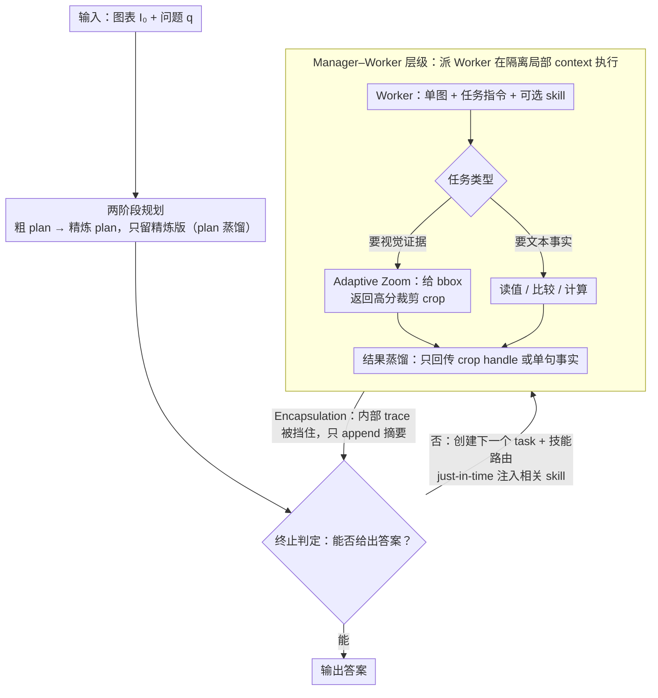

# HierVA: Hierarchical Visual Agent — Managing Contexts in Joint Image-Text Space for Advanced Chart Reasoning

**会议**: ACL 2026  
**arXiv**: [2605.04304](https://arxiv.org/abs/2605.04304)  
**代码**: 待确认  
**领域**: 多模态VLM / Agent / 图表推理  
**关键词**: chart QA, hierarchical agent, multimodal context, zoom-in, training-free

## 一句话总结
HierVA 用 "manager–worker" 双层多模态 agent，把图表推理过程中的图像和文本 context 都按"获取–限定–蒸馏"的纪律管理起来，零训练地在 CharXiv 等复杂图表推理 benchmark 上稳超 CoT 和 "thinking with images" 等强基线。

## 研究背景与动机

**领域现状**：图表问答（Chart QA）是科研助手和文档理解系统的核心能力。CoT 让 MLLM 显式推理，而新近的 "thinking with images" 范式（OpenAI 2025、Lai 2025、Zheng 2025 等）允许模型在推理过程中迭代获取额外视觉证据（如 zoom-in crop），把视觉细节带进 reasoning trace。

**现有痛点**：单图、单步问题（ChartQA-style）上 MLLM 已 90%+；但对多 subplot、多步推理的复杂图表（CharXiv reasoning split），现有方法都崩——CoT 在全局图上分心于无关元素，"thinking with images" 把每次 zoom-in crop 不断 append 到 context 里，导致 **monotonic context growth**：图像吃 token、中间步骤越积越多，反而把全局参照信息稀释掉。

**核心矛盾**：复杂图表推理本质是图像–文本混合任务，需要"小区域细节"与"多步中间结果"同时保留；但 LLM context 是有限的、且文本+图像信息会互相 dilute，越往后越乱。

**本文目标**：在不训练任何模型的前提下，把多模态推理的 context 管理学问做扎实——既要拿到该拿的细节，又要随手把不必要的中间产物蒸馏掉。

**切入角度**：把管理文本 reasoning trace 的同套纪律（plan distillation、scope、summarize）平移到视觉 context 上，并用 **manager-worker 层级架构**强制执行。

**核心 idea**：用一个 manager 维护全局精炼 context、用多个 worker 在各自隔离的局部 context 里干活，每次 zoom-in/计算结果只回传一个蒸馏摘要给 manager。

## 方法详解

### 整体框架

HierVA 要解决的是复杂图表推理里"context 越积越乱"的问题：一张多 subplot 的图加上多步推理，模型既要保留小区域的视觉细节，又要维持多步中间结果，但这两类信息会在有限的 token 预算里互相稀释。它的解法是把一套"管文本 context"的纪律——规划、限定作用域、蒸馏——平移到图像 context 上，并用一个层级 agent 架构强制执行。

具体来说，输入是图表 $I_0$ 加自然语言问题 $q$，输出是答案 $a$。一个 Manager 维护精炼的全局 context $C_M = \{q, I_0, \text{refined plan}, \text{distilled summaries}\}$，若干 Worker 各自在隔离的局部 context $C_{W_t} = \{\text{task instr}, \text{optional skill}, \text{single image}\}$ 里干活。Manager 按 Algorithm 1 的控制环运转：先做两阶段 planning（粗 plan 再细化、只留细化版），然后循环执行"终止判定 → 创建下一个 task → 派 Worker 执行 → 把蒸馏摘要 append 回 $C_M$"，直到能给出最终 $\boxed{}$ 答案。整条主线推理始终只看到 Manager 那份干净的 context，Worker 内部的折腾被挡在外面。

### 关键设计

**1. Manager–Worker 层级 + Encapsulation：用抽象屏障把局部噪声挡在主 context 外**

要对付的痛点很直接——以前的 thinking-with-images 把每个 worker 的所有 deliberation 都倒进主 context，于是图像吃 token、中间步骤越堆越多，最终把全局参照信息稀释掉，也就是 monotonic context growth。HierVA 的做法是给执行单元加一道封装屏障：Manager 永远只看自己的 $C_M$；Worker 跑完任务后，它内部的 reasoning trace 不会被 append 进 $C_M$，只把"一句话事实"或"一个 crop handle"作为蒸馏结果回传。同时每个 Worker 每次只接收单张图（原图或 crop）和最小化的任务指令，强制 scoped evidence。这样一来，主线推理的 context 增长就和子任务的复杂度脱钩，长链推理也不会被局部细节淹没。

**2. Adaptive Zoom 作为显式 action：把"看仔细一点"升格成一等公民动作**

图表里的小字、tick、legend 在全局尺度下经常看不清，模型必须能按需放大。HierVA 没有把"要不要看细节"埋在 CoT 的自然语言里，而是把 zoom 抽象成一个 image-expected task：Worker 接到后调用 zoom-in 工具，指定一个 bounding box，返回 cropped + resized 的高分辨率图像。于是 Manager 的 action space 收敛成清爽的二选一——要么要新的视觉证据（zoom），要么要文本事实（读值、比较、计算）。把放大显式建模成 typed action，调度和调试都比在 prompt 里含糊地提一句"注意细节"可控得多。

**3. Skill routing + 三重 context distillation：技能按需注入，三处堵住 context 膨胀的源头**

朴素做法是把所有可能用到的技能（比如调用代码做精确计算）都写进 base system prompt，但这会立刻让 context 膨胀。HierVA 维护一个紧凑的 skill library $\mathcal{S}$，每个 skill 只是一段简短的 markdown 过程描述；Manager 为每个 task 挑一组相关 skill，**just-in-time** 注入到对应 Worker 的 system prompt 里，而 Manager 自己永远看不到 skill 内容。这套 routing 再配合三重蒸馏共同收口：Plan distillation 只保留最终精炼版 plan，Worker encapsulation 隔离 worker 的内部 trace，Result distillation 把 worker 回答压成单句或 crop handle 再 append。三处恰好对应 context 膨胀的三个来源——规划啰嗦、执行噪声、结果冗长——逐一封住，能力保留但主线不被污染。

### 一个完整示例

以一个 CharXiv 风格的多步问题为例（"在标着 GDP 的子图里，2020 年那一点的数值比 2015 年高多少"），走一遍 HierVA 的控制环就能看清这套机制怎么协同：

- Manager 先做两阶段 planning，把任务细化成"定位 GDP 子图 → 读 2020 与 2015 两个数值 → 求差"，只把细化后的 plan 留在 $C_M$。
- 第一轮，Manager 发出一个 zoom task；某个 Worker 拿到原图和 bounding box，调用 zoom-in 返回 GDP 子图的高分裁剪，**只回传一个 crop handle**，它内部"怎么找到这个子图"的折腾不进 $C_M$。
- 第二轮，Manager 发出读值 task，并 just-in-time 注入"精确读坐标值"的 skill；Worker 在那张 crop 上读出两个数值，**只回传两句事实**。
- 第三轮，Manager 发出计算 task，注入代码 skill 让 Worker 算差，回传一句结果。
- Manager 在自始至终都只看到精炼 plan + 三条蒸馏摘要，于是直接给出 $\boxed{}$ 答案。

整条流程里，Manager 的 context 始终只增加了几句蒸馏摘要，而不是把三次 zoom、读值、计算的全部中间 token 都堆进来——这正是它在 subplot 越多时掉分越少的原因。（此例为示意，用以说明控制环各步如何衔接。）

### 损失函数 / 训练策略
training-free，没有任何参数更新——所有改进都来自 prompt orchestration 设计，复用同一个底座 MLLM（实验用 Qwen3VL-A22B）。

## 实验关键数据

### 主实验：CharXiv reasoning split
对比 Direct / CoT / CoT-Plan / Thinking w/ Images 等基线，统一用 Qwen3VL-A22B 作为底座。指标含整体 Acc 与子类型：Extr / First / Read / RevR / Comp / Freq；同时报告 Peak Token #。

| 方法 | Image Tools | Skills | CharXiv-All | Peak Tok # |
|------|-------------|--------|-------------|------------|
| Direct | — | — | 45.7 | 702 |
| CoT | — | — | 62.1 | 1926 |
| CoT-Plan | — | — | 62.4 | 1947 |
| Thinking w/ Images | zoom | — | （见原表） | — |
| **HierVA (Ours)** | zoom + code | ✓ | **稳超所有基线** | 控制增长 |

在 ChartQA + 合成多 subplot 图（sp#1→sp#6）上：随 subplot 数增加，所有方法都掉分，但 HierVA 仅掉 **1.5%**，CoT 掉 2.6%，CoT-Plan 掉 3.8%，Direct 掉 5.4%。

| 方法 | ChartQA | sp#1 | sp#2 | sp#4 | sp#6 |
|------|---------|------|------|------|------|
| Direct | 88.9 | 88.5 | 86.5 | 84.8 | 83.1 |
| CoT | 90.2 | 90.1 | 89.2 | 88.4 | 87.5 |
| Thinking w/ Images | 89.9 | 89.7 | 88.5 | 87.4 | 87.5 |
| **HierVA** | 89.9 | 89.7 | 89.2 | 88.5 | **88.2** |

### 消融实验

| 配置 | 关键效果 | 说明 |
|------|---------|------|
| Full HierVA | 最佳 | manager+worker + 三重蒸馏 |
| w/o 层级架构 | 显著下降 | 退化为 thinking-with-images |
| w/o scoped visual context | 中等下降 | worker 拿全图反而被分心 |
| w/o distilled context | 中等下降 | manager context 膨胀，长链推理掉分 |

### 关键发现
- 简单问题（ChartQA-style 单步检索）context 管理收益小，HierVA 与 thinking-with-images 打平；优势真正体现在需要多步 reasoning 的复杂 chart 上。
- 复杂度（subplot 数）越高，HierVA 的相对优势越明显——这正印证了"长链推理才考验 context 管理"。
- 三个蒸馏机制互补：单独去掉任一个都掉分，说明 plan/worker/result 三处都是 context 膨胀的源头。

## 亮点与洞察
- **把"管 text context"的纪律照搬到"管 image context"**：核心见解是图像和文本在 token-budget 层面是同质的，所以蒸馏/scope/encapsulation 一样适用。这个 framing 本身就值。
- **Skill just-in-time 注入**：对比传统"全 skill 写进 system prompt"，这种按需注入的设计对所有 tool-use agent 都通用。
- **Zoom 作为一等公民 action**：相比把"看仔细一点"埋在 CoT 里，把 zoom 显式建模成 typed action，调度/调试都更可控。

## 局限与展望
- 完全依赖底座 MLLM 的 instruction following 能力，对小模型可能直接失效。
- Peak token 仍然不低，对延迟敏感场景需要进一步压缩。
- 评测只到 CharXiv reasoning split + ChartQA + 合成图，对真实 dashboard、地图、流程图等更杂的视觉文档暂未验证。
- 没有学得的 skill selection 策略，靠 manager prompt 启发式选 skill，跨域泛化可能受限。

## 相关工作与启发
- **vs CoT / CoT-Plan**：纯文本 CoT 看不到细节，CoT-Plan 不能动态获取证据；HierVA 把图像也纳入工作内存。
- **vs Thinking w/ Images**（Zheng 2025）：同样允许 zoom，但 HierVA 用层级 + 蒸馏避免 context 单调膨胀，是其结构化升级版。
- **vs ReAct / Tool Agents**：思路同源（agent + tool），但 HierVA 强调多模态 context 管理这一被忽视的环节。

## 评分
- 新颖性: ⭐⭐⭐⭐ Manager-worker + 蒸馏的 framing 在多模态 agent 里是清晰的新切角。
- 实验充分度: ⭐⭐⭐ 主要在 CharXiv + ChartQA，合成 subplot 实验设计巧但 benchmark 覆盖不够广。
- 写作质量: ⭐⭐⭐⭐ Motivation 与 design principle 串联紧密，三重蒸馏点出问题本质。
- 价值: ⭐⭐⭐⭐ Training-free 即插即用，对 chart 助手类应用直接可用。

<!-- RELATED:START -->

## 相关论文

- [\[CVPR 2026\] Monet: Reasoning in Latent Visual Space Beyond Image and Language](../../CVPR2026/multimodal_vlm/monet_reasoning_in_latent_visual_space_beyond_image_and_language.md)
- [\[CVPR 2026\] Hierarchical Attacks for Multi-Modal Multi-Agent Reasoning](../../CVPR2026/multimodal_vlm/hierarchical_attacks_for_multi-modal_multi-agent_reasoning.md)
- [\[ACL 2026\] TEMA: Anchor the Image, Follow the Text for Multi-Modification Composed Image Retrieval](tema_anchor_the_image_follow_the_text_for_multi-modification_composed_image_retr.md)
- [\[ACL 2026\] Learning More from Less: Exploiting Counterfactuals for Data-Efficient Chart Understanding](learning_more_from_less_exploiting_counterfactuals_for_data-efficient_chart_unde.md)
- [\[ACL 2026\] SlideAgent: Hierarchical Agentic Framework for Multi-Page Visual Document Understanding](slideagent_hierarchical_agentic_framework_for_multi-page_visual_document_underst.md)

<!-- RELATED:END -->
