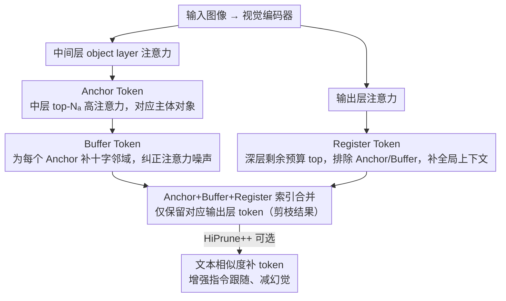

# HiPrune: Hierarchical Attention for Efficient Token Pruning in Vision-Language Models

**会议**: ACL 2026 Findings  
**arXiv**: [2508.00553](https://arxiv.org/abs/2508.00553)  
**代码**: [GitHub](https://github.com/Danielement321/HiPrune)  
**领域**: 多模态效率 / 视觉token压缩  
**关键词**: 视觉token剪枝, 层级注意力, 免训练, 模型无关, VLM加速

## 一句话总结

本文发现视觉编码器中存在层级注意力模式——中层关注主体对象、深层关注全局信息，据此提出 HiPrune，一种免训练、模型无关的视觉 token 剪枝方法，通过选择三类 token（Anchor/Buffer/Register）保留不同层级的视觉信息，仅用 1/3 token 保持 99.3% 性能，FLOPs 减少 58.7%。

## 研究背景与动机

**领域现状**：VLM 将图像编码为大量 token（LLaVA-1.5 中 576 个，高分辨率场景可超 10000 个），导致显著的计算和内存开销。视觉 token 存在高度冗余——随机去除 50% 视觉 token 的性能下降远小于去除 5% 文本 token。

**现有痛点**：(1) FastV 等方法在 LLM 解码器内部根据注意力分数剪枝，但未利用视觉编码器自身的内在属性；(2) 基于 CLS token 注意力的方法无法适用于没有 CLS token 的编码器（如 SigLIP）；(3) 大多数方法对特定模型敏感，需要针对性调优。

**核心矛盾**：现有剪枝方法要么依赖 LLM 端的反馈（计算浪费——先编码全部 token 再剪枝），要么使用单一维度的指标（如仅用最后层注意力），忽略了视觉编码器不同层捕获不同语义层次信息的事实。

**本文目标**：利用视觉编码器内在的层级注意力模式设计通用的 token 剪枝策略。

**切入角度**：系统分析 CLIP、SigLIP、DeiT、VJEPA2 等多种视觉编码器的层级注意力模式，发现一致的层级特化规律。

**核心 idea**：中层高注意力 token 对应主体对象（Anchor），加上空间邻域（Buffer）保留局部语义；深层高注意力 token 均匀分布图像各处（Register）保留全局信息；按预算分配三类 token 即可紧凑表示图像。

## 方法详解

### 整体框架

HiPrune 在视觉编码器输出前进行：(1) 从中间层提取注意力分数，选择高注意力 token 作为 Anchor；(2) 选择 Anchor 的空间邻居作为 Buffer；(3) 从输出层提取注意力分数，选择剩余预算的高注意力 token 作为 Register；(4) HiPrune++ 可选地增加基于文本相似度的 token。最终仅保留这些索引对应的输出层 token。

### 关键设计

**1. Anchor Token（中层对象 token）：从中间层注意力里捞出主体对象，保住局部细节**

过去基于注意力的剪枝大多只看最后一层，但最后一层的高注意力 token 是均匀铺开的全局信息，并不对应具体对象，于是物体的局部细节容易被剪掉。HiPrune 改从一个指定的 object layer $l$（视觉编码器的中间层）提取注意力分数 $\mathbf{a}^{[l]}$，选其中 top-$N_a$ 的高注意力 token 作为 Anchor。这个选择有定量依据：作者发现中层 top-10% 的高注意力 token 与 COCO 对象分割掩码的 IoU 最高，也就是说中层注意力天然聚焦在图像主体上。更关键的是，这个"中层关注对象"的规律在 CLIP / SigLIP / DeiT / VJEPA2 等多种编码器上一致出现，所以 Anchor 的选取不依赖任何特定模型的特性。

**2. Buffer Token（空间邻域 token）：用十字邻域纠正注意力噪声，把对象补全**

注意力图本身是有噪声的——少数高注意力 token 可能零星散布在图像各处，而不是干净地落在对象上，只靠 Anchor 会漏掉对象边缘或被孤立噪声点带偏。Buffer 的做法是为每个 Anchor token 补上它的上下左右四个空间邻居（十字形）：

$$\mathcal{I}_B = \cup\{\mathcal{I}_A - 1,\ \mathcal{I}_A + 1,\ \mathcal{I}_A - c,\ \mathcal{I}_A + c\}$$

其中 $c$ 是每行的 token 数。靠这种空间连续性，原本散开的高注意力点被周围的同对象 token 兜住，对象区域被补得更完整。实验也显示 Buffer 的贡献虽小但稳定（97.5% → 99.3%），而且对邻域形状（十字、方形）并不敏感。

**3. Register Token（深层全局 token）：从输出层补回场景级的全局上下文**

只留对象 token 会丢掉场景类型、空间布局这类全局信息，模型会"只见树木不见森林"。HiPrune 因此再从输出层（最后一层）的注意力分数里，按剩余预算选 top token 作为 Register，并排除已选的 Anchor 和 Buffer。之所以放在深层选，是因为深层的高注意力 token 恰好均匀分布于图像各处、编码的是全局信息——这与中层聚焦对象形成互补。最终三类 token 按预算分配后拼成一组紧凑索引，对应的输出层 token 就是剪枝后保留的全部视觉表示。

### 损失函数 / 训练策略

完全免训练方法，不修改任何模型参数。HiPrune++ 额外利用文本编码器与视觉 token 的余弦相似度选择少量 token 增强指令跟随。

## 实验关键数据

### 主实验

**LLaVA-1.5-7B（576→192 tokens，33.3%）**

| 方法 | GQA | MMB | MME | POPE | SQA | VQAv2 | 平均 |
|------|-----|-----|-----|------|-----|-------|------|
| 原始 (576 tokens) | 61.9 | 64.7 | 1862 | 85.9 | 69.5 | 78.5 | 100% |
| ToMe | 54.3 | 60.5 | — | — | — | — | — |
| FastV | 58.2 | 62.1 | — | — | — | — | — |
| **HiPrune** | **61.4** | **64.2** | **1852** | **85.6** | **69.1** | **78.1** | **99.3%** |

### 消融实验

| 配置 | 平均性能保持 |
|------|-----------|
| 仅 Anchor（中层） | 94.2% |
| 仅 Register（深层） | 92.8% |
| Anchor + Register | 97.5% |
| **Anchor + Buffer + Register** | **99.3%** |

### 关键发现

- 仅用 1/3 token 保持 99.3% 性能，FLOPs 减少 58.7%——证明视觉 token 的高度冗余
- 层级注意力模式在 6 种不同架构（CLIP-L/B、SigLIP、SigLIP2、DeiT、VJEPA2）上一致存在——这是视觉编码器的固有特性而非特定训练的产物
- HiPrune++ 在极低预算（1/9 token）下保持 96.1% 性能，并显著减少幻觉
- Buffer token 的贡献虽小但稳定——从 97.5% 提升至 99.3%，且对不同形状（十字、方形）不敏感

## 亮点与洞察

- "中层关注对象、深层关注全局"的发现简洁有力，定量分析（IoU）和定性可视化（注意力图）双重验证
- 免训练+模型无关的设计使其成为真正的"即插即用"工具
- 三类 token 的设计对应了图像理解的三个层次：局部细节、空间上下文、全局语义

## 局限与展望

- object layer $l$ 的选择需要针对每种编码器确定（通常是中间层）
- 对于需要精确像素级理解的任务（如 OCR），剪枝可能损失关键信息
- 视频 token 剪枝的扩展未充分探索
- 与动态分辨率编码器的集成需要进一步验证

## 相关工作与启发

- **vs FastV**: FastV 在 LLM 解码器内剪枝，需先编码全部 token；HiPrune 在视觉编码器阶段剪枝，更早更高效
- **vs CLS-based 方法**: 依赖 CLS token 不通用（SigLIP 无 CLS）；HiPrune 使用层级注意力分数，适用于任何 ViT
- **vs ToMe**: ToMe 通过相似度合并 token 需训练或额外计算；HiPrune 纯索引选择零额外开销

## 评分

- 新颖性: ⭐⭐⭐⭐ 层级注意力分析的发现新颖，但剪枝方法本身相对简单
- 实验充分度: ⭐⭐⭐⭐⭐ 4 种 VLM × 多种编码器 × 6 种视觉编码器的一致性验证
- 写作质量: ⭐⭐⭐⭐⭐ 动机清晰，从观察到方法的逻辑链完整
- 价值: ⭐⭐⭐⭐⭐ 即插即用、58.7% FLOPs 减少，实用价值极高

<!-- RELATED:START -->

## 相关论文

- [\[CVPR 2026\] TransPrune: Token Transition Pruning for Efficient Large Vision-Language Model](../../CVPR2026/multimodal_vlm/transprune_token_transition_pruning_for_efficient_large_vision-language_model.md)
- [\[CVPR 2026\] VLM-Pruner: Buffering for Spatial Sparsity in an Efficient VLM Centrifugal Token Pruning Paradigm](../../CVPR2026/multimodal_vlm/vlm-pruner_buffering_for_spatial_sparsity_in_an_efficient_vlm_centrifugal_token_.md)
- [\[ICCV 2025\] METEOR: Multi-Encoder Collaborative Token Pruning for Efficient Vision Language Models](../../ICCV2025/multimodal_vlm/meteor_multi-encoder_collaborative_token_pruning_for_efficient_vision_language_m.md)
- [\[ICML 2026\] CLIP Tricks You: Training-free Token Pruning for Efficient Pixel Grounding in Large Vision-Language Models](../../ICML2026/multimodal_vlm/clip_tricks_you_training-free_token_pruning_for_efficient_pixel_grounding_in_lar.md)
- [\[ICLR 2026\] Index-Preserving Lightweight Token Pruning for Efficient Document Understanding](../../ICLR2026/multimodal_vlm/index-preserving_lightweight_token_pruning_for_efficient_document_understanding_.md)

<!-- RELATED:END -->
