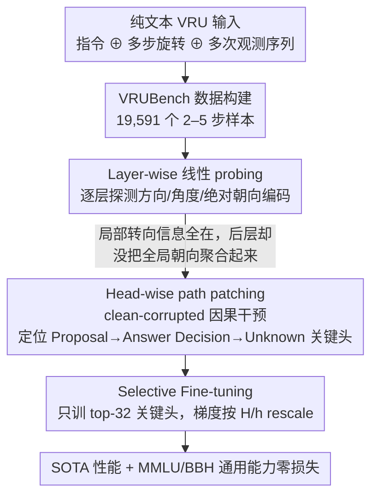

# How Do LLMs and VLMs Understand Viewpoint Rotation Without Vision? An Interpretability Study

**会议**: ACL 2026  
**arXiv**: [2604.15294](https://arxiv.org/abs/2604.15294)  
**代码**: https://github.com/Young-Zhen/VRU_Interpret (有)  
**领域**: 多模态VLM / 可解释性 / 空间智能  
**关键词**: 视角旋转理解, 路径修补, probing, 注意力头, 选择性微调

## 一句话总结
本文提出文本视角旋转理解 (VRU) 基准 VRUBench，用 layer-wise probing 与 head-wise path patching 揭示 LLM/VLM 之所以在该任务上接近随机的根因 —— 中后层关键头未能把"已感知的朝向"与"该朝向对应的观测"绑定，并通过只微调 32 个关键头就以 50% GPU 时间达到全量微调的效果且不损通用能力。

## 研究背景与动机

**领域现状**：空间智能近年成为热点，但绝大多数工作都把它当作 visual-spatial intelligence 来研究 —— 假设模型一定要"看见"才能理解空间。VRU（viewpoint rotation understanding，多步转向后预测最终观测）这类基本能力的纯文本形式几乎无人系统评估。

**现有痛点**：作者构造的纯文本 VRUBench 表明，几乎所有公开 LLM/VLM 都在 60% 以下，而人类轻松 100%；即便是 Qwen3-VL-32B-thinking 也只到 70%。模型在中间表征里到底"懂没懂"朝向、为什么最终输出还是错的，文献完全没回答。

**核心矛盾**：probing 显示中早期层已经能编码方向、角度甚至绝对朝向，但到 21-28 层朝向 probing 准确率反而下滑，最终答案接近瞎猜 —— 即"信息存在，但被丢掉"。

**本文目标**：(1) 用文本 benchmark 把 LLM/VLM 的纯文本空间能力量化；(2) 用 layer-wise probing + head-wise path patching 找出导致表现差的具体计算路径；(3) 把可解释性发现转化为模型改进方法。

**切入角度**：作者借鉴 Gardner 多元智能理论 —— "盲人也能感知空间"，因此 LLM 在没视觉时本该有部分空间智能。把多步旋转 + 多次观测序列化为纯文本输入，强迫模型在残差流里维持一个"心智地图"，再用 mechanistic interpretability 把这个地图打开。

**核心 idea**：用"interpret-then-improve"范式 —— 用 path patching 找到 VRU 的稀疏关键头，然后只微调这些头来同时获得 SOTA 性能 + 通用能力保留。

## 方法详解

### 整体框架
方法分三层：(1) **任务定义与数据**：把 prompt 形式化为 $P = I \oplus O_0 \oplus A_1 \oplus O_1 \oplus \cdots \oplus A_n$，旋转角 $\theta \in \{0°, 90°, 180°, 270°, 360°\}$，造出 19,591 个 2-5 步样本；(2) **可解释性分析**：layer-wise probe 看 direction / angle / orientation 编码情况，head-wise path patching 找 causal effect 大的注意力头；(3) **selective SFT**：只把 top-32 关键头的 $W_{K/Q/V/O}^{i,j}$ 设为 trainable，冻结其余。三层构成一条"先解剖、再对症下药"的闭环。

### 关键设计

**1. Layer-wise 线性 probing：逐层探测残差流，看模型到底在哪一层"懂"了又在哪一层把信息丢了**

要回答"模型中间表征里到底懂没懂朝向"，作者对每个 action $A_i$ 的最后一个 token 抽取各层 hidden state $\boldsymbol{h}_{i\ell}$，训练一个线性分类器 $\mathcal{F}_\ell$ 把它映射到三种 label——方向（binary）、角度（5-way）、绝对朝向（4-way）。坚持用线性 probe 是关键：非线性 probe 自己就能学到知识，会把"信号本来就在"和"probe 替模型算出来"混为一谈，线性才能干净地反映 representation 质量；再加一组随机 embedding 的 control experiment，确认探到的信号是真实存在而非偶然。这套设计探出了全文最核心的反差：方向 / 角度 probing 几乎全层都 >99%，说明局部转向信息一直在；但绝对朝向 probing 的准确率在 layer 1-20 缓慢上升、到 layer 21-28 反而下滑——局部信息齐全，却没能在后层被聚合成一个全局朝向，于是"信息存在，但被丢掉"。5-way 与 4-way 的分工正是为了同时检查这两件事：局部信息存不存在、有没有被汇总成全局朝向。

**2. Head-wise path patching：用因果干预把"丢信息"定位到具体的几个注意力头**

probing 只能说后层出了问题，但说不清是哪些计算单元在捣乱，path patching 把它精确到 head。作者构造 clean-corrupted 数据对——只翻转最后一步旋转方向，这样既保证 token 长度一致、又避免引入逻辑矛盾——并定义因果效应 $\phi_i = (logit_{pt} - logit_{cl}) / (logit_{cor} - logit_{cl})$；对每个 head 当 Sender，依次把它在 corrupted 输入下的激活替换进来，观察对最终 logit 差异 $\mathcal{M}(t_{cl}|\cdot) - \mathcal{M}(t_{cor}|\cdot)$ 的影响。只扰动最后一步、并过滤掉翻转后答案不变的 pair，是为了让 $logit_*$ 非零、效应可测。最终它揪出一条稀疏的关键路径：**Proposal head (22.1)** 先对所有候选答案都分注意力 → **Answer Decision head (26.14, 23.11)** 把注意力收敛到被选中的答案 → **Unknown head (27.14)** 在最后再对 "unknown" token 起特殊偏好（这反映 alignment 训练植入的谨慎倾向）。这三类头串起来，正好解释了"中间懂、最后错"是怎么发生的。

**3. Selective Fine-tuning：只对症下药地微调这几个关键头，省一半算力还不伤通用能力**

既然 path patching 已经证明那 32 个头才是真正"决定答案"的位置，那就没必要全量 SFT 把整个模型洗一遍——全量微调反而会改写承载通用能力的头，造成灾难性遗忘。作者把每层的 $W_{K/Q/V/O}^i$ 切成 $H$ 个 head block，只让 top-32 关键头的 $W_{K/Q/V/O}^{i,j}$ 可训练、其余冻结，并把梯度按 $H/h$ rescale，补偿"只训练少数头"带来的更新偏差。效果是双赢的：Qwen2.5-VL-3B 上只动 0.03B 参数（对比全量 3B），训练吞吐量从 10 sam/sec 提到 18 sam/sec；而且因为通用能力依赖的头没被碰，VRU 性能大涨的同时 MMLU / BBH 几乎零损失，避开了全量 SFT 的遗忘陷阱。

### 损失函数 / 训练策略
SFT 标准交叉熵 + Adam，lr $2 \times 10^{-5}$，batch 32，warmup 0.02，weight decay 0.1，1 epoch。训练集 19,641 条与 VRUBench 测试集严格分离。

## 实验关键数据

### 主实验

| 模型 | 2-step | 3-step | 4-step | 5-step | Avg |
|---|---|---|---|---|---|
| Human | 100 | 100 | 100 | 100 | **100** |
| LLaMA2-7B-chat | 5.44 | 17.22 | 26.24 | 25.64 | 18.90 |
| Qwen2.5-32B | 88.56 | 74.20 | 67.54 | 62.28 | 72.84 |
| Qwen3-VL-32B-thinking | 97.90 | 96.44 | 96.16 | 95.82 | **96.55** |
| Gemini3-Flash-thinking | 93.15 | 90.32 | 85.71 | 76.65 | 86.32 |

| 配置 (Qwen2.5-VL-7B) | Train Speed | Tuned Param | VRUBench Acc | SpinBench (OOD) | MMLU | BBH |
|---|---|---|---|---|---|---|
| baseline | - | - | 48.7 | 44.8 | 60.3 | 49.2 |
| Full SFT | 5 sam/sec | 7.0B | **96.3 (+47.6)** | 47.3 (+2.5) | 55.6 (**-4.7**) | 35.8 (**-13.4**) |
| Selective SFT (本文) | 11 sam/sec | 0.06B | 78.7 (+30.0) | **48.4 (+3.6)** | 60.3 (+0.0) | 48.4 (-0.8) |

### 消融实验

| 配置 | 关键观察 | 说明 |
|---|---|---|
| 全部 head | VRU baseline | Qwen2.5-VL-7B |
| 去掉 top-K causal heads | 性能急剧下降 | 证明识别出的关键头确实承担 VRU 计算 |
| 去掉随机 K 个 head | 几乎不变 | 控制实验排除"动哪都掉"的解释 |
| 去掉 Unknown head 27.14 | 输出 "unknown" 占比 65.78% → 40.73% | 证明该 head 承担"对未知的谨慎"功能 |
| LLM vs VLM (同尺寸) | Qwen2.5-VL-7B > Qwen2.5-7B | 视觉训练即便推理时不用图也能强化空间表征 |
| think vs no-think | Qwen3-VL-8B-think 85.57 vs no-think 64.33 (2-step) | 显式推理在文本空间任务上有效，与 visual-spatial 任务的结论相反 |

### 关键发现
- **Selective SFT 在 OOD 视觉空间数据集 SpinBench 上反而比 full SFT 高 1.1 个点**，且 MMLU / BBH 几乎零损失 —— 证明"对症下药"比"洗一次澡"更稳。Full SFT 在 BBH 上掉 13.4 个点，是典型的灾难性遗忘。
- **3B 模型在 selective SFT 后甚至超过 7B**（80.1 vs 78.7）—— 因为 32 个 head 在 3B 中占 5.6%，在 7B 中只占 4.1%，固定头数下小模型相对训练比例更高。
- **Reasoning vs Non-reasoning 在文本空间任务上"有效"，在 visual-spatial 任务上"无效"** —— 与 Yang et al. 2025 在 VSI-Bench 的结论恰好镜像，提示文本空间智能与视觉空间智能存在本质差异。
- **路径模式跨模型一致**：LLaMA2-7B / Qwen2.5-7B / Qwen2.5-VL-3B 都在中后层出现稀疏关键头，证明这是 Transformer 架构层面的通用现象。

## 亮点与洞察
- **"interpret-then-improve"范式可落地**：先用 path patching 找头 → 再 selective SFT 改头，构成完整闭环；这套流程可直接迁移到任何"模型懂但说错"的任务，比如数学推理或事实问答。
- **Unknown head 的发现非常有意思**：alignment 训练在模型里植入了一个专门的"我不知道"注意力头，把它消融后模型反而更敢说话；这对理解 RLHF 副作用、设计 honesty calibration 有直接启发。
- **VLM 即便推理时无图也比同架构 LLM 强**：暗示视觉训练把某种"空间-语言"耦合写进了 Transformer 参数，是 dual-coding theory 的实证支持，对"是否还需要单独训文本模型"的工程选型有意义。

## 局限与展望
- **只测 ≤7B 模型**：path patching 与 selective SFT 的计算开销使作者无法扩展到 70B / 100B 级，关键头是否随规模变化未知。
- **prompt 敏感性未深究**：作者承认 phrasing 改一下结果可能漂移，但留作未来工作 —— 这意味着 selective SFT 提升的稳健性有未验证的风险。
- **只覆盖 VRU 这一种空间能力**：导航、相对距离、3D 心智旋转等更复杂任务能否复用同样的 head 机制，论文未回答。
- **CoT 的可解释性被排除在外**：作者只研究 implicit reasoning ("直接答")，但 think-then-answer 模式恰好是最强的 setting，这一块缺失会让结论的工程指导价值打折扣。

## 相关工作与启发
- **vs Yang et al. 2025 (VSI-Bench)**：他们在视觉空间任务上结论是"CoT 没用"，本文在文本空间任务上发现"CoT 有用"；两者拼起来说明 reasoning 增益模态依赖。
- **vs Guo et al. 2026 (Beyond Flatlands)**：作者引用同期工作做交叉验证 —— Guo 在 17 个文本化视觉空间任务上同样观察 VLM > LLM，强化 Takeaway I。
- **vs ITI (Li et al. 2023)**：ITI 加 steering vector，本文直接微调 head 参数；本文方法更彻底但也更耗资源，二者可结合（先 SFT 再 inference-time steering）。

## 评分
- 新颖性: ⭐⭐⭐⭐ 第一个系统研究文本空间智能内部机制的工作，VRU benchmark + 三类 head 的解构都很扎实
- 实验充分度: ⭐⭐⭐⭐ 27 模型、layer/head 双层 probing、OOD + 通用能力评估、跨模型 path patching 验证
- 写作质量: ⭐⭐⭐⭐ "interpret-then-improve" 线索清晰，attention pattern 可视化讲得明白
- 价值: ⭐⭐⭐⭐ "找头 + 微调头"范式对资源受限场景 (3B 比 7B 强) 与 alignment 副作用研究都有直接借鉴意义

<!-- RELATED:START -->

## 相关论文

- [\[ACL 2026\] Do MLLMs Understand Pointing? Benchmarking and Enhancing Referential Reasoning in Egocentric Vision](do_mllms_understand_pointing_benchmarking_and_enhancing_referential_reasoning_in.md)
- [\[ICLR 2026\] How Do Medical MLLMs Fail? A Study on Visual Grounding in Medical Images](../../ICLR2026/multimodal_vlm/how_do_medical_mllms_fail_a_study_on_visual_grounding_in_medical_images.md)
- [\[ICLR 2026\] SpinBench: Perspective and Rotation as a Lens on Spatial Reasoning in VLMs](../../ICLR2026/multimodal_vlm/spinbench_perspective_and_rotation_as_a_lens_on_spatial_reasoning_in_vlms.md)
- [\[CVPR 2025\] Vision-Language Models Do Not Understand Negation](../../CVPR2025/multimodal_vlm/vision-language_models_do_not_understand_negation.md)
- [\[ICML 2025\] Do Vision-Language Models Really Understand Visual Language?](../../ICML2025/multimodal_vlm/do_vision-language_models_really_understand_visual_language.md)

<!-- RELATED:END -->
