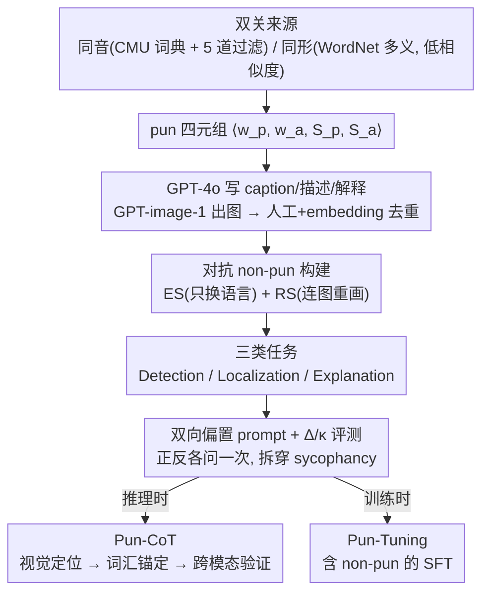

<!-- 由 src/gen_stubs.py 自动生成 -->
# "I See What You Did There": Can Large Vision-Language Models Understand Multimodal Puns?

**会议**: ACL 2026  
**arXiv**: [2604.05930](https://arxiv.org/abs/2604.05930)  
**代码**: 待确认（论文未明确给出）  
**领域**: 多模态 VLM 评测 / 幽默理解 / 双关语  
**关键词**: 多模态双关, 同音/同形双关, VLM 评测, MultiPun benchmark, Pun-CoT

## 一句话总结
本文提出 MultiPun——首个带"对抗性 non-pun 干扰项"的多模态双关语 benchmark（445 个 pun + 890 个 non-pun，覆盖同音/同形两类），系统评测了 11 个 VLM 在双关检测/定位/解释三类任务上的表现，发现**所有模型都倾向于把 non-pun 也当作 pun**（TNR 普遍 < 0.4），并提出 Pun-CoT 提示策略 + Pun-Tuning 微调策略，平均 F1 提升 16.5%。

## 研究背景与动机

**领域现状**：双关语（pun）是利用一词多义（同形）或同音异义（同音）制造幽默的修辞，是语言学和计算幽默研究的经典对象。文本双关在 SemEval-2017 Task 7 后已有较成熟的检测/定位/生成研究。多模态领域近年开始有 meme / 讽刺 / 漫画 / 中文 pun rebus 等评测，但多模态双关（图 + 文同时承载字面 + 比喻）研究仍空白。

**现有痛点**：作者归纳出 3 个关键缺陷：
- **单模态局限（Unimodal confinement）**：以前的双关研究几乎都是纯文本，忽略了视觉模态在制造歧义中的核心作用。
- **多模态 benchmark 缺陷（Deficiencies in benchmarks）**：现有少数多模态 pun 数据集只有正样本，没有 non-pun 负样本，无法验证模型是真懂双关还是看到"搞笑场景就喊 pun"。
- **偏好与理解的混淆（Conflation of preference and comprehension）**：现有评测只问 "Is this a pun?"，没有反向问 "Is this not a pun?"，无法区分真推理和模型的肯定偏好（affirmative language bias）。

**核心矛盾**：双关需要 **跨模态推理**（视觉对象 $S_p$ + 文本字面 $w_p$ + 隐含语义 $w_a$ + 比喻行为 $S_a$ 四元组的对齐）；而 VLM 训练数据里"图 + 文 = 幽默"这种 superficial pattern 太常见，模型容易过拟合到表面线索，把任何"水果 + 拟人化"图都当作 pun。

**本文目标**：(1) 构建带负样本的多模态双关 benchmark；(2) 设计能区分"懂不懂"与"敢不敢拒答"的评测协议；(3) 给出可用的提升方案。

**切入角度**：把双关形式化为 $\mathcal{P} = \langle w_p, w_a, S_p, S_a \rangle$ 四元组，并造两种对抗负样本（ES 替换为直接描述 + RS 随机替换实体），逼模型在"图文协同"和"图文不协同"之间做精细区分。

**核心 idea**：用对抗负样本暴露 VLM 的 over-interpretation 倾向，再用 Pun-CoT（视觉定位 + 词汇锚定 + 跨模态验证）和 Pun-Tuning（用含 non-pun 的 SFT 数据）双管齐下解决。

## 方法详解

### 整体框架
MultiPun 把"多模态双关"做成一套 benchmark + 评测协议 + 增强方法的闭环：先用一条 4 步流水线造出带对抗负样本的数据，再用一套双向 prompt 协议把"真懂"和"顺着提示瞎答"拆开，最后给出推理时（Pun-CoT）和训练时（Pun-Tuning）两条提升路线。

数据流水线先生成 pun 四元组 $\mathcal{P}=\langle w_p, w_a, S_p, S_a\rangle$：同音双关用 CMU 词典找同音异写词对，再过 Zipf 频率 / WordNet 主义项 / 视觉可绘 / 词形变化等 5 道过滤；同形双关用 WordNet 找一词多义，要求两义落在不同 lexical file 且 path similarity < 0.1，避免把 metonymy 误当双关。拿到四元组后，GPT-4o 据此写出 (caption, 图像描述, pun 解释)，GPT-image-1 出图，再经人工 + embedding 去重。每个正样本配两个对抗 non-pun，最后落到三类任务上评测：Detection（二分类）、Localization（同时给出 $w_p, w_a$）、Explanation（给出完整四元组 + 解释）。

### 关键设计

**1. 对抗 non-pun 构建（ES + RS 双策略）：造出表面像双关、但桥梁已被剪断的陷阱样本**

现有少数多模态 pun 数据集只有正样本，模型只要看到"拟人化水果 + 搞笑场景"就喊 pun，根本无从验证它是不是真的在判断双关机制。MultiPun 给每个 pun 配两种对抗负样本来戳破这层表面模式。ES（Explicative Substitution）把 caption 里的 $w_p$ 换成 $S_a$ 的直接描述（如 "We make a great pear" → "We make a great couple"），图保持不变，只把 phonetic 桥梁拆掉；RS（Random Substitution）把 $w_p$ 换成完全无关实体并重画图（把 pears 换成 apples、把对话改成 chair），整个四元组都不成立。

两种策略都刻意保留场景 coherence，所以"图文无关 = non-pun"这种偷懒捷径行不通，模型必须真去判断"phonetic 或 semantic 桥梁到底成不成立"。更妙的是 ES 只动语言、RS 连图一起换，二者一对比就能把模型的失败定位到"语言级"还是"图像级"。

**2. 双向偏置 prompt + $\Delta$ / $\kappa$ 评测：把"真推理"和"对提示措辞的顺从"分开**

只问 "Is this a pun?" 没法区分模型是真懂还是有肯定偏好（affirmative bias），一个总说 yes 的模型也能在正样本上刷出高分。MultiPun 对同一样本问两次：一次诱导 pun（"Is this a pun?"），一次诱导 non-pun（"Is this not a pun?"），计算两次 TPR/TNR 的差值 $\Delta$，再用 Cohen's Kappa $\kappa$ 测两次回答的一致性。$|\Delta|$ 越大，说明决策越依赖提示措辞而非图文内容。

这个协议直接把伪装成 SOTA 的 sycophancy 揪了出来——LLaVA-V1.6-Vicuna-13B 的 $\Delta$TPR $=-0.923$，等于把 "is not a pun" 直接读成 "应该回答 no"，几乎没在看内容。因为它对任意二分类评测都通用，本身也是一个可迁移的范式级评测改良。

**3. Pun-CoT：视觉定位 → 词汇锚定 → 跨模态验证的三步对症 CoT**

错误分析（§4.1）把 VLM 的失败归成 4 类幻觉：Pun word / Phonetic / Semantic / Visual object hallucination。Pun-CoT 不是泛泛地"让模型多想想"，而是针对这 4 类各设一步检查：Step 1 Visual Grounding 先让模型描述图里到底有什么具体对象，治视觉对象幻觉（看到 apple 却说成 date）；Step 2 Lexical Anchoring 强制从 caption 抠出字面 $w_p$，治 pun word 幻觉（脑补出一个根本没出现的 "fan"）；Step 3 Cross-Modal Verification 检查是否真存在合法的 phonetic（同音）或 semantic（多义）桥梁，并明确拒绝 forced association，治 phonetic 与 semantic 两类幻觉（完整 prompt 见附录 F）。

这套"先做错误分析归类、再针对每类错误定制一步 CoT"的打法，比通用 CoT 更有的放矢，也能迁移到任何有明显错误模式的任务上。

### 损失函数 / 训练策略
- **Benchmark 构建**：无监督 + 人工 in-the-loop 质控，详见附录 D。
- **Pun-Tuning**（model-level）：用 MultiPun 数据做 SFT，三条数据组成原则：(i) 含 non-pun 样本压制幻觉；(ii) 高质量 pun 解释样本增强 recall 与解释深度；(iii) 同时含 biased-to-pun 和 biased-to-non-pun 提示对，治 sycophancy。详细 SFT 实现见附录 I。
- **评测**：11 个 VLM（GPT-5.1 / GPT-4o / Gemini-3-Pro / Claude-Sonnet-4.5 / Qwen3-VL 8B/30B Instruct 与 Thinking / LLaVA-1.6-13B / Llama-4-Scout-17B / GLM-4.1V-9B-Thinking），LLM-as-judge 评 explanation 质量（win/tie/loss）。

## 实验关键数据

### 主实验（Explanation 任务下 F1，最有代表性，TPR/TNR/F1 都是 biased-to-pun prompt）

| 类型 | 模型 | Homophonic F1 | Homographic F1 | Homophonic TNR | Homographic TNR |
|------|------|---------------|----------------|----------------|-----------------|
| Closed | GPT-5.1 | **0.804** | 0.757 | 0.910 | 0.878 |
| Closed | GPT-4o | 0.741 | 0.683 | 0.786 | 0.659 |
| Closed | Gemini-3-Pro | 0.746 | 0.718 | 0.686 | 0.625 |
| Closed | Claude-Sonnet-4.5 | 0.594 | 0.560 | 0.353 | 0.235 |
| Open | Qwen3-VL-30B-Instruct | 0.535 | 0.511 | 0.209 | 0.125 |
| Open | LLaVA-V1.6-Vicuna-13B | 0.057 | 0.051 | 0.972 | 0.966 |
| Open-Reason | Qwen3-VL-30B-Thinking | 0.618 | 0.631 | 0.399 | 0.414 |

GPT-5.1 整体最强但 F1 仅 0.80，说明**多模态 pun 对所有 VLM 都难**；LLaVA-13B 在 explanation 上完全崩盘（几乎所有都答 non-pun，TPR ≈ 0.03）；Claude-Sonnet-4.5 是典型的 over-interpretation（TPR 0.969 但 TNR 仅 0.353，几乎全说"是 pun"）。

### 消融实验（Pun-CoT 提升，Explanation 任务）

| 模型 | Vanilla F1 (Homo) | Pun-CoT F1 (Homo) | $\Delta$F1 | Vanilla TNR | Pun-CoT TNR |
|------|-------------------|-------------------|------------|-------------|-------------|
| GPT-5.1 | 0.804 | 0.836 | +3.2% | 0.910 | 0.915 |
| GPT-4o | 0.741 | 0.794 | +5.3% | 0.786 | 0.835 |
| Claude-Sonnet-4.5 | 0.594 | 0.641 | +4.7% | 0.353 | **0.495** |
| Qwen3-VL-8B-Instruct | 0.505 | 0.569 | +6.4% | 0.881 | 0.495 |
| **LLaVA-V1.6-Vicuna-13B** | 0.057 | **0.501** | **+44.4%** | 0.972 | 0.036 |
| Qwen3-VL-8B-Thinking | 0.595 | **0.807** | **+21.2%** | 0.387 | **0.776** |

Pun-Tuning 同样有效——Qwen3-VL-30B-Instruct 经 Pun-Tuning 后 Homophonic F1 从 0.535 → **0.798**（+26.3%），且 $\Delta$TPR 从 −0.273 收窄到 −0.062（prompt sensitivity 大幅缓解）。

### 关键发现
- **VLM 普遍 over-interpret pun**：几乎所有模型 TPR ≈ 0.95+，TNR ≈ 0.1-0.4，$\kappa$ < 0.4——是"逢图就喊 pun"，不是真懂。Qwen3-VL-30B-A3B-Instruct 极端到 TPR=0.990、TNR=0.018，等于把所有样本判 pun。
- **闭源 >> 开源**，且 prompt 鲁棒性差距巨大：GPT-4o 和 Gemini-3-Pro 的 $|\Delta|$ 普遍 < 0.1，LLaVA-13B 的 $\Delta$TPR 高达 −0.923，揭示了 alignment 阶段的 sycophancy 在小开源模型上更严重。
- **Explanation 任务自带 grounding 效应**：要求模型解释 pun 时，TNR 显著提升（GPT-5.1 同音双关 TNR：detection 0.379 → explanation 0.910），因为强制说出 $w_a$ 反而暴露了"没找到合理 alternative"的事实，等价于隐式自检。
- **同音双关比同形双关更难**：$w_a$ 不直接出现在文本里，必须靠语音推理，Qwen3-VL-8B-Instruct 的 $w_a$ mention ratio 只有 40.7%（同音）vs 96.2%（同形）。
- **Reasoning 模型不一定更好**：小模型加 thinking 反而更差（Qwen3-VL-8B Thinking 的 TNR 从 0.193 → 0.054），可能是 thinking 放大了原本的 over-interpretation；大模型才能从 thinking 中受益。
- **Ground truth explanation 远胜模型生成**：即便 GPT-5.1 的解释在 pairwise 比较中也有 ~90% 输给 ground truth，证明"识别 pun 组件 ≠ 理解 pun 逻辑"。

## 亮点与洞察
- **双向偏置 prompt 协议**是这篇论文最被低估的贡献——它揭示了 VLM 评测里一个普遍被忽视的混淆变量（sycophancy），可以直接复用到任何二分类评测（fact-checking、毒性检测、joke detection 等），是一个范式级评测改良。
- **对抗负样本（ES + RS）**：把表面相似但机制缺失的样本作为"陷阱"，逼模型超越表面模式，这个思路完全可以推广到 sarcasm、metaphor、idiom 等其他 figurative language 评测。
- **Pun-CoT 的"视觉定位 → 词汇锚定 → 跨模态验证"三步法**对应的是"先压幻觉，再约束 token-level evidence"，本质是一个**针对错误模式定制 CoT**的方法论——先做错误分析归类，再针对每类设计一步 CoT 检查，这套打法可以泛化到任何"模型有明显错误模式"的任务（如代码生成、数学推理）。
- **错误分析的 4 类幻觉**（Pun word / Phonetic / Semantic / Visual object）是一个非常清晰的分类，能直接指导模型改进——每一类都有对应的 architecture / data fix。
- **同音 vs 同形双关的难度差异**揭示了 VLM 在 phonetic reasoning 上的根本短板，这点对未来 VLM 训练数据组成（要不要加入更多语音 grounding 任务）有直接启示。

## 局限与展望
- 数据集只有 445 puns 偏小，且全是英语；同音 pun 强烈依赖英语发音规则，难以多语扩展；中文 pun（论文提到 Chinese pun rebus 是另一研究）需要单独 benchmark。
- 数据由 GPT-4o + GPT-image-1 生成，存在 **LLM bias circular**：用 GPT 生成数据再评 GPT 自己，闭源模型可能在 distribution 上占便宜；建议未来加入人工创作的 pun（如真实 meme 库）做交叉验证。
- Pun-CoT 是"针对错误模式手工设计"的 prompt，不是自动学习的——能否让模型自己 reflective error analysis 后生成 CoT 是有趣方向。
- LLaVA-13B 在 Pun-CoT 下虽然 F1 从 0.057 飙到 0.501，但 TNR 从 0.972 暴跌到 0.036——其实是"过度纠偏"，从全说 no 翻成全说 yes，并不是真懂；说明小模型的 CoT 提升可能只是改了 decision bias 而非真增加了理解力。
- 没有探索 retrieval 辅助（如查字典找同音词）的影响，VLM 的 phonetic 短板可能通过外挂工具就能解决。

## 相关工作与启发
- **vs SemEval-2017 Task 7 (Miller et al., 2017)**：纯文本双关检测/定位的开山 benchmark，MultiPun 把这套形式化推广到多模态，并加上对抗负样本。
- **vs Xu et al. 2024b (textual pun generation)**：本文复用了它的四元组形式化 $\langle w_p, w_a, S_p, S_a \rangle$，并扩展到多模态。
- **vs PunMeme / 中文 pun rebus (Zhang et al., 2025)**：相关多模态幽默工作，但要么只有正样本，要么是中文图谐音的小众场景；MultiPun 在英语 mainstream pun 上做了首个负样本完整 benchmark。
- **vs MM-Vet / MMMU / MathVista 等通用 VLM 评测**：这些评测主要测知识 / 推理 / 数学，没有测幽默/figurative language；MultiPun 填补了这个空白。
- **vs sycophancy / hallucination 评测**（Zhuang et al., 2024）：本文的 biased-to-pun / non-pun 双向 prompt 是 sycophancy 评测在具体任务上的具体化，可以借鉴到其他 VLM 评测协议中。

## 评分
- 新颖性: ⭐⭐⭐⭐ MultiPun 是首个带对抗负样本的多模态双关 benchmark，双向偏置 prompt 协议是评测方法论的真贡献。
- 实验充分度: ⭐⭐⭐⭐⭐ 11 个 VLM × 2 类双关 × 3 类任务 × 2 类指标，加上详尽错误分析、case study、Pun-CoT 和 Pun-Tuning 双增强验证，工作量极大。
- 写作质量: ⭐⭐⭐⭐ Figure 1 三个例子直击痛点，问题 RQ1-3 框架清晰，方法 / 评测 / 实验 / 错误分析层层递进；细节略密集，部分小模型的反常表现解释偏少。
- 价值: ⭐⭐⭐⭐ 揭示了 VLM 在 figurative language 上的根本短板，benchmark 和方法都可直接被社区使用，对多模态评测方法论也有可迁移启示。

<!-- RELATED:START -->

## 相关论文

- [\[ACL 2026\] Revisit What You See: Revealing Visual Semantics in Vision Tokens to Guide LVLM Decoding](revisit_what_you_see_revealing_visual_semantics_in_vision_tokens_to_guide_lvlm_d.md)
- [\[ICML 2026\] What You Think is What You See: Driving Exploration in VLM Agents via Visual-Linguistic Curiosity (GLANCE)](../../ICML2026/multimodal_vlm/what_you_think_is_what_you_see_driving_exploration_in_vlm_agents_via_visual-ling.md)
- [\[ACL 2025\] Can Multimodal Large Language Models Understand Spatial Relations?](../../ACL2025/multimodal_vlm/spatialmqa_mllm_spatial_relations.md)
- [\[ACL 2025\] Can Vision Language Models Understand Mimed Actions?](../../ACL2025/multimodal_vlm/can_vision_language_models_understand_mimed_actions.md)
- [\[ICCV 2025\] Vision-Language Models Can't See the Obvious](../../ICCV2025/multimodal_vlm/vision-language_models_cant_see_the_obvious.md)

<!-- RELATED:END -->
