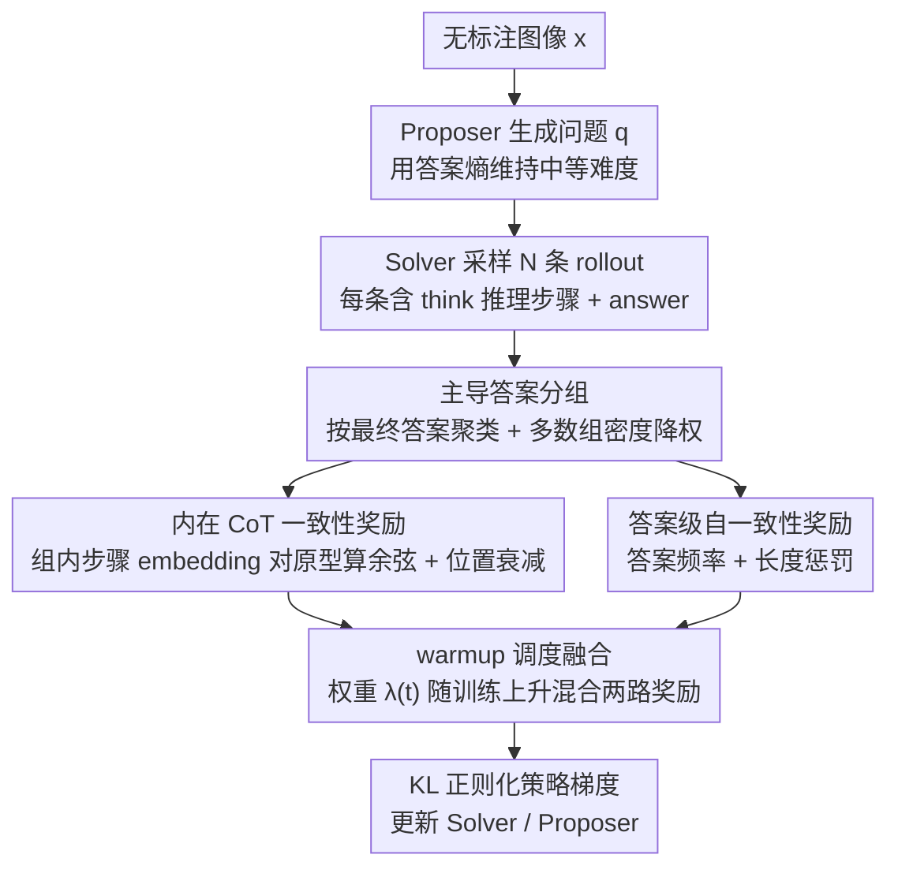

# iReasoner: Trajectory-Aware Intrinsic Reasoning Supervision for Self-Evolving Large Multimodal Models

**会议**: ACL2026 Findings  
**arXiv**: [2601.05877](https://arxiv.org/abs/2601.05877)  
**代码**: 缓存文本仅写“Our code is available here”，未给出明确URL  
**领域**: 多模态VLM / 自监督推理训练  
**关键词**: 多模态推理, 自演化训练, Chain-of-Thought, 内在奖励, 轨迹一致性  

## 一句话总结
iReasoner在无标注图像上让LMM自问自答，并把最终答案一致性扩展为中间CoT步骤的一致性奖励，从而在Qwen2.5-VL-7B上带来最高约+2.13点的多模态推理提升。

## 研究背景与动机
**领域现状**：多模态大模型的自演化训练开始从“依赖人工标注”转向“利用无标注图像自生成问题和答案”。Proposer-Solver式框架让模型基于图像提出问题，再采样多个解答，并用内部一致性作为奖励信号。

**现有痛点**：已有自演化LMM方法大多只奖励最终答案或整段响应。两个推理轨迹只要给出同一个答案，就可能得到几乎相同的奖励，即使其中一个轨迹包含幻觉中间步骤、错误视觉依据或侥幸抵消的计算错误。

**核心矛盾**：无监督设定下没有人工标注答案，也没有外部judge可稳定评价每个推理步骤；但多模态推理的可靠性又高度依赖中间视觉 grounding 和逐步推断。如果只看最终答案，训练信号太粗。

**本文目标**：在不引入标注、外部验证器或奖励模型的前提下，为LMM的中间推理步骤提供可优化的内在监督，让自演化不仅优化“答对”，也优化“怎样推理到答案”。

**切入角度**：作者利用同一图像-问题下多个Solver rollout的共识。若一批rollout收敛到同一个主导答案，那么这些rollout中相同位置的推理步骤应当具有相似语义；这种跨轨迹步骤一致性可以作为无监督的推理质量信号。

**核心 idea**：把多数答案组内部的step-level CoT agreement做成内在奖励，并与答案自一致性奖励混合，用KL正则化策略梯度训练Solver。

## 方法详解

### 整体框架
iReasoner沿用Proposer-Solver自演化框架。给定无标注图像 $x$，Proposer生成一个视觉相关问题 $q$；Solver针对 $(x,q)$ 采样 $N$ 条推理rollout，每条包含显式 `<think>` 推理步骤和 `<answer>` 最终答案。多个答案形成经验分布 $p(a|x,q)$，Proposer用答案熵维持中等难度，Solver则同时接受答案级自一致性奖励和步骤级一致性奖励。

方法的核心不在于生成更长CoT，而在于让不同rollout的中间步骤在语义上可比较、可聚合、可奖励。它把“同一个最终答案下的推理轨迹是否稳定”变成训练信号。

### 关键设计
**1. 主导答案分组（Dominant-answer group）：先按最终答案聚类，让步骤一致性建立在相对可靠的答案模式上**

无监督设定下没有标注答案，如果直接奖励任意两条 rollout 之间的步骤相似度，模型很可能学会"一起犯同一个错"——错误的共识也能拿高分。iReasoner 先从答案分布 $p(a|x,q)$ 里选出主导答案 $\hat{a}$，把所有产出该答案的 rollout 聚成集合 $\mathcal{G}$，只在这个组内部比较步骤；同时用多数组密度 $\rho=(|\mathcal{G}|/N)^\gamma$ 给步骤奖励整体降权，主导组越小（说明答案越分散、越不可信），步骤奖励就被压得越低。

这一步本质是给后面的步骤一致性加了一道"答案先得靠谱"的闸门：只有当一批 rollout 真收敛到同一个主导答案时，才认为它们的中间推理值得拿来互相对齐，从而压住无监督奖励的噪声。

**2. 内在 CoT 一致性奖励（Intrinsic CoT Agreement Reward）：用模型自身 embedding 衡量同组 rollout 的中间步骤是否语义一致**

只奖励最终答案太粗——两条轨迹哪怕一条满是幻觉中间步、一条 grounding 扎实，只要答案相同就拿几乎一样的奖励。iReasoner 把每条轨迹按 `<think>` 拆成步骤 $s_{i,j}$，用模型内部 token embedding 的归一化均值 $e_{i,j}$ 表示每一步；对主导组在每个步骤位置 $j$ 算出原型 $\mu_j$，再用余弦相似度 $r_{i,j}=\text{sim}(e_{i,j},\mu_j)$ 给该步打分。聚合成 step reward 时用一组递减权重 $w_1>w_2>\dots$，刻意把早期步骤的权重压高。

之所以让早期步骤更重，是因为前几步通常负责识别图像信息、建立问题状态，一旦错了会顺着 CoT 一路传播到答案；位置衰减让奖励盯住这些 grounding 基础步骤，而不是去奖励后面那些模板化的总结句。整套信号不需要外部 judge 或人工步骤标注，纯靠模型自身表征算出，契合无监督自演化的设定。

**3. warmup 调度融合（Reward integration with self-evolution）：把答案级和步骤级奖励 warmup 式地合成一个 Solver 奖励**

训练早期答案共识本身还不稳，这时若过早强推步骤一致性，等于在错误答案上对齐推理，会放大错误。iReasoner 让答案奖励 $r_i^{ans}=p(a_i|x,q)^\alpha(1-\eta\bar{\ell}_i)$ 同时承担答案自一致性和长度惩罚，再把它和步骤奖励按一个随训练上升的权重 $\lambda(t)$ 混合：

$$r_i^{sol}=(1-\lambda(t))\,r_i^{ans}+\lambda(t)\,r_i^{step}$$

$\lambda(t)$ 在 warmup 阶段逐步升高，让模型先靠答案自一致性把答案稳定下来，再慢慢把优化重心转向"怎样推理到答案"的轨迹结构。消融里去掉 warmup 带来的退化最明显、最稳定，正说明了这个先后顺序的必要性。

### 损失函数 / 训练策略
Solver和Proposer都用KL正则化的策略梯度训练，参考模型冻结，用EMA baseline降低方差。Solver目标包含REINFORCE项和对参考策略的KL惩罚；Proposer使用答案熵塑形奖励，让问题难度保持在非退化区间。

训练细节比较克制：从Qwen2.5-VL-7B-Instruct初始化，使用LoRA训练Proposer和Solver；训练池是2,500张无标注图像，来自ChartQA、AI2D、InfoGraphic-VQA、PlotQA、ChartX和Geometry3K。每张图像采样1个问题，Solver采样 $N=5$ 条rollout，Proposer每5轮更新一次。step reward权重warmup到0.7，训练2.5k步，AdamW学习率 $10^{-6}$，8张AMD MI250X上约35小时完成。

## 实验关键数据

### 主实验
| Benchmark | Qwen2.5-VL-7B Baseline | EvoLMM | iReasoner | 相对Baseline提升 |
|-----------|------------------------|--------|-----------|------------------|
| InfoGraphic-VQA | 80.44 | 81.06 | 81.56 | +1.12 |
| AI2D | 82.61 | 83.41 | 83.89 | +1.28 |
| ScienceQA | 88.30 | 89.50 | 89.92 | +1.62 |
| MMMU | 51.11 | 52.01 | 52.37 | +1.26 |
| ChartQA | 84.00 | 86.70 | 85.78 | +1.78 |
| MathVista | 68.47 | 70.52 | 69.74 | +1.27 |
| MathVision | 23.91 | 24.81 | 25.29 | +1.38 |
| MathVerse | 43.78 | 44.88 | 45.91 | +2.13 |

### 消融实验
| 配置 | ScienceQA | MMMU | ChartQA | MathVerse | 说明 |
|------|-----------|------|---------|-----------|------|
| Full iReasoner | 89.92 | 52.37 | 85.78 | 45.91 | 答案奖励 + 步骤奖励完整组合 |
| Soft majority reward only / EvoLMM | 89.41 | 51.92 | 86.64 | 44.71 | 短答案可验证任务更强，但迁移弱一些 |
| Step-level reward only | 88.44 | 50.98 | 84.38 | 43.87 | 单独使用步骤一致性噪声较大 |
| w/o Warmup schedule | 89.26 | 51.74 | 85.02 | 45.11 | warmup缺失带来最明显、最稳定退化 |
| w/o Position decay | 89.55 | 52.02 | 85.41 | 45.49 | 早期步骤加权有贡献 |
| w/o Density weighting | 89.47 | 51.88 | 85.29 | 45.32 | 多数组可靠性降权有助于防止错误共识 |

### 关键发现
- iReasoner在8个benchmark上全部超过初始Qwen2.5-VL-7B，平均提升在general visual understanding上约+1.32，在visual math上约+1.64。
- 相对EvoLMM，iReasoner在InfoGraphic-VQA、AI2D、ScienceQA、MMMU、MathVision、MathVerse上更强，但在ChartQA和MathVista上略低，说明答案稳定奖励更适合高度可验证的短答案任务。
- step-level reward不能孤立使用；它需要答案级稳定性先过滤掉明显错误的rollout。
- 主导答案组正确率从训练早期约76%提升到后期约93%，说明多数组作为内在监督源并非完全盲目。

## 亮点与洞察
- 论文最有价值的地方是把“同答案不同推理轨迹”的问题变成可优化信号。很多自一致性方法只看答案投票，而iReasoner追问投票背后的推理路径是否稳定。
- 用模型内部embedding表示步骤很轻量，不需要外部judge或人工步骤标注，符合无监督自演化设定。
- warmup、密度权重和位置衰减这三个小设计很关键，体现了作者对无监督RL噪声的处理经验。
- 这套思路可以迁移到文本推理、代码推理或agent轨迹训练中：只要能采样多条轨迹并定义“同一结果组”，就可以比较中间步骤一致性。

## 局限与展望
- iReasoner只使用模型自身采样形成的内在信号，无法直接优化外部正确性。当多数答案组自信但错误时，步骤一致性可能强化一致但错误的推理。
- 实验规模仍有限：训练只覆盖2,500张图像、2.5k步，并主要围绕Qwen2.5-VL系列展开；更大规模、更长训练和更多模型族还需要验证。
- 方法需要访问模型log probability、内部embedding和KL正则化训练，因此更适合开源权重模型，不容易直接用于黑盒闭源API。
- CoT本身可能存在忠实性问题。论文做了no-CoT推理对照，但更严格的因果干预或过程监督评估仍然值得补充。

## 相关工作与启发
- **vs EvoLMM / VisPlay**: 这些自演化LMM主要依赖答案或响应级内在奖励，iReasoner把监督粒度推进到中间步骤。
- **vs Multimodal-CoT / R3V**: 这些方法关注显式推理链质量，但通常依赖标注、过滤或外部反馈；iReasoner更强调纯无标注训练。
- **vs RLVR式训练**: 传统RLVR需要可验证答案，iReasoner提供了一种在视觉开放任务中构造弱验证信号的办法。
- **对后续研究的启发**: 可以把step agreement扩展为图结构、工具调用序列或视觉区域引用的一致性奖励，而不仅是文本步骤相似。

## 评分
- 新颖性: ⭐⭐⭐⭐☆ 中间轨迹一致性作为无监督内在奖励很有启发，但仍建立在已有Proposer-Solver自演化框架上。
- 实验充分度: ⭐⭐⭐⭐☆ 主实验、消融、step budget和训练动态都较完整；模型族和数据规模还可扩大。
- 写作质量: ⭐⭐⭐⭐☆ 方法解释直观，图示清楚；部分表格编号和附录引用在缓存文本中略混乱。
- 价值: ⭐⭐⭐⭐☆ 对多模态自训练和过程监督都有实用参考，尤其适合开源LMM后训练研究。

<!-- RELATED:START -->

## 相关论文

- [\[CVPR 2026\] EvoLMM: Self-Evolving Large Multimodal Models with Continuous Rewards](../../CVPR2026/multimodal_vlm/evolmm_self_evolving_lmm_continuous_rewards.md)
- [\[ACL 2026\] PRISM: Self-Pruning Intrinsic Selection Method for Training-Free Multimodal Data Selection](prism_self-pruning_intrinsic_selection_method_for_training-free_multimodal_data_.md)
- [\[CVPR 2026\] VisPlay: Self-Evolving Vision-Language Models](../../CVPR2026/multimodal_vlm/visplay_self-evolving_vision-language_models.md)
- [\[CVPR 2026\] AutoTraces: Autoregressive Trajectory Forecasting via Multimodal Large Language Models](../../CVPR2026/multimodal_vlm/autotraces_autoregressive_trajectory_forecasting_via_multimodal_large_language_m.md)
- [\[ICML 2026\] Learn to Think: Improving Multimodal Reasoning through Vision-Aware Self-Improvement Training](../../ICML2026/multimodal_vlm/learn_to_think_improving_multimodal_reasoning_through_vision-aware_self-improvem.md)

<!-- RELATED:END -->
