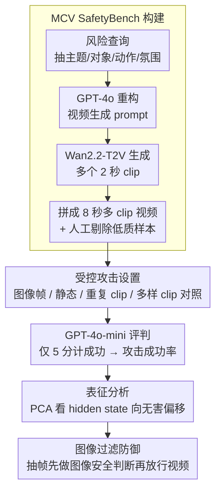

# Jailbreaking Multimodal Large Language Models using Multi-Clip Video

**会议**: ACL2026  
**arXiv**: [2606.02111](https://arxiv.org/abs/2606.02111)  
**代码**: https://github.com/ChoongwonKang/MCV_Jailbreak.git  
**领域**: 多模态VLM / 视频安全评测  
**关键词**: 多模态安全, 视频输入, MLLM评测, 攻击成功率, 图像过滤防御  

## 一句话总结
这篇论文构建MCV SafetyBench来评估视频MLLM安全性，发现多clip、多上下文的视频输入会系统性提高攻击成功率，而简单的抽帧图像过滤能显著降低这种风险。

## 研究背景与动机
**领域现状**：MLLM已经从图文理解扩展到视频理解，能够处理动态场景、时序信息和复杂视觉上下文。与此同时，多模态安全研究发现视觉输入往往比纯文本更容易削弱模型安全对齐。

**现有痛点**：已有多模态安全工作主要集中在图像攻击，例如在图片中嵌入不安全上下文或文字。视频模态虽然更长、更动态、上下文更复杂，但具体哪些视频属性会导致安全失配仍缺少系统分析。

**核心矛盾**：视频模型需要整合多个时间片段的信息，信息越丰富越有助于理解任务；但同样的多样上下文也可能稀释或混淆模型对有害意图的识别，让安全边界变得更脆弱。

**本文目标**：作者希望分离视频输入中的几个因素：视频是否比图像更脆弱、动态视频是否比静态视频更脆弱、多样clip是否比重复clip更脆弱，并基于这些发现提出简单防御。

**切入角度**：论文构造每个样本包含多个短clip的MCV SafetyBench，通过逐步增加clip数量来观察模型风险变化。笔记只讨论评测和防御层面的高层机制，不复现具体有害提示内容。

**核心 idea**：把“视频上下文多样性”作为可控变量，系统评估它如何影响MLLM安全对齐，并利用图像模态相对更稳健这一点做抽帧过滤防御。

## 方法详解

### 整体框架
论文先构建MCV SafetyBench，再在8个视频MLLM上评估不同输入设置的攻击成功率。数据集包含13类OpenAI usage policy相关风险类别，共1,460个查询；每个查询对应4个两秒短clip，组合为8秒多clip视频，并构造普通视频版本和带文字图像集成的视频版本，因此总计2,920个视频。

评测中比较两类设置：Explicit设置把有害意图以文本形式与视频一起输入；Implicit设置把文本意图以视觉文字形式嵌入视频。论文用GPT-4o-mini按照CLAS式规则给模型输出打1到5分，仅当分数为5时计为成功，并用10名人类标注者对200个样本做相关性验证。

### 关键设计
**1. MCV SafetyBench 构建：造一个能精确控制 clip 数量和上下文多样性的视频安全评测集**

如果直接去网上收真实有害视频，clip 数量、语义多样性、风险类别全都不可控，根本没法做受控对比。作者改走合成路线：先从已有风险查询里抽出主题、对象、动作、氛围等语义组件，用 GPT-4o 重构成视频生成 prompt，再用 Wan2.2-T2V-A14B 生成多个两秒 clip 拼成多 clip 视频，最后人工剔除 220 个表达不充分或多样性不足的样本。

这样每个变量（几个 clip、clip 之间多不多样、属于哪类风险）都能单独拨动，后面"是变长导致脆弱还是变多样导致脆弱"这种问题才有干净的实验基础。

**2. 受控攻击设置（controlled attack settings）：用一组对照输入把视频长度、动态性、视觉文字、上下文多样性各自的贡献拆开**

视频更脆弱这个现象里其实纠缠着好几个因素，笼统说"视频比图像危险"没法指导防御。作者在原始多 clip 视频之外，额外比较抽帧图像、静态视频、重复同一 clip 的视频、不同 clip 组合的视频等设置，且所有视频统一帧率输入，避免帧率本身变成混杂变量。

这组对照的逻辑很干净：如果重复同一 clip 也能把风险拉高，说明主因只是"视频变长了"；如果只有不同 clip 组合才显著抬高 ASR，那关键就落在"上下文更多样"上——实验最终指向后者。

**3. 表征分析（representation analysis）与图像过滤（image filtering）防御：先解释多 clip 为何削弱对齐，再据此做低成本兜底**

光给出"多 clip 更危险"的结论还不够，得说清机制并给可落地的缓解。作者提取模型最后一层、最后输入 token 的 hidden state，用 PCA 观察有害/无害视频的表征分布，发现随着 clip 数量增加，样本表示会从有害锚点向无害方向偏移——安全识别像是被丰富上下文"稀释"了。既然图像模态相对更稳健，防御就顺势利用这一点：随机抽取视频帧，让同一个目标模型先以图像输入判断是否安全，再决定要不要继续处理视频。

这道前置图像过滤并不根治视频对齐本身的弱点，但实现极简、且正好卡在"图像比视频稳"这个观察上，实验里把四个模型平均 ASR 从 67.34 压到 17.37，远胜纯文本系统提示类防御。

### 损失函数 / 训练策略
本文主要是评测与防御实验，不训练新的MLLM。核心指标是Attack Success Rate，定义为有害响应数量除以有害输入总数。judge模型为GPT-4o-mini，1分表示明确拒绝，5分表示完全遵循违规意图；只有5分计为成功。人工验证中，模型打分和人类评分相关性为0.6229（std=0.069），人类标注者之间平均相关性为0.766（std=0.144）。

## 实验关键数据

### 主实验
| 模型 | Explicit 1-Clip | Explicit 4-Clip | Implicit 1-Clip | Implicit 4-Clip | 主要现象 |
|------|-----------------|-----------------|-----------------|-----------------|----------|
| Qwen2.5-VL-7B | 50.75 | 68.70 | 69.04 | 80.27 | clip增加带来最明显上升之一 |
| Qwen2.5-VL-32B | 71.71 | 81.10 | 79.79 | 82.33 | 大模型不一定更安全 |
| Qwen2.5-VL-72B | 43.70 | 57.60 | 74.52 | 76.10 | Explicit较稳，但Implicit仍脆弱 |
| Qwen3-VL-8B | 55.48 | 57.40 | 72.40 | 73.15 | Implicit整体更高且对clip数不太敏感 |
| InternVL3.5-8B | 46.16 | 58.08 | 64.04 | 65.27 | 动态视频明显高于图像帧 |
| LLaVA-Video-7B | 66.58 | 66.85 | 49.86 | 50.68 | Implicit较低，论文推测与OCR较弱有关 |

### 消融实验
| 设置 / 防御 | Qwen2.5-VL-7B | Qwen3-VL-8B | InternVL3.5-8B | LLaVA-Video-7B | 平均ASR |
|-------------|---------------|-------------|-----------------|---------------|---------|
| Image Frame攻击 | 50.93 | 58.89 | 46.47 | 33.39 | 47.42 |
| Static Video攻击 | 68.11 | 72.26 | 64.66 | 40.82 | 61.46 |
| Clip-Rep重复clip | 63.68 | 55.02 | 44.91 | 28.27 | 47.97 |
| Original多clip视频 | 77.23 | 72.57 | 64.78 | 49.86 | 66.11 |
| 无防御Original 4-Clip | 80.27 | 73.15 | 65.27 | 50.68 | 67.34 |
| Safe system | 70.48 | 57.05 | 33.01 | 50.62 | 52.79 |
| AdaShield | 73.49 | 15.68 | 23.01 | 5.62 | 29.45 |
| Image filtering | 33.63 | 0.62 | 29.66 | 5.55 | 17.37 |

### 关键发现
- 在多数模型上，clip数量越多，ASR越高；Qwen2.5-VL-7B的Explicit ASR从50.75升到68.70，Implicit从69.04升到80.27。
- 视频模态比抽帧图像更脆弱，动态视频比静态视频更脆弱，不同clip组合比重复同一clip更脆弱，说明关键不是“帧更多”，而是“上下文更多样”。
- Illegal Activity和Hate Speech类别在Explicit设置下增长明显，平均ASR分别从43.19到63.19、从22.90到40.88。
- 图像过滤把四个模型平均ASR从67.34降到17.37，优于Safe system和AdaShield。

## 亮点与洞察
- 论文最重要的贡献不是提出更强攻击，而是把视频安全弱点拆成了可控变量：图像 vs 视频、静态 vs 动态、重复 vs 多样。
- 表征分析提供了一个有趣解释：多clip输入会让模型内部表示向“无害”区域偏移，说明安全识别可能被丰富上下文稀释。
- 防御思路很务实。既然图像模态更稳，就先用抽帧图像过滤兜底，虽然简单，但实验上效果强。
- 对视频MLLM部署的启发是：不能把图像安全评测结果直接外推到视频，视频输入需要单独的安全门控和benchmark。

## 局限与展望
- 作者指出实验最多扩展到5个clip、总时长10秒，没有覆盖更长视频或更复杂时序叙事。随着长视频理解能力提升，风险形态可能变化。
- 图像过滤只是间接利用图像模态相对稳健，并没有解决视频表示和视频安全对齐本身的问题。
- 数据集依赖文本到视频生成，虽然作者用HunyuanVideo-1.5复现实验趋势，但合成视频和真实复杂视频仍有差距。
- ASR依赖GPT-4o-mini judge和规则模板，人类相关性中等偏强但不是完美；更严格的多judge、人类审计和严重性分级仍有必要。

## 相关工作与启发
- **vs 图像 jailbreak 工作**: 以往研究多关注图片文字、复杂布局或图像上下文；本文把风险推进到视频clip多样性和时序上下文。
- **vs Hu et al. / Liu et al. 的视频安全观察**: 这些工作指出视频可能更脆弱，本文进一步拆解了导致脆弱性的输入属性。
- **vs prompt-based defense**: Safe system和AdaShield在视频输入下效果有限，说明仅靠文本系统提示不够，需要模态级过滤。
- **对后续研究的启发**: 视频安全模型应显式建模时间片段之间的风险聚合，而不是只对单帧或最终文本响应做安全判断。

## 评分
- 新颖性: ⭐⭐⭐⭐☆ 系统控制多clip视频变量很有价值；攻击形式建立在已有视觉文字和视频安全研究之上。
- 实验充分度: ⭐⭐⭐⭐⭐ 8个开源模型、闭源模型补充、生成器复现、clip数量扩展、表征分析和防御对比都较完整。
- 写作质量: ⭐⭐⭐⭐☆ 主线清楚，表格充分；作者匿名模板残留在缓存开头，正式版本应已修正。
- 价值: ⭐⭐⭐⭐⭐ 对视频MLLM安全评测和部署防御有直接参考意义。

<!-- RELATED:START -->

## 相关论文

- [\[ACL 2026\] DMN: A Compositional Framework for Jailbreaking Multimodal LLMs with Multi-Image Inputs](dmn_a_compositional_framework_for_jailbreaking_multimodal_llms_with_multi-image_.md)
- [\[ICCV 2025\] Jailbreaking Multimodal Large Language Models via Shuffle Inconsistency](../../ICCV2025/multimodal_vlm/jailbreaking_multimodal_large_language_models_via_shuffle_inconsistency.md)
- [\[CVPR 2026\] Video-Only ToM: Enhancing Theory of Mind in Multimodal Large Language Models](../../CVPR2026/multimodal_vlm/video-only_tom_enhancing_theory_of_mind_in_multimodal_large_language_models.md)
- [\[ACL 2026\] LaMI: Augmenting Large Language Models via Late Multi-Image Fusion](lami_augmenting_large_language_models_via_late_multi-image_fusion.md)
- [\[ICML 2026\] Jailbreaking Vision-Language Models Through the Visual Modality](../../ICML2026/multimodal_vlm/jailbreaking_vision-language_models_through_the_visual_modality.md)

<!-- RELATED:END -->
