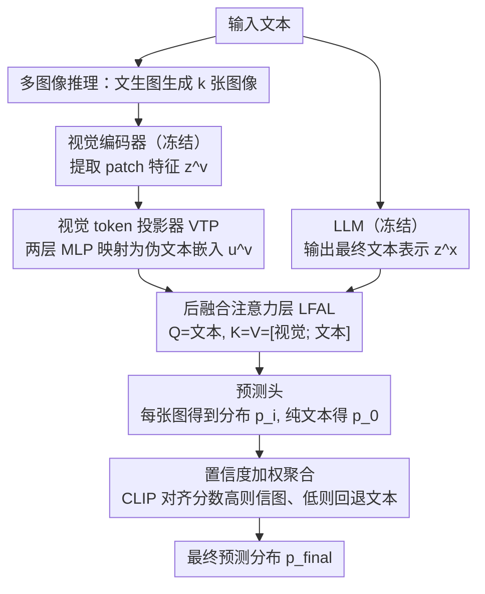

# LaMI: Augmenting Large Language Models via Late Multi-Image Fusion

**会议**: ACL 2026  
**arXiv**: [2406.13621](https://arxiv.org/abs/2406.13621)  
**代码**: [项目主页](https://guyyariv.github.io/LaMI/)  
**领域**: 多模态VLM  
**关键词**: 后融合, 多图像生成, 视觉常识推理, 视觉增强LLM, 推理时视觉注入

## 一句话总结

提出 LaMI，通过后融合架构在预测最后阶段融合视觉特征与 LLM 输出，并在推理时从文本生成多张图像进行基于置信度的聚合，在不损害文本推理能力的前提下显著提升 LLM 的视觉常识推理能力。

## 研究背景与动机

**领域现状**：LLM 在纯文本任务上表现优异但缺乏视觉常识（如"帝企鹅的肚子是什么颜色"），视觉语言模型（VLM）虽能处理视觉任务但往往牺牲文本推理性能，且多模态训练成本高昂。

**现有痛点**：现有视觉增强语言模型（VaLM）方案存在两个核心问题——(1) 大多采用**早期融合**，视觉信号过早注入 LLM 会干扰其语言行为；(2) 仅依赖**单张图像**，容易引入噪声和偏差。

**核心矛盾**：如何为纯文本 LLM 高效添加视觉知识，同时不影响其文本推理能力且无需昂贵的多模态重训练。

**本文目标**：设计一种轻量级、即插即用的视觉增强方案，兼顾视觉常识提升和文本性能保持。

**切入角度**：将视觉特征的融合推迟到预测最后阶段（late fusion），避免干扰 LLM 的中间表示；在推理时生成多张图像提供多样化视觉证据。

**核心 idea**：Late Fusion + Multi-Image = 视觉增强不损语言能力。LLM 保持冻结，仅训练轻量级的投影层和融合层。

## 方法详解

### 整体框架

LaMI 由四个组件构成：冻结的预训练 LLM、冻结的预训练视觉编码器、可训练的视觉 token 投影器（Visual Token Projector, VTP）、可训练的后融合注意力层（Late Fusion Attention Layer, LFAL）。整条数据流是：输入文本一边送进冻结 LLM 正常完成语言处理、一边交给文生图模型生成 $k$ 张图像；图像经视觉编码器与 VTP 变成伪文本 token，在 LLM 输出最终表示之后才由 LFAL 一次性融合；每张图给出一个预测分布，最后用 CLIP 对齐分数把多张图的分布与纯文本分布加权聚合成最终答案。训练时只用图像-文本对调 VTP 和 LFAL，推理时则从输入文本现场生成多张图像。

### 关键设计

1. **视觉 token 投影器（VTP）**：视觉编码器输出的 patch 特征 $z^v \in \mathbb{R}^{n_v \times d_v}$ 活在视觉空间，LLM 却只认文本嵌入，二者无法直接对话。VTP 用两层 MLP 把它映射成伪文本嵌入 $u^v = W_1 \sigma(W_2 z^v) \in \mathbb{R}^{n_v \times d_x}$，相当于把图像翻译成 LLM 能读的"伪 token"，让后续融合层能在统一空间里整合跨模态信息。

2. **后融合注意力层（LFAL）**：早期/中间融合把视觉信号过早塞进 LLM，会干扰它的语言行为、拉低文本推理。LaMI 反其道而行，把融合推迟到 LLM 已输出最终表示、预测头之前的最后一步：插入一个注意力层，令 $Q=z^x_{(<t)}$、$K=V=[u^v; z^x_{(<t)}]$，文本 token 在此一次性关注视觉 token。这样 LLM 整个前向过程都专注于语言、只在临门一脚才"轻触"视觉，把对语言能力的干扰降到最低。

3. **多图像推理与置信度加权**：单张生成图可能带噪声或语义偏差，押注一张图很危险。推理时改为生成 $k$ 张图像、各自得到分布 $p_i$，再与纯文本分布 $p_0$ 一起按 CLIP 对齐分数加权：$p_{\text{final}} = \sum_i f(\bar{x}_i, v_i)\, p_i + (1 - f(\bar{x}_i, v_i))\, p_0$。多张图互为冗余证据；对齐度高的图获得更高权重，对齐度低时权重趋零、自动回退到纯文本 LLM，从而保证不可靠的图不会拖累预测。

### 损失函数 / 训练策略

使用标准语言建模目标 $\max_\theta \log P_\theta(x_{(t)} | x_{(<t)}, v)$ 进行训练。训练数据包括真实图像-文本对和文本+合成生成图像对。仅 VTP 和 LFAL 的参数可训练，LLM 和视觉编码器保持冻结。推理时使用蒸馏版 text-to-image 生成器进行批量并行采样，最小化开销。

## 实验关键数据

### 主实验

| 模型 | Base | 视觉常识 (VC) | 常识推理 (CR) | 阅读理解 (RC) | 平均 |
|------|------|--------------|-------------|-------------|------|
| Llama3-8B | - | 52.0 | 72.0 | 57.9 | 60.6 |
| LaMI (Llama3-8B) | Llama3-8B | **55.0** | **72.9** | **58.0** | **62.0** |
| Llama3-8B-Instruct | - | 53.0 | 71.6 | 59.2 | 61.2 |
| Llava-Next (Llama3-8B-Inst.) | Llama3-8B-Inst. | 56.5 | 70.8 | 54.8 | 60.7 |
| LaMI (Llama3-8B-Inst.) | Llama3-8B-Inst. | 55.6 | **71.7** | **60.9** | **62.7** |

### 消融实验

| 方法 | Memory Color | Color Terms | Object Shape | Relative Size |
|------|-------------|-------------|-------------|--------------|
| GPT-2 (Base) | 32.4 | 34.6 | 44.5 | 43.1 |
| Early Fusion | 49.1 | 45.3 | 40.3 | 70.1 |
| Early Fusion + Multi | 55.5 | 52.1 | 41.2 | 75.5 |
| Intermediate Fusion + Multi | 69.7 | 67.8 | 63.0 | 81.1 |
| **Late Fusion + Multi (Ours)** | **72.5** | **69.2** | **66.8** | **85.5** |

### 关键发现

- **后融合一致优于早期融合和中间融合**：在所有任务上 Late Fusion 都表现最优，尤其在形状相关任务上优势明显
- **多图像生成跨所有融合策略都带来增益**：对颜色和相对大小推理改善尤为显著
- **LaMI 提升视觉常识的同时不损害甚至提升文本任务**：与 VLM（如 InstructBLIP、Llava-Next）形成鲜明对比
- 推理时计算对照实验：Best-of-N 采样虽提升常识推理但无法弥补视觉常识差距（VC: 47.8 vs LaMI 50.1），确认 LaMI 的改进来自视觉证据而非额外计算
- 图像数量 $k \approx 6$ 时性能饱和，$k=3$ 即可获得显著收益

## 亮点与洞察

- **后融合保护语言能力**的设计哲学极为实用——LLM 保持冻结，视觉仅在最后阶段"轻触"，这是一种对 LLM 最小侵入的多模态增强范式
- **CLIP 置信度加权的自动降级**机制设计精巧：图像不靠谱时自动回退到纯文本路径，避免视觉噪声损害预测
- 方法可即插即用地应用于任何新发布的 LLM，无需昂贵的多模态重训练

## 局限与展望

- 依赖 text-to-image 生成器的质量，生成图像可能引入分布外噪声
- 推理时需要生成多张图像，增加了延迟和计算开销（虽然可并行）
- 在视觉常识上仍略低于完全训练的 VLM（如 Llava-Next VC: 56.5 vs LaMI 55.6），但在整体平均上领先
- 仅在判别式任务（选择题）上验证，对开放式生成任务的效果未知
- 未来可探索更高效的视觉证据获取方式（如检索而非生成）

## 相关工作与启发

- **VaLM 系列**（VaLM、Z-LaVI、LiVE）：LaMI 的后融合策略统一解决了早期融合方案的语言能力下降问题
- **CLIP 作为跨模态桥梁**：CLIP 评分用于自动评估图像-文本对齐度并加权，无需额外训练
- 启示：多模态增强不一定需要深度融合，浅层的后融合在保持单模态能力方面有天然优势

## 评分

- **新颖性**: ⭐⭐⭐⭐ 后融合 + 多图像推理的组合虽非全新概念，但系统性地验证了其优势，CLIP 加权回退机制有创意
- **实验充分度**: ⭐⭐⭐⭐ 从小模型到大模型、从 BERT 到 LLaMA3 的全面评估，消融实验完整，但缺少更大规模模型的验证
- **写作质量**: ⭐⭐⭐⭐ 结构清晰，动机阐述充分，但部分符号使用不够统一
- **价值**: ⭐⭐⭐⭐ 为快速适配新 LLM 到多模态场景提供了实用轻量方案

<!-- RELATED:START -->

## 相关论文

- [\[ACL 2026\] OMIBench: Benchmarking Olympiad-Level Multi-Image Reasoning in Large Vision-Language Models](omibench_benchmarking_olympiad-level_multi-image_reasoning_in_large_vision-langu.md)
- [\[CVPR 2026\] Multi-Modal Image Fusion via Intervention-Stable Feature Learning](../../CVPR2026/multimodal_vlm/multi-modal_image_fusion_via_intervention-stable_feature_learning.md)
- [\[ACL 2026\] TEMA: Anchor the Image, Follow the Text for Multi-Modification Composed Image Retrieval](tema_anchor_the_image_follow_the_text_for_multi-modification_composed_image_retr.md)
- [\[ACL 2026\] Jailbreaking Multimodal Large Language Models using Multi-Clip Video](jailbreaking_multimodal_large_language_models_using_multi-clip_video.md)
- [\[ACL 2026\] Leave My Images Alone: Preventing Multi-Modal Large Language Models from Analyzing Unauthorized Images](leave_my_images_alone_preventing_multi-modal_large_language_models_from_analyzin.md)

<!-- RELATED:END -->
