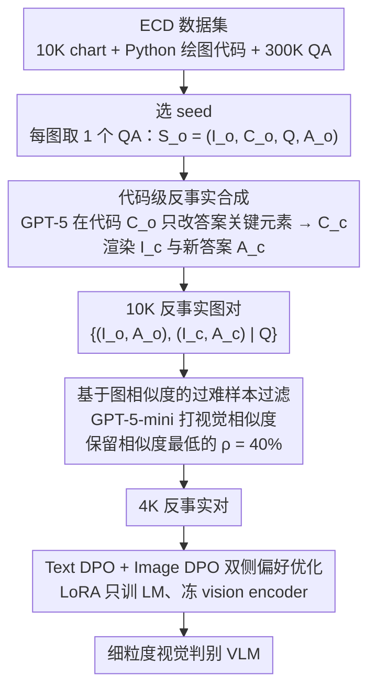

# Learning More from Less: Exploiting Counterfactuals for Data-Efficient Chart Understanding

**会议**: ACL 2026  
**arXiv**: [2605.10855](https://arxiv.org/abs/2605.10855)  
**代码**: https://github.com/jianzhubao/ChartCF  
**领域**: 多模态 / 图表理解 / 反事实学习 / VLM 偏好优化  
**关键词**: chart QA, 反事实数据, DPO, 多模态偏好, 数据高效训练

## 一句话总结
针对 chart 是"程序化生成的视觉产物"这一独特属性，提出 ChartCF——通过 GPT-5 在绘图代码上做最小改动生成视觉相似但答案不同的"反事实图对"，再用文本 DPO + 图像 DPO 联合偏好优化让 VLM 学会细粒度视觉判别，仅用 4K 偏好对就在多个 chart QA benchmark 上匹配或超过用 300K SFT 数据训练的 ECD。

## 研究背景与动机

**领域现状**：Chart 理解（chart QA / chart-to-code / 图表描述）是 VLM 的核心能力之一，主流提升手段是用 Matplotlib + 高级 LLM 大规模合成数据 + SFT（如 ECD 300K、ChartGemma 123K、Chart-R1 228K SFT + 30K RL）。开源 chart-specific VLM 在 ChartQA / CharXiv / ChartBench 等 benchmark 上仍落后 GPT-4o / Claude-3.5 一截，尤其在细微视觉判别上。

**现有痛点**：(1) 现有研究都在堆 SFT 数据，但 chart 的特殊性被忽视；(2) 标准 SFT 把每个 (图, 问, 答) 当独立样本训练，**不显式监督 VLM 学习"细微视觉差异 → 答案变化"的判别能力**；(3) 当 chart 上某个 bar 高度被微调，答案应该变但 VLM 经常视而不见、产生幻觉。

**核心矛盾**：Chart 是**代码控制的视觉产物**——一个数据值的微调就会**整体改变正确答案**，但视觉上几乎不变。这种"counterfactual sensitivity"恰恰需要对比式监督，而 SFT 完全提供不了。堆再多独立样本也学不到这种"差异化"信号。

**本文目标**：(1) 构造视觉相似但答案不同的反事实图对作为对比信号；(2) 过滤"过难"样本，避免 DPO 在难样本上崩；(3) 同时在文本和视觉两侧做偏好优化，让 VLM **把答案锚定到精确的视觉证据上**。

**切入角度**：Chart 的图像 + 代码双重表示给了"做反事实"的工具——只要让 LLM 在代码层只改答案相关元素（一个数值、一个标签、一个 subplot 标题），就能在视觉上保留极高相似度的同时改变正确答案。这是 chart 领域独有的"廉价、精确、可控"反事实生成路径。

**核心 idea**：用 GPT-5 改 Matplotlib 代码做反事实图对 $(I_o, I_c)$ 配对 $(A_o, A_c)$；用 chart similarity 过滤掉视觉差异过小的"过难"样本；用 Text DPO + Image DPO 双侧偏好优化把 VLM 训成"看清楚哪张图说哪个答案"。

## 方法详解

### 整体框架

ChartCF 是三阶段、不改架构、不依赖 RL 的轻量后训练框架：

1. **反事实数据合成**：从 ECD 数据集（含 10K chart + Python 绘图代码 + 300K QA）出发，每张图选 1 个 QA 作 seed $S_o = (I_o, C_o, Q, A_o)$，用 GPT-5 在代码层定位"答案关键元素"并最小改动得 $C_c$，渲染出 $I_c$ 和对应正确答案 $A_c$，配成反事实对 $\mathcal{D}_{\text{pair}} = \{(I_o, A_o), (I_c, A_c) \mid Q\}$。
2. **相似度数据选择**：用 GPT-5-mini 给每对 $(I_o, I_c)$ 打"视觉相似度"分，**保留 $\rho\%$ 相似度最低的样本**（即视觉差异较明显的对），过滤"过难"样本。10K 对中保留 4K。
3. **多模态偏好优化**：在 4K 反事实对上联合优化 $\mathcal{L}_{\text{text-dpo}} + \mathcal{L}_{\text{img-dpo}}$，用 LoRA 只更新 LM 部分（冻 vision encoder），lr=1e-4、rank=64、2 epoch、8×A100。

### 关键设计

**1. 代码级反事实合成：在"代码可控的视觉产物"上低成本造出视觉几乎一样、答案却不同的图对**

标准 SFT 把每个 (图, 问, 答) 当独立样本喂进去，模型从来没被逼着回答"这两张几乎一样的图为什么答案不同"，于是某根 bar 的高度被微调时它经常视而不见、照旧给老答案。ChartCF 抓住 chart 的独特性——它本就是 Matplotlib 代码渲染出来的——把"造反事实"这件事下沉到代码层：让 GPT-5 先在原始代码 $C_o$ 里 isolate 出答案 $A_o$ 直接依赖的元素（某根 bar 的 `height`、某个 subplot 的 `title`、某个 category label），**只改这一处**、其余数据点/配色/随机种子严格不动得到 $C_c$，执行 $C_c$ 渲染出 $I_c$ 与对应的新答案 $A_c$，配成反事实对 $\mathcal{D}_{\text{pair}} = \{(I_o, A_o), (I_c, A_c) \mid Q\}$，最后再走附录 B 的多阶段 pipeline 过滤掉生成质量差的对。

举个具体的：一张"各国 GDP"柱状图，原图问"哪国最高"答"德国"；GPT-5 只把法国那根 bar 的 height 从 2.1 改到 3.8、别的一字不动，渲染出的新图肉眼几乎看不出差别，但正确答案已经变成"法国"——这就是一个干净的 hard negative。之所以非要在代码层做，是因为自然图像的反事实（修图、扩散重绘）会顺手引入一堆无关变化，把 DPO 的监督信号淹在噪音里；而代码层修改天然把"答案相关的信号"和"无关变化"完全解耦，改动越小、视觉差越微、监督越纯净，这正是把多模态反事实学习真正做对的技术杠杆。

**2. 基于图相似度的"过难样本"过滤：把视觉差小到几乎不可感知的对剔掉，免得 DPO 在它们身上学坏**

反事实对并不是越难越好。当 $I_o$ 和 $I_c$ 的视觉差异小到接近不可分辨时，chosen 与 rejected 的边界变得模糊，DPO 的反向梯度方向不稳，反而会把模型带偏。ChartCF 用 GPT-5-mini 给每对 $(I_o, I_c)$ 打视觉相似度——相似度越高意味着视觉差越微小、越难学——再按相似度从低到高排序，只保留前 $\rho\%$（默认 $\rho=40\%$，即从 10K 对里留下 4K）。消融显示 $\rho=40\%$ 在 CharXiv 平均分上最优，而 $\rho=100\%$（完全不过滤）反而掉点。

这一步呼应了 Gou & Nguyen (2025) / Gao et al. (2025) 关于"DPO 对样本难度敏感"的发现：它和 LearnAlign 里"过滤过简单样本"恰是同一枚硬币的两面，本质都是把监督停在模型能力边界附近的"近端发展区"，太难太易都没有学习价值。

**3. Text DPO + Image DPO 双侧偏好优化：同时学"给定图哪个答案对"和"给定答案哪张图对"，把答案锚死在视觉证据上**

光有反事实对还不够，得用一对对偶的方向逼模型看清证据。**Text DPO** 固定原图 $I_o$ 和问题 $Q$，让模型偏好 $A_o$、贬低 $A_c$：

$$\mathcal{L}_{\text{text-dpo}} = -\log\sigma\Big(\beta\log\frac{\pi_\theta(A_o|I_o,Q)}{\pi_{\text{ref}}(A_o|I_o,Q)} - \beta\log\frac{\pi_\theta(A_c|I_o,Q)}{\pi_{\text{ref}}(A_c|I_o,Q)}\Big)$$

这里 $A_c$ 是天然的 hard negative——它对 $I_c$ 是对的、只是对 $I_o$ 不对，逼模型学会"看图选答案"。**Image DPO** 则反过来固定问题 $Q$ 和答案 $A_o$，让模型偏好 $I_o$、贬低 $I_c$：

$$\mathcal{L}_{\text{img-dpo}} = -\log\sigma\Big(\beta\log\frac{\pi_\theta(A_o|I_o,Q)}{\pi_{\text{ref}}(A_o|I_o,Q)} - \beta\log\frac{\pi_\theta(A_o|I_c,Q)}{\pi_{\text{ref}}(A_o|I_c,Q)}\Big)$$

逼模型学会"给定答案挑出对的那张图"。总损失就是两者相加 $\mathcal{L}_{\text{total}} = \mathcal{L}_{\text{text-dpo}} + \mathcal{L}_{\text{img-dpo}}$。两个方向形成对偶约束：文侧防止模型"看图却不区分微差"，图侧防止模型"听问题却不看图"，合起来把答案紧紧绑在精确的视觉证据上——这正是 chart 任务最缺的反幻觉信号。作者在 §4.8 还证明把这套数据接到 mDPO、S-VCO 等其他多模态偏好目标上同样 work，说明真正的增益来源是反事实数据本身，而不是某个特定的 DPO 公式。

### 损失函数 / 训练策略

总目标如上述 $\mathcal{L}_{\text{total}}$。$\beta$ 是 DPO 温度（默认值见原文）。用 LoRA (rank=64, alpha=64) 只训 LM 部分，vision encoder + projection 冻结。8×A100 80GB、batch 64、lr 1e-4、2 epoch、约 40 分钟训完——相比 Chart-R1 的 30+ 小时（24×H800）是**两个数量级**的训练成本下降。

## 实验关键数据

### 主实验

在 5 个 benchmark（CharXiv / ChartQA real-world + ChartBench / ChartX / ECDBench 合成）上对比 ChartCF vs 各种 SFT 基线：

**Real-world charts（节选）**：

| 方法 | 模型 | 训练数据 | CharXiv Avg | ChartQA |
|------|------|----------|-------------|---------|
| GPT-4o | – | – | 76.98 | 85.70 |
| Claude-3.5-Sonnet | – | – | 79.48 | 90.80 |
| TinyChart | 3B | 1.36M SFT | – | 83.60 |
| Chart-R1 | 7B | 228K SFT + 30K RL | 58.84 | **91.04** |
| Qwen2.5-VL + ECD | 7B | 300K SFT | 67.40 | 85.32 |
| **Qwen2.5-VL + ChartCF** | 7B | **4K DPO** | **68.94** | 87.00 |
| InternVL3.5 + ECD | 8B | 300K SFT | 69.68 | 86.52 |
| **InternVL3.5 + ChartCF** | 8B | **4K DPO** | **72.84** | 87.16 |
| Qwen3-VL + ECD | 8B | 300K SFT | 73.98 | 85.12 |
| **Qwen3-VL + ChartCF** | 8B | **4K DPO** | **75.36** | 85.24 |

仅用 4K 反事实对（1.3% of ECD 数据）就在 3 个 base 上都超过 300K SFT 的 ECD，CharXiv 平均 +1.4 ~ +3.2 分。

**Synthetic charts**：在 ChartBench / ChartX / ECDBench 上同样保持优势或持平 ECD，例如 Qwen2.5-VL 上 ChartBench Avg 从 ECD 的 78.41 涨到 81.34。

### 消融 / 增强实验

**SFT + DPO 增强 vs 仅 SFT**（验证 ChartCF 可叠加在 SFT 上获额外增益）：

| 方法 | CharXiv Des | CharXiv Rea | CharXiv Avg | ChartQA |
|------|-------------|-------------|-------------|---------|
| Qwen2.5-VL + ChartCF only (4K DPO) | 75.08 | 44.40 | 68.94 | 87.00 |
| Qwen2.5-VL + ECD (300K SFT) | 74.20 | 40.20 | 67.40 | 85.32 |
| Qwen2.5-VL + ECD + ChartCF (300K SFT + 4K DPO) | **81.20** | **46.10** | **74.18** | 85.48 |

把 ChartCF 接在 ECD SFT 之上还能再涨 6.78 分（CharXiv Avg），说明反事实偏好优化与传统 SFT **互补正交**，不是替代关系。

### 关键发现
- **少量反事实 DPO ≈ 巨量 SFT**：4K pairs DPO 在 CharXiv 上超过 300K SFT，证明 chart 任务的真正瓶颈不在数据规模，而在**监督是否提供视觉判别信号**。
- **过滤过难样本至关重要**：$\rho=40\%$ 优于 $\rho=100\%$，验证 DPO 在 hard sample 上易崩——和 LearnAlign 的 ZPD 原则呼应，preference 学习同样需要"中等难度"。
- **Text DPO + Image DPO 是真正双侧锚定**：消融显示去掉任一侧都掉点；图侧 DPO 防止模型"听问题不看图"，文侧 DPO 防止模型"看图不区分微差"。
- **可叠加在 SFT 之上**：300K SFT + 4K DPO 比 300K SFT 单独高 6.78 分（CharXiv Avg），说明 SFT 学的是知识，DPO 学的是判别——分工互补。
- **方法对底座 VLM 鲁棒**：InternVL3.5 / Qwen2.5-VL / Qwen3-VL 三种 base 上都一致涨点。
- **训练成本降两个数量级**：4K DPO 40 分钟（8×A100）vs Chart-R1 的 228K SFT + 30K RL ~33h（24×H800）。

## 亮点与洞察
- **"chart = programmatic visual artifact"** 这个观察被作者吃透——把代码当作"反事实操作的接口"，制造视觉相似度极高、语义截然不同的对，是**领域特化的优雅技术杠杆**。这种"通过领域内可控生成模型造对比数据"的思路可迁移到：(a) 表格理解（改 CSV 单元格做对比）；(b) 代码理解（改一行代码做对比）；(c) 物理仿真问答（改物理参数做对比）等任何"由代码/规则生成的视觉/文本"领域。
- **"过滤过难 + DPO" vs "近端发展区"思想跨任务一致**：本文（preference 学习）和 LearnAlign（RLVR）独立得出"中等难度优先、过难有害"的结论，说明这是 alignment 训练的普适原理，未来 SFT/DPO/RL 数据选择都应纳入这个框架。
- **Text DPO + Image DPO 的"双侧偏好"是 multimodal alignment 的好模板**：对偶约束让模型把"答案"和"视觉证据"绑死，是反幻觉的强信号。这套写法可直接搬到 VQA、video QA、document understanding 等任何"答案锚定到精确视觉证据"的任务。
- **"4K DPO > 300K SFT"是对 chart 领域 SFT 堆数据路线的有力质疑**：未来 chart-specific VLM 研究可能要把精力从"再造一个 500K 数据集"转向"造 5K 高质量对比对"。

## 局限与展望
- **依赖 GPT-5 做代码反事实生成**：合成成本不低（10K 对都需调用），且方法对底层 advance VLM 的能力有依赖，开源平替（如 Qwen2.5-VL-72B）效果待验证。
- **chart 之外不直接适用**：方法核心假设是"目标视觉物是代码可控的"。自然图像（医疗 / 自动驾驶 / 真实照片）做反事实仍很难。
- **相似度过滤靠 GPT-5-mini**：相似度评分不可避免有 LLM bias；$\rho=40\%$ 是经验值，未来可探索动态 / 学习型阈值。
- **只覆盖 chart QA**：chart-to-code、chart captioning、chart retrieval 等子任务未触及，但反事实数据自然延伸到这些任务的潜力很大。
- **没有 RL 对比**：相比 Chart-R1 这种 SFT+RL 两段式方法，本文只做 DPO；理论上 reward-shaped RL 可能进一步释放反事实数据的潜力。
- **改进思路**：(a) 把反事实对生成与 self-play 结合（模型自己提出 candidate 反事实，advance VLM 验证后入库）；(b) 引入多步反事实（连续改动得 $I_o \to I_{c_1} \to I_{c_2}$，做 ranking 而非 binary preference）；(c) 把 ChartCF 推广到表格 / 公式 / 工程图等"代码生成视觉物"的对偶任务。

## 相关工作与启发
- **vs ECD (Yang et al., 2025) / ChartGemma / Chart-R1**: 它们走"扩规模 SFT (+RL)"路线，ChartCF 走"精合成 + DPO"路线，用 1.3% 数据匹配它们性能。这两条路线**可叠加**（300K SFT + 4K DPO 更强）。
- **vs mDPO (Wang et al., 2024) / S-VCO (Wu et al., 2025)**: 这些是多模态偏好优化的算法框架，**ChartCF 的核心贡献是数据**——作者在 §4.8 把数据接到这些 objective 上同样 work，证明 counterfactual data 才是关键。
- **vs 自然图像反事实工作（如 CounterCurate, CounterCLIP）**: 自然图像反事实生成（修图/扩散）有视觉不一致风险；ChartCF 用代码层操作把反事实生成的精度提到"逐像素可控"，是 multimodal counterfactual 在合成视觉物上的精确实现。
- **vs LearnAlign / LIMR**: 同样关心"少量高价值数据"，但 LearnAlign 是 RLVR 数据选择、LIMR 是 RL 经验筛选，ChartCF 是**数据合成 + 偏好优化**，三者在"data-efficient post-training"主题下互补。
- **vs ZPD-based curriculum**: ChartCF 的"过滤过难样本" + LearnAlign 的"$p(1-p)$ 选中等难度"都是 ZPD 原则在 LLM 训练上的具体实例，说明 alignment 训练范式正在从"越难越好"向"恰好够难"转变。

## 评分
- 新颖性: ⭐⭐⭐⭐⭐ 把"chart = 代码"这个领域特性转成"代码级反事实生成"的训练范式，且双侧 DPO + 难度过滤组合扎实，整体范式具有原创性
- 实验充分度: ⭐⭐⭐⭐⭐ 5 benchmark × 3 base VLM × 多种 alternative DPO 目标 × 完整消融 + SFT 叠加实验 + 数据比例曲线，覆盖到位
- 写作质量: ⭐⭐⭐⭐ 故事讲得清楚（"chart 的特性 → 现有 SFT 缺什么 → 反事实如何补"）；图表组织有条理
- 价值: ⭐⭐⭐⭐⭐ 直接挑战 chart-VLM "堆数据"路线，证明"4K DPO > 300K SFT"，对工业部署有立刻可见的成本和性能双重收益；范式可推广到其他"代码可控视觉物"领域

<!-- RELATED:START -->

## 相关论文

- [\[CVPR 2026\] SketchVL: Policy Optimization via Fine-Grained Credit Assignment for Chart Understanding and More](../../CVPR2026/multimodal_vlm/sketchvl_policy_optimization_via_fine-grained_credit_assignment_for_chart_unders.md)
- [\[CVPR 2026\] Select Less, Reason More: Prioritizing Evidence Purity for Video Reasoning](../../CVPR2026/multimodal_vlm/select_less_reason_more_prioritizing_evidence_purity_for_video_reasoning.md)
- [\[ICCV 2025\] Effective Training Data Synthesis for Improving MLLM Chart Understanding](../../ICCV2025/multimodal_vlm/effective_training_data_synthesis_for_improving_mllm_chart_understanding.md)
- [\[ACL 2026\] HierVA: Hierarchical Visual Agent — Managing Contexts in Joint Image-Text Space for Advanced Chart Reasoning](hierarchical_visual_agent_managing_contexts_in_joint_image-text_space_for_advanc.md)
- [\[ICML 2026\] Less Precise Can Be More Reliable: A Systematic Evaluation of Quantization's Impact on VLMs Beyond Accuracy](../../ICML2026/multimodal_vlm/less_precise_can_be_more_reliable_a_systematic_evaluation_of_quantizations_impac.md)

<!-- RELATED:END -->
