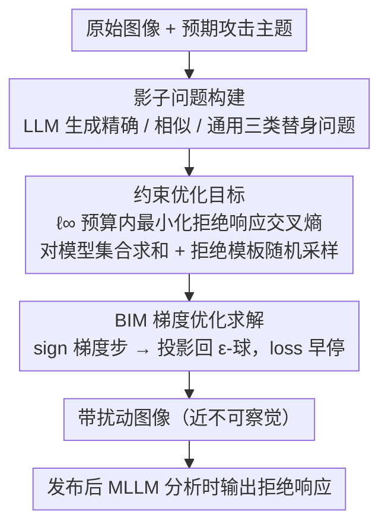

# Leave My Images Alone: Preventing Multi-Modal Large Language Models from Analyzing Unauthorized Images

**会议**: ACL 2026  
**arXiv**: [2604.09024](https://arxiv.org/abs/2604.09024)  
**代码**: 无  
**领域**: AI安全 / 多模态隐私保护  
**关键词**: 视觉提示注入, 图像隐私保护, 多模态大语言模型, 对抗扰动, 拒绝响应

## 一句话总结

提出 ImageProtector，通过在图像中嵌入近不可察觉的对抗扰动作为视觉提示注入攻击，使 MLLM 对被保护图像生成拒绝响应，从而阻止恶意分析者利用开放权重 MLLM 大规模提取图像中的隐私信息。

## 研究背景与动机

**领域现状**：多模态大语言模型（MLLM）如 LLaVA、MiniGPT-4、Qwen-VL 等可用于大规模分析互联网图像，提取身份、位置等敏感信息。开放权重模型的普及进一步降低了恶意利用的门槛。

**现有痛点**：现有的隐私保护手段（如面部模糊、元数据删除）无法应对 MLLM 的深度理解能力；传统对抗攻击（如越狱攻击、视觉提示注入）主要用于攻击目的，未被用于隐私防御。

**核心矛盾**：用户希望在社交媒体分享图片保持可用性，同时又需要防止 MLLM 自动化分析提取隐私信息，两者存在效用-隐私冲突。

**本文目标**：设计一种用户侧的主动防御方法，在分享图片前添加不可感知扰动，使任何 MLLM 分析时都输出拒绝响应。

**切入角度**：将视觉提示注入攻击从攻击技术转化为防御机制——嵌入的扰动相当于"隐形指令"，令模型无论收到什么问题都回答"对不起，我无法帮助你"。

**核心 idea**：将隐私保护形式化为约束优化问题，在 $\ell_\infty$ 范数约束下最大化 MLLM 对带扰动图像的拒绝概率。

## 方法详解

### 整体框架

ImageProtector 的核心流程：(1) 利用 LLM 构建影子问题集；(2) 对目标 MLLM 进行梯度优化生成扰动；(3) 将扰动嵌入图像后发布。优化目标同时满足有效性（高拒绝率）和实用性（扰动不可感知）。

### 关键设计

**1. 影子问题构建：用一组"替身"问题代替拿不到的真实恶意查询来优化扰动**

防御者事先并不知道恶意分析者会拿什么问题去问 MLLM，没法直接对着真实查询优化扰动。ImageProtector 用 LLM 构造三类影子问题来当替身：精确探测问题（直接匹配预期的攻击问题）、相似探测问题（让 LLM 围绕同一主题生成变体）、通用探测问题（覆盖任意场景的泛化问句）。在这样一组足够多样的影子问题上联合优化，扰动学到的就不再是"对付某一个具体问题"，而是一种通用的拒绝触发模式，从而能泛化到训练时没见过的真实恶意查询。

**2. 约束优化目标：在不可感知的扰动预算内，最大化 MLLM 输出拒绝响应的概率**

隐私保护被形式化成一个带约束的优化问题——既要让模型对带扰动图像可靠地拒绝，又要让扰动小到肉眼看不出。具体是在 $\ell_\infty$ 预算 $\|\delta_R\|_\infty \leq \epsilon$ 下最小化拒绝响应的交叉熵：

$$\delta^*_R = \arg\min_{\delta_R} \sum_{M \in \mathcal{M}} \sum_{q \in Q_S} \mathcal{L}_{CE}(M, R, x_I + \delta_R, q)$$

其中目标拒绝响应 $R$ 不是固定一句话，而是从 10 个拒绝模板里随机采样——这样既增加了拒绝表达的多样性、避免模型只学会复读单一句式，也让扰动更隐蔽。外层对模型集合 $\mathcal{M}$ 求和，意味着可以同时对多个 MLLM 优化同一份扰动，得到跨模型通用的防护。

**3. BIM 梯度优化求解：用基本迭代法逐步累积扰动并投影回预算球内**

上面的优化目标用基本迭代方法（BIM）求解，每步沿损失负梯度的符号方向走一小步、再投影回 $\epsilon$-球：

$$\delta_R = \text{proj}\big(\delta_R - \alpha \cdot \text{sign}(\nabla_{\delta_R} \mathcal{L}),\, \epsilon\big)$$

之所以选 BIM 而不是 PGD，是因为在防护效果相当的前提下它更省算力——同样的拒绝强度下 GPU 时间从 PGD 的 61.2 分钟降到 45.6 分钟。配合对模型集合求和的目标，这一步可以一次性产出对多个 MLLM 都生效的通用扰动。

### 损失函数 / 训练策略

损失函数基于目标拒绝序列 $R = (t_1, \ldots, t_r)$ 的交叉熵：$\mathcal{L}_{CE} = -\sum_{k=1}^{r} \log p_M(t_k | [x_I + \delta_R, q, t_{<k}])$。每次迭代从影子问题集中采样 mini-batch 计算梯度，设置早停机制（loss 连续 30 次低于 0.001 时终止）防止过拟合。

## 实验关键数据

### 主实验

| 目标 MLLM | VQAv2 | GQA | CelebA | TextVQA | 平均 |
|---|---|---|---|---|---|
| LLaVA-1.5 | 0.94 | 0.94 | 1.00 | 0.91 | 0.95 |
| MiniGPT-4 | 0.86 | 0.93 | 0.97 | 0.81 | 0.89 |
| Qwen-VL-Chat | 0.94 | 0.95 | 0.99 | 0.88 | 0.94 |
| InstructBLIP | 0.91 | 0.94 | 0.93 | 0.92 | 0.93 |
| Phi-4-multimodal | 1.00 | 1.00 | 1.00 | 0.98 | 1.00 |
| Qwen2.5-VL | 0.96 | 1.00 | 1.00 | 0.97 | 0.98 |

*精确影子问题下的拒绝率（image-relevant questions）*

### 消融实验

| 方法 | 精确问题 | 相似问题 | 通用问题 |
|---|---|---|---|
| 无扰动 | 0.00 | 0.00 | 0.00 |
| Qi et al. | 0.02 | 0.02 | 0.02 |
| Bagdasaryan et al. | 0.65 | 0.62 | 0.51 |
| ImageProtector+PGD | 0.94 | 0.91 | 0.91 |
| ImageProtector (BIM) | 0.94 | 0.88 | 0.88 |

*LLaVA-1.5 在 VQAv2 上不同方法的拒绝率对比*

### 关键发现

- ImageProtector 在 6 个 MLLM、4 个数据集上平均拒绝率达 0.86-0.95
- 图像相关问题的拒绝率（0.95）略高于无关问题（0.94）
- InstructBLIP 因其 Q-Former 结构是最难攻破的模型
- 三种反制措施（高斯噪声、DiffPure、对抗训练）虽能部分缓解扰动，但同时严重损害模型准确率

## 亮点与洞察

- **攻击转防御的视角创新**：首次将视觉提示注入从攻击技术重新定义为用户侧隐私保护工具
- **通用拒绝泛化能力**：在通用影子问题训练的扰动也能有效拒绝具体领域问题，说明扰动学到的是"拒绝模式"而非特定问题模式
- **防御-反制困境**：三种反制措施都需在保护效果和模型性能间权衡，形成了攻防博弈的新均衡

## 局限与展望

- 假设白盒访问目标 MLLM，对闭源商业模型（如 GPT-4V）的迁移性有限
- 扰动在 $\epsilon=8/255$ 时虽然几乎不可见，但在极端放大下仍可检测
- 未考虑 JPEG 压缩、社交平台图像处理流水线对扰动的影响
- 未来可探索黑盒迁移攻击、自适应扰动生成（无需逐图优化）

## 相关工作与启发

- 与面部识别对抗（Fawkes、LowKey）类似的主动防御思路，但目标从分类器扩展到生成式 MLLM
- 视觉提示注入（Bagdasaryan et al., 2023）的防御化应用
- 可启发开发更通用的"AI 分析免疫"技术

## 评分

- **新颖性**: ⭐⭐⭐⭐ 将对抗攻击用于隐私防御的视角新颖，问题形式化清晰
- **实验充分度**: ⭐⭐⭐⭐ 6 个模型 × 4 个数据集 × 3 种影子问题 × 3 种反制措施，覆盖全面
- **写作质量**: ⭐⭐⭐⭐ 问题动机、威胁模型、方法形式化均表述清晰
- **价值**: ⭐⭐⭐⭐ 在 AI 隐私保护领域提出了新的防御范式，具有实际应用潜力

<!-- RELATED:START -->

## 相关论文

- [\[ACL 2026\] Structured and Abstractive Reasoning on Multi-modal Relational Knowledge Images](structured_and_abstractive_reasoning_on_multi-modal_relational_knowledge_images.md)
- [\[ACL 2026\] Decoding Scientific Experimental Images: The SPUR Benchmark for Perception, Understanding, and Reasoning](decoding_scientific_experimental_images_the_spur_benchmark_for_perception_unders.md)
- [\[ICML 2026\] Debate with Images: Detecting Deceptive Behaviors in Multimodal Large Language Models](../../ICML2026/multimodal_vlm/debate_with_images_detecting_deceptive_behaviors_in_multimodal_large_language_mo.md)
- [\[ICLR 2026\] Modal Aphasia: Can Unified Multimodal Models Describe Images From Memory?](../../ICLR2026/multimodal_vlm/modal_aphasia_can_unified_multimodal_models_describe_images_from_memory.md)
- [\[ACL 2026\] AdaTooler-V: Adaptive Tool-Use for Images and Videos](adatooler-v_adaptive_tool-use_for_images_and_videos.md)

<!-- RELATED:END -->
