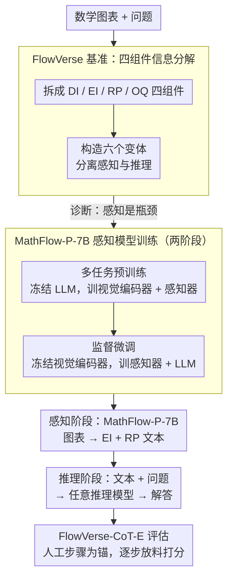

# MathFlow: Enhancing the Perceptual Flow of MLLMs for Visual Mathematical Problems

**会议**: ACL 2026  
**arXiv**: [2503.16549](https://arxiv.org/abs/2503.16549)  
**代码**: [GitHub](https://github.com/MathFlow-zju/MathFlow)  
**领域**: 多模态VLM  
**关键词**: 视觉数学推理, 多模态大模型, 感知与推理解耦, 数学图表理解, 基准测试

## 一句话总结

提出 FlowVerse 基准（将数学问题信息分为 DI/EI/RP/OQ 四个组件并构建六个变体版本）和 MathFlow 模块化管线（将感知和推理解耦为独立阶段），训练专门的感知模型 MathFlow-P-7B 从数学图表中提取关键信息，显著提升各类推理模型的视觉数学问题解决能力。

## 研究背景与动机

**领域现状**：多模态大语言模型（MLLMs）在图像描述、视觉问答等任务上表现出色，但在视觉数学问题求解方面仍有明显不足，特别是对数学图表中几何元素、数值关系等关键信息的感知和解读不够准确。

**现有痛点**：现有方法大多聚焦于改进推理过程（如 CoT 策略、工具辅助推理、强化学习等），忽略了一个关键前提——感知阶段的信息提取质量直接制约推理上限。即使是 GPT-4V 这样的强模型，在从图表中提取关键信息时也存在显著缺陷。现有评测基准（如 MathVista、MathVerse）也无法精细区分感知能力和推理能力的各自贡献。

**核心矛盾**：模型的感知能力和推理能力被耦合在一起训练和评估，导致无法独立优化。感知阶段的错误会级联传播到推理阶段，而现有框架无法诊断瓶颈到底在哪个阶段。

**本文目标**：(1) 构建细粒度基准来独立评估感知和推理能力；(2) 设计模块化管线解耦感知和推理；(3) 训练专门的感知模型提升关键信息提取质量。

**切入角度**：受人类解题过程启发——人类先从图表中提取关键信息（感知），再进行数学推理（推理）。作者将问题信息分解为四个独立组件，通过组合不同组件构建六个变体来精确定位模型短板。

**核心 idea**：将视觉数学问题的信息流分解为描述信息（DI）、关键信息（EI）、推理属性（RP）和问题（OQ），通过控制变量实验证明感知是瓶颈，然后用专门训练的感知模型 + 通用推理模型的管线来解决。

## 方法详解

### 整体框架

本文有两条主线。先用 **FlowVerse** 基准把视觉数学问题的信息拆成可控组件，通过控制变量诊断出「感知（而非推理）才是瓶颈」；再据此设计 **MathFlow**——一个把感知与推理解耦的两阶段模块化管线：(1) 感知阶段：使用专门训练的 MathFlow-P-7B 从数学图表中提取 EI（关键信息如角度值、边长关系）和 RP（推理属性如几何关系推断），转化为文本表示；(2) 推理阶段：将提取的文本信息与原始问题拼接，输入任意推理模型（如 GPT-5、Claude）生成解答。最后用 **FlowVerse-CoT-E** 以人工标注的解题步骤为锚点，评估模型在不同推理深度下的表现。

### 关键设计

**1. FlowVerse 基准的四组件信息分解：把"感知"和"推理"拆成可控变量，精确定位瓶颈在哪一环**

现有基准（MathVista、MathVerse）把感知和推理混在一起评，模型答错了你也不知道是没看清图还是不会推理。FlowVerse 的做法是先把每道题的信息拆成四个独立组件：DI（描述信息，如"三角形 ABC"）、EI（关键信息，如"∠A=45°"）、RP（推理属性，即需要从图中自行推断的中间关系）、OQ（问题本身）。再通过增删/图文转换这些组件，构造出六个变体：Text Centric（全文本）、Text Limited（去 DI）、Text Plus（去图）、Vision Dense（去 RP）、Vision Centric（EI 图化）、Vision Primary（EI+RP 图化）。

这套设计的关键在于把 RP 当成控制变量——比较 Vision Dense（RP 已给出）和 Vision Primary（RP 要自己从图里推）的准确率差，就能单独检验模型"能不能自行推导中间属性"；而比较 Text Centric 和 Vision Centric 则能隔离出"读文字 vs 看图"的纯感知差距。逐对相减得到的差值，直接把"错在感知还是错在推理"量化成可读的数字。

**2. MathFlow-P-7B 感知模型训练：用两阶段、分模块冻结的方式，把"看图"和"推断关系"分开教**

既然感知是瓶颈，就专门训一个感知模型把图表转成可靠的文本。MathFlow-P-7B 基于 Qwen2-VL-7B，分两阶段训练。多任务预训练阶段同时学两件事：EI 描述任务（65 万图文对，教模型"看"出图中的基本元素）和视觉推理任务（13 万样本，把解题步骤拆成序列预测，教模型"推断"隐含的几何关系），两者数据比例 3:1；这一阶段冻结 LLM，只训视觉编码器和感知器。监督微调阶段则反过来——冻结视觉编码器，训练感知器和 LLM，用精心标注的 MathFlow-SFT 数据集。

之所以要分阶段、分模块冻结，是因为"看清基本元素"和"推断隐含关系"是两种不同能力，混在一起训会互相干扰；先固定语言侧专攻视觉感知，再固定视觉侧打磨语言表达，每一步只动该动的模块。最终 EI 的 F1 做到 97.2%，反超 GPT-4o 的 87.7%，印证了专用化训练在子任务上的价值。

**3. FlowVerse-CoT-E 评估策略：用人工标注的解题步骤当锚点，逐步放料评测推理深度**

MathVerse-CoT-E 的评估要先让 GPT 把模型回答拆解成步骤再打分，等于在评测里又引入一个会出错的环节。FlowVerse-CoT-E 改成由专家预先为每题写好权威解题步骤并分解，然后逐步把这些步骤提示喂进 prompt，观察模型在不同推理深度下的表现，最后加权聚合：

$$\text{Score}_{\text{final}} = 0.8 \cdot \frac{1}{N}\sum_{i=1}^N \text{Score}_i + 0.2 \cdot \text{Score}_0$$

其中 $\text{Score}_0$ 是不给任何步骤提示时的得分，$\text{Score}_i$ 是逐步加料后的得分。因为评测锚点来自人工标注而非模型自身的二次拆解，整个打分过程更稳定、噪声更小。

### 损失函数 / 训练策略

多任务预训练阶段学习率 1e-5，监督微调阶段学习率 5e-6，使用 DeepSpeed Zero2。两阶段分别冻结不同模块，确保感知相关组件和语言推理组件独立优化。

## 实验关键数据

### 主实验

在 FlowVerse 基准上（CoT-E 指标）：

| 模型 | All | Text Centric | Vision Dense | Vision Primary |
|------|-----|-------------|-------------|---------------|
| Qwen2.5-VL-7B | 53.8 | 60.1 | 45.0 | 48.1 |
| MathFlow*_Qwen2.5-VL-7B | **57.0** | **62.0** | **49.0** | **52.0** |
| GPT-5 | 65.8 | 74.3 | 53.8 | 60.3 |
| MathFlow*_GPT-5 | **66.5** | **74.6** | **58.2** | **69.4** |

结构化描述质量评估（F1）：

| 模型 | EI (F1) | RP (F1) |
|------|---------|---------|
| GPT-4o | 87.7% | 70.1% |
| Claude-sonnet | 89.1% | 72.8% |
| MathFlow-P-7B | **97.2%** | **85.6%** |

### 消融实验

| 配置 | FlowVerse† 准确率 | 说明 |
|------|-------------------|------|
| 推理模型直接解题 | 基线 | 无感知增强 |
| + MathFlow-P-7B (仅EI) | +2-4% | 关键信息提取有效 |
| + MathFlow-P-7B (EI+RP) | +4-8% | RP推断带来额外增益 |
| 不同推理模型均获提升 | 一致 | 管线通用性强 |

### 关键发现

- 移除图像后模型准确率反而提升（Qwen2-VL-72B +4.3%），说明图像更多是干扰源而非信息源——感知才是真正的瓶颈
- Vision Primary 版本（EI+RP 均在图中）比 Text Centric 版本（全文本）平均下降 10+ 个百分点，证明模型"更善于读文字而非看图"
- MathFlow-P-7B 的 EI F1 达 97.2%，远超 GPT-4o (87.7%)，证明专用感知模型的价值
- 管线对开源和闭源推理模型均有效，说明感知增强具有通用性

## 亮点与洞察

- **信息分解 + 控制变量的评测设计**非常精巧——通过 DI/EI/RP/OQ 的不同组合，可以精确量化每种信息、每种模态对最终结果的贡献，这种方法论可以迁移到其他多模态任务的评测设计中
- **"感知是瓶颈"的结论反直觉但数据充分**——在各类模型上一致观察到去掉图像反而提升准确率，为"先感知后推理"的分离策略提供了强有力的实验基础
- **7B 感知模型超越 GPT-4o**说明专用化训练在特定子任务上可以大幅超越通用大模型，这一思路可迁移到科学图表理解、医学影像分析等领域

## 局限与展望

- RP 的人工标注成本高，限制了数据规模和领域扩展
- 评测集以中英文考试题为主，对大学以上数学或应用数学覆盖有限
- 两阶段管线引入额外推理开销（需要两次模型调用），实时场景需要考虑效率
- 感知模型基于 Qwen2-VL-7B，换用更大基模型是否有进一步提升空间值得探索

## 相关工作与启发

- **vs MathVerse**: MathVerse 主要消除文本冗余确保模型必须看图，但缺少对感知 vs 推理的精细解耦；FlowVerse 通过四组件六变体实现更细粒度的诊断
- **vs 端到端视觉数学模型（如 VLM-R1）**: 端到端方法简单但感知推理耦合、难以独立优化；MathFlow 的模块化设计允许感知和推理分别迭代升级
- **vs 工具辅助推理**: 工具辅助（如 AlphaGeometry）假设输入已被正确解析，本文指出解析本身是瓶颈

## 评分

- 新颖性: ⭐⭐⭐⭐ 信息分解和模块化管线思路清晰，但"分离感知和推理"本身不算全新
- 实验充分度: ⭐⭐⭐⭐⭐ 基准设计精良，评测涵盖大量模型和多个数据集，消融充分
- 写作质量: ⭐⭐⭐⭐ 结构清晰，但表格过多导致阅读负担较重
- 价值: ⭐⭐⭐⭐⭐ FlowVerse 基准和 MathFlow 管线对视觉数学推理领域都有实际推动价值

<!-- RELATED:START -->

## 相关论文

- [\[CVPR 2026\] ViRC: Enhancing Visual Interleaved Mathematical CoT with Reason Chunking](../../CVPR2026/multimodal_vlm/virc_enhancing_visual_interleaved_mathematical_cot_with_reason_chunking.md)
- [\[ACL 2026\] Do MLLMs Understand Pointing? Benchmarking and Enhancing Referential Reasoning in Egocentric Vision](do_mllms_understand_pointing_benchmarking_and_enhancing_referential_reasoning_in.md)
- [\[ACL 2026\] A Survey of Multimodal Mathematical Reasoning: From Perception, Alignment to Reasoning](a_survey_of_multimodal_mathematical_reasoning_from_perception_alignment_to_reaso.md)
- [\[ACL 2026\] ReGATE: Learning Faster and Better with Fewer Tokens in MLLMs](regate_learning_faster_and_better_with_fewer_tokens_in_mllms.md)
- [\[ICML 2026\] Mitigating Perceptual Judgment Bias in Multimodal LLM-as-a-Judge via Perceptual Perturbation and Reward Modeling](../../ICML2026/multimodal_vlm/mitigating_perceptual_judgment_bias_in_multimodal_llm-as-a-judge_via_perceptual_.md)

<!-- RELATED:END -->
