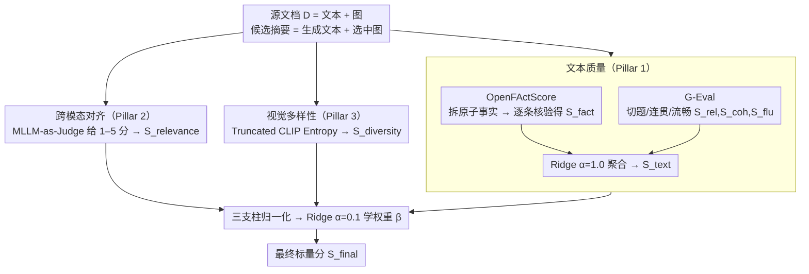

# Measuring What Matters Beyond Text: Evaluating Multimodal Summaries by Quality, Alignment, and Diversity (MM-Eval)

**会议**: ACL 2026  
**arXiv**: [2605.11693](https://arxiv.org/abs/2605.11693)  
**代码**: https://github.com/abidmeeraj/MM-Eval  
**领域**: 多模态评测 / 摘要 / 可解释评测  
**关键词**: 多模态摘要, 评测框架, OpenFActScore, MLLM-as-Judge, Truncated CLIP Entropy

## 一句话总结
针对"多模态摘要带多模态输出 (MSMO)"任务，提出 MM-Eval 评测框架：把文本质量 (OpenFActScore + G-Eval)、跨模态对齐 (MLLM-as-Judge) 和视觉多样性 (Truncated CLIP Entropy) 三个分项分数用 Ridge 回归学到的权重聚合成单一打分，在 mLLM-EVAL 新闻基准上对人类偏好的 Kendall $\tau$ 从 equal-weight baseline 的 0.041 提升到 0.374。

## 研究背景与动机
**领域现状**：MSMO (Multimodal Summarization with Multimodal Output) 要求系统同时输出一段文本摘要 + 一组配图。MLLM (GPT-4V / LLaVA / Qwen-VL) 把生成能力推得很高，但评测仍停留在 ROUGE (文本) + Image Precision (图像) + 它们的 cosine 相似度的"模态孤岛 (Silo Effect)"——每个分项单独用 unimodal 指标算，没有任何指标真的回答"文字和图加起来是不是一个忠实有用的摘要"。

**现有痛点**：(1) ROUGE 只看 n-gram，看不出语义等价和事实错误，summaries hallucinated 仍可拿高分；(2) Image Precision 假设有一个"正确图集"，模型选了语义等价但不一样的图就 0 分；(3) 整体打分要么用 MMAE 那种把 ROUGE+IP+cos 简单线性回归（仍然受 ROUGE 拖累），要么用 mLLM-Eval 直接让 GPT-4V 给整体分（贵且 black-box，没法定位短板）。

**核心矛盾**：(a) **可解释性 vs 准确性** —— LLM-as-judge 准但是 opaque，分项指标可解释但跟人评相关性差；(b) **参考依赖 vs 通用性** —— 多数指标要 reference summary，但跨领域的参考标准并不一致。

**本文目标**：构建一个 (1) 三维分项 + 一维聚合的模块化框架；(2) 三个分项全是 reference-weak（只依赖 source + 系统输出）以便跨领域迁移；(3) 聚合权重学自人类偏好以反映"哪个维度更重要"。

**切入角度**：作者观察到人类对摘要质量的判断本质上是分层的——一旦事实错误就直接否决（gatekeeper effect），其它维度只在事实过关后才起作用。这种**非线性的、有阈值的人类判断**用 equal-weight 平均根本捕捉不到，必须学权重。

**核心 idea**：用「decompose-then-verify」的原子事实抽取做 factual consistency、用 G-Eval 做软质量、用 MLLM-as-Judge 做跨模态对齐、用 Truncated CLIP Entropy 做视觉多样性，最后用 Ridge 回归在 mLLM-EVAL 上学聚合权重。

## 方法详解

### 整体框架
MM-Eval 接收源文档 $D = \{T_{source}, V_{source}\}$ 和候选摘要 $S_{cand} = \{T_{gen}, V_{sel}\}$，输出标量 $S_{final}$。pipeline 三个并行 pillar 后做两阶段 Ridge 回归：(1) 文本质量 $S_{text}$ —— 子分量 $S_{fact}, S_{rel}, S_{coh}, S_{flu}$ 内部用 Ridge ($\alpha=1.0$) 聚合；(2) 跨模态对齐 $S_{relevance}$ —— MLLM 给出 1–5 分；(3) 视觉多样性 $S_{diversity}$ —— TCE 输出 log-entropy。三大 pillar 归一化到 $[0,1]$ 后再用 Ridge ($\alpha=0.1$) 学最终系数 $\beta$，目标是最小化与人类 overall score 的 MSE。整个流程使用开源模型 (Mistral-7B-Instruct, LLaVA-Mistral, ViT-B/32)，温度 = 0 保证可复现。

### 关键设计

**1. Pillar 1：文本质量 = OpenFActScore（硬事实）+ G-Eval（软质量），把事实和文风分开度量再合并**

ROUGE 只看 n-gram，一段事实全错但读起来流畅的摘要照样能拿高分。MM-Eval 的第一根支柱把"事实对不对"和"语言好不好"拆成两类异质指标分别评。事实侧走 decompose-then-verify：先用 instruction-tuned LLM 把生成摘要 $T_{gen}$ 分解为原子事实集合 $A=\{a_1,\dots,a_m\}$，再让第二个 LLM 对每个 $a_i$ 二元判别是否被源文支持，得 $S_{fact} = \frac{1}{|A|}\sum_i v_i$。文风侧用 G-Eval 的 CoT + 概率加权打分，给出切题 $S_{rel}$、连贯 $S_{coh}$、流畅 $S_{flu}$。

四个子分量再用 Ridge（$\alpha=1.0$）聚合成 $S_{text} = w_1 S_{fact} + w_2 S_{rel} + w_3 S_{coh} + w_4 S_{flu}$，学到的权重是事实 0.55、连贯 0.29、流畅 0.15、切题 0.02。原子化的好处是分数对 paraphrase 和长度免疫——把事实评估从"n-gram recall"提升到"fact-level precision"；G-Eval 的概率加权则压住了 LLM 在相邻分数间反复横跳的方差问题。

**2. Pillar 2：MLLM-as-a-Judge 跨模态对齐，绕开 Image Precision"必须选中参考图"的死规矩**

Image Precision 假设有一个标准图集，模型选了语义等价但不在集里的图就 0 分。第二根支柱改用 LLaVA-v1.6-mistral-7b 当 judge，对每个（文本片段，候选图）对先做 CoT 推理，再输出 1–5 的 likert 分，归一化到 $[0,1]$。它判断的不是"图和文字像不像"，而是图有没有在语义上 complement / supplement 文字——是否补充了文字里没点明的细节。

这种 pragmatic 推理只有强 MLLM 做得了，而 CoT 推理又稳定了打分方差。这根支柱内部刻意不再拆子指标、保持单一分数，目的是将来 MLLM 升级了可以直接换 judge，框架其余部分不用动。

**3. Pillar 3：Truncated CLIP Entropy 视觉多样性，用谱熵惩罚"语义冗余"而非"视觉差异"**

示威新闻里常配好几张同一场景不同角度的照片，pixel-level 或 pairwise 距离会判它们"差异很大"，但信息上是冗余的。TCE 换个角度：对选出的 $k$ 张图取 CLIP embedding $F$，算经验协方差 $C$ 的特征值 $\lambda_i$，取前 20 大特征值归一化为概率 $p_i$，再算 Von Neumann 熵：

$$S_{diversity} = -\sum_{i=1}^k p_i \log(p_i)$$

它度量的是"图集在 CLIP 语义空间里占了多大体积"——只有当图真的语义重叠时熵才会塌下来，所以惩罚的是信息冗余而非画面相似。这个度量天然 reference-free，不像 FID 那样需要海量样本估分布，特别适合 MSMO 每篇摘要才 3–5 张图的小集合。

### 损失函数 / 训练策略
两阶段 Ridge 回归。阶段 1：在 mLLM-EVAL 的 ~1500 条人评样本上用 5-fold CV 学 $S_{text}$ 内部 4 个权重 ($\alpha=1.0$)；阶段 2：学三大 pillar 的最终系数 $\beta$ ($\alpha=0.1$)，目标 $\hat\beta = \arg\min_\beta \sum_i (\beta^T X_i - y_{human}^{(i)})^2$，数据 80/20 按 summarization 系统分层切分。学到的签名系数：$\beta_{text} = 2.7721$（正且大），$\beta_{relevance} = 0.2256$（正小），$\beta_{diversity} = -0.4991$（**负**，因为该数据集里冗余图集常与弱文本共现，构成 confounder）。

## 实验关键数据

### 主实验：MM-Eval 整体与 baseline 对比 (mLLM-EVAL 新闻基准, 1562 标注)

| 评测器 | Kendall $\tau$ | Spearman $\rho$ | Pearson $r$ | $R^2$ | RMSE |
|---|---|---|---|---|---|
| Equal weights baseline | 0.041 | 0.058 | — | — | — |
| 仅文本 pillar | 0.369 | 0.506 | — | — | — |
| 仅跨模态 pillar (MLLM judge) | −0.085 | −0.110 | — | — | — |
| 仅多样性 pillar (TCE) | −0.089 | −0.124 | — | — | — |
| **MM-Eval (full, learned weights)** | **0.374** (CI [0.300, 0.444]) | **0.514** (CI [0.417, 0.597]) | **0.611** | **0.372** | **0.828** |

学到的 pillar 权重稳定性（50 次 resample）：$w_{text} = 0.7572 \pm 0.043$（绝对主导）、$w_{relevance} = 0.070 \pm 0.022$、$w_{diversity} = 0.173 \pm 0.022$。文本内部：事实 0.551、连贯 0.287、流畅 0.145、切题 0.017。

### 消融：去掉单个 pillar 对 Kendall $\tau$ 的影响

| 配置 | Kendall $\tau$ | 相对 full 变化 |
|---|---|---|
| Full MM-Eval | 0.3744 | — |
| w/o $S_{text}$ | −0.0835 | **−122%**（直接翻负） |
| w/o $S_{relevance}$ | 0.1716 | −54% |
| w/o $S_{diversity}$ | 0.1123 | −70% |

### 关键发现
- **事实一致性是"门控函数"，不是普通线性贡献**：人评 consistency bin 1 (n=225) 的 P(Overall≥4) = 0.000、P(Overall≤2) = 0.933；bin 5 (n=937) 翻转到 P(Overall≥4) = 0.819。Ridge 的高 $w_{fact}$ 正是在模拟这种"事实低分一票否决"的非线性。
- **单个视觉 pillar 的边际相关性 (−0.085 / −0.089) 看起来负贡献，但消融显示去掉它们 $\tau$ 掉一半以上**——视觉信号是 conditional / interaction 性质的：只在文本过关后才补充信息，独立看反而被 confounded by "选弱图的系统通常也写弱文本"。这是本论文最有方法论意义的发现：**边际相关 ≠ 联合贡献**。
- **新闻领域是 text-dominant，但不能据此推到所有领域**：人评 200 条补充实验显示，标注者对 image relevance (4.04) 和 diversity (3.89) 同样打高分，说明 0.79 的 $w_{text}$ 是"边际贡献"结构而非"人类不在乎视觉"。
- **可解释性 + 可迁移性**：所有 pillar 都 reference-weak，新领域只需重新 fit 三个 $\beta$（几十到几百条人评），底层 scorer 无需重训。

## 亮点与洞察
- **"门控函数 + 联合学权"是评测框架的范式升级**：把"事实是 deal-breaker"这一直觉量化为 Ridge 系数，而不是用 if-then 规则硬编码，既保留可解释性又能数据驱动调整。
- **Negative 系数也是合理结果**：$\beta_{diversity} = -0.4991$ 不意味着"多样性有害"，而是说在该数据集分布下，diversity 与质量呈现 spurious 负相关。这种坦诚报告负系数 + 用 ablation 反证 "去掉它会更糟"的论证方式，是评测论文里少见的严谨做法。
- **TCE 用谱熵做语义多样性**：相比 pairwise distance / FID，谱熵只看 covariance 的特征值分布，既反映了"图集占据多大语义体积"又对单张图扰动鲁棒，是个被低估的 reference-free 多样性度量。
- **方法学启示**：评测论文不一定要造新模型，把已有 scorer 用 Ridge 这种"无脑但有效"的方式聚合 + 严密统计分析 (CI / bootstrap / 50 次 resample / 分层 CV) 就能拿到强 baseline。

## 局限与展望
- 作者承认：(1) 仅在 text-dominant 新闻领域验证，image-dominant 域 (产品评论 / 技术文档) 可能完全反过来；(2) Kendall $\tau = 0.374$ 是 moderate，对接近的系统 ranking 仍需配合人评；(3) 视觉 pillar 的 negative 边际相关可能部分由 TCE / LLaVA judge 本身的 proxy noise 造成。
- 我看到的局限：(1) Ridge 是线性聚合，但论文自己揭示了"非线性 gatekeeper" 行为，建议改用单调神经网或带阈值的 piecewise-linear 模型来直接建模门控效应；(2) `wdiversity=0.173` 和 `βdiversity=−0.499` 之间的符号矛盾来自"权重 = 归一化贡献"与"回归系数"的差异，论文交代不够清楚，可能造成读者误解；(3) 训练数据 ~1500 条对学 4 个 + 3 个权重虽够，但只有 9 个 system，aggregation 可能过拟合到这 9 个系统的"风格"上。
- 改进方向：把 OpenFActScore 升级为 multimodal fact verification (利用 $V_{source}$)、引入 image-grounded factuality；扩展到对话摘要、报告生成等更多 MSMO 子任务。

## 相关工作与启发
- **vs MMAE (Zhu et al. 2018)**：MMAE 也是回归聚合 ROUGE+IP+cos 三个分项，但底层指标都是 reference-based 且语义浅；MM-Eval 同样的聚合思路，但每个分项都升级为 LLM/MLLM-based reference-weak 指标。
- **vs mLLM-Eval (Zhuang et al. 2024)**：mLLM-Eval 直接让 GPT-4V 给整体分，准确但 black-box；MM-Eval 分解为可独立替换的 pillar，可解释性 + 模块化更强，且开源模型即可。
- **vs FActScore / OpenFActScore**：作者直接复用 OpenFActScore 做事实子分量，贡献在于把"如何把 fact 子分数与其它子分数合并"这一被遮蔽的问题端到端解决。
- **vs FID / Inception Score (视觉多样性)**：TCE 不需要海量样本估分布，更适合 MSMO 这种每篇摘要 3–5 张图的小集合场景。

## 评分
- 新颖性: ⭐⭐⭐☆☆ 框架本身是已有 scorer 的有机组合，但"learned aggregation + 揭示 gatekeeper effect + 边际相关 ≠ 联合贡献"在评测方法学上有实质贡献。
- 实验充分度: ⭐⭐⭐⭐☆ 统计分析非常扎实（bootstrap CI / 50 次 resample / 5-fold CV / 补充人评 200 条 / 多模型 ablation），但仅在单一新闻数据集验证。
- 写作质量: ⭐⭐⭐⭐☆ 数学符号清晰，对负系数等容易引起争议的结果有专门段落解释，逻辑链完整。
- 价值: ⭐⭐⭐⭐☆ 对做 MSMO / 多模态生成评测的研究者直接可用；其"learned aggregation + gatekeeper analysis"范式可迁移到任何多维度评测任务。

<!-- RELATED:START -->

## 相关论文

- [\[ACL 2026\] Beyond Screenshots: Evaluating VLMs' Understanding of UI Animations](beyond_screenshots_evaluating_vlms_understanding_of_ui_animations.md)
- [\[ACL 2025\] VF-Eval: Evaluating Multimodal LLMs for Generating Feedback on AIGC Videos](../../ACL2025/multimodal_vlm/vf_eval_aigc_video_feedback.md)
- [\[CVPR 2026\] Learning What Matters: Prioritized Concept Learning via Relative Error-driven Sample Selection](../../CVPR2026/multimodal_vlm/learning_what_matters_prioritized_concept_learning_via_relative_error-driven_sam.md)
- [\[ACL 2026\] What's Missing in Screen-to-Action? Towards a UI-in-the-Loop Paradigm for Multimodal GUI Reasoning](what39s_missing_in_screen-to-action_towards_a_ui-in-the-loop_paradigm_for_multim.md)
- [\[ACL 2026\] More Than Meets the Eye: Measuring the Semiotic Gap in Vision-Language Models via Semantic Anchorage](more_than_meets_the_eye_measuring_the_semiotic_gap_in_vision-language_models_via.md)

<!-- RELATED:END -->
