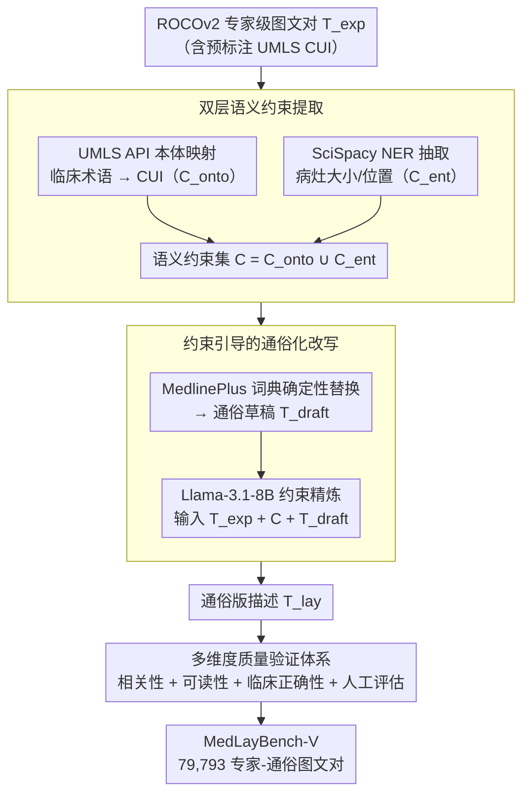

# MedLayBench-V: A Large-Scale Benchmark for Expert-Lay Semantic Alignment in Medical Vision Language Models

**会议**: ACL 2026  
**arXiv**: [2604.05738](https://arxiv.org/abs/2604.05738)  
**代码**: [GitHub](https://github.com/) (Project Page 提供)  
**领域**: 多模态VLM / 医学NLP  
**关键词**: 医学视觉语言模型, 专家-通俗语义对齐, 医学文本简化, UMLS, 多模态基准

## 一句话总结

本文提出 MedLayBench-V，首个大规模多模态医学专家-通俗语义对齐基准（79,793 图文对），通过 Structured Concept-Grounded Refinement (SCGR) 流水线将专业放射学报告转化为通俗描述，确保临床语义保真的同时将阅读难度从研究生级别降至高中水平，零样本检索实验表明通俗描述仅带来不到 1% 的性能损失。

## 研究背景与动机

**领域现状**：医学视觉语言模型（Med-VLM）已在诊断影像解读方面达到专家级水平，但主要在专业文献上训练，输出以临床术语为主。文本领域的医学通俗化（MLLG）研究已较成熟，BioLaySumm 等共享任务推动了医学文本简化的发展。

**现有痛点**：(1) 现有多模态医学数据集（如 ROCOv2、PMC-OA）全部由专业级报告组成，没有通俗版本的标注；(2) 直接用 LLM 生成通俗描述存在幻觉风险——约 6-7% 的简化报告包含事实错误或关键信息遗漏；(3) 传统 n-gram 指标（BLEU、ROUGE）天然惩罚词汇替换，不适合评估专家到通俗的翻译质量。

**核心矛盾**：文本领域的通俗化能力尚未渗透到多模态系统中——VLM 能将视觉特征编码为"Pneumothorax"这样的技术术语，但缺乏训练数据来学习其对应的通俗表达"collapsed lung"。

**本文目标**：构建首个多模态医学双语域基准（专家+通俗），支持训练和评估能够跨越临床专家与患者之间沟通鸿沟的 Med-VLM。

**切入角度**：借鉴文本领域利用结构化医学知识增强摘要相关性的做法，将其扩展到多模态领域，通过 UMLS 本体映射和 NER 实体约束确保通俗化的语义保真。

**核心 idea**：将语义提取与风格改写显式解耦——先用 UMLS CUI 映射和 NER 提取语义约束，再在约束下用 LLM 进行通俗化改写，从而在防止幻觉的同时实现可控的语言简化。

## 方法详解

### 整体框架

SCGR 流水线把数据构建拆成"先定语义、再改风格"，外加一道质量验证。输入是 ROCOv2 数据集的专家级图文对（$T_{exp}$，已预标注 UMLS CUI），输出是语义等价的通俗版本（$T_{lay}$）。第一步**双层语义约束提取**（Concept-Knowledge Alignment）从专家报告里抽出"必须保留什么"，得到语义约束集 $C$；第二步**约束引导的通俗化改写**（Knowledge-Constrained Refinement）先用 MedlinePlus 词典生成通俗草稿、再用 Llama-3.1-8B-Instruct 在约束下精炼成 $T_{lay}$；最后用**多维度质量验证体系**从相关性、可读性、临床正确性三条线给整库把关。整条流水线的核心思想是把语义提取与风格改写显式解耦——先锁定"说什么"，再处理"怎么说"，从根本上抑制端到端生成的幻觉。

### 关键设计

**1. 双层语义约束提取（Concept-Knowledge Alignment）：用本体 + NER 两层抓取，搭起专家报告到通俗描述的语义桥梁**

直接让 LLM 把"Pneumothorax"改写成"collapsed lung"，很容易顺手把病灶大小、位置这类关键定量信息漏掉或编错。SCGR 的第一步是先从专家报告里把"必须保留什么"显式抽出来，分宏观和微观两层。宏观层用 UMLS Metathesaurus API 把临床术语映射到 CUI（如 C0040405 → "CTPA"），得到本体约束集 $C_{onto}$，锚住核心病理概念；微观层用 SciSpacy 的 NER 模型抽取定量属性和空间描述符（如病灶大小、位置），得到实体约束集 $C_{ent}$。两者求并得到最终约束集 $C = C_{onto} \cup C_{ent}$。

之所以两层都要，是因为单纯 CUI 映射会把数值和空间细节漏掉，而纯 NER 又缺了高层语义锚定——一个管"是什么病"，一个管"多大、在哪"，合起来才能既不丢核心概念也不丢关键数字。这个约束集是后续防幻觉的依据。

**2. 约束引导的通俗化改写（Knowledge-Constrained Refinement）：先用权威词典换词，再让小模型只管顺句子**

有了约束集，第二步才动笔改写，目标是把阅读难度从研究生级降到高中水平，同时一个字的诊断信息都不能错。做法分两步：先查 UMLS 里的 MedlinePlus 患者友好词汇库，通过确定性字典替换生成初始通俗草稿 $T_{draft}$——词汇可靠但语法可能磕巴；再用 Llama-3.1-8B-Instruct 在结构化 prompt 下精炼，prompt 里同时塞进原文 $T_{exp}$（做事实锚定）、约束集 $C$（防幻觉）和草稿 $T_{draft}$（做词汇引导）。

这里特意选 8B 而非更大的模型：因为语义保真已经由前面的结构化约束兜底了，LLM 只剩"把粗糙草稿润成通顺句子"这一件轻活，小模型完全够用，也更适合处理约 80K 样本的规模。换句话说，把"说什么"交给确定性的词典和约束，把"怎么说"才交给 LLM。

**3. 多维度质量验证体系：相关性、可读性、临床正确性三条线同时把关，单一指标盖不住**

专家到通俗的翻译质量没法用一个数字说清——BLEU/ROUGE 这类 n-gram 指标天然惩罚词汇替换，而通俗化本来就是大量换词，用它们评等于自相矛盾。所以验证拆成三个维度各管一段：相关性用 BLEU-4 / ROUGE-L / METEOR 看表面相似度；可读性用 FKGL、CLI 等阅读难度指标加上 LENS（专为文本简化设计的可学习指标）；临床正确性用 RaTEScore 和 GREEN 专门检测幻觉和临床事实错误。最后再加一道人工评估——两名放射科医生 + 一名非专业读者在 5 分量表上打分。

三维并行的理由是：有效的医学通俗化评估必须同时盯住视觉锚定、事实正确和通俗可达，任何单一指标都会漏掉另外两个维度的失败。

### 损失函数 / 训练策略

SCGR 流水线是数据构建方法，不涉及端到端训练。Llama-3.1-8B-Instruct 以推理模式使用，无需微调。下游实验采用零样本检索协议评估。

## 实验关键数据

### 主实验

**零样本图文检索性能（Recall@1, %）**

| 模型 | Image→Text (Expert / Layman) | Text→Image (Expert / Layman) |
|------|------|------|
| BiomedCLIP | 31.06 / 30.70 | 32.50 / 32.07 |
| PMC-CLIP | 28.98 / 28.38 | 30.90 / 30.24 |
| BMC-CLIP | 22.69 / 22.42 | 23.04 / 23.21 |
| PubMedCLIP | 4.61 / 4.26 | 4.85 / 4.71 |
| OpenCLIP-Huge | 3.33 / 3.44 | 5.17 / 5.15 |
| OpenAI-CLIP | 1.23 / 1.08 | 1.57 / 1.54 |

### 消融实验

| SCGR 配置 | CUI | MedlinePlus | LLM | 平均 R@1 |
|-----------|-----|-------------|-----|----------|
| LLM Only | ✗ | ✗ | ✓ | 1.96 |
| LLM + CUI | ✓ | ✗ | ✓ | 2.08 |
| SCGR (完整) | ✓ | ✓ | ✓ | 11.26 |
| Expert (原始) | — | — | — | 11.44 |

### 关键发现

- 通俗化后的检索性能降幅极小——BiomedCLIP 的 I2T R@1 仅从 31.06% 降至 30.70%，证明 SCGR 成功保留了核心诊断语义
- 去掉结构化约束（LLM Only）导致 R@1 暴跌 83%（从 11.44 到 1.96），证实约束引导是防止幻觉的关键
- 阅读难度指标 FKGL 从 13.10 降至 10.35，词汇量减少 46.1%，可读性显著提升
- 人工评估四个维度均超 4.5/5.0，事实正确性和完整性达 4.86
- 医学领域 VLM 显著优于通用 VLM（BiomedCLIP R@1 ~31% vs OpenAI-CLIP ~1%），说明领域适应的重要性

## 亮点与洞察

- 语义提取与风格改写的显式解耦是核心创新——先确保"说什么"再处理"怎么说"，从根本上避免了端到端生成中常见的幻觉问题。这个思路可迁移到任何需要保持语义不变但改变表达风格的任务
- 用 MedlinePlus 作为通俗化桥梁既权威又实用——NLM 维护的患者教育词汇表天然就是"专家→通俗"的映射字典，直接利用比训练模型来学习映射更可靠
- 消融实验清楚地表明，CUI 提取只是必要条件，真正的性能恢复来自 MedlinePlus 的知识约束精炼

## 局限与展望

- 依赖合成数据——通俗描述由 LLM 生成而非人工撰写，可能缺乏真实患者交流中的语言细微差异
- 仅覆盖英文——多语言医学通俗化需求未被满足
- 继承了 ROCOv2 的模态不平衡问题
- 未来可扩展到视觉问答、报告生成等更复杂的下游任务来充分暴露专家-通俗表征对齐差距

## 相关工作与启发

- **vs BioLaySumm**: BioLaySumm 是纯文本的通俗化共享任务，MedLayBench-V 是首个多模态版本，增加了视觉锚定维度
- **vs Layman's RRG**: 仅限胸部 X 光单一模态且数据量小，MedLayBench-V 覆盖 7 种模态共 80K 样本
- **vs 端到端 LLM 简化**: 直接用 LLM 简化存在 6-7% 的事实错误率，SCGR 通过结构化约束将幻觉控制在最低

## 评分

- 新颖性: ⭐⭐⭐⭐⭐ 首个多模态医学专家-通俗对齐基准，SCGR 流水线设计巧妙
- 实验充分度: ⭐⭐⭐⭐ 8个模型零样本检索+消融+人工评估，但缺乏微调实验
- 写作质量: ⭐⭐⭐⭐⭐ 结构严谨，动机清晰，消融令人信服
- 价值: ⭐⭐⭐⭐⭐ 填补了多模态医学 AI 以患者为中心的关键资源空白

<!-- RELATED:START -->

## 相关论文

- [\[ACL 2026\] ChartDiff: A Large-Scale Benchmark for Comprehending Pairs of Charts](chartdiff_a_large-scale_benchmark_for_comprehending_pairs_of_charts.md)
- [\[ACL 2026\] Cross-Cultural Expert-Level Art Critique Evaluation with Vision-Language Models](cross-cultural_expert-level_art_critique_evaluation_with_vision-language_models.md)
- [\[ACL 2026\] Doc-PP: Document Policy Preservation Benchmark for Large Vision-Language Models](doc-pp_document_policy_preservation_benchmark_for_large_vision-language_models.md)
- [\[CVPR 2025\] VILA-M3: Enhancing Vision-Language Models with Medical Expert Knowledge](../../CVPR2025/multimodal_vlm/vila-m3_enhancing_vision-language_models_with_medical_expert_knowledge.md)
- [\[ACL 2026\] MMErroR: A Benchmark for Erroneous Reasoning in Vision-Language Models](mmerror_a_benchmark_for_erroneous_reasoning_in_vision-language_models.md)

<!-- RELATED:END -->
