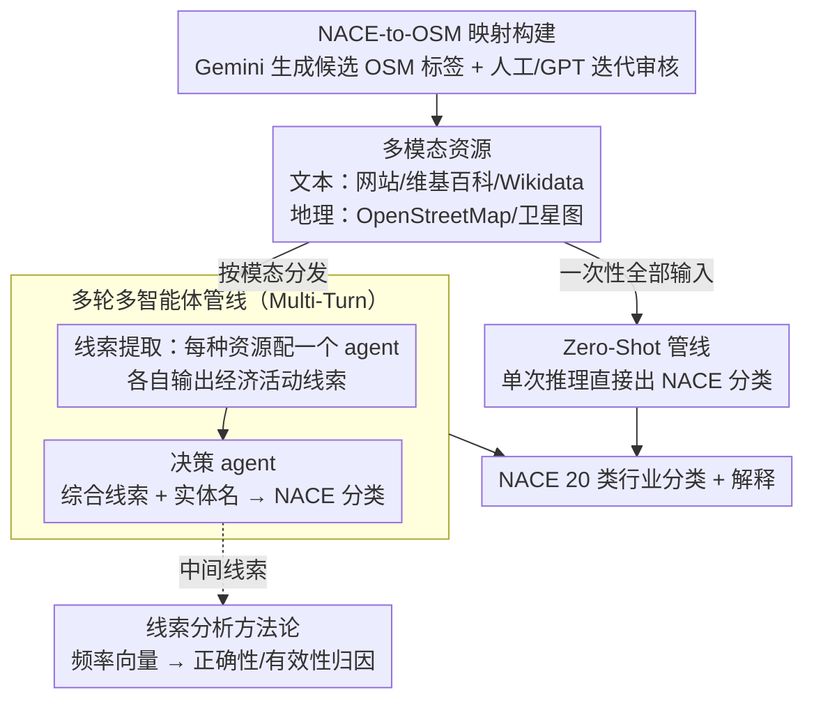

# MONETA: Multimodal Industry Classification through Geographic Information with Multi Agent Systems

**会议**: ACL 2026  
**arXiv**: [2604.07956](https://arxiv.org/abs/2604.07956)  
**代码**: [GitHub](https://github.com/trusthlt/Moneta)  
**领域**: 遥感 / 多模态理解  
**关键词**: 行业分类, 地理信息, 多模态LLM, 多智能体, OpenStreetMap

## 一句话总结

本文提出 MONETA，首个结合文本（网站、维基百科、Wikidata）和地理空间数据（OpenStreetMap、卫星图像）的多模态行业分类基准，并设计零样本和多轮多智能体两种无训练管线，使用开源和闭源 MLLM 在 20 类 NACE 行业分类上达到 62.10%-74.10% 准确率，多轮设计最高提升 22.80%。

## 研究背景与动机

**领域现状**：行业分类方案（如 NACE、ISIC、GICS）是公共和企业数据库的核心组成部分。现有自动分类方法主要依赖文本（公司描述、财务报告、网站），且通常需要微调模型。

**现有痛点**：(1) 纯文本方法对新成立或小型企业不适用，因为这些企业可能没有公开的文本信息；(2) 微调模型需要大量数据收集且无法跨分类方案迁移；(3) 地理空间信息（如公司的地理位置和周边环境）包含强烈的行业线索但从未被系统利用。

**核心矛盾**：企业的经济活动与其空间位置高度相关（工厂在工业区、银行在商业街），但现有行业分类完全忽视了这种空间-经济的关联。

**本文目标**：构建首个多模态行业分类基准并探索 MLLM 能否利用地理空间信息进行行业分类。

**切入角度**：将 OpenStreetMap 和卫星图像作为除文本之外的补充信息源，通过多智能体架构让不同模态的线索分别由专门的 agent 提取再由决策 agent 综合判断。

**核心 idea**：多模态资源 + 多智能体 + 无训练——每种资源由专门 agent 提取经济活动线索，决策 agent 综合所有线索分类，全程无需训练。

## 方法详解

### 整体框架

MONETA 框架有两种管线：(1) Zero-Shot——将所有可用资源一次性输入 MLLM，直接生成分类；(2) Multi-Turn——分两阶段：线索提取阶段中每种资源由独立的 MLLM agent 处理生成经济活动线索，决策阶段中决策 agent 综合所有线索和实体名称做最终分类。这两套管线都建立在「NACE-to-OSM 映射」打通的地理数据之上，运行后再用「线索分析方法论」对各 agent 做归因。

### 关键设计

**1. NACE-to-OSM 映射构建：在行业分类体系和地理数据之间架一座桥**

要让模型用地理空间线索做行业分类，前提是知道"某个 NACE 行业对应 OpenStreetMap 里哪些标签"，但这层映射此前根本不存在。MONETA 半自动地把它造出来：先用 Gemini 从 NACE 官方指南的 RDF/XML 生成候选 OSM 标签，再经人工审核与 GPT/Gemini 多轮迭代修正，得到每个 NACE 节经验证的 OSM 标签列表；随后按这些标签查询欧洲 OSM 数据，并用名称、地址、外部链接做质量过滤。人工审核这一环保证了映射不会把"工厂"错连成"零售店"，这张映射本身也成了可被后续工作复用的产出。

**2. 多轮多智能体管线（Multi-Turn）：每种信息源先各自提线索，再交给决策 agent 综合**

把 OSM、卫星图、Wikidata、维基百科、网站一股脑塞进一次推理，MLLM 很容易在多种模态间串味、互相干扰。MONETA 改成两阶段：线索提取阶段让每种资源配一个专门的 agent，各自输出一段包含经济活动关键词的自由文本；决策阶段再由决策 agent 汇总所有中间线索、实体名称和 NACE 节描述做最终分类。这更贴近人类专家的审核流程——先分别看公司周边的地标、卫星影像、官网文字，再综合下判断，因此多轮管线比一次性的零样本管线一致更优、最高提升 22.80%。

**3. 线索分析方法论（频率向量）：量化每个 agent 到底帮了忙还是帮了倒忙**

多智能体系统的麻烦在于事后说不清是哪个资源贡献了正确线索、哪个把决策带偏了。MONETA 用频率向量来归因：把每个 agent 提取的关键词按 NACE 节分组、归一化成一个频率向量，再取真实标签和预测标签对应的索引，分别构成正确性向量和有效性向量——正确性衡量该 agent 的线索与真实标签有多相关，有效性衡量它对最终预测施加了多大影响。两者一对照就能看出，比如 OSM 和网站的有效性最高，而卫星图正确性偏低、只能作为文本的补充。

### 损失函数 / 训练策略

完全无训练框架。评估了 InternVL 2.5/3、Llava 1.6、QwenVL 2.5 等开源模型以及 Gemini 2.5 和 GPT-5 等闭源模型。

## 实验关键数据

### 主实验

**不同输入配置下的 Zero-Shot 分类准确率（部分模型）**

| 模型 | 无额外输入 | 卫星图 | 外部文本 | 全部输入 |
|------|-----------|--------|---------|---------|
| InternVL 2.5-38B | 46.30 | 49.80 | 58.40 | 60.10 |
| InternVL 3-78B | 43.40 | 47.80 | 60.40 | 58.80 |
| QwenVL 2.5-72B | — | — | — | ~62% |

### 消融实验

**Multi-Turn vs Zero-Shot 提升**

| 配置 | 说明 |
|------|------|
| 多轮 + 上下文丰富 + 解释 | 最高提升 +22.80% |
| 扩展 prompt（含 NACE 描述） | 比简单 prompt 显著提升 |
| 卫星图像 | 单独使用效果有限，但与文本组合有增益 |

### 关键发现

- 外部文本资源（网站/维基）对分类贡献最大，卫星图像单独使用效果有限
- 多轮多智能体管线一致优于零样本管线，最高提升 22.80%
- 分类解释（JSON 输出含 reasoning）比纯标签输出准确率更高
- 闭源模型（GPT-5、Gemini 2.5）达到 ~74%，显著优于开源模型
- 线索分析揭示 OSM 和网站的有效性最高，卫星图的正确性较低但与文本互补

## 亮点与洞察

- 首次将地理空间信息引入行业分类——开创了一个新的跨领域研究方向
- NACE-to-OSM 映射本身就是有价值的研究产出，可被后续工作复用
- 频率向量的线索分析方法为多智能体系统的中间步骤评估提供了量化工具

## 局限与展望

- 1000 个样本的基准规模较小，每类仅 50 个样本
- 地理空间资源的分辨率和覆盖度因地区而异
- 未探索更细粒度的 NACE 分类（如 88 个 division 或 272 个 group）
- 卫星图像的贡献有限，可能需要更高分辨率或更好的视觉理解能力

## 相关工作与启发

- **vs 纯文本行业分类 (Kühnemann et al.)**: 后者仅用网站文本，本文引入地理空间模态
- **vs 遥感分类 (UC Merced, AID)**: 后者做土地利用分类而非企业级行业分类
- **vs 微调方法**: 微调需要大量标注数据且限于单一分类方案，本文无训练框架适应性更强

## 评分

- 新颖性: ⭐⭐⭐⭐ 首个多模态行业分类基准，地理空间+文本的组合新颖
- 实验充分度: ⭐⭐⭐⭐ 多模型 × 多配置 × 多管线 + 新颖的线索分析方法
- 写作质量: ⭐⭐⭐⭐ 研究问题清晰，数据集构建流程详细
- 价值: ⭐⭐⭐⭐ 开源基准和映射对后续研究有重要推动作用

<!-- RELATED:START -->

## 相关论文

- [\[ICLR 2026\] Why Keep Your Doubts to Yourself? Trading Visual Uncertainties in Multi-Agent Bandit Systems](../../ICLR2026/multimodal_vlm/why_keep_your_doubts_to_yourself_trading_visual_uncertainties_in_multi-agent_ban.md)
- [\[ACL 2026\] GeoArena: Evaluating Open-World Geographic Reasoning in Large Vision-Language Models](geoarena_evaluating_open-world_geographic_reasoning_in_large_vision-language_mod.md)
- [\[ACL 2026\] From Verbatim to Gist: Distilling Pyramidal Multimodal Memory via Semantic Information Bottleneck](from_verbatim_to_gist_distilling_pyramidal_multimodal_memory_via_semantic_inform.md)
- [\[ICLR 2026\] Multimodal Classification via Total Correlation Maximization](../../ICLR2026/multimodal_vlm/multimodal_classification_via_total_correlation_maximization.md)
- [\[AAAI 2026\] Large Language Models Meet Extreme Multi-label Classification: Scaling and Multi-modal Framework](../../AAAI2026/multimodal_vlm/large_language_models_meet_extreme_multi-label_classification_scaling_and_multi-.md)

<!-- RELATED:END -->
