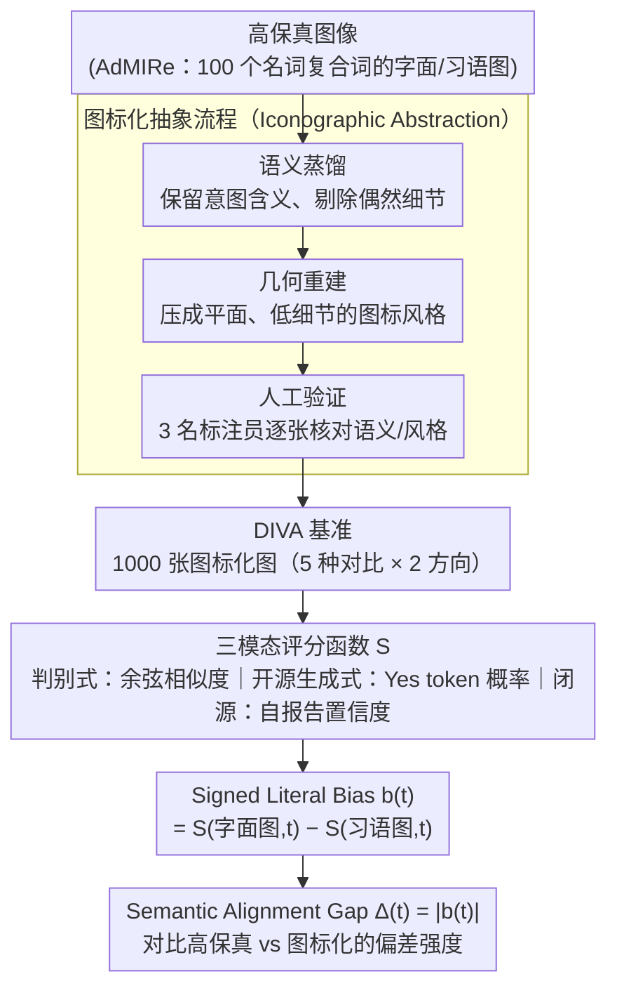

# More Than Meets the Eye: Measuring the Semiotic Gap in Vision-Language Models via Semantic Anchorage

**会议**: ACL 2026  
**arXiv**: [2604.17354](https://arxiv.org/abs/2604.17354)  
**代码**: [GitHub](https://github.com/risehnhew/More-than-meets-the-eye)  
**领域**: 多模态VLM / 符号理解  
**关键词**: 视觉语言模型, 符号学鸿沟, 字面偏差, 图标化抽象, 名词复合词

## 一句话总结

本文从认知符号学角度揭示 VLM 的"字面优越偏差"——模型在高保真图像上倾向于字面解读而非隐喻/习语理解，通过引入 DIVA 基准（图标化简化图像）和 Semantic Alignment Gap 指标，证明降低视觉保真度能显著缩小字面与习语解读之间的鸿沟。

## 研究背景与动机

**领域现状**：文本到图像模型已能生成高度逼真的图像，VLM 也能很好地解码图像的字面内容。但在理解抽象含义（如习语、比喻）方面，VLM 仍然存在根本性的认知鸿沟。

**现有痛点**：(1) 现有 VL 基准主要关注字面意义的视觉-文本对齐（物体检测、属性绑定等），对比喻意义评估不足；(2) 名词复合词（如 "Eye Candy"）的视觉表示需要从字面图标性转向习语象征性，但模型常常被高保真视觉细节所误导；(3) 缺乏跨架构一致的评估指标——判别式模型用余弦相似度、生成式模型用 token 概率、闭源模型只能用行为探测。

**核心矛盾**：VLM 的预训练目标过度优化了物理重建和视觉仿真（Iconicity），导致模型在面对需要抽象/象征理解的任务时，高保真视觉细节反而成为"认知干扰"——模型看到"Eye"就只想到眼睛，而非 "Eye Candy" 的隐喻含义。

**本文目标**：(1) 量化 VLM 的字面偏差程度；(2) 验证"降低视觉保真度能否提升象征理解"的假说；(3) 提供跨架构的统一评估框架。

**切入角度**：从符号学理论出发——图标（icon）通过相似性传递意义，符号（symbol）通过约定传递意义。文本天然是符号性的，但图像通常是图标性的。当图像的图标性（高保真细节）太强时，模型会被锁定在字面解读上。

**核心 idea**：通过"图标化抽象"（Iconographic Abstraction）——系统性降低图像的视觉保真度（去纹理、去光影、简化构图），将图像从"现实仿真"转变为"意义符号"，从而释放模型的象征理解潜能。

## 方法详解

### 整体框架

DIVA 基准的构建流程：(1) 从 SemEval-2025 AdMIRe 任务获取 100 个英语名词复合词的字面和习语高保真图像；(2) 使用 Gemini 生成对应的图标化（低保真、示意图式）图像，每个复合词生成 5 种对比图像（高习语、高字面、弱习语、弱字面、干扰项）；(3) 3 名标注员进行人工验证。评估时，整条流水线沿"建库 → 评分 → 算指标"走：先把高保真图标化成 DIVA，再用一套三模态评分函数给每张图打分，最后把字面图与习语图的分差折算成可读数的字面偏差指标。

### 关键设计

**1. Iconographic Abstraction Pipeline（图标化抽象）：用"降保真"把图像从仿真推向符号**

本文的核心假说是"高保真细节本身是认知干扰"，要验证它就得有一套能系统性降低视觉保真度、又不破坏语义的图像生成流程。作者用 Gemini 做两阶段处理：先做语义蒸馏，保留名词复合词的意图含义、剔除偶然的场景细节；再做几何重建，把图像约束成平面、低细节的图标风格，最后由人工标注员逐张验证"语义有没有丢、风格够不够图标化"，产出 DIVA 基准。

这一步背后是"语义锚定"理论——当视觉信号变得更"数字化"（离散、约定）而非"模拟"（连续、写实）时，模型不再被表面纹理锁死在字面解读上，更愿意采取符号立场去读隐喻。降保真后所有架构 Δ 一致下降（GPT-5 从 0.065 掉到 0.021），正是这个机制的直接证据。

**2. 三模态评分函数（Tri-fold Scoring）：让同一个 Δ 横跨判别式、开源生成式、闭源三种模型**

有了图像还得给它们打分，但不同架构拿"置信度信号"的方式完全不同，强行统一会失真，所以评分函数 $\mathcal{S}$ 按架构落地成三种实现：判别式模型（CLIP/SigLIP）直接用图文嵌入的余弦相似度；开源生成式模型（LLaVA/InternVL）改成强制 Yes/No 回答时"Yes"的 token 概率（LID）；闭源模型（GPT-5/Claude）拿不到内部概率，就用模型自报告的置信度 $\gamma \in [0,100]$，并辅以 10 次重复强制选择的行为频率来交叉验证自报告是否可信。

三种实现各自只在本范式内比较趋势，不跨范式比绝对值，从而既保住了下游 Δ 定义的一致性，又适配了三类模型异质的可观测信号——这也是论文能一次性覆盖 8 个模型、三种架构范式的关键。

**3. Semantic Alignment Gap（Δ）与 Signed Literal Bias（b）：把"字面偏差"变成可读数的标量**

评分之后，怎么把"模型到底偏不偏字面"读成一个数？之前评估 VLM 懂不懂比喻，要么只能在某一类架构上做、要么只给一个"对/错"，既不能区分模型是偏向字面还是偏向习语，也不能说清偏差有多强。本文把这两件事拆开量化：对每个名词复合词 $t$，先算模型对字面图 $v_{lit}$ 和习语图 $v_{id}$ 的语义匹配分数之差 $b(t) = \mathcal{S}(v_{lit}, t) - \mathcal{S}(v_{id}, t)$，$b(t)>0$ 就代表模型更认字面图（字面偏好的方向），再取绝对值 $\Delta(t)=|b(t)|$ 衡量偏差强度。

由于 $\Delta$ 是同一个模型在两张图上的相对差，而不是跨模型的绝对分，它天然抵消了不同架构打分尺度的差异，因此可以在同一架构族内做有意义的趋势比较——这正是"高保真图 vs 图标化图谁的 Δ 更小"这一核心结论得以成立的前提。

### 损失函数 / 训练策略

本文不涉及模型训练，是纯评估性工作。DIVA 包含 1,000 张图标化图像（100 个 NC × 5 种对比 × 2 个语义方向）。

## 实验关键数据

### 主实验

| 模型 | Δ (AdMIRe/高保真) | Δ (DIVA/图标化) | Δ 降低 |
|------|------------------|----------------|--------|
| SigLIP 2 | 0.245 | 0.178 | -27% |
| EVA-CLIP-18B | 0.262 | 0.191 | -27% |
| InternVL3-78B | 0.138 | 0.089 | -36% |
| Qwen2.5-VL-32B | 0.145 | 0.095 | -34% |
| LLaVA-OV-7B | 0.176 | 0.122 | -31% |
| GPT-5 | 0.065 | 0.021 | -68% |
| Claude 4.5 Sonnet | 0.072 | 0.028 | -61% |

### 消融实验

| 分析维度 | 结果 |
|----------|------|
| 判别式 vs 生成式 | 判别式模型 Δ 最大（~0.25），生成式显著更小（~0.14），闭源最小（~0.07） |
| 模型规模效应 | 同架构内，更大模型不一定更小 Δ——规模无法自动解决字面偏差 |
| 5-way 选择准确率 | 图标化图像在所有模型族上均提升准确率（判别式 42.3→58.7%，闭源 78.5→91.3%） |

### 关键发现

- 所有模型在所有条件下均表现出正 $b(t)$（字面偏好），且在高保真图像上更为严重
- 图标化抽象在所有架构族内一致降低 Δ——GPT-5 从 0.065 降到 0.021，接近零偏差
- 判别式模型受"认知干扰"最严重——CLIP 类模型过度依赖纹理和表面特征
- Spearman 相关分析显示人类评估与 Δ 指标高度一致（ρ=0.64-0.73）

## 亮点与洞察

- 从符号学理论切入 VLM 评估是一个非常新颖的角度——将"为什么模型不懂比喻"转化为可量化的"图标-符号连续体"上的位置测量
- "高保真度是认知干扰"这一反直觉发现极有启发性——更逼真的图像不一定有利于理解，这挑战了"图像越清晰越好"的隐含假设
- Δ 指标的三模态设计巧妙地解决了跨架构评估的可比性问题

## 局限与展望

- 仅限于英语名词复合词，未涉及跨文化隐喻（如中文"铁饭碗"）
- 图标化图像的特定风格（扁平设计）可能引入风格偏差——模型可能因熟悉特定风格而表现更好
- 闭源模型的自报告置信度可能反映指令跟随倾向而非真实语义判断
- 仅作为诊断工具，未提出如何改进模型的方法

## 相关工作与启发

- **vs T2I-CompBench/GenEval**: 这些基准关注物理组合性（红方块旁蓝球），本文关注语义组合性——名词组合产生超越字面的抽象意义
- **vs AdMIRe (SemEval-2025)**: AdMIRe 评估模型能否对齐习语图像，但使用高保真图像可能引入混淆因素；DIVA 通过图标化控制了视觉复杂度
- **vs IconQA**: IconQA 使用图标式图表进行推理，但不涉及比喻理解

## 评分

- 新颖性: ⭐⭐⭐⭐⭐ 符号学视角 + 图标化抽象假说 + 跨架构统一指标，高度原创
- 实验充分度: ⭐⭐⭐⭐ 8个模型、三种架构范式、人类评估验证，但仅限英语名词复合词
- 写作质量: ⭐⭐⭐⭐⭐ 理论框架优雅，方法论严谨，论述清晰
- 价值: ⭐⭐⭐⭐ 深刻揭示了 VLM 的字面偏差问题，但缺少改进方案

<!-- RELATED:START -->

## 相关论文

- [\[CVPR 2026\] More than the Sum: Panorama-Language Models for Adverse Omni-Scenes](../../CVPR2026/multimodal_vlm/more_than_the_sum_panorama-language_models_for_adverse_omni-scenes.md)
- [\[AAAI 2026\] PatientVLM Meets DocVLM: Pre-Consultation Dialogue Between Vision-Language Models for Efficient Diagnosis](../../AAAI2026/multimodal_vlm/patientvlm_meets_docvlm_pre-consultation_dialogue_between_vision_language_models.md)
- [\[ACL 2026\] Cross-Modal Taxonomic Generalization in (Vision-) Language Models](cross-modal_taxonomic_generalization_in_vision-_language_models.md)
- [\[ACL 2026\] Topology-Aware Layer Pruning for Large Vision-Language Models](topology-aware_layer_pruning_for_large_vision-language_models.md)
- [\[CVPR 2026\] Continual Learning with Vision-Language Models via Semantic-Geometry Preservation](../../CVPR2026/multimodal_vlm/continual_learning_with_vision-language_models_via_semantic-geometry_preservatio.md)

<!-- RELATED:END -->
