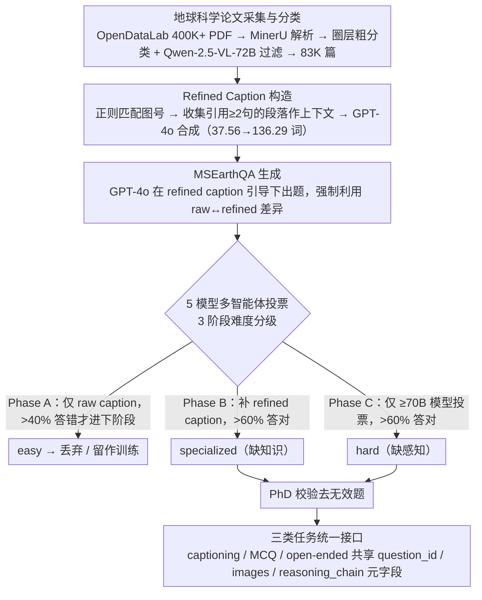

# MSEarth: A Multimodal Benchmark for Earth Science Phenomenon Discovery with MLLMs

**会议**: ACL 2026  
**arXiv**: [2505.20740](https://arxiv.org/abs/2505.20740)  
**代码**: https://github.com/xiangyu-mm/MSEarth  
**领域**: 多模态 VLM / 科学 Benchmark / 地球科学  
**关键词**: 地球科学 Benchmark, MLLM 评估, Refined Caption, 研究生级 VQA, 多智能体投票

## 一句话总结
从 64,560 篇 CC-BY 开源地球科学论文里抽出 289K 张图，用「raw caption + 正文上下文」合成 refined caption，再用 5 模型多智能体投票 + 三阶段 PhD 专家校验生成 7,195 题 graduate-level 测试集（含 captioning / MCQ / open-ended），系统揭示了 SOTA MLLM 在 Earth-science 多图推理上"感知 >> 推理"的 20+ 分鸿沟，并给出 441K 训练集让开源 7B 模型 GRPO 后媲美 GPT-4o。

## 研究背景与动机

**领域现状**：MLLM 在化学（ChemVLM）、遥感（GeoChat）、气象（WeatherQA）等单一学科已经有领域 benchmark；通用科学 benchmark 如 ScienceQA / MMMU / OlympiadBench 等也在迅速扩张。

**现有痛点**：（1）通用 benchmark 几乎都是**高中或本科**水平的合成 / 课本题目，缺乏 graduate-level 复杂度；（2）基于论文的 benchmark（SciFIBench、ArxivQA、MMSci）虽然到了研究生水平，但**只用 figure + caption 配对**生成题目，丢掉了正文里真正承载推理的内容（hypothesis、evidence、analysis、conclusion），把任务退化成"caption matching"；（3）原生 LLM 生成的问题没有 paper 文本支撑，无法被验证；（4）地球科学（五大圈层：atmosphere/cryosphere/hydrosphere/lithosphere/biosphere）这种**强空间观测 + 强领域知识**结合的方向，连一个 graduate-level 多模态 benchmark 都没有。

**核心矛盾**：「raw caption 太短，根本支撑不起复杂科学推理题」——平均仅 37.56 词，缺乏正文里的因果链；而正文又散落在不同段落，需要可控的检索-融合方法把"图-文-推理链"重新对齐。

**本文目标**：构建首个 graduate-level Earth-science 多模态 benchmark，要做到：（a）问题质量由 paper 文本支撑可验证；（b）覆盖五大圈层、8 一级学科、66 二级学科；（c）能同时支撑 captioning / MCQ / open-ended 三类任务；（d）配套训练集让开源模型可以追赶。

**切入角度**：先把每张图的 raw caption 与正文里所有「引用该图编号 ≥ 2 句」的段落正则匹配出来，喂给 GPT-4o 生成 **refined caption**（平均 136.29 词，含科学推理）；再用 refined caption 作为"教师信号"驱动 VQA 生成 + 5 模型投票自动质量分级。

**核心 idea**：把"图-推理-验证"三者**显式分离再聚合**——refined caption 是 ground-truth 的推理链，多智能体投票按"无 refined caption 答对率 / 有 refined caption 答对率 / 仅大模型答对率"把题目自动分成 easy / specialized / hard / discarded 四档，配合 PhD 人工 cross-check 形成高保真测试集。

## 方法详解

### 整体框架
MSEarth 是 4 阶段流水线（Figure 2）：
（1）**论文采集与分类**：从 OpenDataLab 拿 400K+ 地球科学 PDF，用 MinerU 解析成结构化 JSON；用 all-MiniLM-L6-v2 算 abstract 与 5 圈层关键词的余弦相似度做粗分类，再用 Qwen-2.5-VL-72B 二阶段过滤掉非地球观测图，剩 83K papers。
（2）**MSEarthCap 构造**：正则匹配 figure label 到正文段落，保留"引用 ≥ 2 句的段落"作 context，最后用 GPT-4o 把 (figure, raw caption, context) 合成 refined caption——产出 289,891 张图 + 64,560 篇论文。
（3）**MSEarthQA 生成**：GPT-4o 在 refined caption 引导下生成 MCQ + open-ended 题目，强制问题"必须利用 raw 与 refined 之间的差异"，保证题目能被 paper 内容验证。
（4）**多智能体投票 + PhD 校验**：5 模型（Qwen2.5-VL-7B/72B、InternVL2.5-7B/78B、GPT-4o）按 3 阶段过滤分级题目难度，最后随机抽样让 PhD 标注，去掉 216 道 MCQ + 89 道 open-ended 中的无效题。

### 关键设计

**1. Refined Caption：把正文里的推理链"补"回图旁**

直接拿 raw caption 生成题（ArxivQA 的做法）只能问表层信息——平均 37.56 词的描述根本撑不起"为什么会这样"的推理题。作者先用正则在 MinerU 解析后的段落里搜 figure label（如 "Fig. 3"），把所有"引用该图且 ≥ 2 句"的段落收集成 context，再把 (figure_image, raw_caption, paper_context) 一起喂给 GPT-4o，让它生成含 hypothesis / evidence / analysis / conclusion 的 refined caption（prompt 见 Appendix E.6）。

这一步把 raw caption 从 37.56 词扩到 136.29 词、信息密度翻 3.6 倍，效果是双重的：一方面让 ground-truth answer 能被论文证据直接支撑，题目可验证；另一方面 refined caption 本身成了后续多智能体投票分级的"教师信号"——有没有它一加就答对，正好用来区分模型缺的是知识还是感知。

**2. 5 模型多智能体投票 + 3 阶段难度分级：在没有 PhD 全量标注的预算下自动分级**

PhD 逐题标注 7K+ 题不现实，作者让 5 个 MLLM（Qwen2.5-VL-7B/72B、InternVL2.5-7B/78B、GPT-4o）独立答题、按 60% 多数票定结果，再用三阶段把题目沿"知识 vs 感知"两个维度筛开。**Phase A** 只给 raw caption + 问题，> 40% 模型答错才进入下一阶段（约 70% 题在此被判 easy 丢弃、留 20% 作训练）；**Phase B** 补上 refined caption，> 60% 模型答对则判 specialized（需领域知识，约 20%）；**Phase C** 只让 ≥ 70B 大模型投票，> 60% 答对判 hard（需强感知，约 5%），剩下约 5% 判 flawed 丢弃。

这样分级的妙处在于把"为什么答错"拆成两个正交维度：refined caption 一加就对的是"缺知识但有感知"，只有最大模型在 refined 后才对的是"缺感知"。benchmark 因此不只能给总分，还能精确诊断模型短板——后面 Phase B 抽检无效率只有 4.4%、质量最高，也印证了这条分级假设。

**3. 三类任务统一接口 + 字段化标注：同一组图上做 captioning / MCQ / open-ended**

跨 benchmark 比较容易混入分布漂移，作者让三类任务共享同一组图和 `question_id / images / classification / reasoning_chain` 等元字段（Table 7），只在 query 与 response 上区分：MCQ 用 (raw_caption, question, options)，open-ended 用 (raw_caption, question)，captioning 直接让模型生成 refined caption。评估上，表面相似度交给 BLEU/ROUGE/METEOR/BERTScore，语义层面再用 Qwen2.5-VL-72B 当 LLM-judge 跑 OE-Eval / Cap-Eval。

在同一图集上做三种任务，能直接对比"模型是看不清图 / 不会描述 / 不会选答案"——这种 in-set 解耦比跨 benchmark 比干净得多；训练时三类样本还能 instruction-tuning + GRPO 混训，正是 7B 模型 GRPO 后追上 GPT-4o 的数据基础。

### 损失函数 / 训练策略
**Benchmark 本身无训练**，但提供 441,785 题的训练集（289,891 captioning + 102,753 MCQ + 49,141 open-ended）。作者在 Intern-S1-mini 与 Qwen2.5-VL-7B 上做了：captioning 与 open-ended 用 instruction tuning；MCQ 用 GRPO RL（DeepSeek-Math 提出，answer 正确 = +1 reward）。

## 实验关键数据

### 主实验
评估了 13 个开源 + 8 个闭源 MLLM 在 7,195 题测试集上的表现：

| 模型 | 单图 | 多图聚焦 | 跨图推理 | Reasoning | Perception | Overall ACC |
|------|------|---------|---------|-----------|-----------|-------------|
| Qwen2.5-VL-7B | 47.65 | 44.07 | 37.53 | 40.53 | 58.47 | 44.83 |
| InternVL3-78B | 57.53 | 51.37 | 45.48 | 47.00 | 73.61 | 53.38 |
| Intern-S1 | 67.01 | 65.62 | 64.11 | 61.22 | 79.61 | 65.63 |
| **Qwen-7B-MSEarth (本文 fine-tune)** | 57.61 | 52.75 | 45.20 | 50.68 | 64.32 | **53.95** (+9.1 vs base) |
| **Intern-S1-mini-MSEarth (本文 fine-tune)** | 65.49 | 62.97 | 58.63 | 58.81 | 78.56 | **63.54** (+5.4) |
| GPT-4o | 63.03 | 55.76 | 47.67 | 50.45 | 81.86 | 57.97 |
| Claude-3.7-Sonnet | 59.52 | 56.53 | 57.53 | 51.68 | 78.11 | 58.01 |
| Gemini-2.5-Pro-Thinking | 64.78 | 59.36 | 55.34 | 56.31 | 77.06 | 61.28 |
| Gemini-3-Flash | **70.44** | **67.70** | **66.85** | **65.14** | 80.51 | **68.82** |

**Captioning + Open-ended QA**（LLM-based 评价，OE% / Cap-Eval）：

| 模型 | Open-Ended OE% | Cap-Eval (1-5) |
|------|---------------|----------------|
| Qwen2.5-VL-72B | 44.82 | 2.56 |
| InternVL3-78B | 47.00 | 2.43 |
| Intern-S1-mini | 43.69 | 2.65 |
| **Qwen-7B-MSEarth** | **48.19** | **2.73** |
| **Intern-S1-mini-MSEarth** | **49.74** | **3.02** |
| GPT-4o | 48.55 | 2.72 |
| Gemini-3-Flash | 52.61 | 3.40 |

PhD 人工评测 300 题 mini set，专家 87.00% > o4-mini 53.00% > Gemini-2.5-Pro 51.33%，说明 SOTA MLLM 离专家仍有 30+ 点 gap。

### 消融实验
对原始 caption 输入 / CoT prompting / 多智能体投票质量做消融：

| 配置 | Reasoning | Perception | Overall |
|------|-----------|-----------|---------|
| InternVL3-78B 无 raw caption | 44.54 | 59.67 | 48.17 |
| InternVL3-78B + raw caption | 47.00 | 73.61 | **53.38** (+5.2) |
| Qwen2.5-VL-72B 无 raw caption | 41.43 | 57.72 | 45.33 |
| Qwen2.5-VL-72B + raw caption | 44.40 | 70.46 | **50.65** (+5.3) |
| GPT-o4-mini CoT-low | – | – | 52.0 |
| GPT-o4-mini Non-CoT high | – | – | **54.3** (CoT 反而掉点) |
| Gemini-2.5-Flash-Thinking + CoT | – | – | **52.0** (think model 用 CoT 涨) |
| Gemini-2.5-Flash 无 think + CoT | – | – | **42.0** (基础模型用 CoT 涨 +2) |

**多智能体投票分级质量**：Phase A 抽 900 题人工复核 59/900 = 6.6% 无效；Phase B 抽 1800 题 80/1800 = 4.4%；Phase C 抽 300 题 77/300 = 25.7% 无效——证明 Phase B（specialized）质量最高，与"靠 refined caption 才能答对"的预期吻合。

### 关键发现
- **感知-推理鸿沟普遍存在**：Gemini-2.5-Pro-Thinking perception 77.06% vs reasoning 56.31%（差 20.75 分）；几乎所有模型都"先达到 75% perception 上限再推理"。这意味着进一步提升不靠看图，而靠领域知识 + multi-step reasoning。
- **跨图推理是最难的**：所有模型在 cross-image（多图比较 / 关联）上掉点最厉害，开源模型只有 38-49 分，闭源 SOTA Gemini-3-Flash 也只有 66.85——MSEarth 一半题目都是 multi-image，这才是真实地球科学场景。
- **MSEarth 训练数据有效**：Qwen-7B 在测试集上 +9.1 点，Intern-S1-mini +5.4 点；最大涨幅都在 reasoning task 上而非 perception，说明 GRPO 主要灌入了 domain knowledge。
- **raw caption 是公平 input 的关键**：所有开源模型加上 raw caption 后 perception 涨 8-12 分（因为 caption 解释了坐标轴 / 符号），加之后再做推理才有意义。但 raw caption 也带来"提示泄露"风险，需小心使用。
- **CoT 对未经过 reasoning 训练的模型有害**：Gemini-2.5-Pro Non-CoT 52.33% > CoT 50.67%，o4-mini high-CoT 反不如 low-CoT，提示"reasoning 模型才能用 CoT"，这与近期 think-mode 的论文结论一致。
- **OE-Eval 与人评 Spearman 相关性最高**：Krippendorff α = 0.695，远超传统 BLEU/ROUGE/BERTScore，验证用 LLM-judge 在开放式科学 QA 上是更合理的指标。

## 亮点与洞察
- **"refined caption"是 benchmark 构造范式的关键创新**：把"图 + 段落上下文"再压回 caption，让一切下游 VQA 都有可验证的 ground truth；这一招可直接迁移到 Bio / Astro / Chem 等任何"图+论文"的 benchmark。
- **多智能体投票 + PhD 校验是高保真低预算的范式**：5 模型 3 阶段投票把"easy / specialized / hard / flawed"自动分级，PhD 只对 ≈ 5K 题做最后 verification，节省 80% 标注成本却保留 graduate-level 质量；这套框架可复用到其他需要专家审核的 benchmark 项目。
- **Phase A/B/C 的诊断意义**：Phase B 题量最大、质量最好——"refined caption 一加就对"恰好是模型"缺领域知识但有感知"的题；Phase C 反过来是"refined 也没用，需大模型才看清"——这种正交分解让 benchmark 不仅能给总分，还能精确诊断短板。
- **首个真正 multi-sphere / multi-image / graduate 的 Earth Science benchmark**：覆盖 8 学科 66 子学科，54.9% 是多图题——填补了 WeatherQA / GeoChat 等单一领域 benchmark 的空白，也是首个把 Earth science 当作完整学科系统评估的工作。

## 局限与展望
- **作者承认**：（1）地球科学子领域太多，niche 方向（如 paleoclimatology 细分）覆盖不全；（2）大多数题目仍是 MCQ + 短答案，缺乏需要长程 reasoning 的探究式题目（如 hypothesis generation）。
- **自己发现**：（1）**refined caption 的"质量"直接被 GPT-4o 上限锁死**——如果 GPT-4o 对某个子领域不熟，refined caption 自身就含偏差，但论文没量化这种 contamination；（2）多智能体投票里 GPT-4o 既参与生成又参与投票，存在 self-favoring bias；（3）训练集来自同一批论文，与测试集没有完全独立的 venue split，可能让 Qwen-7B-MSEarth 涨的是 distribution-specific 知识；（4）raw caption 作为输入显著拉高 perception，但真实科研场景下 caption 本身就是"答案"，benchmark 设置略偏宽松；（5）评估只用一个 LLM-judge（Qwen2.5-VL-72B），其偏好可能与人类不完全对齐，论文虽给了 α=0.695 但仍不到 inter-PhD 一致性的水平。
- **改进思路**：把 refined caption 换成"多个不同 LLM 各生成一版后取交集"以降低单模型偏差；引入 hypothesis generation（让模型生成可被论文 reproducible 的新观察假设）；评测时区分 in-paper vs out-of-paper 知识泛化能力。

## 相关工作与启发
- **vs MMMU / ScienceQA**: 通用科学但只到本科水平，没有 paper 上下文；MSEarth 是 graduate-level + 单学科深度。
- **vs ArxivQA / MMSci**: 同样用 paper 做 graduate benchmark，但 ArxivQA 只用 caption 生成（无 paper context 验证），MMSci 不验证；MSEarth 同时做了"refined caption + 多智能体过滤 + PhD 校验"，质量更高。
- **vs WeatherQA / GeoChat**: 单领域（气象 / 遥感）benchmark；MSEarth 横跨 5 大圈层 8 学科，更接近真实 Earth science 的多学科本质。
- **vs OlympiadBench (奥赛级)**: OlympiadBench 用人工标注的少量竞赛题（8K），但只覆盖数学 / 物理；MSEarth 用 paper-grounded 自动 + 投票流水线扩到 7K 测试 + 441K 训练。
- **vs G-Eval / LAVE (LLM-as-Judge 评估)**: 沿用其 LLM-judge 评估但加上"专家 cross-check"作为最终 ground truth，提供了 graduate-level VQA 上 LLM-judge 与人类的高相关性（Spearman > 传统 metric）证据。

## 评分
- 新颖性: ⭐⭐⭐⭐ "refined caption + 多智能体三阶段过滤"是 benchmark 构造方法论上的明确进步；首个 multi-sphere Earth science graduate benchmark。
- 实验充分度: ⭐⭐⭐⭐⭐ 21 个 MLLM × 3 类任务 × 8 子学科 + CoT / raw caption / 训练数据消融 + PhD mini-set 人评 + Spearman 相关性 + OE-Eval vs 传统 metric 对比，覆盖极其充分。
- 写作质量: ⭐⭐⭐⭐ 数据流水线讲得很清晰，三阶段投票动机干净；唯一可惜是 main paper 没把 Phase A/B/C 与 reasoning/perception 的对应关系画成 cross-table。
- 价值: ⭐⭐⭐⭐⭐ 给地球科学 + 多模态社区直接提供了 "测+训"两套数据；refined caption 范式可被任何 paper-grounded benchmark 复用；7B 模型 GRPO 后追上 GPT-4o 的故事激励小模型 + 领域数据的 path。

<!-- RELATED:START -->

## 相关论文

- [\[ICLR 2026\] WebDS: An End-to-End Benchmark for Web-based Data Science](../../ICLR2026/multimodal_vlm/webds_an_end-to-end_benchmark_for_web-based_data_science.md)
- [\[CVPR 2026\] TerraScope: Pixel-Grounded Visual Reasoning for Earth Observation](../../CVPR2026/multimodal_vlm/terrascope_pixel-grounded_visual_reasoning_for_earth_observation.md)
- [\[ACL 2026\] Do MLLMs Capture How Interfaces Guide User Behavior? A Benchmark for Multimodal UI/UX Design Understanding](do_mllms_capture_how_interfaces_guide_user_behavior_a_benchmark_for_multimodal_u.md)
- [\[ACL 2026\] Can MLLMs Reason Beyond Language? VisReason: A Comprehensive Benchmark for Vision-Centric Reasoning](can_mllms_reason_beyond_language_visreason_a_comprehensive_benchmark_for_vision-.md)
- [\[ACL 2026\] GeoRC: A Benchmark for Geolocation Reasoning Chains](georc_a_benchmark_for_geolocation_reasoning_chains.md)

<!-- RELATED:END -->
