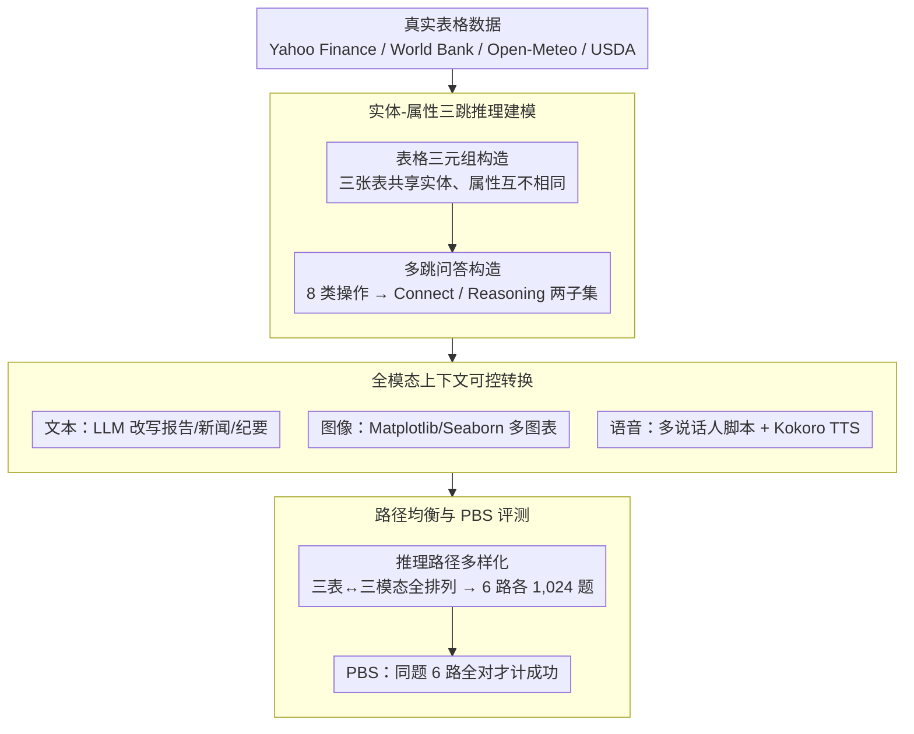

# OMHBench: Benchmarking Balanced and Grounded Omni-Modal Multi-Hop Reasoning

**会议**: ACL 2026 Findings  
**arXiv**: [2508.16198](https://arxiv.org/abs/2508.16198)  
**代码**: 无公开代码（数据集: https://huggingface.co/datasets/HYU-NLP/OMHBench）  
**领域**: 多模态VLM  
**关键词**: 全模态推理、多跳问答、语音理解、路径均衡、Benchmark

## 一句话总结
OMHBench 构造了一个覆盖文本、图像、语音三种上下文的 6,144 题全模态三跳推理 benchmark，通过实体-属性链和 6 种均衡推理路径暴露出当前 MLLM 在语音落地、路径鲁棒性和跨模态 grounding 上的系统性短板。

## 研究背景与动机
**领域现状**：多模态大模型已经从文本-图像或文本-语音的双模态模型，逐步走向同时处理文本、视觉和语音的 omni-modal 模型。对应的评测也大致分成两类：一类是 Omni-Modal Understanding benchmark，强调模型能否接收三种模态；另一类是 Cross-Modal Multi-Hop Reasoning benchmark，强调模型能否跨模态组合证据完成多跳推理。

**现有痛点**：这两类评测各有盲区。OMU 数据集虽然输入里有图像和语音，但文本常常只出现在题干或选项里，很多题可以绕开某个模态直接答出，形成 modality shortcut。CMR 数据集更强调推理链，但大多只覆盖文本和图像，缺少语音；同时推理路径分布高度不均衡，例如大量问题都遵循同一种 I-T 或 T-I 顺序，模型在单一路径上的高分不一定代表真正的跨模态推理能力。

**核心矛盾**：全模态评测想要同时考察“是否使用全部模态”和“是否能稳定执行多跳推理”，但现有数据集往往只能满足其中一边。只放入三种模态不等于模型必须使用三种模态；只做多跳问答也不等于路径分布公平、不同模态顺序都被可靠覆盖。

**本文目标**：作者希望构造一个更受控的 benchmark：第一，问题必须依赖文本、图像、语音三种证据；第二，每道题有明确的三跳实体-属性推理链；第三，同一题可以被实例化为 6 种模态顺序，从而检查模型是不是只擅长某几条路径；第四，答案形式足够明确，便于做可复现的 exact match 评测。

**切入角度**：论文把多跳推理抽象成“实体在不同模态之间共享，属性只在某个模态中可见”。例如先在图像图表里根据 goodwill 找到公司，再到文本里读取 inventory，最后到语音里聚合某个数值。这样每一步都必须落在特定模态上，路径也可以被显式控制。

**核心 idea**：用同一组实体的三张属性表生成三跳问答，再把三张表分别转成文本、图像和语音，并对三种模态分配做全排列，从而得到内容等价但推理路径不同的全模态多跳评测。

## 方法详解
OMHBench 不是提出一个新的模型，而是提出一个面向全模态多跳推理的 benchmark 构造流程。它的关键在于把“题目语义”“模态承载形式”和“推理路径”拆开控制：题目的底层实体和答案保持不变，但证据被放入不同模态，迫使模型沿着指定的模态顺序完成推理。

### 整体框架
整个 pipeline 分为四步。

第一步是**表格三元组构造**（Table Triplet Formation）。作者从 finance、economics、climate、nutrition 四个领域收集真实表格数据，来源包括 Yahoo Finance、World Bank、Open-Meteo 和 USDA。对每个样本，构造三张小表；三张表共享同一组实体，但属性互不相同。每张表包含 10 个实体和 3 个属性，并混入干扰实体与干扰属性。

第二步是**多跳问答构造**（Multi-Hop QA Construction）。系统从三张表中生成三跳问题。前两跳通常负责定位或筛选实体，最后一跳负责读取或聚合答案。作者定义了 Lookup、Ranking、Comparison、Range、Proximity、Retrieval、Mean、Summation 这 8 类操作，并组合出 Connect 和 Reasoning 两个子集。

第三步是**全模态上下文生成**（Omni-Modal Context Generation）。三张表会被转成三种上下文：文本、图像和语音。文本由 LLM 按不同场景改写成报告、新闻、会议纪要等自然语言；图像用 Matplotlib 和 Seaborn 生成多种图表；语音先由 LLM 生成多说话人脚本，再用 Kokoro-82M TTS 合成音频。

第四步是**推理路径多样化**（Reasoning Diversification）。作者对三张表到三种模态的分配做全排列，得到 S-I-T、S-T-I、I-S-T、T-S-I、I-T-S、T-I-S 六种推理路径。同一题的底层答案不变，但模型需要先后访问的模态不同，因此可以比较路径本身对模型表现的影响。

### 关键设计

**1. 实体-属性三跳推理建模：把"用没用某个模态"变成可检查的结构约束**

omni-modal 评测最大的漏洞是 modality shortcut——题目里虽然有图像和语音，但答案常能绕开某个模态直接读出来。OMHBench 的破解办法是让实体在三张表之间共享、属性却分散到不同表里；当三张表被映射到文本、图像、语音后，模型要追踪同一实体就必须跨模态跳转。其中 Connect 子集固定走 Lookup-Comparison-Retrieval，考察单实体的链式连接；Reasoning 子集放开 Ranking、Range、Proximity、Mean、Summation 等操作，考察集合筛选与数值聚合。

关键在于"中间某个属性只存在于语音或图像里"这个设定：模型只要跳过该模态，就无法稳定拿到正确答案。于是"是否真的用了某个模态"不再靠主观判断，而被硬编码进了推理链结构——这也是后面 shortcut 验证里 OMHBench 几乎没有可绕过样本的根本原因。

**2. 表格三元组到全模态上下文的可控转换：同一份事实，多种模态、多样风格**

如果只把表格机械地转成三种格式，benchmark 会单调到失真；若完全自由生成，又会引入事实漂移。作者以真实表格（Yahoo Finance、World Bank、Open-Meteo、USDA）为事实底座，再用受控生成铺开风格：文本侧用 24 类领域场景 prompt 改写成报告/新闻/纪要；图像侧用 10 类图表 × 20 种字体 × 20 种颜色 × 2 个绘图库（Matplotlib/Seaborn）；语音侧用 22 类场景、四说话人对话和 27 种 TTS 声音合成音频。

为防止转换过程偷偷改变事实，作者额外做了表格重建与 factoid QA 一致性检查，报告转换后事实一致性达到 100%。这套"真实底座 + 受控多样化"是可扩展性与可靠性之间的折中——既保证了六条路径下题目语义严格等价，又让模型不能靠记某种固定风格作弊。

**3. 路径均衡与鲁棒性指标（PBS）：用"同题六路全对才算数"逼出真 grounding**

只放三种模态不等于路径分布公平：现有 CMR 数据集常被某一两种模态顺序主导，模型在单条路径上的高分掩盖了跨路径的不稳定。OMHBench 对三张表到三种模态的分配做全排列，每道题派生出 $3!=6$ 条路径（S-I-T、S-T-I、I-S-T、T-S-I、I-T-S、T-I-S），六条路径各 1,024 个样本、总计 6,144 题。在此之上定义 Path Balance Score：记第 $i$ 组题在第 $j$ 条路径上的正确性为 $a_{i,j}$，PBS 只在 $\sum_j a_{i,j}=6$ 时才计该组成功，也就是同一题的 6 个路径版本全部答对才算路径鲁棒。

平均准确率只能反映模型在混合分布上的总体水平，而 PBS 直接问"换一种模态顺序还答得对吗"。一个模型若 S-T-I 很强、I-T-S 很差，平均分可能仍然好看，PBS 会立刻把这种不对称 grounding 暴露出来——实验里 Gemini 3 Flash 在 Connect 上平均 78.3 但 PBS 仅 32.2，正是这个指标的价值所在。

### 损失函数 / 训练策略
本文不训练新模型，因此没有模型损失函数。评测时作者使用 zero-shot chain-of-thought prompt，不指定固定推理格式；对支持 reasoning mode 的模型设置 8,192 token thinking budget。输出被解析为离散数值答案，用 exact match 计算正确率。由于 OMHBench 的答案都是正整数，作者还在 600 个样本上对比人工判断、LLM-as-a-Judge 和 exact match，三者结果完全一致。

## 实验关键数据

### 主实验
论文评测了 13 个 MLLM，包括 Gemini 系列闭源模型和 Qwen3-Omni、Phi-4 Multimodal、Qwen2.5-Omni、OmniVinci、MiniCPM-o、Omni-AutoThink 等开源模型。下面保留最能说明问题的代表性结果。

| 模型 | OMHBench-Connect 平均准确率 | PBS | 最强路径 | 最弱路径 |
|------|------------------------------|-----|----------|----------|
| Gemini 3 Flash | 78.3 | 32.2 | S-T-I 98.4 | I-T-S 60.2 |
| Gemini 2.5 Pro | 72.5 | 25.0 | S-T-I 96.9 | T-I-S 50.8 |
| Gemini 2.5 Flash | 53.6 | 4.7 | S-T-I 85.9 | T-I-S 21.9 |
| Qwen3-Omni 30B | 46.8 | 2.3 | S-T-I 77.0 | I-T-S/T-I-S 16.0 |
| Phi-4 Multimodal | 15.1 | 0.0 | S-I-T 26.6 | T-I-S 0.0 |
| Qwen2.5-Omni 7B | 14.5 | 0.0 | S-I-T 22.7 | T-I-S 1.8 |

Connect 子集相对简单，因为中间状态始终是单实体。即便如此，最强模型 Gemini 3 Flash 的 PBS 也只有 32.2，说明它能答对大量单路径样本，却很难保证同一题在六种路径下全部答对。Qwen3-Omni 30B 是最强开源模型，但 S-T-I 到 I-T-S 的准确率差距达到 61.0 个百分点。

| 模型 | OMHBench-Reasoning 平均准确率 | PBS | 最强路径 | 最弱路径 |
|------|--------------------------------|-----|----------|----------|
| Gemini 3 Flash | 49.4 | 8.6 | S-T-I 58.8 | I-T-S 40.0 |
| Gemini 2.5 Pro | 48.8 | 10.9 | S-I-T 53.9 | I-T-S 41.4 |
| Gemini 2.5 Flash | 21.0 | 0.0 | S-I-T 32.0 | I-T-S/T-I-S 10.9 |
| Gemini 2.5 Flash-lite | 10.7 | 0.0 | S-T-I 21.1 | I-T-S/T-I-S 0.0 |
| Qwen3-Omni 30B | 15.0 | 0.0 | S-T-I 28.5 | I-T-S/T-I-S 2.7 |
| Phi-4 Multimodal | 0.3 | 0.0 | S-I-T 0.6 | T-S-I 0.0 |

Reasoning 子集明显更难，因为前两跳可能产生实体集合，最后还要做求和或均值等数值聚合。最强模型也只有约 49% 平均准确率；大多数开源模型接近 0，说明“能听、能看、能读”距离“能跨三种模态做受控多跳推理”还有很大差距。

### 消融实验
这篇论文是 benchmark 工作，没有传统模型消融；更有价值的是一组受控分析实验，验证 OMHBench 是否真的消除了 shortcut、是否能诊断路径敏感性。

| 分析项 | 设置 | 关键结果 | 说明 |
|--------|------|----------|------|
| OMU shortcut 验证 | 移除视觉或语音输入后再测可解比例 | 既有 OMU benchmark 约 70%-80% 样本仍可解；OMHBench 几乎没有 shortcut-prone 样本 | 实体-属性三跳结构确实迫使模型使用全部模态 |
| PBS@k 路径鲁棒性 | 同一题 6 条路径中至少答对 k 条才计分 | Gemini 3 Flash 在 Connect 上 PBS@1 为 100.0、PBS@6 为 32.2；在 Reasoning 上 PBS@1 为 90.0、PBS@6 为 8.6 | 答对任意一个路径很容易，六条路径都稳才难 |
| 输入模态顺序 | 固定推理路径，枚举输入上下文排列 | Connect 的 T-S-I 路径最高波动 12.5 点；Reasoning 的 S-I-T 路径最高波动 11.5 点 | 模型不仅受“推理路径”影响，也受“输入摆放顺序”影响 |
| Exact Match 验证 | 600 个 Gemini 3 Flash 输出，比较人工、LLM-as-a-Judge 和 EM | 三种评测完全一致，Connect 为 72.7，Reasoning 为 45.7 | 正整数答案让自动评测可靠，减少主观打分噪声 |
| TTS 质量检查 | ASR 与语音质量指标 | WER 0.03、CER 0.02、STOI 99.2、SI-SDR 21.0 | 语音错误率较低，模型失败更可能来自语音 grounding 而非音频失真 |

### 关键发现
- 闭源模型整体强于开源模型，但闭源模型也没有解决路径不对称问题。Gemini 3 Flash 在 Connect 上平均 78.3，看似很强，PBS 只有 32.2；到 Reasoning 子集，PBS 进一步降到 8.6。
- 语音位置是核心瓶颈。路径中较早访问语音通常更容易，推理后段转向语音，例如 I-S 或 T-S，往往更难。作者把这种现象称为 asymmetric omni-modal grounding。
- 路径分布会改变模型排名。比如 Reasoning 子集中，Gemini 2.5 Pro 在 I-S-T 上优于 Gemini 3 Flash，但在 T-S-I 上落后；这说明只报单一路径或混合平均值会隐藏重要行为差异。
- 操作类型也影响难度。Ranking 相对容易，Comparison、Proximity、Range 更难，尤其是涉及数值邻近或区间约束时，模型更容易在中间实体集合上犯错。
- 高级 prompting 不能根本解决问题。Self-Ask、Least-to-Most、Plan-and-Solve 相比普通 CoT 没有稳定增益，说明问题主要不是提示词形式，而是模型内部跨模态语义传递能力不足。

## 亮点与洞察
- OMHBench 的最巧之处在于把同一问题复制成六条路径版本。这样一来，数据内容、答案和问题语义都被控制住，只改变证据所在模态顺序，因而可以更干净地测出模型对路径的偏好。
- PBS 是一个比平均准确率更苛刻也更有解释力的指标。它直接问模型“同一道题换一种模态顺序还能不能答对”，对评估真正的全模态 grounding 很有价值。
- 数据构造没有完全依赖生成式模型来“凭空写题”，而是以真实表格为底层事实源，规则化地产生问题和答案。这降低了答案漂移和不可验证性的风险，也让 exact match 更可信。
- 论文把语音从“附加输入”提升为推理链中的必要证据。这个设计对后续 audio-language 或 speech-aware VLM 训练很有启发，因为模型必须把语音内容当成可查询的结构化知识，而不是背景材料。
- OMHBench 的分析提醒我们，多模态 benchmark 不应该只看是否支持多种输入格式。真正重要的是每个模态是否携带不可替代的信息，以及模型是否能在不同模态顺序下稳定转移实体和属性。

## 局限与展望
- 任务形式仍然比较受控。OMHBench 主要覆盖实体-属性关系和固定三跳链条，适合精确诊断，但与开放世界问答、长视频理解、真实会议音频推理等复杂场景还有距离。
- 语音数据由 TTS 合成，虽然质量指标很好，但它不能完全代表真实口语中的口音、噪声、打断、重叠说话和语速变化。后续可以加入真实录音或半真实场景音频。
- 图像侧主要是表格可视化图表，不包含自然图像、界面截图、文档扫描等更复杂视觉证据。因此它评估的是图表/结构化视觉理解，而不是全部视觉 grounding 能力。
- 答案被设计为正整数，便于 exact match，但也限制了问题类型。现实任务中常见的开放式解释、条件判断、证据引用和不确定性回答并未覆盖。
- 数据生成使用 GPT-5.1、Grok-4、Claude-Sonnet-4.5 等模型生成文本与脚本，虽然底层事实可控，但语言风格仍可能带有这些生成器的分布偏好。更细粒度的人类改写或跨语言版本会让 benchmark 更稳健。
- 后续值得把 OMHBench 用作训练诊断集：不仅评测最终答案，也监督每一步实体、属性和模态跳转，让模型学习在语音、文本、图像之间显式对齐中间状态。

## 相关工作与启发
- **vs OmniBench / WorldSense / Daily-Omni / UNO-Bench / AV-SpeakerBench**: 这些 OMU benchmark 关注三模态输入能力，但文本多停留在问题或选项层面，题目常可绕过某个模态。OMHBench 把上下文文本作为独立证据源，并让每个问题必须依赖文本、图像、语音三种上下文。
- **vs MMQA / MuMuQA / FCMR**: 这些 CMR benchmark 强调跨模态多跳推理，但主要是文本-图像双模态，并且路径分布不均衡。OMHBench 增加语音模态，并将六条三模态路径均衡到各 1,024 个样本。
- **vs ICT-QA / WikiMixQA**: 这些数据集也探索表格、图表等结构化来源上的多跳问答，但公开可用性和路径控制不足。OMHBench 的贡献不只是题目更多，而是把推理路径本身变成可控变量。
- **对模型训练的启发**: 当前 MLLM 可能需要显式的跨模态中间状态监督。例如训练模型在每一步输出“当前实体、所用属性、证据模态”，再进入下一跳，可能比只用最终答案监督更适合解决语音后段 grounding 失败。
- **对 benchmark 设计的启发**: 未来多模态评测可以借鉴“内容等价、路径变化”的设计。只要能把同一问题映射到多个证据布局，就能把数据偏差和模型能力区分得更清楚。

## 评分
- 新颖性: ⭐⭐⭐⭐☆ 把全模态、三跳推理和路径均衡合在一个可控 benchmark 中，问题定义很清楚，创新主要在评测设计而非模型方法。
- 实验充分度: ⭐⭐⭐⭐⭐ 评测 13 个模型，报告准确率、PBS、PBS@k、路径分析、输入顺序、prompting、shortcut 和评测协议验证，诊断维度很完整。
- 写作质量: ⭐⭐⭐⭐☆ 论文结构清楚，方法和分析闭环好；少量表格和图示信息密集，读者需要来回对照主文与附录。
- 价值: ⭐⭐⭐⭐⭐ 对全模态 MLLM 评测很有价值，尤其是揭示了平均准确率掩盖的语音 grounding 与路径不对称问题。

<!-- RELATED:START -->

## 相关论文

- [\[ACL 2025\] FCMR: Robust Evaluation of Financial Cross-Modal Multi-Hop Reasoning](../../ACL2025/multimodal_vlm/fcmr_robust_evaluation_of_financial_cross-modal_multi-hop_reasoning.md)
- [\[ICLR 2026\] ThinkOmni: Lifting Textual Reasoning to Omni-modal Scenarios via Guidance Decoding](../../ICLR2026/multimodal_vlm/thinkomni_lifting_textual_reasoning_to_omni-modal_scenarios_via_guidance_decodin.md)
- [\[CVPR 2026\] CRIT: Graph-Based Automatic Data Synthesis to Enhance Cross-Modal Multi-Hop Reasoning](../../CVPR2026/multimodal_vlm/crit_graph-based_automatic_data_synthesis_to_enhance_cross-modal_multi-hop_reaso.md)
- [\[ICLR 2026\] FRIEDA: Benchmarking Multi-Step Cartographic Reasoning in Vision-Language Models](../../ICLR2026/multimodal_vlm/frieda_benchmarking_multi-step_cartographic_reasoning_in_vision-language_models.md)
- [\[ACL 2026\] Structured and Abstractive Reasoning on Multi-modal Relational Knowledge Images](structured_and_abstractive_reasoning_on_multi-modal_relational_knowledge_images.md)

<!-- RELATED:END -->
