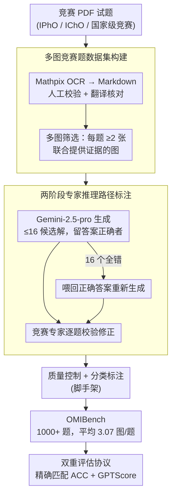

# OMIBench: Benchmarking Olympiad-Level Multi-Image Reasoning in Large Vision-Language Models

**会议**: ACL 2026  
**arXiv**: [2604.20806](https://arxiv.org/abs/2604.20806)  
**代码**: [GitHub](https://github.com/LightChen233/OMIBench)  
**领域**: 多模态VLM / LLM评估  
**关键词**: 多图推理, 奥赛级推理, 视觉语言模型基准, 跨图关联, 科学推理

## 一句话总结
本文提出 OMIBench——首个面向奥赛级多图推理的大规模基准，涵盖生物、化学、数学、物理四学科超 1000 道竞赛题，发现即使最强 LVLM（Gemini-3-Pro）也仅达约 50% 准确率，比单图基准下降超 25%。

## 研究背景与动机

**领域现状**：LVLM 在标准推理任务上进步显著，链式思考（CoT）提示在单图奥赛基准上取得了重大突破。OlympiadBench 等现有基准已被头部模型接近饱和。

**现有痛点**：（1）现有奥赛级多模态基准几乎完全局限于单图问题设置，而真实科学竞赛中大量问题依赖多个相互关联的图表和实验装置图；（2）现有多图基准（如 MuirBench、MMIU）侧重感知和跨图引用，但难度偏低、缺少强语义/定量跨图关联，不足以评估奥赛级推理能力；（3）缺少专家推理路径标注，无法深入分析模型推理过程的具体失败点。

**核心矛盾**：奥赛级多图推理要求模型不仅理解单张图片，还需（1）维持跨图信息流的连贯性，（2）执行跨图、跨模态的深层推理——这是一种从感知到整合推理的质的飞跃，现有基准无法有效评估。

**本文目标**：构建覆盖四大理科学科的奥赛级多图推理基准，包含专家推理标注和多种评估协议，系统暴露 LVLM 在多图场景下的推理短板。

**切入角度**：从国际和国家级学科竞赛中收集需要多图联合推理的真实竞赛题，而非合成或简化的多图任务。

**核心 idea**：将奥赛级推理评估从单图扩展到多图——证据分散在多张图中时，推理难度发生质变而非量变。

## 方法详解

### 整体框架
OMIBench 包含 1000+ 道奥赛级多图推理题，每题平均 3.07 张图像。支持选择题和开放式作答两种格式。每道题配有专家验证的推理路径（rationale），支持精确匹配和语义等价两种评估模式。数据构建流水线串起三个贡献环节——多图竞赛题数据集构建、两阶段专家推理路径标注、双重评估协议，中间穿插质量控制与分类标注两步脚手架。

### 关键设计

**1. 多图竞赛题数据集构建：让证据真正分散在多张图里，逼出跨图推理**

现有奥赛基准几乎全是单图，掩盖了模型整合多图信息的能力缺陷，所以第一步要保证每道题都"非看多图不可"。作者从国际奥赛（IPhO、IChO 等）、国家/地区竞赛和混合复杂度基准中收集 PDF 试题，用 Mathpix OCR 转成 Markdown 后人工校验，多语言题目先经 Google Translate 翻译再人工核对。关键筛选条件是每题必须包含 $\geq 2$ 张联合提供推理证据的图像——不是补充插图，而是缺了任何一张就无法解题。这样筛出来的题目平均 3.07 张图，既保证竞赛级难度，又确保多图之间存在非平凡的语义/定量依赖，而非简单的并列罗列。

**2. 两阶段专家推理路径标注：先让强模型铺草稿，再让竞赛专家定稿**

大多数竞赛数据集只给最终答案、不给解题过程，导致无法定位模型究竟在哪一步翻车。OMIBench 为每题补上专家验证的推理路径（rationale），但纯人工标注成本太高，于是采用"机器初稿 + 人工精修"的两阶段流程：先用 Gemini-2.5-pro-thinking 为每题生成至多 16 个候选解答，保留答案正确的方案；若 16 个全错，则把正确答案喂回去重新生成，仅此一招就省下约 20% 的人工标注量。再由有竞赛经验的标注者逐题校验和修正，确保推理步骤正确、完整、规范。有了这条参考路径，后续才能做"46% 关键步骤存在逻辑错误"这类细粒度的失败分析。

**3. 双重评估协议（精确匹配 + GPTScore）：堵住开放式答案被低估的漏洞**

开放式科学答案常有多种等价表达（不同的单位写法、等价的化学式、化简程度不同的表达式），只用字符级精确匹配会把"答对但写法不同"误判为错，从而系统性低估模型真实能力。OMIBench 因此并行两套指标：精确匹配（ACC）要求答案完全一致，作为严格下界；GPTScore 则在多模态上下文约束下判定开放式答案与参考答案是否语义等价，吸收表达差异。两者一严一宽，共同框定模型能力的真实区间。

### 损失函数 / 训练策略
本文是纯基准工作，不涉及模型训练。

## 实验关键数据

### 主实验

| 模型 | 生物 Score | 化学 Score | 数学 Score | 物理 Score | 总体 Score |
|------|-----------|-----------|-----------|-----------|-----------|
| Gemini-3-Pro | 71.31 | 25.35 | 62.56 | 38.92 | **50.53** |
| GPT-5 | 62.55 | 29.03 | 56.51 | 40.80 | 48.11 |
| GPT-5-mini | 59.36 | 24.42 | 56.74 | 43.63 | 47.73 |
| Qwen3-VL-32B | 58.57 | 20.74 | 40.70 | 25.00 | 35.78 |
| InternVL3-78B | 46.61 | 20.74 | 17.21 | 18.63 | 23.83 |

### 与单图基准对比

| 分析 | 数据 |
|------|------|
| Gemini-3-Pro: OlympiadBench → OMIBench | 75.67% → 50.53% (↓25%+) |
| 模型排名相关性（Spearman ρ） | 0.614 < 0.7（中等相关） |
| 人工审查 o4-mini 推理步骤错误率 | 46% 关键步骤存在逻辑错误 |

### 关键发现
- 最强模型 Gemini-3-Pro 也仅达 50.53%，说明多图奥赛推理仍是极大挑战
- 从单图到多图，模型准确率下降超 25%，且模型排名发生显著变化（ρ = 0.614），说明多图推理能力不能由单图能力简单推断
- 闭源与开源差距显著——Gemini-3-Pro 比最佳开源模型高约 15%，但 GPT-4o 仅与开源模型相当，说明规模不是唯一决定因素
- Long CoT、测试时缩放、ICL 带来有限但一致的提升；参数缩放和 think-with-image 方法收益甚微甚至负面
- 化学和物理最难（得分最低），生物最"容易"——可能因为生物题更偏向知识记忆而非多步推理

## 亮点与洞察
- **从单图到多图的"质变"论断**得到了坚实的实验支持——25%+ 的绝对下降和排名重排（ρ = 0.614）共同说明这不是简单的难度叠加
- 人工审查发现 46% 关键推理步骤有逻辑错误——模型能生成流畅的推理链但逻辑可能不对，这对 CoT 评估方法论有重要警示
- 四学科覆盖使得基准可以揭示学科间推理能力的不均衡——对教育和能力评估有参考价值

## 局限与展望
- 数据集规模约 1000 题，部分学科子集可能偏小，统计功效有限
- 依赖 GPTScore 做语义评估，LLM-as-judge 在数学/科学答案等价判断上的可靠性待验证
- 多图之间的依赖关系类型（补充信息、矛盾信息、时序变化等）未做细粒度分类
- 未测试多模态 RAG 或工具增强策略
- 题目来源偏向国际和中国竞赛，可能对某些文化背景的模型有不公平偏差

## 相关工作与启发
- **vs OlympiadBench (He et al., 2024)**: 同为竞赛级但仅 <5% 多图题，OMIBench 全部为多图，暴露了此前被单图设置掩盖的能力缺陷
- **vs MuirBench / MMIU**: 这些多图基准难度低、无竞赛级推理，且无推理路径标注
- **vs ReMI (Kazemi et al., 2024)**: 覆盖数学和物理但难度为 H/COL 级别，不含生物化学，且无推理标注

## 评分
- 新颖性: ⭐⭐⭐⭐ 多图 + 奥赛级的组合是新的评估角度，但基准构建方法论相对标准
- 实验充分度: ⭐⭐⭐⭐⭐ 30+ 模型评测、多种增强策略分析、与单图基准的系统对比
- 写作质量: ⭐⭐⭐⭐ 结构清晰、数据丰富
- 价值: ⭐⭐⭐⭐ 填补了多图奥赛推理评估的空白，对模型能力分析有参考意义

<!-- RELATED:START -->

## 相关论文

- [\[ACL 2026\] LaMI: Augmenting Large Language Models via Late Multi-Image Fusion](lami_augmenting_large_language_models_via_late_multi-image_fusion.md)
- [\[ACL 2026\] ErrorRadar: Benchmarking Complex Mathematical Reasoning of Multimodal Large Language Models Via Error Detection](errorradar_benchmarking_complex_mathematical_reasoning_of_multimodal_large_langu.md)
- [\[ICLR 2026\] FRIEDA: Benchmarking Multi-Step Cartographic Reasoning in Vision-Language Models](../../ICLR2026/multimodal_vlm/frieda_benchmarking_multi-step_cartographic_reasoning_in_vision-language_models.md)
- [\[ACL 2026\] OMHBench: Benchmarking Balanced and Grounded Omni-Modal Multi-Hop Reasoning](omhbench_benchmarking_balanced_and_grounded_omni-modal_multi-hop_reasoning.md)
- [\[ACL 2026\] Position: Multimodal Large Language Models Can Significantly Advance Scientific Reasoning](position_multimodal_large_language_models_can_significantly_advance_scientific_r.md)

<!-- RELATED:END -->
