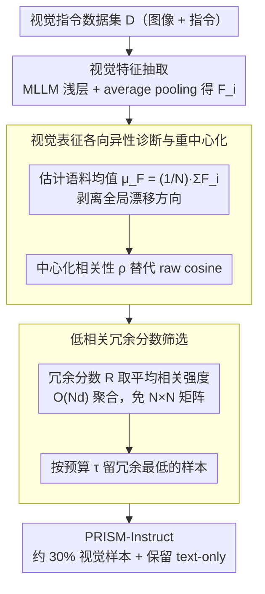

# PRISM: Self-Pruning Intrinsic Selection Method for Training-Free Multimodal Data Selection

**会议**: ACL2026 Best Paper  
**arXiv**: [2502.12119](https://arxiv.org/abs/2502.12119)  
**代码**: 有，cache 未提供明确 URL  
**领域**: 多模态VLM / 数据选择  
**关键词**: 多模态数据选择, 视觉指令微调, 表征各向异性, 训练免筛选, 冗余剪枝  

## 一句话总结
PRISM 发现 MLLM 视觉特征的非零均值会造成 Global Semantic Drift，从而污染基于相似度的数据选择，并用训练免的均值重中心化和低相关样本筛选，在只保留约 30% 视觉样本的情况下达到 101.7% 相对性能，同时把端到端 GPU 时间降低约 70%。

## 研究背景与动机
**领域现状**：多模态大模型通常先做大规模图文预训练，再用视觉指令数据进行 instruction tuning。随着 LLaVA、VisionFlan 等数据池不断扩大，指令样本数量很多，但其中也包含大量重复、低信息量或噪声样本。

**现有痛点**：现有视觉指令数据选择方法大多依赖 proxy model、外部 scorer、训练 loss、perplexity、gradient 或 influence function。这些方法要么需要额外模型推理，要么需要迭代训练和梯度计算，筛数据本身就很贵，甚至抵消了少训练数据带来的效率收益。

**核心矛盾**：数据选择本来是为了省算力，但很多选择器把成本转移到了选择阶段。作者认为根因在于大家直接使用 MLLM 视觉特征的原始几何，而这些视觉 embedding 并非均匀分布在原点附近，而是被一个强全局均值方向拉进狭窄锥体，导致 cosine similarity 把共享背景漂移误当成语义相似。

**本文目标**：提出一种无需 proxy、无需训练、无需梯度的 multimodal instruction selection 方法，既能保持甚至超过 full fine-tuning 性能，又能真正降低 selection + tuning 的总成本。

**切入角度**：论文从表征几何诊断入手，先证明视觉特征存在 representation anisotropy 和奇异值集中，再把数据选择问题改写成“先去掉全局漂移，再基于样本的独特语义分量估计冗余”。

**核心 idea**：用目标 MLLM 自身视觉特征的均值重中心化，恢复更可靠的相似度几何，然后保留与全体样本低相关、信息更独特的样本。

## 方法详解
PRISM 的关键不在于训练一个更强选择器，而是让原本已经存在于 MLLM 中的视觉表征重新变得可用。它把选择流程做成单次特征抽取、全局均值估计、冗余评分和百分位筛选四步，因此成本主要是一次前向和线性聚合。

### 整体框架
给定视觉指令数据集 $D=\{d_1,\dots,d_N\}$，每个样本包含图像和文本指令。PRISM 首先用目标 MLLM 的视觉编码器、投影器和 LLM 中间层抽取每个样本的视觉特征 $F_i$，并通过 average pooling 得到一个全局图像表示。

然后，PRISM 计算整个语料的特征均值 $\mu_F=\frac{1}{N}\sum_i F_i$。这个均值代表所有视觉样本共享的 global drift，而不是单个样本独有语义。对于任意两个样本，PRISM 不再用 raw cosine，而是先做 $F_i-\mu_F$ 和 $F_j-\mu_F$，再计算归一化内积。

接着，每个样本的 Redundancy Score 是它和其他所有样本中心化后相关性的平均值。直觉上，如果一个样本和大量样本都高度相关，它更可能是重复或低边际收益样本；如果相关性低，它可能携带更独特的视觉语义。

最后，根据选择预算 $\tau$ 取冗余分数最低的一部分样本。主实验中，PRISM 对 LLaVA-665K 的视觉样本使用 30% 预算，同时保留 text-only 样本，最终得到 PRISM-Instruct-250K。

> 注：OSC（Overall Selection Cost）是评价"选择器到底真省了没有"的端到端尺子，是驱动上述训练免流程的动机，不属于选择 pipeline 的某个阶段，故不入图。

### 关键设计

**1. Overall Selection Cost 评价准则：逼问一个数据选择器到底"真省了没有"**

很多选择方法只报告 subset 上的性能，却把昂贵的 selection overhead 藏起来不算，于是出现"筛得很准，但加上选择成本比直接全量训练还贵"的尴尬。PRISM 先立一把诚实的尺子：把性能比和时间比相乘，

$$C=\frac{P(D_{full})}{P(D_{sub})}\times\frac{T_{select}+T_{tune}(D_{sub})}{T_{tune}(D_{full})}.$$

只有当 $C<1$ 时，一个方法才同时做到了不掉性能且端到端净省算力。这个指标把比较强行拉回端到端成本，也正是 PRISM 后面坚持"训练免、单次前向"的根本动因。

**2. 视觉表征各向异性诊断与重中心化：先修好相似度，再谈选数据**

作者发现根因不在选择器不够强，而在大家直接用了 MLLM 视觉特征的原始几何——这些视觉 embedding 并非均匀分布在原点附近，而是被一个强全局均值方向拉进狭窄锥体，使得 cosine similarity 把"共享背景漂移"误当成"语义相似"。把视觉特征分解为 $x_i=\mu+\delta_i$（$\mu$ 是全体共享的 global component，$\delta_i$ 才是样本特有语义），当 $\|\mu\|$ 远大于 $\|\delta_i\|$ 时，raw cosine 会被 $\mu$ 主导而趋近 1。PRISM 的对策是先估计语料均值 $\mu_F=\frac{1}{N}\sum_i F_i$，再用中心化后的相关性

$$\rho(F_i,F_j)=\frac{(F_i-\mu_F)^\top(F_j-\mu_F)}{\|F_i-\mu_F\|_2\,\|F_j-\mu_F\|_2}$$

替代 raw cosine。值得一提的是，作者明确说这不是 full whitening，而只针对最破坏冗余估计的 corpus-level mean shift——与其引入外部 scorer，不如先修掉目标模型自身特征空间里最显著的一阶几何偏差。

**3. 低相关冗余分数筛选：用一阶聚合找出语义最独特的样本**

把相似度修好之后，还得在几十万样本规模上算出谁冗余、谁独特，而构造 $N\times N$ 相似度矩阵或跑精确 greedy coverage 都贵到不可承受。PRISM 给每个样本定义冗余分数

$$R(d_i)=\frac{1}{N-1}\sum_{j\ne i}\rho(F_i,F_j),$$

即它在中心化语义图中与其余样本的平均连接强度：分数高说明和一大票样本都高度相关、多半是重复或低边际收益样本，分数低则意味着携带更独特的视觉语义、训练价值更高。借助 exact aggregate implementation，这个分数能以 $O(Nd)$ 算出而无需 materialize 全量 pairwise 矩阵，最后按选择预算 $\tau$ 保留冗余分数低于百分位阈值的那部分样本即可。

### 损失函数 / 训练策略
PRISM 本身没有训练损失，是 training-free selector。选完数据后，作者按 LLaVA-1.5 官方超参进行一轮 visual instruction tuning。主设置使用 LLaVA-665K 和 LLaVA-1.5-7B，并与 Random、Length、EL2N、Perplexity、GraNd、TIVE、InstructionGPT-4、Self-Filter、COINCIDE、ICONS、DataTailor 等方法比较。额外实验在 VisionFlan-186K、不同 MLLM 架构和 text-only benchmark 上验证泛化与知识保留。

## 实验关键数据

### 主实验
PRISM 在 LLaVA-1.5-7B 上相对 full fine-tuning 达到 101.7% 综合性能，同时在多个多模态 benchmark 上超过全量数据或强选择方法。

| 方法 | SQA | SQA-I | VizWiz | POPE-P/R/A | MM-Vet | MMBench | MME-C | MMMU | Rel. |
|------|-----|-------|--------|------------|--------|---------|-------|------|------|
| Full-Finetune | 69.4 | 66.8 | 50.0 | 86.1 / 87.3 / 84.2 | 31.1 | 64.3 | 311.9 | 35.4 | 100% |
| TIVE | 72.2 | 70.6 | 未列出 | 85.6 / 85.6 / 85.6 | 未列出 | 63.2 | 322.1 | 未列出 | 100.6% |
| ICONS | 未列出 | 70.8 | 未列出 | 87.5 / 87.5 / 87.5 | 未列出 | 63.1 | 未列出 | 未列出 | 101.0% |
| PRISM | 71.3 | 69.1 | 50.1 | 87.7 / 88.7 / 85.5 | 32.0 | 65.2 | 330.0 | 34.7 | 101.7% |

在 VisionFlan-186K 上，PRISM 用同样 30% 预算选择 57K 样本，仍超过 full-data aggregate，并显著强于随机选择。

| 方法 | 样本量 | VizWiz | SQA-I | TextVQA | POPE | MME | MMBench | Rel. |
|------|--------|--------|-------|---------|------|-----|---------|------|
| Full Data | 186K | 41.7 | 60.8 | 50.4 | 83.4 | 1263.2 | 52.6 | 100.0 |
| Random | 57K | 38.8 | 56.5 | 46.9 | 83.1 | 1175.0 | 48.9 | 94.1 |
| PRISM | 57K | 42.3 | 61.1 | 50.8 | 84.1 | 1275.5 | 53.1 | 100.9 |

### 消融实验
核心消融验证了三点：浅层视觉特征最好、低相关样本最好、average pooling 优于 last token。

| 配置 | SQA | SQA-I | VizWiz | POPE-P/R/A | MM-Vet | MMBench | MME-C | Rel. |
|------|-----|-------|--------|------------|--------|---------|-------|------|
| Deep Layer | 71.2 | 69.1 | 51.6 | 86.6 / 88.0 / 84.2 | 31.1 | 62.9 | 254.0 | 97.2% |
| Middle Layer | 70.9 | 69.1 | 47.7 | 86.5 / 87.8 / 84.2 | 31.9 | 65.0 | 276.0 | 97.9% |
| Shallow Layer | 71.3 | 69.1 | 50.1 | 87.7 / 88.7 / 85.5 | 32.0 | 65.2 | 330.0 | 100.0% |
| High Correlation | 70.6 | 68.0 | 48.1 | 85.8 / 87.6 / 83.9 | 30.7 | 64.0 | 275.3 | 96.3% |
| Low Correlation | 71.3 | 69.1 | 50.1 | 87.7 / 88.7 / 85.5 | 32.0 | 65.2 | 330.0 | 100.0% |
| Last Token | 69.9 | 67.3 | 49.4 | 87.4 / 88.3 / 85.0 | 31.6 | 62.6 | 272.0 | 97.4% |
| Avg Pooling | 71.3 | 69.1 | 50.1 | 87.7 / 88.7 / 85.5 | 32.0 | 65.2 | 330.0 | 100.0% |

跨模型泛化显示 PRISM 不只适用于 LLaVA-1.5-7B，而是在多种 LLM 和 vision encoder 组合上都略优于 full fine-tuning。

| 模型组合 | Full Rel. | PRISM Rel. | 代表性变化 |
|----------|-----------|-------------|------------|
| Phi2-3B | 100% | 100.1% | MME 1765.7 → 1790.5 |
| Vicuna-7B | 100% | 101.7% | MMBench 64.3 → 65.2 |
| Vicuna-13B | 100% | 100.4% | MME 1826.7 → 1846.0 |
| Qwen2.5-7B Base | 100% | 101.0% | SQA-I 76.7 → 78.9 |
| Qwen2.5-7B Instruct | 100% | 100.9% | MMBench 71.0 → 72.4 |
| Llama-3-8B | 100% | 100.8% | SQA-I 75.2 → 77.3 |

### 关键发现
- PRISM 的主结果不是“少训一点还能不掉点”，而是相对 full fine-tuning 还略有提升：LLaVA-665K 设置为 101.7%，VisionFlan-186K 设置为 100.9%。
- 低相关样本优于高相关和中等相关样本，直接支持“重中心化后低 redundancy 更有训练价值”的核心假设。
- 浅层特征优于中深层，说明用于冗余检测的几何结构在 early visual-token representation 中更干净，深层可能混入更多任务和抽象 artifacts。
- PRISM-Instruct-250K 的最终样本数为 250,557，其中包括 LLaVA 53,591、VG 28,777、VQAv2 27,567、OCRVQA 26,638、Text-Only 40,688 等，说明它不是按数据源硬编码比例，而是由全局低冗余阈值自然决定组成。
- text-only retention 也有收益：PRISM-7B 相对 101.9%，PRISM-13B 相对 130.6%，说明更干净的视觉指令数据可能减少 catastrophic forgetting。

## 亮点与洞察
- PRISM 的巧妙之处在于把数据选择的“模型评分问题”转成“几何校准问题”。如果 raw embedding 的相似度本身坏了，再复杂的 cheap distance selector 都会被误导。
- OSC 指标很实用。它要求选择器同时满足性能 fidelity 和 net efficiency gain，对数据选择论文是一个更诚实的评价约束。
- 只做 corpus mean re-centering 而不做 whitening 是一个务实取舍。full whitening 需要高维协方差估计、正则和 rank 选择；PRISM 放弃完全 isotropize，换来稳定、无超参、可大规模部署。
- 视觉优先的选择也很有启发。附录指出 text features 相对更接近中心，联合 multimodal feature 选择反而只有 97.8% 相对性能，低于 visual-only PRISM 的 101.7%。这说明多模态选择不一定要把所有模态直接拼起来。

## 局限与展望
- PRISM 只针对基于 feature correlation 的语义冗余剪枝，不检测事实错误、伦理偏差、有害内容或标注质量问题。因此它适合作为效率选择器，不应被当作完整数据治理工具。
- 方法主要修正一阶全局均值漂移，而不是完整 whitening。若某些数据池的主要问题来自更复杂的二阶协方差结构，单纯重中心化可能不足。
- 主任务集中在视觉-语言 instruction tuning，作者提到未来可以扩展到其他模态，但语音、视频、机器人轨迹等场景是否同样存在可利用的一阶 drift 还需要验证。
- PRISM 依赖目标 MLLM 的中间视觉表示；当目标模型不可访问或视觉 token 表征不稳定时，部署会受到限制。
- 当前选择目标是保留低冗余样本，但未显式建模任务覆盖、公平性、罕见类别或安全关键样本，后续可以把几何冗余分数和质量/安全过滤器组合起来。

## 相关工作与启发
- **vs Random / Length / Perplexity**: 这些方法便宜但语义信号弱，PRISM 同样便宜，却利用目标 MLLM 的中心化视觉几何来估计冗余。
- **vs Proxy-Based Selection**: InstructionGPT-4、Self-Filter、TIVE 等方法依赖外部模型或 scorer，可能引入 proxy bias 和推理开销；PRISM 不需要外部评估器。
- **vs Training-Based Selection**: EL2N、GraNd、ICONS 等使用训练动态或梯度信号，信息强但成本高；PRISM 用一次特征抽取替代迭代训练信号。
- **vs whitening / top-PC removal**: 这些几何修正更彻底但需要额外超参或高维协方差估计；PRISM 选择最简单的一阶重中心化，在性能和可扩展性之间取平衡。

## 评分
- 新颖性: ⭐⭐⭐⭐☆ 从视觉表征各向异性解释数据选择低效，角度清晰且有理论支撑。
- 实验充分度: ⭐⭐⭐⭐⭐ 主结果、消融、VisionFlan、跨模型、语言保持和效率分析都比较扎实。
- 写作质量: ⭐⭐⭐⭐☆ 方法逻辑完整，附录补充充分，但正文公式和图表较多，阅读密度偏高。
- 价值: ⭐⭐⭐⭐⭐ 对多模态指令数据筛选很实用，尤其适合需要真正降低端到端训练成本的场景。

<!-- RELATED:START -->

## 相关论文

- [\[ICML 2026\] Toward Structural Multimodal Representations: Specialization, Selection, and Sparsification via Mixture-of-Experts](../../ICML2026/multimodal_vlm/toward_structural_multimodal_representations_specialization_selection_and_sparsi.md)
- [\[ACL 2026\] iReasoner: Trajectory-Aware Intrinsic Reasoning Supervision for Self-Evolving Large Multimodal Models](ireasoner_trajectory-aware_intrinsic_reasoning_supervision_for_self-evolving_lar.md)
- [\[ICCV 2025\] Mastering Collaborative Multi-modal Data Selection: A Focus on Informativeness, Uniqueness, and Representativeness](../../ICCV2025/multimodal_vlm/mastering_collaborative_multi-modal_data_selection_a_focus_on_informativeness_un.md)
- [\[NeurIPS 2025\] CoIDO: Efficient Data Selection for Visual Instruction Tuning via Coupled Importance-Diversity Optimization](../../NeurIPS2025/multimodal_vlm/coido_efficient_data_selection_for_visual_instruction_tuning_via_coupled_importa.md)
- [\[CVPR 2026\] Rethinking Model Selection in VLM Through the Lens of Gromov-Wasserstein Distance](../../CVPR2026/multimodal_vlm/rethinking_model_selection_in_vlm_through_the_lens_of_gromov-wasserstein_distanc.md)

<!-- RELATED:END -->
