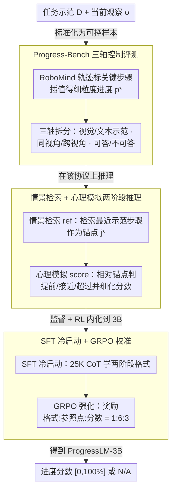

# PROGRESSLM: Towards Progress Reasoning in Vision-Language Models

**会议**: ACL2026  
**arXiv**: [2601.15224](https://arxiv.org/abs/2601.15224)  
**代码**: 缓存中标注 Website / Code / Model / Dataset，但未展开具体 URL  
**领域**: 多模态 VLM / 具身任务进度推理  
**关键词**: 进度推理, VLM评测, 具身智能, 两阶段推理, 强化学习微调

## 一句话总结
本文把“从单帧观察判断任务完成到哪一步”定义为 VLM 的进度推理能力，构建 Progress-Bench 和 ProgressLM-45K，并证明显式学习“情景检索 + 心理模拟”比单纯提示推理更稳定。

## 研究背景与动机
**领域现状**：现有 VLM 已经很擅长描述单张图像中“有什么”，也能在机器人或具身任务里回答局部状态问题；但很多实际系统更关心“任务推进到哪里了”，例如机器人执行是否停滞、Web agent 是否接近完成目标、在线 RL 是否需要稠密奖励。

**现有痛点**：传统进度估计通常依赖任务专用回归器，或者把问题转成轨迹重排、两两比较等间接目标。这些方法要么强依赖特定任务分布，要么需要整段轨迹作为上下文，无法回答一个更通用的问题：给定完整任务示范和当前单帧观察，VLM 能否直接推断归一化进度。

**核心矛盾**：单帧观察包含的是静态视觉证据，而进度本质上是时间维度上的状态变量。模型不能只做图像匹配，还必须把当前观察放回任务轨迹中，判断它位于哪个阶段，以及该阶段内部已经推进了多少。

**本文目标**：作者首先构建一个可控 benchmark，系统区分视觉示范与文本示范、同视角与跨视角、可回答与不可回答样本；然后评测 14 个 VLM；最后训练一个小规模 ProgressLM-3B，验证进度推理能否通过显式监督和强化学习习得。

**切入角度**：论文借鉴人类理解任务进展的方式：先在记忆中找一个粗粒度参照点，再围绕这个参照点想象状态如何继续演化。这个角度比直接回归百分比更可解释，也更适合处理跨视角或文本示范带来的不确定性。

**核心 idea**：把进度估计拆成“情景检索定位锚点”和“心理模拟细化百分比”两个阶段，并用 ProgressLM-45K 将这种推理格式显式教给 VLM。

## 方法详解
本文的方法由一个 benchmark、一个推理范式和一个训练流程组成。Progress-Bench 负责把进度推理问题标准化，训练自由提示用于测试现有 VLM 是否能靠 prompt 激活这类能力，ProgressLM-3B 则把两阶段推理内化到模型参数中。

### 整体框架
输入是一段任务示范 $D$ 和一个当前观察 $o$。示范可以是按步骤标注进度的关键帧序列，也可以是文本动作步骤；观察是任务执行中间某一时刻的一帧图像。模型要输出 $[0,100\%]$ 内的进度分数；如果示范与观察不一致，或者无法从示范推出进度，则输出 N/A。

Progress-Bench 基于 RoboMind 构建。每条任务轨迹先被标注为若干关键步骤，再在相邻关键步骤之间采样中间帧，并通过线性插值得到细粒度进度 $p^*=p_j+\delta(p_{j+1}-p_j)$。视觉示范进一步区分同视角和跨视角，测试模型是否真的理解任务状态，而不是做像素级相似度匹配。不可回答样本通过修改示范或编辑观察来构造，用来检查模型是否会在语义不匹配时主动拒答。

ProgressLM 的推理输出采用固定结构：先生成 `<ref_think>` 和 `<ref>` 找到最接近当前观察的示范步骤，再生成 `<score_think>` 和 `<score>` 估计当前状态相对这个锚点是提前、接近还是超过。训练阶段先用监督微调学习这个格式，再用 GRPO 强化学习优化格式、参照点和进度分数。

### 关键设计

**1. Progress-Bench 的三轴控制评测：用同一套任务定义同时量出进度误差、顺序一致性和拒答能力**

如果只盯着最终百分比误差，模型完全可能靠固定模板或几个离散分数蒙混过关，让人误以为它真懂进度。为了把这种假象戳破，benchmark 沿三条轴拆解样本：示范模态分成视觉关键帧和文本步骤，视觉示范再细分 same-view 与 cross-view，每条样本又标注为 answerable 或 unanswerable。三轴交叉之后，一次失败就能被定位到具体模式——是根本看不懂进度、是跨视角下排序崩了、还是该拒答时不会拒答。正因为有这层结构，分数坍缩、文本状态累积失败、过度保守拒答这些更细的行为才会暴露出来，而不是被一个平均误差掩盖掉。

**2. 情景检索 + 心理模拟的两阶段推理：把连续进度估计拆成先选锚点、再局部比较**

直接让模型吐一个进度百分比，很容易退化成 0%、50%、100% 这类启发式答案，看起来在答题其实在猜。ProgressLM 借人类判断任务进展的方式把它拆成两步：第一阶段在示范里检索与当前观察最接近的步骤 $j^\star$ 作为参照锚点，第二阶段只围绕 $j^\star$ 与当前观察的状态差异，判断当前帧是落在该步骤之前、附近还是之后，再给出细化分数。输出格式也被固定下来——先 `<ref_think>`/`<ref>` 定锚点，再 `<score_think>`/`<score>` 估进度。显式锚点把分数约束在一个可解释的任务状态附近，既压住了启发式坍缩，也让错误更容易被诊断到底错在选锚点还是估细节。

**3. SFT 冷启动 + GRPO 校准：让小模型既写得出两阶段格式，又把格式绑到正确的锚点和分数上**

光会写 `<ref>`/`<score>` 这套格式还不够，小模型很可能格式对了但锚点和分数全错。ProgressLM 因此先用 ProgressLM-25K-CoT 做自回归监督冷启动，损失为 $\mathcal{L}_{SFT}=-\frac{1}{N}\sum_i\log P_\theta(r_i^*|D_i,o_i)$，把两阶段推理骨架先立起来；随后用另外 20K 样本跑 GRPO 强化学习，奖励拆成格式、参照点和分数三项 $R=\alpha R_{format}+\beta R_{ref}+\gamma R_{score}$，权重比例取 $1:6:3$，把绝大部分奖励压在锚点正确性上。SFT 负责教会"怎么推理"，RL 则专门惩罚锚点错误和分数偏差，尤其把跨视角和不可回答这两类最难校准的场景往回拉。

### 损失函数 / 训练策略
训练数据是 ProgressLM-45K，其中 25K 用于 CoT 监督冷启动，20K 用于 RL refinement，且训练任务与 Progress-Bench 不重合。SFT 采用 LLaMA-Factory 和 LoRA rank 8，学习率 $1\times10^{-4}$，4 张 H100 上有效 batch size 为 64，训练 2 个 epoch；RL 使用 EasyR1/GRPO，actor 学习率 $1\times10^{-6}$，KL 系数 0.01，每个 prompt 采样 $n=16$ 个 rollout，在 16 张 H100 上训练 2 个 epoch，约 23 小时。

推理评测统一使用较大的最大输出长度，保证模型可以生成完整两阶段推理。论文同时比较 direct prediction、training-free prompting 和 training-based ProgressLM，避免把 prompt 格式收益误认为训练收益。

## 实验关键数据

### 主实验
Progress-Bench 含 240 条任务轨迹和 3,325 个采样观察，评测 14 个 VLM。回答可行样本使用 NSE↓、PRC↑、AFRR↓；NSE 越低表示百分比误差越小，PRC 越高表示沿轨迹的进度排序越一致，AFRR 越低表示可回答样本被误拒的比例越低。

| 模型 | 宏平均 NSE↓ | 宏平均 PRC↑ | 宏平均 AFRR↓ | 说明 |
|------|-------------|-------------|--------------|------|
| GPT-5 | 21.3 | 72.6 | 4.2 | 强闭源基线，仍受模态影响 |
| GPT-5-mini | 20.9 | 71.4 | 5.1 | 小闭源模型，PRC 接近 GPT-5 |
| Qwen2.5-VL-3B | 39.0 | 20.2 | 0.01 | ProgressLM 的小模型基底，直接预测很弱 |
| ProgressLM-3B-SFT | 24.0 | 59.3 | 7.8 | SFT 后误差显著下降，排序改善 |
| ProgressLM-3B-RL | 17.5 | 77.0 | 7.0 | 宏平均 NSE/PRC 优于 GPT-5 |

### 消融实验
| 配置 | 关键指标 | 说明 |
|------|----------|------|
| Qwen2.5-VL-3B，same-view | NSE 29.2 / PRC 43.0 / AFRR 9.9 | 小模型在同视角下已有基本视觉匹配能力 |
| Qwen2.5-VL-3B，cross-view | NSE 33.4 / PRC 28.9 / AFRR 6.5 | 跨视角后排序能力明显下降 |
| ProgressLM-3B-RL，same-view | NSE 10.3 / PRC 93.5 / AFRR 0.1 | 两阶段训练在同视角下非常稳定 |
| ProgressLM-3B-RL，cross-view | NSE 15.2 / PRC 88.8 / AFRR 11.7 | 跨视角误差上升，但 PRC 仍保持较高 |
| Qwen2.5-VL-7B，vision no-think | PRC 33.7 / NSE 34.0 / AFRR 28.3 | 7B 直接预测仍不可靠 |
| Qwen2.5-VL-7B，vision training-based | PRC 85.7 / NSE 13.4 / AFRR 32.4 | 训练式推理显著提高排序和误差表现 |
| Qwen2.5-VL-7B，text training-based | PRC 50.5 / NSE 26.6 / AFRR 1.4 | 文本示范更难，但训练仍有收益 |

### 关键发现
- 现有 VLM 常把进度分数坍缩到少数启发式位置，例如 0%、50% 或 100%，导致 PRC 为负或不可定义；ProgressLM-SFT/RL 的分布更连续。
- Training-free reasoning 只在强模型上有条件收益，小模型往往只是遵守输出格式，并没有真正改善进度理解。
- 文本示范比视觉示范更难，因为模型必须累积隐式状态；例如相同“操作锅盖”的文字步骤可能对应完全不同的物体状态。
- 不可回答识别不能只看 UDA，Intern3.5-VL-38B 虽然能拒答不少异常样本，但在可回答样本上 AFRR 很高，说明过度保守也会损害系统可用性。

## 亮点与洞察
- 把 VLM 的“任务进度”从模糊能力变成可测指标，是这篇论文最有价值的地方。它不仅问模型是否看懂图像，还问模型是否能把单帧状态放入完整任务时间线。
- 两阶段推理的设计很朴素但抓住了关键：先找锚点再估细节，比直接回归百分比更符合人类做进度判断的过程，也让错误更容易诊断。
- ProgressLM-3B 能在宏平均 NSE/PRC 上超过 GPT-5，说明这类能力不一定只能靠模型规模获得；有针对性的监督和奖励设计可以把小模型推到更稳定的位置。
- benchmark 中的不可回答样本很重要。进度估计一旦用于机器人监控或 agent 自我改进，错误地给出“看似精确”的百分比可能比拒答更危险。

## 局限与展望
- 作者承认 Progress-Bench 主要聚焦机器人操作任务，而且任务进度相对清晰、单调；开放式任务、循环任务或目标会变化的场景中，进度未必能用单一百分比描述。
- ProgressLM 的训练数据也是结构相近的操作任务，迁移到 Web agent、代码 agent 或人类活动时可能需要新的示范格式和进度标注。
- 实验显示跨视角 AFRR 仍会上升，说明模型在“保守拒答”和“鲁棒估计”之间还没有完全校准好。
- 后续可以把进度分数接入在线控制：例如用低进度增长检测停滞，用高不确定性触发重新规划，或把 ProgressLM 作为 dense reward 生成器辅助 RL。

## 相关工作与启发
- **vs 任务专用进度回归器**: 传统方法通常在固定任务或环境中训练回归模型，泛化依赖训练分布；本文把进度估计做成 VLM 的通用推理问题，并要求单帧观察即可作答。
- **vs 轨迹重排 / 两两比较**: 这类方法通过重排帧或比较相对进度间接得到估计，依赖整段轨迹上下文；ProgressLM 直接从示范和单帧推断绝对进度，更适合在线监控。
- **vs inference-time CoT prompting**: 训练自由提示可以让模型显式说出参照步骤，但收益不稳定；本文的结果提醒我们，复杂推理格式需要训练和奖励绑定，否则只是“格式化解释”。
- **启发**: 对于 agent 评测，可以类似地设计“任务进展 benchmark”：给出目标、历史轨迹和当前状态，让模型判断完成度、下一步瓶颈和是否不可回答。

## 评分
- 新颖性: ⭐⭐⭐⭐☆ 将进度估计定义为 VLM 的结构化推理能力，并构建三轴 benchmark，问题设定很清晰。
- 实验充分度: ⭐⭐⭐⭐⭐ 覆盖 14 个 VLM、同/跨视角、文本/视觉示范、不可回答样本和 3B/7B 训练扩展，证据比较扎实。
- 写作质量: ⭐⭐⭐⭐☆ 主线清楚，表格信息密集；部分大表需要读者自己整理宏观结论。
- 价值: ⭐⭐⭐⭐⭐ 对具身智能、长程 agent 监控和 RL reward shaping 都有直接启发。

<!-- RELATED:START -->

## 相关论文

- [\[NeurIPS 2025\] The Illusion of Progress? A Critical Look at Test-Time Adaptation for Vision-Language Models](../../NeurIPS2025/multimodal_vlm/the_illusion_of_progress_a_critical_look_at_testtime_adaptat.md)
- [\[ACL 2026\] VL-Calibration: Decoupled Confidence Calibration for Large Vision-Language Models Reasoning](vl-calibration_decoupled_confidence_calibration_for_large_vision-language_models.md)
- [\[ACL 2026\] MMErroR: A Benchmark for Erroneous Reasoning in Vision-Language Models](mmerror_a_benchmark_for_erroneous_reasoning_in_vision-language_models.md)
- [\[ACL 2026\] Can MLLMs Reason Beyond Language? VisReason: A Comprehensive Benchmark for Vision-Centric Reasoning](can_mllms_reason_beyond_language_visreason_a_comprehensive_benchmark_for_vision-.md)
- [\[ACL 2026\] GeoArena: Evaluating Open-World Geographic Reasoning in Large Vision-Language Models](geoarena_evaluating_open-world_geographic_reasoning_in_large_vision-language_mod.md)

<!-- RELATED:END -->
