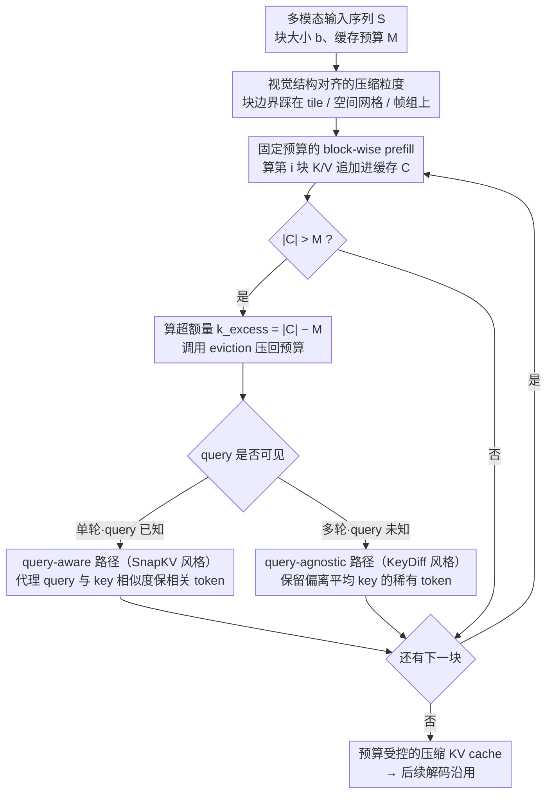

# Reducing Peak Memory Usage for Modern Multimodal Large Language Model Pipelines

**会议**: ACL 2026  
**arXiv**: [2604.16734](https://arxiv.org/abs/2604.16734)  
**代码**: 未公开  
**领域**: 多模态VLM / 推理效率 / KV Cache压缩  
**关键词**: 多模态大模型、KV缓存、prefill压缩、显存优化、视觉token

## 一句话总结
论文把多模态大模型的显存瓶颈从“解码阶段的长上下文缓存”前移到“prefill 阶段的视觉 token 峰值缓存”，提出在 prefill 过程中边计算边压缩的结构感知 KV-cache 框架，在固定缓存预算下把峰值显存控制住，同时尽量保留图像和视频理解能力。

## 研究背景与动机
**领域现状**：现代 MLLM 通常用视觉编码器提取图像或视频特征，再通过投影层送入 LLM backbone，让文本 token 和大量视觉 token 一起进入自注意力。高分辨率图像、多 tile 输入、长视频帧序列让视觉 token 数快速膨胀，模型在解码前就要处理非常长的 multimodal prefix。

**现有痛点**：KV cache 原本是为了降低自回归解码的重复计算，但缓存大小随 token 数、层数、head 数线性增长。在 MLLM 中，峰值显存往往不是出现在生成很长答案时，而是出现在 prefill 阶段：模型必须先为完整视觉上下文构建 KV cache，随后才开始生成。很多已有 KV 压缩方法是在 full cache 已经建好之后再做 eviction 或 merging，因此无法避免 prefill 时的显存尖峰和 OOM。

**核心矛盾**：多模态推理需要保留足够细的视觉信息，尤其是高分辨率定位和长视频时序线索；但如果先完整编码再压缩，显存峰值已经发生。如果直接降低输入分辨率或删掉视觉 token，又会丢失任务所需的细节。

**本文目标**：设计一种在 prefill 过程中就维持固定 KV-cache budget 的推理框架，使模型能够处理更大规模视觉输入；同时比较 query-aware 与 query-agnostic 的在线 eviction 策略，分析显存、延迟和精度之间的关系。

**切入角度**：作者观察到视觉 token 与纯文本 token 不同，图像具有空间连续性，视频具有时间冗余。这些结构意味着压缩粒度不应完全随机或仅依赖全局注意力统计，而应尽量和视觉块、tile 或帧组对齐。

**核心 idea**：不要等 multimodal prefix 全部编码完再压缩，而是在 prefill 中按块处理视觉上下文，每处理一块就把 KV cache 压回固定预算，从而把“process first, compress later”改成“compress as you prefill”。

## 方法详解
这篇论文的方法不是训练一个新模型，而是改造 MLLM 的推理执行路径。关键点在于把传统一次性 prefill 拆成 block-wise prefill：输入序列被分成连续块，模型逐块计算 KV；每次追加新块的 KV 后，如果缓存超过预算，就立刻根据 eviction 策略删除一部分 token。这样完整视觉上下文从未以 full cache 的形式同时驻留在显存中，峰值显存由预算控制，而不是由原始视觉 token 数决定。

### 整体框架
给定多模态输入序列 $S$、块大小 $b$ 和缓存预算 $M$，框架先把 $S$ 分成若干连续块。处理第 $i$ 个块时，模型计算该块的 key/value，并将它们加入已有缓存 $C$。如果 $|C| > M$，系统计算需要移除的数量 $k_{excess}=|C|-M$，调用 eviction 策略将缓存压回预算内。这个过程一直持续到 prefill 完成，最终得到一个预算受控的压缩 KV cache，后续解码沿用这个 cache。

论文考虑两类在线 eviction。单轮问答中，文本 query 已经可见，可以使用 query-aware 的 SnapKV 风格策略，用 prompt 中的代理 query 和缓存 key 的相似度估计视觉 token 对当前问题的重要性；潜在多轮场景中，后续 query 可能未知，则使用 query-agnostic 的 KeyDiff 风格策略，保留更偏离平均 key 表示的 token，以维护视觉表示多样性。

### 关键设计

**1. 固定预算的 block-wise prefill：把峰值显存钉在预算 $M$ 附近，而不是随原始视觉 token 数膨胀**

MLLM 的长视觉输入在解码还没开始时就已经制造了显存尖峰——模型得先为完整视觉上下文建好 KV cache 才能生成第一个 token，只优化生成阶段根本碰不到这个峰值。这套框架把一次性 prefill 拆成逐块执行：输入序列按块大小 $b$ 切成连续块，处理第 $i$ 块时算出该块的 key/value 追加进缓存 $C$，一旦 $|C|>M$ 就立即算出超额量 $k_{excess}=|C|-M$ 并调用 eviction 把缓存压回预算内。这样完整视觉上下文从不以 full cache 的形态同时驻留显存，峰值由预算 $M$ 决定而非由原始 token 数决定。和那些等 full cache 建好之后再 eviction 的 post-prefill 方法相比，在线压缩直接作用在尖峰真正发生的位置，才能从根上避免 prefill 阶段的 OOM。

**2. 视觉结构对齐的压缩粒度：让块边界尽量踩在 tile、空间网格和帧组上，避免删错关键视觉信息**

视觉 token 的冗余不是无结构噪声，而是来自相邻区域和相邻帧的重复；如果压缩粒度横切这种结构，很容易把定位和细粒度理解需要的 token 误删。因此 block boundary 被刻意往视觉输入的自然结构上对齐——块大小分析显示 Qwen2.5-VL-7B 在 block size 784 时表现最好，而这正好对应它 $28 \times 28$ 的视觉 tokenization。换句话说，"结构对齐"不是装饰性说法：让每个块恰好覆盖完整的视觉网格单元，eviction 才能在尊重空间/时序连续性的前提下做取舍，而不是把一个 tile 切两半各删一块。

**3. query-aware 与 query-agnostic 双路径 eviction：分别对应"当前问题最有用"和"未来问题也可能有用"两种假设**

单轮问答里文本 query 已经可见，这时该追求的是任务相关性；但多轮场景下后续 query 可能还没出现，缓存得为未知的将来保留可复用性，两种需求并不兼容。框架因此给出两条路径：query-aware 路径走 SnapKV 风格，用 prompt 里的代理 query 和 cached keys 算相似度，保留与当前问题更相关的视觉 token；query-agnostic 路径走 KeyDiff 风格，计算每个 key 到平均表示的偏离度，保留更稀有、更有代表性的 token 以维护视觉表示的多样性。前者把算力压到当前问题最需要的证据上，后者赌的是多样化的视觉 cache 在未来任意 query 下都更耐用，让框架能同时覆盖单轮和潜在多轮两类部署。

### 损失函数 / 训练策略
本文没有引入新的训练目标，也不需要微调模型；它是 inference-time 的 KV-cache 管理方法。主要超参包括 KV budget、block size 和 eviction 策略。默认 block size 为 256，但作者发现结构对齐的 block size 可以明显改善效果。为降低纯 block-wise 执行带来的延迟，论文还使用 hybrid 策略：尽量先用一次 bulk forward 处理可容纳的部分，只在超出预算时进入分块执行。

## 实验关键数据

### 主实验
主实验覆盖图像细粒度定位和长视频理解任务，包括 ImageNeedleInHaystack、V*、MLVU 和 Video-MME long setting。下面摘取最能体现压缩效果的 8B/7B 模型结果，Average 越高越好，Delta 表示相对 full cache 的平均下降。

| 模型 | 方法 / KV预算 | ImageNeedle | V* | MLVU | Video-MME(L) | Average | Delta ↓ |
|------|---------------|-------------|----|------|--------------|---------|---------|
| InternVL3.5-8B | Full Cache | 80.31 | 84.35 | 51.28 | 53.89 | 67.46 | - |
| InternVL3.5-8B | SnapKV 1024 | 80.00 | 82.61 | 51.00 | 53.11 | 66.68 | 0.78 |
| InternVL3.5-8B | KeyDiff 1024 | 74.06 | 74.35 | 50.40 | 52.22 | 62.76 | 4.70 |
| Qwen2.5-VL-7B | Full Cache | 83.70 | 79.58 | 48.80 | 50.00 | 65.52 | - |
| Qwen2.5-VL-7B | SnapKV 4096 | 85.00 | 78.53 | 44.82 | 48.77 | 64.28 | 1.24 |
| Qwen2.5-VL-7B | KeyDiff 4096 | 81.56 | 79.58 | 47.41 | 49.33 | 64.47 | 1.05 |

模型规模实验说明方法不只适用于中等规模 backbone，在更大模型上也能工作，但 1024 预算下性能下降更明显。

| 模型 | 方法 / KV预算 | ImageNeedle | V* | MLVU | Video-MME(L) | Average | Delta ↓ |
|------|---------------|-------------|----|------|--------------|---------|---------|
| InternVL3.5-14B | Full Cache | 84.06 | 83.76 | 49.67 | 57.89 | 68.95 | - |
| InternVL3.5-14B | SnapKV 1024 | 66.25 | 82.72 | 47.61 | 56.45 | 63.26 | 7.73 |
| InternVL3.5-14B | KeyDiff 1024 | 75.94 | 64.92 | 46.41 | 52.78 | 60.01 | 8.84 |
| Qwen2.5-VL-32B | Full Cache | 96.56 | 83.77 | 48.40 | 55.22 | 70.99 | - |
| Qwen2.5-VL-32B | SnapKV 1024 | 66.25 | 82.72 | 47.61 | 56.45 | 63.26 | 7.73 |
| Qwen2.5-VL-32B | KeyDiff 1024 | 67.19 | 72.25 | 45.82 | 54.56 | 59.96 | 11.03 |

### 消融实验
prefill 策略分析显示，本文方法的收益不是简单来自降低输入分辨率，也不是任意动态预算都有效。

| 分析项 | 设置 | ImageNeedle | 说明 |
|--------|------|-------------|------|
| Forward under budget | Block Forward 1024 | 80.94 | 全程分块执行，显存稳定但延迟更高 |
| Forward under budget | Bulk Forward 1024 | 80.31 | 默认 hybrid 策略，精度接近且延迟更低 |
| Static vs. Dynamic | Static 1024 | 80.31 | 固定预算在 prefill 中更可靠 |
| Static vs. Dynamic | Dynamic 1024 | 74.68 | 动态层级预算下降 5.63 点 |
| Input res. vs. Compression | Compression 1024 | 80.31 | 保留高分辨率输入，仅压 KV cache |
| Input res. vs. Compression | Reduction 1024 | 9.38 | 直接降分辨率严重破坏视觉定位 |

block size 消融进一步证明“结构对齐”不是装饰性说法，而是影响压缩鲁棒性的关键因素。

| Block size / KV预算 | ImageNeedle | Global Peak (GB) | Avg. Peak (GB) | 观察 |
|----------------------|-------------|------------------|----------------|------|
| 256 / 2048 | 72.19 | 17.80 | 17.12 | 默认小块，显存最低但精度弱 |
| 512 / 2048 | 75.31 | 18.00 | 17.19 | 未完全对齐视觉网格 |
| 784 / 2048 | 80.63 | 18.21 | 17.26 | 匹配 $28 \times 28$ tokenization，效果最好 |
| 1024 / 2048 | 79.38 | 18.38 | 17.37 | 稍高显存换来较好精度 |

### 关键发现
- prefill 阶段才是多视觉 token MLLM 的关键显存峰值，post-prefill 压缩无法解决这一点。
- 在 InternVL3.5-8B 上，SnapKV 1024 预算只带来 0.78 平均下降，说明约 90% KV cache 压缩仍能保留主要视觉能力。
- query-aware eviction 在 query 可见时更强，query-agnostic KeyDiff 则为多轮或 query 未知场景提供可复用方案。
- 直接降低输入分辨率会让 ImageNeedle 从 80.31 掉到 9.38，说明保留原始视觉输入、只压缓存比输入级削减更安全。
- 该方法把不可运行的 OOM 情况转化为可调的 memory-latency trade-off，但延迟上升是必须面对的系统代价。

## 亮点与洞察
- 论文把问题定位得很准：MLLM 的显存压力不仅来自“生成很长”，还来自“还没生成前就已经塞入大量视觉 token”。这个视角让 KV-cache 压缩从解码优化扩展到 prefill 优化。
- 方法没有重训模型，工程侵入性较低。只要推理系统能支持分块 prefill 和在线 eviction，就可以接入现有 MLLM。
- 结构对齐的分析很有启发。视觉 token 压缩不能只看数值重要性，还要尊重 patch grid、tile 和帧序列这样的输入结构。
- 与输入降采样的对比很有说服力。论文表明“少看一点图”和“看完整图但压缩缓存”在效果上不是一回事，后者更适合细粒度视觉任务。

## 局限与展望
- block-wise prefill 会增加 time-to-first-token，尤其是在较小预算下，系统需要在可运行性和延迟之间权衡。
- query-agnostic eviction 只保留表示多样性，不知道用户真正会问什么，因此在任务相关性上弱于 query-aware 策略。
- 压缩效果依赖 block boundary 与视觉 tokenization 的对齐，不同 MLLM 的视觉编码方式可能需要单独调参。
- 本文方法只在推理时压缩，没有让模型在训练阶段适应 prefill-stage compression；未来可以训练模型在压缩 cache 条件下更稳健地推理。
- 论文中的显存曲线主要以图展示，缓存文本没有给出完整精确数值，复现实验时还需要结合原图或代码进一步核对具体峰值。

## 相关工作与启发
- **vs SnapKV / H2O 等 post-prefill KV eviction**: 这些方法能压缩解码阶段 cache，但通常要先构造完整上下文。本文把压缩提前到 prefill 内部，直接降低峰值显存。
- **vs KeyDiff**: KeyDiff 本身是 query-agnostic 的表示多样性保留策略，本文把它放进在线 prefill 框架，使其可以在视觉上下文构建过程中持续控制 cache budget。
- **vs 输入级 token pruning / 降分辨率**: 输入剪枝减少进入模型的视觉信息，容易丢掉细节；本文保留高分辨率输入，只在 KV cache 层做预算控制。
- **vs MEDA / FlowMM**: 这些方法更强调多模态 cache 的层级或跨模态结构，本文的启发是系统执行时机同样重要，压缩发生在 full cache 之后还是 prefill 之中会导致完全不同的峰值显存。

## 评分
- 新颖性: ⭐⭐⭐⭐ 将 KV-cache 压缩显式前移到 MLLM prefill 阶段，问题定位和系统视角都很清楚。
- 实验充分度: ⭐⭐⭐⭐ 覆盖图像、视频、不同模型尺寸和多项消融，但显存曲线的具体数值可读性有限。
- 写作质量: ⭐⭐⭐⭐ 结构简洁，动机直接，系统 trade-off 讲得比较清楚。
- 价值: ⭐⭐⭐⭐ 对高分辨率图像和长视频 MLLM 部署很实用，尤其适合受显存约束的推理场景。

<!-- RELATED:START -->

## 相关论文

- [\[ACL 2026\] From Verbatim to Gist: Distilling Pyramidal Multimodal Memory via Semantic Information Bottleneck](from_verbatim_to_gist_distilling_pyramidal_multimodal_memory_via_semantic_inform.md)
- [\[CVPR 2026\] Scaling the Long Video Understanding of Multimodal Large Language Models via Visual Memory Mechanism](../../CVPR2026/multimodal_vlm/scaling_the_long_video_understanding_of_multimodal_large_language_models_via_vis.md)
- [\[CVPR 2026\] CAPT: Confusion-Aware Prompt Tuning for Reducing Vision-Language Misalignment](../../CVPR2026/multimodal_vlm/capt_confusion-aware_prompt_tuning_for_reducing_vision-language_misalignment.md)
- [\[ACL 2026\] Enhancing Multimodal Large Language Models for Ancient Chinese Character Evolution Analysis via Glyph-Driven Fine-Tuning](enhancing_multimodal_large_language_models_for_ancient_chinese_character_evoluti.md)
- [\[CVPR 2026\] PointThinker: Point-Incentivized Parallel Thinking for Multimodal Large Language Model](../../CVPR2026/multimodal_vlm/pointthinker_point-incentivized_parallel_thinking_for_multimodal_large_language_.md)

<!-- RELATED:END -->
