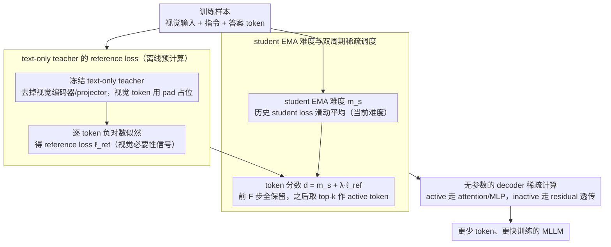

# ReGATE: Learning Faster and Better with Fewer Tokens in MLLMs

**会议**: ACL 2026  
**arXiv**: [2507.21420](https://arxiv.org/abs/2507.21420)  
**代码**: https://people-robots.github.io/regate (项目页)  
**领域**: 多模态VLM / 训练加速 / Token剪枝  
**关键词**: 多模态大模型、训练加速、Token Elision、教师-学生、稀疏计算

## 一句话总结
ReGATE 用冻结的 text-only teacher 估计哪些输出 token 需要视觉信息，再结合 student 的历史学习难度动态选择训练 token，让 MLLM 在不改架构、不加参数的情况下用更少 token 更快训练，并在多个图像和视频 benchmark 上达到或超过标准微调。

## 研究背景与动机
**领域现状**：MLLM 的训练成本主要被长序列自注意力和大规模视觉输入拉高。视频任务尤其明显，多个帧被展开成大量视觉 token，再与指令和答案 token 一起进入 LLM backbone，使每次 forward/backward 都很贵。

**现有痛点**：大量 token reduction、token merging 和 token compression 方法主要面向推理阶段，它们可以让已训练模型生成更快，却无法减少训练时每一步必须处理的 token。已有训练期加速方法要么来自 text-only LM，要么依赖额外模块、视觉 token 专用 scorer 或启发式剪枝，难以无缝迁移到不同 MLLM。

**核心矛盾**：训练时并不是所有 token 都同样值得计算。功能词、模板词或可由文本上下文直接预测的 token 对多模态 grounding 贡献有限；但如果只靠简单规则剪掉 token，又可能误删需要视觉证据的颜色、动作、物体属性和时序线索。

**本文目标**：构造一个训练期 token elision 框架，既能识别需要视觉 grounding 的关键 token，又能根据 student 的当前学习状态动态调整计算预算，并且不改变模型结构、不增加可训练参数。

**切入角度**：作者把“文本上下文能否预测该 token”作为视觉依赖的代理信号。如果一个冻结 text-only teacher 在遮掉视觉输入后仍能轻松预测某个 token，那么该 token 对多模态训练的边际价值可能较低；反之，高 reference loss 往往说明它需要视觉信息。

**核心 idea**：用 text-only teacher 的 reference loss 表示视觉必要性，用 student 的 EMA loss 表示当前学习难度，两者相加后选择高分 token 进行稀疏计算，把训练算力集中在“既需要视觉、又仍然难学”的 token 上。

## 方法详解
ReGATE 的名字来自 Reference-Guided Adaptive Token Elision。它不是把视觉 token 粗暴删掉，而是在训练期间为输出 token 计算重要性 mask，并让 transformer decoder 只对被选中的 token 执行主要计算。inactive token 不参与 attention 和 MLP 的重计算，但通过 residual 保留原有表示。这样模型功能形式不变，预训练权重也兼容，只是每步训练少处理一部分低价值 token。

### 整体框架
整体流程分成两个阶段。第一阶段是 reference loss generation：从 student MLLM 的 LLM backbone 构造一个冻结的 text-only teacher，移除视觉编码器和 projector，并用 `<pad>` 占位替换视觉 token，保持序列长度一致。teacher 对答案 token 计算逐 token negative log-likelihood，得到 $\ell^{ref}_{b,i}$。高 reference loss 说明 teacher 仅凭文本难以预测该 token，它更可能依赖视觉证据。

第二阶段是 student training：训练过程中维护每个样本每个 token 的 EMA 难度 $m_{s,i}$，用当前 student loss 持续更新。ReGATE 把二者合成 token 分数 $d_{b,i}=m_{s,i}+\lambda\ell^{ref}_{b,i}$，再按当前 sparsity schedule 选择 top-$k$ token 作为 active token。active token 正常经过 attention、MLP 和反向传播；inactive token 跳过主要计算，从而减少 token usage、训练时间和 activation memory。

### 关键设计

**1. text-only teacher 的 reference loss：用"文本能不能预测这个 token"当作它需不需要看图的代理信号**

多模态训练里真正贵的是学跨模态证据，而不是反复训练那些功能词、模板词；可这些低价值 token 又和颜色、动作、物体属性这类必须看图的 token 混在一起，简单规则一剪就容易误伤。ReGATE 的办法是从 student 自己的 LLM backbone 拷一个冻结的 text-only teacher，砍掉视觉编码器和 projector，把视觉 token 全用 `<pad>` 占位替换、保持序列长度不变，让 teacher 只能凭文本上下文预测答案 token，逐 token 算负对数似然得到 $\ell^{ref}_{b,i}$。某个 token 的 reference loss 越高，说明 teacher 光看文字越猜不出来，它就越可能依赖视觉 grounding。这套信号不需要任何人工标注、可以离线预计算，等于给每个输出 token 贴上了一张"视觉必要性"的标签。

**2. student EMA 难度与双周期稀疏调度：让被剪的 token 随训练进度变，而不是从头到尾固定那一批**

teacher 只反映静态的视觉依赖，可一个 token 此刻难学不代表一直难学——已经学会的 token 再算就是浪费。ReGATE 因此给每个 token 维护一份历史 student loss 的 EMA 难度 $m_{s,i}$，按 $m_{s,i}\leftarrow\beta m_{s,i}+(1-\beta)\ell^{stu}_{b,i}$ 持续更新，再把它和 teacher 信号相加成 token 分数：

$$d_{b,i}=m_{s,i}+\lambda\ell^{ref}_{b,i}$$

训练按周期 $C$ 运行，每个周期前 $F$ 步保留全部 token 让难度估计稳定下来，之后只留分数最高的比例 $p_{sparse}$ 作为 active token。这样选择既不会一直死磕已经变容易的 token，也不会只听 teacher 的静态信号而无视 student 当前到底学到哪了——算力被引导到"既需要视觉、又仍然难学"的交集上。

**3. 无参数的 decoder 稀疏计算（sparse computation）：把 token mask 真正落成 attention 和 MLP 的计算节省，而不只是改 loss 权重**

如果只在 loss 层给 token 加 mask，forward/backward 的大头开销其实一点没省。ReGATE 把稀疏性下沉进 decoder layer：只为 active token 生成 query/key/value 并执行 attention，MLP 也只 gather active token 的 hidden states 去算、算完再 scatter 回原位置；inactive token 直接走 residual 透传，不接收对应计算路径的梯度。因为模型的函数形式没变、预训练权重照样兼容，这套稀疏化既不增加任何可训练参数、又能实打实减少每步训练的时间和 activation memory，把"少处理 token"翻译成真正的训练加速。

### 损失函数 / 训练策略
ReGATE 保持原始 MLLM 微调目标不变，改变的是哪些 token 参与主要计算。实验中 teacher reference loss 在训练前对整个 fine-tuning 数据集预计算并缓存，避免每一步都运行 teacher。默认超参为周期 $C=128$、全 token 稳定步 $F=16$、稀疏比例 $p_{sparse}=0.5$，全局 warm-up 为 100 iterations，EMA decay $\beta=0.9$，teacher loss 权重 $\lambda=0.5$。VideoLLaMA2 和 VideoChat2 实验使用 4 张 H100，InternVL3.5 使用 16 张 H100；方法同时覆盖 full fine-tuning 和 LoRA fine-tuning。

## 实验关键数据

### 主实验
图像理解实验显示，ReGATE 在减少 41% 到 44% token 的同时，通常还能提升 ScienceQA、MME、VizWiz 等任务表现。MME 的两个数分别对应 perception / cognition。

| 模型 | Tokens | ScienceQA | MME | VizWiz | POPE | SEED-I |
|------|--------|-----------|-----|--------|------|--------|
| VideoChat2 | 3.93B | 40.8 | 314.6 / 1244.0 | 28.5 | 86.2 | 45.9 |
| VideoChat2-ReGATE | 2.22B (↓43.51%) | 46.6 | 360.7 / 1287.8 | 32.5 | 85.1 | 47.2 |
| VideoLLaMA2 | 83.82M | 61.4 | 376.4 / 1474.0 | 46.8 | 86.7 | 70.4 |
| VideoLLaMA2-ReGATE | 49.27M (↓41.22%) | 80.5 | 391.1 / 1507.1 | 48.0 | 87.5 | 70.0 |
| InternVL3.5 | 3.96B | 93.3 | 681.6 / 1694.3 | 60.6 | 91.6 | 76.8 |
| InternVL3.5-ReGATE | 2.32B (↓41.41%) | 94.4 | 689.3 / 1698.8 | 61.5 | 93.1 | 76.6 |

长视频和短视频实验进一步验证 ReGATE 不只适用于静态图像。它在 Video-MME、MLVU、MVBench 和 Perception 等任务上多数提升，但在 EgoSchema、LongVideoBench 或 NExT-QA 上也存在小幅下降，说明固定稀疏率仍有边界。

| 模型 | Tokens | Video-MME | LongVideoBench | MLVU | EgoSchema | MVBench | Perception |
|------|--------|-----------|----------------|------|-----------|---------|------------|
| VideoChat2 | 3.93B | 26.0 | 21.8 | 36.0 | 55.6 | 55.7 | 48.4 |
| VideoChat2-ReGATE | 2.22B | 32.7 | 24.3 | 40.5 | 54.8 | 56.6 | 50.0 |
| VideoLLaMA2 | 83.82M | 53.7 | 47.7 | 53.2 | 58.2 | 52.0 | 53.0 |
| VideoLLaMA2-ReGATE | 49.27M | 54.5 | 47.6 | 54.5 | 56.4 | 53.6 | 54.1 |
| InternVL3.5 | 3.96B | 62.4 | 57.9 | 63.7 | 64.7 | 68.3 | 65.3 |
| InternVL3.5-ReGATE | 2.32B | 63.0 | 58.0 | 64.2 | 63.9 | 69.6 | 66.7 |

效率表最直接展示了“learning faster”的结论。Aggressive ReGATE 在更少 GPU-hours 内接近 baseline，extended ReGATE 则在仍少于 baseline 训练时间的情况下超过 baseline 平均准确率。

| 模型 | 设置 | Tokens ↓ | Teacher Cost | Train Time | Avg. Mem/GPU | Avg. Acc. ↑ |
|------|------|----------|--------------|------------|--------------|-------------|
| VideoLLaMA2 | Baseline | 83.82M | - | 129.6 | 69.1 GB | 48.2 |
| VideoLLaMA2 | ReGATE extended | 49.27M | 2.1 | 107.6 | 61.3 GB | 48.9 |
| VideoLLaMA2 | ReGATE fast | 29.32M | 2.1 | 64.0 | - | 48.0 |
| VideoChat2 | Baseline | 3.93B | - | 148.8 | 70.8 GB | 46.1 |
| VideoChat2 | ReGATE extended | 2.22B | 10.0 | 130.0 | 63.7 GB | 47.8 |
| VideoChat2 | ReGATE fast | 1.51B | 10.0 | 86.4 | - | 46.0 |
| InternVL3.5 | Baseline | 3.96B | - | 435.2 | 58.3 GB | 61.8 |
| InternVL3.5 | ReGATE extended | 2.32B | 11.3 | 374.4 | 51.9 GB | 62.2 |
| InternVL3.5 | ReGATE fast | 1.63B | 11.3 | 262.4 | - | 61.6 |

### 消融实验
附录消融说明两个信号都重要。只用 student EMA 或只用 reference loss 都不如组合信号，capacity-aligned teacher 也比过小或过大的 teacher 更合适。

| 消融对象 | 设置 | Avg. Acc. | 解释 |
|----------|------|-----------|------|
| λ 权重 | λ=0.0，仅 Student EMA | 47.7 | 只看学习难度，缺少视觉依赖信号 |
| λ 权重 | λ=1.0，仅 Reference Loss | 46.4 | 只看 teacher，忽略 student 当前状态 |
| λ 权重 | λ=0.5，组合信号 | 48.9 | 两类信号互补，效果最好 |
| Teacher 容量 | Qwen2-1.5B | 45.4 | teacher 太弱，把语言难点误判为视觉重点 |
| Teacher 容量 | Qwen2-57B | 46.8 | teacher 太强，可凭世界知识预测，低估视觉依赖 |
| Teacher 容量 | Qwen2-7B | 48.9 | 与 student 容量和 tokenizer 对齐，信号最可靠 |

### 关键发现
- ReGATE 在 3 个不同 MLLM 上都能减少约 41% 到 44% token，并多数提升 zero-shot 图像和视频理解指标。
- 加速效果受微调方式影响：full fine-tuning 的 VideoLLaMA2 受益最大，LoRA 的 VideoChat2 因 backward 本来就轻，时间收益相对小。
- reference teacher 的容量不是越大越好。过强 teacher 会用世界知识“猜对”视觉词，反而把 student 需要视觉 grounding 的 token 剪掉。
- 固定 $p_{sparse}=0.5$ 简单稳定，但附录失败案例显示一些有用 token 仍可能因为固定比例被跳过。
- 注意力可视化显示 ReGATE 训练后的模型更关注手部、被操作物体等任务相关区域，说明 token elision 不只是省算力，也改变了学习焦点。

## 亮点与洞察
- 最巧妙的地方是把 text-only teacher 当成视觉依赖探针。它不需要标注“哪个词需要看图”，只要看遮掉视觉后预测难不难，就能得到细粒度 token 信号。
- 论文没有走复杂架构路线。ReGATE 不增加可训练参数，不要求重写模型结构，因此比很多训练期压缩方法更容易迁移到现有 MLLM。
- 组合 student EMA 和 teacher reference loss 很自然。前者告诉系统“当前模型还不会什么”，后者告诉系统“什么更可能需要视觉”，二者结合比任一单信号更稳。
- 结果提示训练加速不一定牺牲精度。把低价值 token 从训练计算中拿掉，反而可能减少背景噪声，让模型更集中学习跨模态证据。

## 局限与展望
- 当前稀疏调度仍是固定设计，不能根据样本复杂度、任务类型或训练稳定性自适应调整保留比例。
- reference supervision 来自冻结 text-only teacher，对 fine-grained 空间/时间推理的覆盖有限；未来可探索更强但容量对齐的 multimodal-aware teacher。
- per-token reference loss 依赖 tokenizer 对齐，因此跨架构 teacher 不容易直接使用，限制了 teacher 选择范围。
- 方法主要在公开可训练的 7B/14B 级 MLLM 上验证，尚不清楚更大规模闭源或 web-scale 训练中的工程收益。
- fixed sparsity 会漏掉少数关键 token，论文的失败案例中 “static”“NASA” 等有用词被跳过，说明 adaptive sparsity 是很自然的下一步。

## 相关工作与启发
- **vs RHO-1**: RHO-1 在 text-only LM 中用参考模型选择高价值 token；ReGATE 把这一思想扩展到 MLLM，并把 reference loss 解释为视觉依赖信号。
- **vs LaVi**: LaVi 通过额外视觉调制模块跳过视觉 token，需要架构改动和新增参数；ReGATE 参数免费，主要 gate 输出文本 token 的训练计算。
- **vs LLaVA-Meteor**: Meteor 使用视觉 token scorer 和启发式剪枝，更多面向 image instruction tuning；ReGATE 结合 teacher loss 与 student EMA，覆盖图像和视频，并能适配 LoRA/full fine-tuning。
- **vs inference-time token pruning**: 推理剪枝不能减少训练成本，ReGATE 直接作用于 forward/backward，因此更适合大规模 MLLM 微调阶段。

## 评分
- 新颖性: ⭐⭐⭐⭐ 将 text-only reference loss 用作 MLLM 训练期视觉依赖信号，想法简洁且有效。
- 实验充分度: ⭐⭐⭐⭐⭐ 覆盖 3 个模型、图像/长视频/短视频、效率、同类方法对比和附录消融，证据比较完整。
- 写作质量: ⭐⭐⭐⭐ 方法脉络清楚，实验丰富，但表格较多且排版略密。
- 价值: ⭐⭐⭐⭐⭐ 对 MLLM 微调成本很有现实意义，尤其适合视频模型和资源受限训练场景。

<!-- RELATED:START -->

## 相关论文

- [\[CVPR 2026\] Better, Stronger, Faster: Tackling the Trilemma in MLLM-based Segmentation with Simultaneous Textual Mask Prediction](../../CVPR2026/multimodal_vlm/better_stronger_faster_tackling_the_trilemma_in_mllm-based_segmentation_with_sim.md)
- [\[NeurIPS 2025\] Better Tokens for Better 3D: Advancing Vision-Language Modeling in 3D Medical Imaging](../../NeurIPS2025/multimodal_vlm/better_tokens_for_better_3d_advancing_vision-language_modeling_in_3d_medical_ima.md)
- [\[CVPR 2026\] Hugging Visual Prompt and Segmentation Tokens: Consistency Learning for Fine-Grained Visual Understanding in MLLMs](../../CVPR2026/multimodal_vlm/hugging_visual_prompt_and_segmentation_tokens_consistency_learning_for_fine-grai.md)
- [\[ACL 2026\] MathFlow: Enhancing the Perceptual Flow of MLLMs for Visual Mathematical Problems](mathflow_enhancing_the_perceptual_flow_of_mllms_for_visual_mathematical_problems.md)
- [\[ACL 2025\] Sharper and Faster mean Better: Towards More Efficient Vision-Language Model for Hour-scale Long Video Understanding](../../ACL2025/multimodal_vlm/sophia_efficient_long_video.md)

<!-- RELATED:END -->
