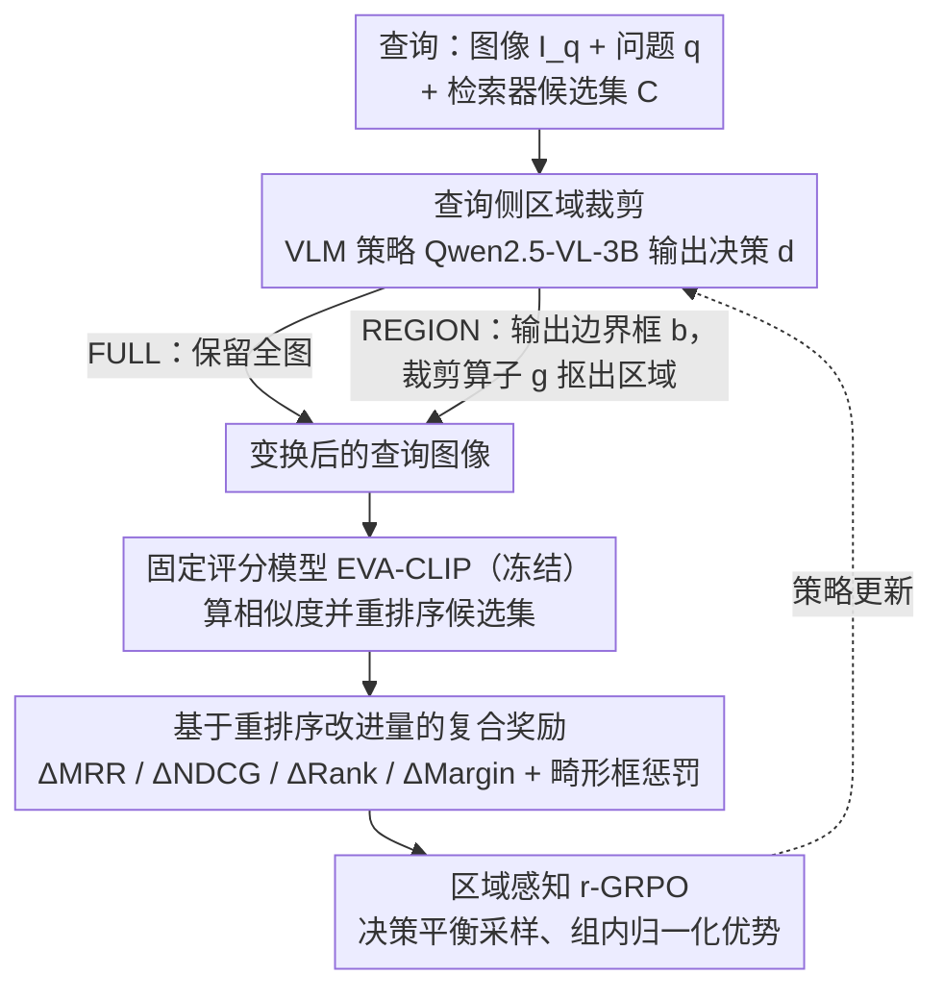

# Region-R1: Reinforcing Query-Side Region Cropping for Multi-Modal Re-Ranking

**会议**: ACL 2026 Findings  
**arXiv**: [2604.05268](https://arxiv.org/abs/2604.05268)  
**代码**: 无  
**领域**: 多模态VLM / 信息检索  
**关键词**: 多模态重排序, 查询侧区域裁剪, 强化学习, 视觉问答, 检索增强生成

## 一句话总结
本文提出 Region-R1，将多模态重排序中的查询图像区域裁剪建模为决策问题，通过强化学习（r-GRPO）学习何时以及如何裁剪查询图像中与问题相关的区域，在 E-VQA 和 InfoSeek 上将 CondRecall@1 分别提升 20% 和 8%。

## 研究背景与动机

**领域现状**：多模态检索增强生成（MM-RAG）系统通常采用"检索器-重排序器-生成器"的流水线架构，其中重排序阶段对从候选池中筛选出最相关证据至关重要。现有工作主要集中在改进检索器或设计更复杂的重排序模型（如 EchoSight、OMGM）。

**现有痛点**：标准重排序器将查询图像作为全局嵌入来处理，隐式假设图像中所有区域都与用户问题相关。然而在实际场景中，查询图像往往包含大量干扰元素（如背景杂乱、无关对象），当这些无关区域主导全局视觉表示时，会扭曲相似度估计，导致重排序性能下降。

**核心矛盾**：全局图像表示与问题聚焦需求之间的矛盾——全局表示保留了所有视觉信息但引入了干扰，简单的启发式裁剪又可能丢失有用上下文。这是多模态特有的问题，在纯文本 RAG 中不存在。

**本文目标**：设计一种查询侧的视觉信息选择机制，能够在重排序阶段自适应地决定是否裁剪查询图像以及裁剪哪个区域，从而可靠地提升重排序性能。

**切入角度**：现代视觉语言模型已经具备强大的定位能力，初步分析表明在固定候选池和评分模型下，用适当选择的区域替换全图可以显著改善重排序。但需要一个学习框架来决定"何时裁剪"和"裁剪哪里"。

**核心 idea**：将查询侧区域裁剪建模为强化学习决策问题，用改进的 GRPO（r-GRPO）直接优化重排序指标，学习一个策略来动态决定保留全图还是裁剪特定区域。

## 方法详解

### 整体框架
Region-R1 工作在 MM-RAG 的重排序阶段。给定一个图像-问题对查询 $x=(I_q, q)$ 和上游检索器产生的候选集 $\mathcal{C}$，系统首先通过一个视觉语言模型策略决定是保留全图（FULL）还是裁剪一个区域（REGION），然后用变换后的查询图像与候选集计算相似度得分并重新排序。整个流程包括：策略模型输出裁剪决策 → 图像变换 → 固定评分模型计算排序 → 基于排序改进的奖励反馈 → r-GRPO 策略优化。

### 关键设计

**1. 查询侧区域裁剪：让模型自己决定"要不要裁、裁哪里"，而不是无脑用全图**

标准重排序器把查询图像压成一个全局嵌入，默认整张图都和问题相关——可一旦背景杂乱或塞满无关对象，这些干扰区域就会主导全局表示、扭曲相似度。Region-R1 因此把裁剪写成一个离散决策变量 $d \in \{\text{REGION}, \text{FULL}\}$：选 FULL 就保留全图，选 REGION 就让视觉语言模型（Qwen2.5-VL-3B）同时吐出一个边界框 $b=(x_1, y_1, x_2, y_2)$，再用裁剪算子 $g(\cdot)$ 把该区域抠出来替换原图。

值得注意的是这套机制只挂在重排序阶段、不动检索阶段。原因很实在：检索要扫整个库，过早裁剪可能丢掉关键信息、压低召回；而重排序只面对上游送来的小候选集（论文里 $K=20$），既算得起逐查询裁剪的开销，又不会因为丢信息而伤到 recall。

**2. 基于重排序改进量的复合奖励：把"这次裁剪到底有没有让排序变好"直接量化成训练信号**

如果只用排名指标当奖励，信号会很稀疏——多个候选分数贴得很近时，正样本分数动一点点根本不改变名次，策略学不到梯度方向。Region-R1 于是把奖励拆成四个"相对基线的改进量"加权求和：$\Delta\text{MRR}$、$\Delta\text{NDCG}$、$\Delta\text{Rank}$（正样本排名的对数提升）和 $\Delta\text{Margin}$（正样本与最强负样本的得分间距提升），再加一个畸形框惩罚项；当决策为 FULL 时，只有在基线已经把正样本排到第 1 位时才给正奖励，避免"什么都不做"被滥奖。

其中 $\Delta\text{Margin}$ 是点睛之笔：它绕开离散名次、直接鼓励策略把正样本拉近、把最强负样本推远，提供的是连续梯度而非阶梯式信号。消融里加上 Margin 项后 InfoSeek MRR 从 0.613 跳到 0.706，是所有奖励组件中带来跳跃最大的一项。

**3. 区域感知的 r-GRPO：用决策平衡采样压住混合动作空间的训练方差**

这里的动作空间很别扭——既有离散决策（REGION / FULL），又有连续边界框，标准 GRPO 直接上会方差大、更新不稳。r-GRPO 仍按 GRPO 的套路对每个查询采样 $N$ 个动作组、算组内归一化优势，但关键改动是"决策平衡的组采样"：强制每个采样组里 REGION 和 FULL 两种决策都出现，不让占多数的那种决策替占少数的那种去设定基线。这样组内对比是在同类决策之间发生的，优势估计更干净，训练也随之稳定下来。

### 损失函数 / 训练策略
使用 Qwen2.5-VL-3B 作为基座模型，通过 r-GRPO 进行微调。评分模型使用预训练的 EVA-CLIP，在训练过程中保持冻结。候选池大小 $K=20$，仅保留候选池中包含至少一个正样本的训练查询。

## 实验关键数据

### 主实验

| 方法 | E-VQA MRR | E-VQA R@1 | InfoSeek MRR | InfoSeek R@1 |
|------|-----------|-----------|--------------|--------------|
| EVA-CLIP | 0.224 | 14.2 | 0.553 | 46.3 |
| EchoSight | 0.402 | 36.5 | 0.586 | 53.2 |
| OMGM | 0.473 | 42.8 | 0.681 | 64.0 |
| **Region-R1** | **0.473** | **44.7** | **0.706** | **66.5** |

| 方法 | E-VQA CondR@1 | InfoSeek CondR@1 |
|------|---------------|------------------|
| EchoSight | 0.75 | 0.68 |
| OMGM | 0.73 | 0.75 |
| **Region-R1** | **0.90** | **0.81** |

### 消融实验

| 奖励配置 | InfoSeek MRR | E-VQA MRR |
|---------|-------------|-----------|
| ΔMRR only | 0.611 | 0.408 |
| + ΔNDCG | 0.613 (↑) | 0.425 (↑) |
| + ΔRank | 0.613 (-) | 0.426 (↑) |
| + ΔMargin (Full) | **0.706** | **0.473** |

### 关键发现
- Margin 项是性能提升的关键因子，加入后 InfoSeek MRR 从 0.613 跳升至 0.706，E-VQA 从 0.426 跳升至 0.473
- 学习到的策略展现出正确的裁剪行为：正样本已在第1位时 RC 率较低；正样本排名靠后时 RC 率显著提高
- 零样本 VLM 裁剪 RC 率仅约 20%，大部分情况下等同于不裁剪基线
- 启发式裁剪（中心/随机）效果很差，容易丢弃关键信息

## 亮点与洞察
- 查询侧适配的理念非常简洁有效：不改模型不改候选，只改查询表示就能大幅提升重排序性能，这种思路可迁移到其他检索匹配任务
- r-GRPO 的决策平衡采样设计巧妙地解决了混合动作空间的训练不稳定问题，对其他涉及离散+连续动作的 RL 应用有参考价值
- Margin 奖励项的发现很有启发性：排名指标提供稀疏离散信号，而 margin 提供连续梯度方向

## 局限与展望
- 仅在重排序阶段操作，无法恢复检索器 top-K 候选池中缺失的正样本
- 仅支持单区域裁剪，对需要关注多个区域的复杂查询可能不够
- 评分模型固定不变，裁剪策略可能过度适配特定评分器
- 仅在两个数据集上评估，泛化性有待验证
- 未来方向：多区域选择、软注意力机制、将查询侧适配扩展到检索阶段

## 相关工作与启发
- **vs EchoSight/OMGM**: 它们通过改进重排序模型本身提升性能，本文保持评分模型不变仅修改查询表示，两种方向互补
- **vs 零样本 VLM 裁剪**: 直接用 VLM 提示裁剪的 RC 率太低，说明通用视觉理解能力不等于任务特化的裁剪能力

## 评分
- 新颖性: ⭐⭐⭐⭐ 查询侧区域裁剪的视角新颖，将其建模为 RL 决策问题是合理的创新
- 实验充分度: ⭐⭐⭐⭐ 两个数据集、多种基线对比、详细消融和行为分析
- 写作质量: ⭐⭐⭐⭐ 问题动机清晰，方法描述详细，实验分析有深度
- 价值: ⭐⭐⭐⭐ "改查询不改模型"的思路简洁有效，对 MM-RAG 社区有实际价值

<!-- RELATED:START -->

## 相关论文

- [\[CVPR 2026\] STAR-R1: Multi-View Spatial TrAnsformation Reasoning by Reinforcing Multimodal LLMs](../../CVPR2026/multimodal_vlm/star-r1_multi-view_spatial_transformation_reasoning_by_reinforcing_multimodal_ll.md)
- [\[NeurIPS 2025\] Video-R1: Reinforcing Video Reasoning in MLLMs](../../NeurIPS2025/multimodal_vlm/video-r1_reinforcing_video_reasoning_in_mllms.md)
- [\[CVPR 2026\] Chain-of-Thought Guided Multi-Modal Object Re-Identification](../../CVPR2026/multimodal_vlm/chain-of-thought_guided_multi-modal_object_re-identification.md)
- [\[ICLR 2026\] SophiaVL-R1: Reinforcing MLLMs Reasoning with Thinking Reward](../../ICLR2026/multimodal_vlm/sophiavl-r1_reinforcing_mllms_reasoning_with_thinking_reward.md)
- [\[ICLR 2026\] Grasp Any Region: Towards Precise, Contextual Pixel Understanding for Multimodal LLMs](../../ICLR2026/multimodal_vlm/grasp_any_region_towards_precise_contextual_pixel_understanding_for_multimodal_l.md)

<!-- RELATED:END -->
