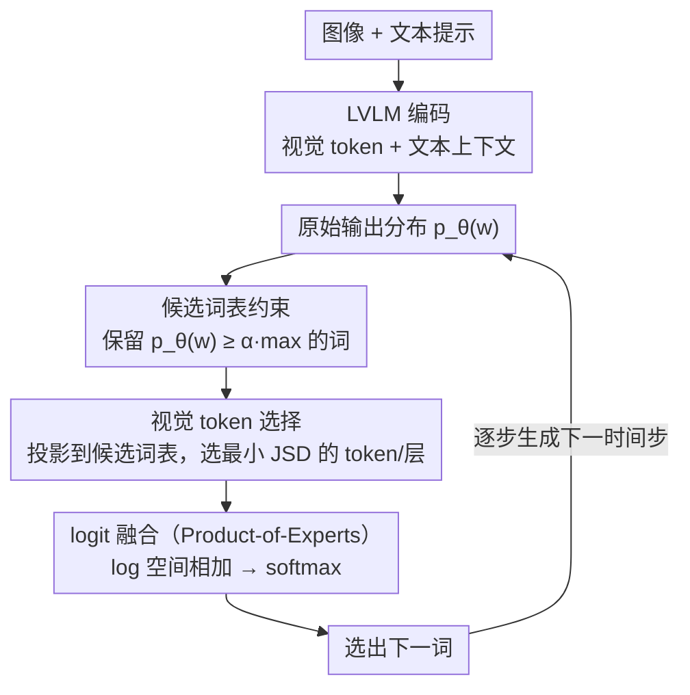

# Revisit What You See: Revealing Visual Semantics in Vision Tokens to Guide LVLM Decoding

**会议**: ACL2026 Oral  
**arXiv**: [2506.09522](https://arxiv.org/abs/2506.09522)  
**代码**: https://github.com/bscho333/ReVisiT  
**领域**: 多模态VLM  
**关键词**: 视觉语言模型、幻觉抑制、解码策略、视觉 token、训练自由方法

## 一句话总结
ReVisiT 发现 LVLM 的视觉 token 本身已经编码了可解释的对象语义，并通过上下文约束词表、视觉 token 选择与 logit 融合，在不训练、不额外前向的情况下提升视觉 grounding 并降低幻觉。

## 研究背景与动机
**领域现状**：当前大型视觉语言模型通常先把图像编码成视觉 token，再把这些 token 与文本 token 一起送入语言模型解码器。主流幻觉抑制方法大多在解码阶段做 contrastive decoding、注意力重加权、扰动输入对比，或者在生成后再用额外 verifier 修正输出。

**现有痛点**：这些方法虽然能减少一部分对象幻觉，但常常把视觉信息当成隐式上下文来使用。视觉 token 究竟在下一词分布中贡献了什么、它们是否已经含有对象级语义、这些语义为什么没有被常规 greedy decoding 选中，都缺少直接分析。

**核心矛盾**：LVLM 在幻觉位置并不一定“看不到”正确对象。论文的经验分析显示，真实对象经常仍在模型输出分布的高概率候选中，只是语言先验在某些时间步压过了视觉 grounding 信号。因此问题不只是补充更多视觉信息，而是如何把已经存在于视觉 token 中的语义显式拉回解码决策。

**本文目标**：作者希望回答两个子问题：第一，视觉 token 是否携带可以映射到文本词表的对象语义；第二，如果携带，能否在解码时用一个轻量机制选择当前最相关的视觉 token，并用它修正下一词概率。

**切入角度**：论文采用类似 logit lens 的思路，把视觉 token 的隐藏状态投影到语言模型词表空间。关键观察是：直接投影到完整词表会被大量无关词稀释，但只要把词表限制到当前上下文合理的候选集，视觉 token 的对象语义就会变得清晰。

**核心 idea**：用当前输出分布自适应构造候选词表，再在该约束空间内选择与当前上下文最接近的视觉 token，把它的投影分布作为视觉参考信号与原始 logits 融合。

## 方法详解
ReVisiT 是一个解码时方法，不改模型结构，不需要额外标注，也不需要重新训练。它把 LVLM 原本静态存在的视觉 token 变成每一步可引用的“视觉证据库”：在每个生成步，先根据原始输出分布确定当前可能说哪些词，再从视觉 token 中找出最能解释这些候选词的 token，最后用该视觉 token 的分布修正输出。

### 整体框架
输入是一张图像和用户文本提示。LVLM 按常规流程得到视觉 token 与文本上下文，并计算当前时间步的原始输出分布。ReVisiT 在这个分布上执行三步：第一，用概率阈值从完整词表中筛出上下文相关候选；第二，把预先缓存的视觉 token 投影分布切到同一候选空间，用 Jensen-Shannon Divergence 选择最相关的视觉 token；第三，把原始输出分布和选中视觉 token 的投影分布在 log 空间相加，再 softmax 得到最终分布。

该流程的关键是所有比较都发生在同一个受约束词表内。这样既避免完整词表中 function word、标点、低相关词带来的噪声，也让视觉 token 的对象语义能够和当前上下文对齐。

### 关键设计
**1. 上下文感知的候选词表约束：先把词表收窄到"这一步真有可能说出口的词"，视觉语义才显形**

直接把视觉 token 的隐藏状态投影到完整词表，会被海量无关词、function word、标点稀释——作者的分析里，真实对象的 top-1 recall 只有 $2.03\%$，视觉语义几乎被淹没。ReVisiT 的第一步因此是给定原始分布 $p_\theta(w)$，只保留满足 $p_\theta(w) \geq \alpha \cdot \max_{w'}p_\theta(w')$ 的 token，阈值 $\alpha$ 控制候选集松紧：小一点放进更多可能项，大一点更强调高置信候选。

一旦投影空间被压到这个语义一致的对象子集上，同样的视觉 token 投影 top-1 recall 就从 $2.03\%$ 飙到 $40.44\%$。所以这一步不是为了省算力的剪枝技巧，而是让视觉 token 语义"可见"的前提条件——没有它，后两步根本无从对齐。

**2. 基于最小 JSD 的视觉 token 选择：让"引用哪个视觉 token"变成上下文相关的挑选，而不是盲目加视觉权重**

约束好词表后，还得回答一个问题：这么多视觉 token、这么多层，该信哪一个？ReVisiT 先用 LM head 把每个视觉 token 的隐藏状态也投影成候选词表上的概率分布，再和当前输出分布逐一算 Jensen-Shannon Divergence，挑出 JSD 最小的那个 token 和层。直观上，JSD 越小，说明这个视觉 token 给出的语义方向和模型此刻正在斟酌的候选词越一致。

这一步的必要性由消融反证得很彻底：如果改成选 JSD 最大（最不相似）的 token，F1 直接崩到 $0.67$；随机选也只剩 $17.63$。可见盲目把"某个"视觉区域注入解码毫无意义，只有最小 JSD 这种上下文对齐的选择，才能把视觉证据稳稳接到当前决策上。

**3. Product-of-Experts 风格的 logit 融合：把选中的视觉 token 当成一个"专家"，和语言上下文一起投票**

光选对 token 还不够，怎么把它的意见揉进解码才是落点。最朴素的做法各有毛病：直接用视觉分布替换原始 logits 会破坏语言流畅性，只在事后做惩罚又可能压根激活不了正确对象。ReVisiT 的折中是在受约束候选集内，把原始输出分布的 log 概率和选中视觉 token 投影分布的 log 概率相加，再重新归一化——等价于要求最终 token 同时被语言上下文和视觉参考支持。

这正是 Product-of-Experts 的味道：语言模型和视觉 token 各是一个专家，log 空间相加意味着两边都点头的候选才会胜出。既保留了语言模型的上下文约束、不至于胡言乱语，又把视觉 grounding 实打实拉到了决策层，而非停留在"软提示"。

### 损失函数 / 训练策略
ReVisiT 没有训练损失。视觉 token 对完整词表的投影可以在解码开始前缓存，后续每个时间步只需按候选词表切片、计算分布差异并融合 logits。实验中作者使用 deterministic greedy decoding，最大输出长度为 512；不同模型和任务只调整候选阈值 $\alpha$ 与可选层范围。

## 实验关键数据

### 主实验
论文在 HallusionBench、CHAIR、POPE、VQAv2、MMMU 上评估 LLaVA-1.5-7B、Qwen2.5-VL-7B、InternVL3-8B，并与 Greedy、DoLa、VCD、M3ID、CODE、SID 等解码基线比较。

| 数据集 / 模型 | 指标 | ReVisiT | Greedy | 主要提升 |
|--------|------|------|----------|------|
| HallusionBench / LLaVA-1.5-7B | qAcc | 20.22 | 11.55 | +8.67，约 75% 相对提升 |
| CHAIR / Qwen2.5-VL-7B | CHAIRI ↓ / F1 ↑ | 7.04 / 81.16 | 8.43 / 79.85 | 幻觉实例率下降，F1 +1.31 |
| POPE / LLaVA-1.5-7B | Accuracy / F1 | 81.80 / 83.45 | 79.47 / 82.36 | Accuracy +2.33，F1 +1.09 |
| VQAv2 / Qwen2.5-VL-7B | Accuracy | 67.60 | 65.80 | +1.80 |
| MMMU / InternVL3-8B | Accuracy | 54.14 | 53.54 | +0.60 |

从结果看，ReVisiT 的优势不是只体现在一种任务上。它既能降低对象幻觉，也能在 VQA 和知识密集型多模态问答中保持或提升准确率，说明该方法没有简单地让模型变得保守。

### 消融实验
作者在 Qwen2.5-VL 的 CHAIR 上分析选择准则、词表约束、层范围与阈值。

| 配置 | 关键指标 | 说明 |
|------|---------|------|
| Full ReVisiT | F1 = 81.16 | 使用候选词表、min-JSD、all-layers，表现最佳 |
| max-JSD 选择 | F1 = 0.67 | 选择最不相似的视觉 token 后几乎崩溃 |
| random 选择 | F1 = 17.63 | 随机视觉参考无法稳定提供 grounding |
| min-JSD + full vocabulary | F1 = 1.52 | 不约束词表时视觉投影偏离语义目标 |
| last-layer 变体 | 峰值 F1 = 80.97 | 稍低于 all-layers，但仍保持有效 |

### 关键发现
- 在 190 个幻觉生成步中，至少一个真实对象出现在 top-50 候选中的比例为 63.2%，top-500 则达到 95.8%，说明模型常常“知道”正确视觉对象，只是没有选中。
- 视觉 token 的完整词表投影 top-1 真实对象 recall 只有 2.03%，但在 CHAIR 对象子集上提升到 40.44%，top-30 达到 89.24%。这直接支撑了“语义约束使视觉 token 可解释”的核心假设。
- 推理延迟只比 greedy 增加 0.6% 到 2.0%，而 VCD、M3ID、SID、CODE 等多前向方法接近或超过 2 倍开销，ReVisiT 的效率优势很明显。
- 阈值 $\alpha$ 有一定敏感性，但在 CHAIR 上峰值附近约 1.5 F1 内波动，说明方法不完全依赖精细调参。

## 亮点与洞察
- 最有价值的洞察是把视觉 token 从“模型内部不可见上下文”变成“可投影、可选择、可引用的语义证据”。这让幻觉抑制从经验式 logit 调整推进到更可解释的视觉语义利用。
- 论文没有简单假设更多视觉权重一定更好，而是强调视觉信息必须在当前文本候选空间中被激活。这个设计解释了为什么完整词表投影失败，也解释了为什么 min-JSD 比 random 或 max-JSD 稳定。
- ReVisiT 的训练自由特性很适合部署在已有 LVLM 上。对于不能重新训练的闭源或成本敏感场景，只要能访问中间隐藏状态和 logits，这类 decoding-time grounding 方法就有实际吸引力。
- 这篇论文也提醒我们，幻觉并不总是由于表示中缺失视觉知识；有时问题在于解码策略没有正确使用已有知识。这个观点可以迁移到视频、音频或检索增强模型中的多源信息融合。

## 局限与展望
- 方法强依赖视觉 token 中已经存在的语义。如果底层视觉编码器没有捕捉到小目标、关系或细粒度属性，ReVisiT 无法凭空补全这些信息。
- 视觉 grounding 被加强后，模型可能过度关注显著可见对象，在需要常识、隐含上下文或外部知识的任务中未必始终有利。论文也承认更自适应的融合权重值得研究。
- 实验覆盖 7B 到 32B 的开源 LVLM，没有验证 70B 级或专有模型。更大模型的视觉 token 语义是否同样需要这种约束投影，还有待进一步确认。
- 当前方法主要围绕对象级 hallucination 展开。对于关系幻觉、属性幻觉、OCR 错误和复杂推理错误，候选词表和视觉 token 选择机制可能需要更细粒度的扩展。

## 相关工作与启发
- **vs VCD / M3ID**: 这些方法通过扰动图像或移除图像形成对比分布，强调抑制语言先验；ReVisiT 则直接引用视觉 token 的投影分布，不需要额外 forward，因此效率更高。
- **vs DoLa**: DoLa 利用早晚层 logits 差异改善事实性，核心信号来自语言模型层间差异；ReVisiT 的信号来自视觉 token，目标更明确地指向视觉 grounding。
- **vs attention-based 方法**: DAMRO、SID 等方法通过视觉注意力模式调整解码；ReVisiT 不直接依赖注意力权重，而是把视觉 hidden state 显式映射到词表语义空间。
- **启发**: 对多模态模型内部 token 做“受约束语义投影”可能是一个通用工具。未来可以用于定位视频帧 token、音频片段 token 或检索文档 token 在生成中的实际贡献。

## 评分
- 新颖性: ⭐⭐⭐⭐⭐ 视觉 token 约束投影与解码引用结合得很自然，问题切入比普通 logit 校准更有解释力。
- 实验充分度: ⭐⭐⭐⭐⭐ 覆盖 5 个 benchmark、3 个架构、多个模型尺寸，并包含速度、消融和机制分析。
- 写作质量: ⭐⭐⭐⭐☆ 分析链条清晰，表格丰富；部分公式和表格在文本版中较密，需要读者熟悉 LVLM decoding。
- 价值: ⭐⭐⭐⭐⭐ 对训练自由幻觉抑制、视觉 token 可解释性和多模态解码策略都有较高参考价值。

<!-- RELATED:START -->

## 相关论文

- [\[ICML 2026\] What You Think is What You See: Driving Exploration in VLM Agents via Visual-Linguistic Curiosity (GLANCE)](../../ICML2026/multimodal_vlm/what_you_think_is_what_you_see_driving_exploration_in_vlm_agents_via_visual-ling.md)
- [\[ACL 2026\] "I See What You Did There": Can Large Vision-Language Models Understand Multimodal Puns?](i_see_what_you_did_there_can_large_vision-language_models_understand_multimodal_.md)
- [\[CVPR 2026\] Aligning What Vision-Language Models See and Perceive with Adaptive Information Flow](../../CVPR2026/multimodal_vlm/aif_adaptive_information_flow_vlm.md)
- [\[ACL 2025\] I See What You Mean: Co-Speech Gestures for Reference Resolution in Multimodal Dialogue](../../ACL2025/multimodal_vlm/i_see_what_you_mean_co-speech_gestures_for_reference_resolution_in_multimodal_di.md)
- [\[ACL 2026\] What Do Vision-Language Models Encode for Personalized Image Aesthetics Assessment?](what_do_vision-language_models_encode_for_personalized_image_aesthetics_assessme.md)

<!-- RELATED:END -->
